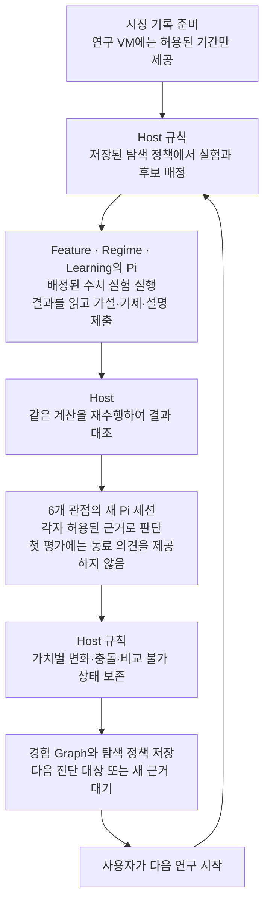
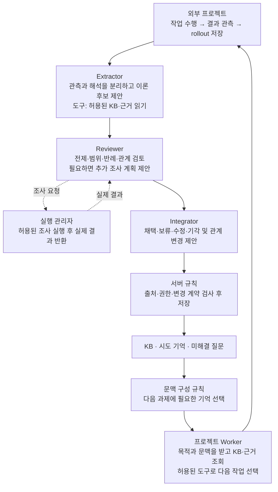
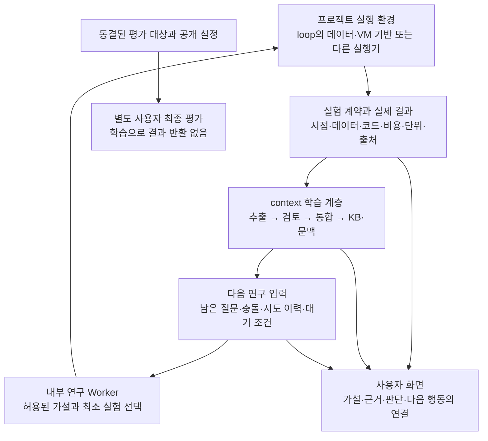

# loop(AgentOS)와 context(Theory Lab) 구현 비교

작성일: 2026-09-13. 두 로컬 저장소의 문서와 소스 코드를 읽어 비교했다. 실험을 재시작하거나 모델을 호출하지 않았으며, 비공개 최종 평가 데이터·결과 파일은 열지 않았다.

## 1. 판단부터

**두 프로젝트는 모델 가중치를 바꾸지 않고 경험으로 더 나은 연구를 하려는 방향을 공유하지만, 현재 개선하는 대상이 다르다.**

- **loop / AgentOS:** 시장 관측과 수치 예측을 수행하고, 여러 평가 관점의 충돌을 보존하면서 **다음에 어떤 등록 실험을 할지** 바꾼다. VM 격리와 실시간 데이터 경로가 구체적이다.
- **context / Theory Lab:** 프로젝트의 실행 기록에서 이론을 추출·검토·통합하고, **다음 작업에 전달할 KB와 LLM 문맥**을 바꾼다. 여기에 개발 백테스트와 자동 연구, 실험 전 가설 등록을 연결하고 있다.

따라서 loop가 우리가 만들려는 것을 이미 전부 구현했다고 보기는 어렵다. 반대로 우리 구현이 loop의 상위 호환인 것도 아니다. **연구 판단을 설명하는 형식과 운영 기반은 loop에서 배울 점이 있고, 범용 경험 학습과 다음 입력 구성은 context 쪽에 더 직접적인 구현이 있다.** 어느 쪽도 현재 자료만으로 지속적인 지능 향상이나 거래 우위를 입증한 상태라고 판단하지 않는다.

## 2. 무엇을 기준으로 비교했는가

| 대상 | 비교 기준 | 해석상 주의점 |
|---|---|---|
| loop | Git `ae07691704e29b2bd5b2239ffb9df7727124c6ed`, 작업 트리 변경 없음 | 상세 설명서는 이전 구현 기준 `9b6a5b4`를 명시한다. 이번에는 현재 코드를 함께 읽었다. |
| context | Git `557b9bda0c621a5e732d49a9be8e113dbf47bedd` + 비교 시점의 미커밋 변경 | 새 가설 중심 기능·단위 계약 수정이 포함된다. HEAD만으로 이 상태를 재현할 수 없다. |
| 동작 증거 | 기존 문서에 기록된 검증과 이번 코드 확인을 구분 | 이번 비교에서 성능 실험·VM 실행·테스트 재실행은 하지 않았다. |

context의 기존 자동 연구와 새 가설 중심 경로를 구분해야 한다. 새 경로는 실제 첫 비교 실험에서 학습 단계 진입까지 확인했지만, 마지막 단위 계약 수정은 검증·배포 완료 전에 사용자의 중단 지시를 받았다. **현재 파일에 코드가 있다는 것과 운영 검증을 마쳤다는 것은 다르다.** 실험은 중단 상태를 유지했다.

아래의 코드 근거 표기 `[L1]`, `[C1]` 등은 마지막 절의 저장소 상대 경로·함수를 가리킨다. 상대 경로는 코드 위치를 설명하기 위한 것이며 공개 소스 링크를 뜻하지 않는다. 내부 소스나 실행 로그를 이 문서와 함께 게시하지 않는다.

## 3. 누가 무엇을 어떻게 하는가

### loop: 정해진 실험의 근거로 다음 조사 순서를 바꾼다

핵심은 **현재 가설 생성자가 자유롭게 실험을 설계하지 않는다는 점**이다. 후보는 `volume`, `regime`, `recent`로 고정되어 있다. Pi에는 배정된 실험을 실행한 뒤 `hypothesis / mechanism / rationale`를 제출하라는 지시가 들어간다. 따라서 이 경로의 자연어 가설은 결과를 보기 전에 새로 고정한 예측과 구분해야 한다. 사전 등록된 후보와 기제는 있지만, LLM이 생성한 문장은 실험 후 설명일 수 있다. [L2, L3, L4]

다음 조사 선택도 LLM이 정책 코드를 새로 쓰는 방식이 아니다. Python의 `update_policy()`가 전체 MAE 개선과 다수 날짜의 악화가 충돌하면 해당 후보의 잔차 진단을 선택한다. 허용된 진단을 소진하면 `await_new_evidence`로 바뀐다. [L3]

### context: 경험에서 이론을 관리하고 다음 작업의 입력을 바꾼다

금융 작업은 이 공통 학습 구조에 붙는 한 프로젝트다. 새 가설 중심 경로에서는 내부 Worker가 **주장·baseline·변경안·예측 지표·방향·최소 효과를 먼저 등록**하고 서버가 비교 실험을 실행한다. 이후 그 기록을 세 학습 역할이 읽는다. 개발 Codex가 매번 전략이나 다음 실행을 대신 선택하는 방식은 프로젝트 목표에서 금지한다. [C1, C2, C3]

여기에도 제약이 있다. 자유로운 수식·특징·전략 코드를 생성해 실행하는 도구는 없으며, 현재 전략 계약에서 표현할 수 없는 가설은 도구 부족으로 기록한다. **실험 전 등록은 이미 본 개발 데이터를 미관측 평가 데이터로 바꾸지 않는다.**

## 4. 핵심 비교표

| 항목 | loop / AgentOS | context / Theory Lab |
|---|---|---|
| 주된 개선 대상 | 등록된 예측 실험의 선택·진단 순서·배정 수 | 이론·관계·시도 기억·다음 LLM 문맥과 연구 선택 |
| 기본 연구 단위 | 후보별 수치 보고서 + 관점 평가 + Iteration | rollout + 이론 revision; 새 금융 경로는 사전 등록 가설 + 비교 결과 |
| LLM 역할 분리 | 관측 Pi, 3개 생성 역할, 6개 평가 관점 | 작업 Worker, Extractor, Reviewer, Integrator |
| 역할과 실행 환경 | 연구 VM 3대에서 6관점도 나눠 실행. 6관점은 6대 VM이 아님 | PI 역할 세션과 필요 시 Jupyter 커널. OS 보안 경계가 아님 |
| LLM 추론 위치 | 저장소 구성상 Host GPU의 Qwen 서버를 VM Pi가 공유 | PI RoleHost가 설정된 제공자·모델에 연결; 역할별 모델 설정 경로 |
| 수치 학습 | 별도 선형 예측기의 11개 가중치를 지연 정답으로 갱신 | 현재 시장 경로는 등록 전략을 백테스트; 일반 수치 온라인 학습기 없음 |
| Qwen/LLM 가중치 갱신 | 없음 | 없음 |
| 이론 지식 저장 | 실험별 가설·기제·근거·가치·판정 Graph와 Archive | 이론 상태·조건·근거·반대 근거·revision·관계·snapshot |
| 다음 입력 구성 | 현재 연구 질문·배정된 실험·정책, 관점별 근거 | 목적·KB·시도 기억·미해결 사항을 선택해 입력 구성; 추가 읽기 도구 |
| 논리적 검토 | 6관점의 평가와 가치 충돌 보존 | Reviewer의 논리 연산·추가 조사, Integrator 재검토와 저장 계약 |
| 수치 실험 자유도 | 3후보 × 2실험 종류 | 제한된 전략 종류와 파라미터; 새 가설 경로는 한 가지 유효 변경의 비교 |
| 평가 지표 | 예측 MAE·방향 정확도·일별 오차 등 | 개발 백테스트 수익·낙폭·거래비용·펀딩·회전율 등 |
| 종합 판단 | 14차원 Value Vector, 6관점, 보수적 Pareto; 미측정은 미측정 | 개별 가설의 등록 지표 판정과 KB 판단; 동등한 14차원 판단 계층은 없음 |
| 기록 기반 | SQLite, Pi transcript, JSON 결과, 메모리 상태 페이지 | 작업공간별 SQLite와 원본 기록, Langfuse 전송·조회 검증 경로 |
| GUI 중심 | 시장·VM 상태, 예측, 연구 질문·가치 충돌·정책 변화 | 역할별 입력·출력·도구, rollout·KB·문맥 변화, 실행·가설 상태 |
| 연속 실행 | 한 Iteration 내부는 자동, 다음 Iteration 접수는 사용자 | 제품 내부 반복 관리자가 다음 실험·학습 주기를 진행하는 구조 |
| 현재 실행 상태 판단 | 이번에 원격 운영 환경은 접속하지 않음 | 사용자 요청으로 실험 중단. 새 변경의 장시간 검증은 미완료 |

표의 loop 모델·하드웨어 정보는 해당 저장소의 구성 설명이다. 최신 모델 사양이나 이 PC에서의 실행 가능성을 새로 확인한 결과가 아니다. loop의 현재 Meta 경로에서 Langfuse 연동은 확인하지 못했다. [L1–L6, C1–C7]

## 5. 사용자가 말한 ‘이론’에는 어느 쪽이 가까운가

**표현 형식은 loop가 더 연구 질문처럼 읽히기 쉽고, 재사용 가능한 지식 관리 구조는 context가 더 직접적이다.**

loop는 가설 다음에 기제, 실험, 가치별 영향, 충돌, 다음 행동을 나란히 보여 준다. 예를 들어 “전체 평균 오차는 줄었는데 왜 더 많은 날짜에서는 나빠졌는가?”라는 질문이 다음 잔차 진단으로 연결된다. 이 연결은 단순한 “검증을 더 해야 한다”라는 교훈보다 구체적이다.

그러나 `build_graph()`의 현재 구현은 후보마다 정해진 8종 노드를 순서대로 연결한다. 저장된 Graph가 있다는 이유만으로 **서로 다른 이론의 전제·의존·모순을 자유롭게 탐색하는 추론 엔진**이 구현됐다고 볼 수 없다. 또한 `update_policy()`는 수치 보고서와 고정 분기 규칙을 읽는다. 생성된 자연어 기제나 전체 Graph를 분석해 새로운 실험 종류를 만드는 경로는 확인되지 않는다. [L3, L5]

context는 이론별 상태와 revision, 지지·의존·모순 관계, 반대 근거 보존, 관련 이론 선택을 구현한다. 반면 이 저장 구조만으로 유용한 금융 이론이 생기지는 않는다. 근거 연결을 검사해도 자연어 해석이 옳다는 보장은 없고, 계약 v2의 `method` 채택에 비교 근거를 요구하는 검사도 그 비교가 해당 방법의 효과를 인과적으로 입증했음을 보장하지 않는다. [C4]

양쪽의 공통 병목은 **새로운 설명을 실제로 틀리게 만들 수 있는 실험 도구의 표현 범위**다. loop는 후보·실험 종류가 좁고, context도 현재 등록 전략 밖의 특징이나 수식을 바로 시험할 수 없다. 역할 수를 늘리는 것만으로 이 병목이 해결되지는 않는다.

## 6. 미래참조와 최종 평가 분리는 별개의 문제다

### 시간 순서에 맞게 계산하는가

loop의 `predictor.py`는 현재까지의 특징으로 예측하고, 6봉 뒤 정답이 도착한 항목만 학습한다. Live 원장은 Host 도착 시각·봉 기준 시각·데이터 epoch·지연을 검사한 뒤 성숙한 정답을 붙인다. 이는 사후 예측을 사전 예측처럼 집계하지 않기 위한 구체적인 장치다. [L7]

context 백테스트는 확정봉으로 계산한 신호를 다음 관측 시가에 체결하고, 수수료·슬리피지·실제 제공된 펀딩 이벤트를 반영한다. 다만 다음 시가 체결은 계산·네트워크 지연이 없는 근사이며, 청산·증거금·시장충격·호가 단위의 완전한 선물 거래 시뮬레이터는 아니다. [C5]

두 설명 모두 코드 수준의 시간 계약이다. 코드에 `causal`이라는 이름이 있거나 결과를 같은 코드로 재계산했다는 사실만으로 모든 누출이나 현실의 인과성이 검증되는 것은 아니다.

### 최종 구간의 결과가 연구에 돌아오는가

| 경계 | loop | context |
|---|---|---|
| 현재 연구 기간 | 2026년 6–7월 데이터, 6월 준비·7월 채점 | 개발 기간 2025-07-01 이상, 2026-08-01 미만 |
| 연구 데이터 격리 | 별도 연구 backing 파일에 허용 기간만 복사하여 연구 VM에 RO 제공 | 개발 기간 검증과 허용 dataset·도구·근거 범위 검사 |
| 최근 데이터 | 관측 VM은 전체 역사·live를 읽음. Meta 연구 VM에는 제공하지 않음 | 사용자 전용 최종 기간은 학습 경로에서 제외 |
| 현재 Meta 최종 평가 | holdout 접근·승격 금지 | 학습 서버의 최종 실행·결과 수신 endpoint 거절, 별도 사용자 환경 계약 |
| 별도 경로 주의 | legacy Council에는 Host holdout·shadow·승격 코드가 남아 있음 | 암호화 결과 봉투·사용자 reader 도구가 있어도 실제 별도 평가 환경 구축을 대신하지 않음 |

**loop의 “Meta 연구 VM에 8월을 주지 않는다”는 구조를 그대로 가져오는 것만으로 사용자의 “최근 기간 결과는 사용자만 안다”는 요구가 충족되지는 않는다.** 관측 VM과 모델 호출 경로는 더 최근 자료를 볼 수 있기 때문이다. 통합한다면 그 역할의 데이터·예측·도구 출력·대화·요약까지 최종 평가 경계 밖에서 관리해야 한다. 그렇다고 현재 Meta가 그 결과를 되먹이고 있다고 단정하는 것은 아니다. [L1, L2, L8]

context 역시 동일 PC의 경로·라벨 검사만으로 관리자나 임의 코드에 대한 물리적 비밀성을 보장하지 않는다. 별도 평가 환경, 사용자 키, 결과·오류·승격 신호까지 학습에 반환하지 않는 운용이 필요하다. 최종 기간은 개발 기간 종료 이후부터 평가 시 동결한 어제까지이며, 이번 비교에서는 그 구간이나 결과를 새로 조회하지 않았다. [C6]

## 7. 자율성: 다음 연구 선택과 다음 연구 실행을 구분해야 한다

loop는 경험을 반영한 `next_action`을 저장하지만 `automatic_iteration_chaining=False`다. `tick_next()`도 이미 접수된 Iteration만 진행하고 새 Iteration을 자동 생성하지 않는다. 따라서 현재 코드는 **사람 없이 한 회차를 수행하는 기능**과 **사람 없이 여러 회차를 이어가는 기능** 중 전자를 구현한다. 새 근거가 없을 때의 대기는 의도한 기능이며 장애와 구분된다. [L2, L5]

context는 실행 의도를 저장한 반복 관리자가 Worker → 학습 → 다음 주기를 이어 가도록 설계·구현되어 있다. 사용자 중단은 복구가 뒤집으면 안 되며, 도구 실행 여부가 불명확한 경우 무조건 재실행해서도 안 된다. 다만 이 구조가 있다는 것과 모든 장애에서 밤새 안정적으로 동작한다는 것은 별도 검증 대상이다. 새 가설 경로에 대해서는 그 검증을 완료했다고 말할 수 없다. [C1, C2]

제품 내부 Python 조정기는 두 프로젝트 모두에 필요하다. 사용자가 금지한 것은 **외부 개발 Codex가 연구 내용을 정하고 단계 API를 수동으로 이어 붙이는 운영**이다. 서버 내부의 지속 실행 기능과 혼동하면 안 된다.

## 8. 무엇을 가져오고 무엇을 유지하는 것이 좋은가

다음은 비교에 따른 제안이다. 이번 작업에서 기능·스펙을 변경하거나 실험을 재개한 것은 아니다.

| 판단 | 제안 | 이유 |
|---|---|---|
| 우선 참고 | 가설 → 기제 → 실제 근거 → 가치 충돌 → 다음 실험의 읽기 순서 | 사용자가 궁금해하는 “무엇을 발견했고 왜 다음 일을 하는가”를 더 잘 설명한다. |
| 우선 참고 | 수익·위험·비용·안정성의 변화와 미측정을 각각 보존 | 단일 지표의 개선을 전체 우월성으로 확대하는 오류를 줄인다. |
| 선택적으로 참고 | 관점별 입력 제한과 첫 의견 분리 | Reviewer가 같은 설명을 반복하는 현상을 줄일 수 있다. 처음부터 6개 상시 LLM 역할을 추가할 필요는 없다. |
| 참고 | 중복 실험 소진·새 근거 대기와 명시적인 다음 행동 | 끝없이 같은 근거를 재생하는 것과 생산적인 자동 연구를 구분한다. 대기는 GUI에서 이유와 재개 조건을 보여야 한다. |
| 유지 | context의 범용 rollout → KB → 문맥 구성 경계 | 금융 실험을 context architecture 자체와 뒤섞지 않는다. |
| 유지·검증 | 사전 가설 등록과 결과별 실패·보류 구분 | 사후 설명과 예측 검증을 구분하고, 도구 실패를 이론 반증으로 승격하지 않는다. |
| 유지·검증 | 제품 내부 연속 실행과 사용자 중단의 영속성 | 외부 개발 세션 없이 돌아가야 한다는 상시 요구에 맞는다. |
| 팀 단위 후속 | Vetu·공유 메모리 실행 기반의 연결 | 현재 loop는 Linux ARM64와 커스텀 VMM·드라이버 전제다. Windows의 Jupyter 대체 구현에 그대로 복사할 수 없다. |

전체를 합친다면 아래와 같이 책임을 나누는 방향이 타당하다. **아래 그림은 제안이며 현재 연결된 상태가 아니다.**

먼저 맞출 것은 공통 실행 결과 계약이다. `dataset_id / 기간 / as_of / hypothesis_id / 사전 계획 / baseline / variant / metric·unit / evidence_id / code_version / 실패 유형`을 동일하게 해석해야 한다. 예측 MAE와 거래 손익은 별도 측정으로 유지한다. 데이터 전송을 공유 메모리로 바꿀지는 그 다음 문제다.

제 의견은 **context를 버리고 loop로 갈아타기보다, loop의 연구 설명 방식과 가치 충돌 관리를 참고하고, 제한된 가설 하나가 근거를 통해 수정·기각되어 다음 선택을 바꾸는지부터 검증하는 것이 좋다**는 것이다. 두 프로젝트 모두 자유로운 수식·특징 실험 능력과 독립 검증 능력은 추가 작업이 필요하다.

## 9. 검증 수준을 비교할 때 주의할 점

loop의 `META_RUNTIME.md`는 과거 두 Iteration, 16개 Pi 작업, Host·VM 수치 일치, 정책의 진단 전환과 새 근거 대기, 27개 Python 테스트 및 2개 JavaScript 테스트를 보고한다. 이는 **저장소가 보고한 과거 실행 증거**이며 이번 작업에서 재현한 결과가 아니다. Host 재계산은 결과 위조·불일치 확인에는 유용하지만 같은 수치 코드의 공통 오류를 제거하지 않는다.

context는 기존 경로와 새 기능에 대한 테스트·일부 실제 실행 확인이 있지만, 마지막 단위 수정까지 포함한 현재 미커밋 전체 상태를 검증 완료로 취급하지 않는다. 테스트 개수나 완주 횟수의 단순 비교로 시스템 우열을 매기지 않는다.

공통으로 필요한 증거는 다음과 같다.

1. 이전 경험을 읽은 뒤 실제 다음 실험 선택이 달라지는가.
2. 단순 기억 재사용보다 더 좋은 설명·반증·의사결정이 나오는가.
3. 동일 실험의 반복을 독립 증거로 늘리지 않는가.
4. 동등한 모델·도구·예산·개발 평가 조건에서 이득이 유지되는가.
5. 실패·재시작·사용자 중단을 외부 개발자의 개입 없이 처리하는가.
6. 사용자 전용 최종 평가 결과가 입력·로그·기억·선택 신호로 되돌아오지 않는가.

이번 문서는 이 검증을 수행한 성과 보고서가 아니라, **어떤 구현이 있고 어떤 주장은 아직 검증되지 않았는지 정리한 코드 기반 비교**다.

## 10. 확인한 코드와 문서

### loop — 경로는 저장소 루트 기준

| ID | 경로·함수 | 확인 내용 |
|---|---|---|
| L1 | `README.md`, `docs/PROJECT_GUIDE.md` §§1–3, `examples/binance-ivshmem/README.md` | 전체 역할, VM/Host 추론 분리, 데이터 구간, 운영 전제 |
| L2 | `examples/binance-ivshmem/meta_contract.py`: `MANIFEST`, `validate_job`, `validate_decision`; `META_RUNTIME.md` | 3후보·2실험, 6관점, 자동 연쇄 비활성, 보호 계약과 현재 한계 |
| L3 | `examples/binance-ivshmem/meta_engine.py`: `experiment`, `value_vector`, `pareto`, `update_policy` | 수치 근거, 미측정, 충돌에 따른 고정 정책 갱신 |
| L4 | `examples/binance-ivshmem/meta_worker.mjs`; `meta_tool.py`: `scoped_evidence`, `main` | 실제 Pi 입력·도구, 실험 후 가설 제출, 관점별 정보 범위 |
| L5 | `examples/binance-ivshmem/meta_research.py`: `enqueue`, `validate_result`, `build_graph`, `finish`, `tick_next` | Host 재계산, Graph 구성, 원자적 정책 저장, 접수된 작업만 진행 |
| L6 | `examples/binance-ivshmem/META_RESEARCH_FRAMEWORK.md` §§8–11 | 목표 규범과 현재 유한 정책 구현의 차이 |
| L7 | `examples/binance-ivshmem/predictor.py`: `features`, `Learner.advance`, `replay`; `forecast_ledger.py`: `ingest` | 지연 정답 학습, 사전 예측 기록과 사후 채점 |
| L8 | `examples/binance-ivshmem/council.py`: `job_for`, holdout/shadow 경로, 서비스 루프 | legacy 경험 입력과 별도 평가 경로, Meta와의 경계 |

### context — 경로는 저장소 루트 기준

| ID | 경로·함수 | 확인 내용 |
|---|---|---|
| C1 | `docs/design/autonomous-research-goal.md`, `docs/architecture/system-overview-2026-09.md`, `docs/design/hypothesis-centered-research.md` | 공통 학습 구조, 외부 개입 금지, 새 가설 경로의 목표·제약 |
| C2 | `src/theory_learning/market_research.py`: `ResearchStart`, `FuturesResearch.start/stop/tick` | 연구 범위·반복·중단·내부 실행 관리 |
| C3 | `src/theory_learning/market_hypotheses.py`: `HypothesisPlan`, `assess_pair`, `MarketHypotheses.register/run`; `pi/role-host.ts` | 사전 등록·실험 실행·수치 계약·모델 입력 기록. 미커밋 변경 포함 |
| C4 | `src/theory_learning/knowledge.py`: `context`, `validate_evidence`, `apply`; `controller.py`, `prompts/` | 문맥 선택, 근거·revision·method 채택 검사와 세 역할 |
| C5 | `src/theory_learning/market_backtest.py`: `run_backtest`; `market_service.py` | 개발 전용 수치 실험, 체결·비용·펀딩 계약과 한계 |
| C6 | `src/theory_learning/evaluation_policy.py`, `backtest_preparation.py`, `private_reports.py` | 기간·비공개 입력 차단, 최종 실행 거절, 별도 결과 봉투 경계 |
| C7 | `src/theory_learning/rollout.py`, `model_settings.py`, `ui/src/FuturesHypothesesPanel.tsx`, `FuturesResearchPanel.tsx` | Langfuse, 모델 설정, 연구·가설 표시. UI 일부는 미검증 변경 포함 |
