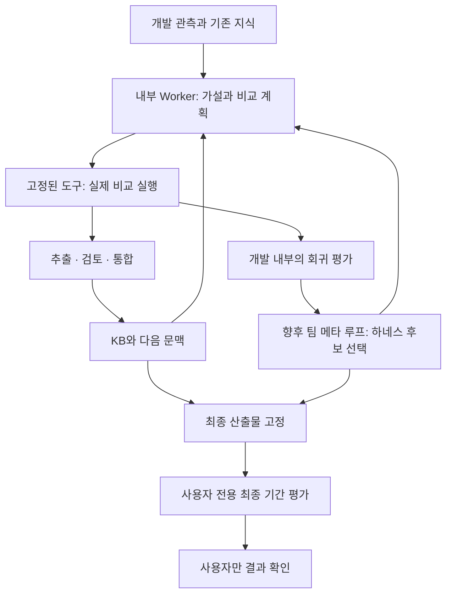

# Self-Harness와 우리 경험 학습·자율 연구 시스템 비교

작성일: 2026-09-13. 논문은 **arXiv:2606.09498v3, 2026-08-20 개정본**의 본문·알고리즘·부록을 확인했습니다. 공식 저장소는 `2720dbb3f52283684f4b85a1065d642df1779dd8`을 기준으로 읽었습니다. 우리 쪽은 기존 구현과 작성 중인 가설 중심 변경을 구분합니다. 이 문서를 작성하면서 실제 연구를 새로 실행하거나 최종 평가 자료를 조회하지 않았습니다.

**우리 팀의 상위 목표와 상당히 가깝습니다. 다만 현재 담당 모듈을 대체하는 완성품이라고 보기는 어렵습니다.** 우리 팀이 입증하려는 것은 하네스 변화가 내부 연구 성과를 개선했다는 사실이고, 현재 모듈이 먼저 만들고 있는 것은 경험에서 가설·이론을 검토하여 KB와 다음 입력에 반영하는 과정입니다. 두 층을 연결할 수 있지만, 거래 전략을 바꾸는 일과 에이전트의 연구 방법을 바꾸는 일은 따로 평가해야 합니다.

## 논문이 실제로 하는 일

Self-Harness는 모델 가중치와 평가기를 고정하고, 실행 실패를 묶어 약점을 찾은 뒤 같은 모델이 제한된 하네스 수정을 제안하게 합니다. 후보는 회귀 평가를 거쳐 채택됩니다. 평가 대상은 세 모델과 Terminal-Bench-2.0·SWE-bench Verified·AppWorld의 조합입니다. 시작점은 최소 구성의 DeepAgent 하네스입니다. [논문 v3, 3–4절](https://arxiv.org/html/2606.09498v3#S3)

채택 조건은 `Δheld-in ≥ 0`, `Δheld-out ≥ 0`, 그리고 둘 중 하나의 엄격한 개선입니다. held-in 기록은 제안에 쓰이고, held-out 기록은 제안자에게 숨기지만 **held-out 점수는 반복적인 채택 판단에 쓰입니다.** 후보당 기본 두 번의 실행 결과를 사용합니다. [알고리즘 1·3.4절·4.1절](https://arxiv.org/html/2606.09498v3#S3.S4)

“최대 132% 개선”은 Qwen3.5-35B-A3B의 AppWorld **상대 향상률**입니다. 전체 성공률은 **22.5% → 52.2%**, 절대 차이는 **29.7%p**입니다. 같은 조합의 held-in은 25.0% → 60.0%, held-out은 20.0% → 44.4%이며 각각 90개 과제를 사용합니다. 이 수치는 선택한 평가 구성의 결과이며 일반 지능 점수나 우리 금융 과제의 예상 개선율이 아닙니다. [논문 v3, 표 1·부록 A.2](https://arxiv.org/html/2606.09498v3#S4.S2)

## 공개 코드에서 더 구체적으로 확인한 부분

논문의 설명과 공개 구현을 구분해서 보았습니다. 아래 내용은 공식 저장소의 고정 커밋을 직접 읽은 결과입니다.

| 확인한 부분 | 공개 구현에서 보이는 계약 | 우리에게 주는 시사점 |
|---|---|---|
| 바꿀 수 있는 범위 | 프롬프트, 서브에이전트, 스킬, 도구 설정, 미들웨어, 런타임 제어, 권한·중단 설정을 hook으로 구분하며 후보 하나는 하나의 가상 hook을 바꾸도록 제한합니다. | 하네스 진화를 추가할 때 변경 가능한 표면을 먼저 선언해야 합니다. 모든 파일의 쓰기 권한을 주는 방식은 평가가 어렵습니다. |
| 제안 기록 | 선택한 실패 묶음, 수정 표면, 메커니즘, 예상 효과, 위험 등을 구조화합니다. 근거 있는 변경 거절도 표현합니다. | 이론 문장과 실행 가능한 변경안을 분리하고, 무엇이 개선될 것인지 먼저 남겨야 합니다. |
| 개별 후보의 채택 | 기본 train·heldout의 반복별 분모를 대조하고 평균 성공률의 악화가 없으며 적어도 한 분할이 좋아졌는지 검사합니다. | 실행 성공과 개선 성공을 별도 상태로 관리하는 선례입니다. |
| 여러 후보의 병합 | 각각 통과한 수정도 합친 뒤 다시 실행·평가하고, 병합 결과가 통과해야 새 분기로 반영합니다. | 좋은 변경 두 개가 함께 작동한다는 보장은 없으므로 통합 후 검사가 필요합니다. |

각 행의 근거: [수정 hook 계약](https://github.com/qzzqzzb/Self-Harness/blob/2720dbb3f52283684f4b85a1065d642df1779dd8/proposer/src/self_harness_proposer/hooks.py), [제안 입력·출력 계약](https://github.com/qzzqzzb/Self-Harness/blob/2720dbb3f52283684f4b85a1065d642df1779dd8/proposer/src/self_harness_proposer/multi_proposer.py), [채택 게이트](https://github.com/qzzqzzb/Self-Harness/blob/2720dbb3f52283684f4b85a1065d642df1779dd8/acceptance/scripts/run_acceptance_gate.py), [병합 후 재평가](https://github.com/qzzqzzb/Self-Harness/blob/2720dbb3f52283684f4b85a1065d642df1779dd8/workflow/scripts/run_self_harness_loop.py#L500).

한 가지 주의할 점도 있습니다. 진단 코드는 실패 원인·중요도·에이전트 메커니즘에 **LLM이 생성한 필드**를 사용한다고 명시합니다. 이후 같은 서명의 기록을 묶는 과정이 결정론적이어도 원인 해석까지 독립적으로 입증된 것은 아닙니다. **우리 해석:** 이런 원인 설명은 검증할 가설로 보존하고 실제 변경 전후 결과와 구분하는 편이 맞습니다. [공식 진단 구현](https://github.com/qzzqzzb/Self-Harness/blob/2720dbb3f52283684f4b85a1065d642df1779dd8/diagnosis/src/self_harness_diagnosis/integrated.py#L65)

공개 자료의 범위도 과장하면 안 됩니다. 확인한 저장소에는 평가·진단·제안·채택·반복 실행 코드, TB2 분할 목록과 Qwen TB2 최종 하네스가 있습니다. README의 공개 결과 표는 TB2 중심입니다. 따라서 이 저장소를 확인했다는 것만으로 모든 모델·벤치마크 조합의 재현 패키지를 검증했다고 할 수 없습니다. 이 검토에서는 설치·재현 실행을 하지 않았습니다. [공식 저장소](https://github.com/qzzqzzb/Self-Harness/tree/2720dbb3f52283684f4b85a1065d642df1779dd8), [TB2 분할](https://github.com/qzzqzzb/Self-Harness/blob/2720dbb3f52283684f4b85a1065d642df1779dd8/eval/README.md)

## 우리 시스템에서는 무엇이 바뀌고 있는가

아래는 우리 코드와 설계에 대한 비교·평가입니다. 논문의 성능 주장으로부터 유도한 결과가 아닙니다.

| 구분 | 지금 담당하는 경험 학습·연구 모듈 | 팀 차원의 하네스 개선에서 추가할 일 |
|---|---|---|
| 변화의 대상 | 가설, 비교 전략, 이론 상태·관계, KB와 다음 LLM 입력 | 역할 프롬프트·도구·검색·검증 흐름 등의 후보 버전 |
| 누가 결정하는가 | 내부 Worker가 연구 내용을 선택하고 Extractor·Reviewer·Integrator가 경험을 검토 | 별도 제안 역할이 하네스 변경안을 만들고 고정된 평가 계층이 승격 여부 결정 |
| 누가 사실을 만드는가 | 서버의 신뢰 가능한 백테스트와 원본 기록이 관측을 제공 | 동일 과제·동일 예산에서 실행한 기준 하네스와 후보 하네스의 결과 |
| 무엇이 고정되는가 | 허용된 개발 자료, 비용·체결 규칙, 실행 권한, 최종 자료 접근 금지 | 모델·추론 설정·과제 배정·평가기·비교 예산까지 함께 고정 |
| 무엇을 저장하는가 | 원본 rollout, 가설·시도, 증거 참조, KB 스냅샷, 역할별 입력·출력 | 하네스 diff, 부모 버전, 대상 실패 유형, 비교 결과, 채택·기각 이력 |
| 현재 증명 수준 | 연속 실행과 경험 학습의 연결을 확인하는 단계 | 후보 하네스가 기준보다 연구 능력을 개선했는지는 별도 대조 평가 필요 |

기존 코드에는 실행을 이어주는 Python 서버, PI 기반 역할 실행, Langfuse 원본 조회, KB 스냅샷과 근거 관계, 재시도·복구가 있습니다. 기존 묶음 방식은 실제 모델로 복수 주기의 실험·학습·다음 주기 진행을 확인했습니다. 이것은 자율 운영의 연결 증거이며 수익성이나 지능 향상의 증거는 아닙니다.

현재 추가하는 가설 중심 방식은 다음을 명시합니다.

1. Worker가 주장, 기준·변경 전략, 예상 방향·최소 효과, 반증 기준, 한계를 먼저 등록합니다.
2. 서버가 자료·비용 조건과 계획을 고정하고 같은 조건의 비교 실행을 연결합니다.
3. 범위 안에서 지지, 예측과 모순, 불명확, 도구 부족, 실행 실패를 구분합니다.
4. 부모 가설과 후속 수정을 연결하고, 학습 에이전트가 이를 KB 판정의 근거로 검토합니다.

**작성 시점의 상태:** 이 새 방식은 코드·검사·GUI를 통합 중이며, 새 방식으로 실제 모델의 등록 → 쌍 비교 → 학습 → 다음 가설 전체 경로를 검증했다는 보고는 아직 하지 않습니다. 기존 방식의 실행 성공을 새 방식의 실증 결과로 옮겨 적지 않습니다.

또한 `supported_in_scope`는 그 계획·자료에서의 예측 판정입니다. KB의 `accepted`와 같은 상태가 아닙니다. 일 수익률 차이의 신뢰구간은 낙폭이나 비용 지표의 신뢰구간도 아니며, 반복 탐색에 따른 선택 편향을 제거하지 않습니다. 현재 코드도 `independent_validation: false`와 관련 한계를 남기도록 구성합니다.

검토한 우리 구현의 주요 위치는 `market_research.py`, `market_hypotheses.py`, `market_service.py`, `market_backtest.py`, `controller.py`, `knowledge.py`, `evaluation_policy.py`, `harness_manifest.py` 및 역할 프롬프트입니다. 기준 커밋은 `557b9bd`이고 가설 중심 변경은 그 위의 작업 중인 변경을 포함합니다. 내부 문서의 내용이나 실행 원문을 이 비교 문서와 함께 자동 공개하지 않습니다.

## 가장 큰 평가 차이: 개발 검증과 사용자 전용 최종 평가

**우리 판단:** 수정의 채택 여부를 결정하는 점수는 학습 루프의 입력입니다. 에이전트에게 원본이나 숫자를 보여주지 않아도, 그 숫자로 어느 후보를 살릴지 골랐다면 미래의 선택에 영향을 준 것입니다. 따라서 앞서 확인한 held-out 채택 게이트를 우리 사용자 전용 최종 기간에 그대로 적용하면 요구사항을 위반합니다.

우리는 다음 세 역할을 분리해야 합니다.

| 자료의 역할 | 반복 연구에서 사용하는 방법 | 최종 성과 주장 |
|---|---|---|
| 개발·탐색 | 가설 생성, 실패 진단, 전략 비교, KB 갱신에 사용 | 탐색 결과로 보고 |
| 개발 내부의 회귀 검증 | 후보 KB·문맥·하네스의 악화를 검사하고 선택에 사용 | 반복 선택에 사용했음을 명시 |
| 사용자 전용 최종 기간 | 최종 산출물을 고정한 뒤 별도 실행 경로에서 평가, 결과는 사용자만 확인 | 자동 연구·후보 선택에 되먹이지 않은 최종 평가 |

그림에서 최종 결과가 자동 연구로 돌아가는 화살표는 없습니다. 손익 숫자뿐 아니라 **합격·불합격 한 비트**, 순위, 요약, “좋아졌다”라는 설명도 후보 선택에 사용하지 않아야 합니다. 최종 결과를 본 사람이 그 결과를 근거로 같은 최종 기간에 맞춰 수정한다면, 이후 비교는 처음의 봉인된 최종 평가와 구분해서 기록해야 합니다.

우리 정책 코드는 분류된 비공개 입력의 유입을 거부하지만, 출처 표시를 제거한 자연어까지 알아내는 완전한 탐지기는 아닙니다. 최근 기간 실행 경로의 물리적·권한상 분리, 결과 저장소 분리, 산출물 고정과 접근 기록까지 함께 유지해야 합니다. 임의 Python 실행을 현재 금융 연구 도구에 허용하지 않는 이유도 이 경계와 연결됩니다.

## 지금 가져오면 좋은 것과 뒤로 미룰 것

**지금은 가설·이론의 검증 기록을 단단하게 만드는 데 적용하는 것이 좋습니다.** 현재 구현의 빈틈에 대한 다음 제안은 비교를 바탕으로 한 우리 설계 판단입니다.

- **실패를 연구 재료로 정리하기:** “오류가 났다”에서 끝내지 말고 자료 부족, 도구 부족, 모델 제약, 실행 버그, 가설 예측 실패를 분리합니다. 원인 추측은 관측과 다른 필드에 둡니다.
- **한 번에 무엇을 검증했는지 좁히기:** 한 가설에서 여러 전략 요소와 비용 조건을 동시에 바꾸면 어느 변화의 효과인지 알기 어렵습니다. 좁은 비교와 변경 불가능한 계획을 우선합니다.
- **기존 성공도 보존하기:** 새 KB가 들어간 후 이전에 해결하던 과제를 놓치지 않는지 개발 내부 회귀 세트로 확인합니다. 관계 병합이나 문맥 축약 후에도 검사합니다.
- **누적 탐색을 기록하기:** 같은 자료에서 시도한 후보 수와 선택 이유를 남깁니다. 많은 시도 중 최고 수익 하나를 일반화하지 않습니다.
- **KB 품질과 선택 품질을 따로 보기:** 좋은 이론을 못 검색한 경우와 잘 검색한 이론 자체가 틀린 경우를 분리해야 개선 위치를 알 수 있습니다.

**하네스 자동 수정은 팀이 평가 계약을 정한 뒤 연결하는 것이 좋습니다.** 첫 변경 표면은 역할 입력 구성이나 검색 정책처럼 작고 되돌릴 수 있는 것으로 한정할 수 있습니다. 모델, 비용, 과제 배정, 사용 가능한 도구와 평가기를 고정한 뒤 기준 하네스와 후보를 비교하고, 통합한 결과를 다시 검사합니다. 최종 기간의 차단 정책·평가기·원본 결과 작성 권한은 수정 대상에 넣지 않습니다.

가장 중요한 남은 증명은 “실험을 많이 했다”가 아니라 **같은 조건과 예산에서 개선된 문맥 또는 하네스가 더 나은 연구를 했는가**입니다. 새 가설 프로토콜의 자율 연속 동작을 먼저 검증하고, 그다음 고정된 개발 평가 과제에서 개선 효과를 비교하는 순서가 현재 목표에 맞습니다.
