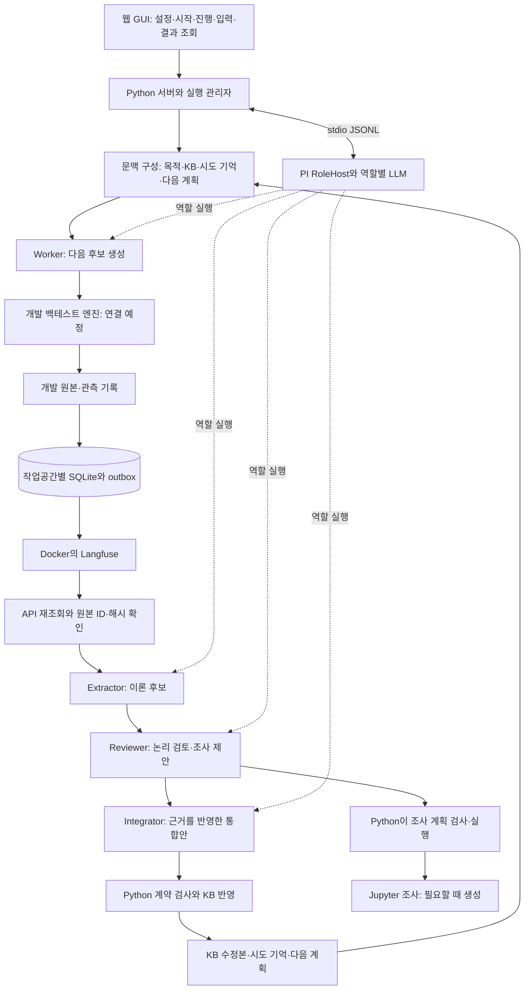
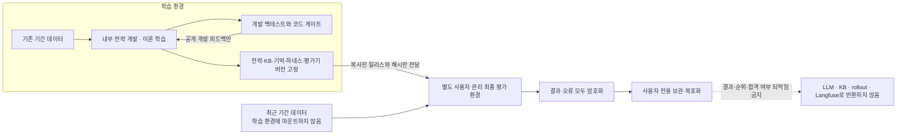

# 실행 전 검토: 변경사항·아키텍처·백테스트 평가와 개선 계획

2026-09-11 기준입니다. 이 문서는 실제 백테스트 결과를 포함하지 않습니다. 문장 점수 실험은 중단 상태로 보존하며 재실행하지 않습니다.

**현재 완료한 것은 학습 경로의 개선과 최종 평가 분리 장치입니다. 시장 백테스트 엔진과 실제 사용자 전용 평가 환경은 아직 없으므로, 백테스트를 바로 시작할 수 있는 상태는 아닙니다.** 아래에서는 구현된 동작과 앞으로 연결할 절차를 구분합니다.

전체 구현 설명과 기존 GUI·도구 구성은 [현재 아키텍처 문서](https://github.com/sicarius01/codex-docs/blob/main/cognitive-architecture/theory-learning-current-architecture.md)에서 함께 확인할 수 있습니다.

## 먼저: 이번에 무엇을 바꿨나요?

| 항목 | 바꾼 동작 | 의미와 한계 |
|---|---|---|
| 공통 목표 | Worker·Extractor·Reviewer·Integrator 모두 같은 실험 목적을 입력받습니다. Episode 생성 시 고정한 목적을 재시도에도 유지합니다. | 에이전트들이 무엇을 개선하려는지 공유합니다. 목표 달성을 보증하지는 않습니다. |
| 원문과 점수 | 이번 묶음의 모든 제출 원문·점수 쌍을 학습 입력에 보존합니다. | 점수 목록만 보고 내용을 추측하는 문제를 줄입니다. 입력 길이와 비용은 증가할 수 있습니다. |
| 시도 기억 | 시도한 방법, 근거가 있는 관측, 실패·불확실성, 다음 비교안을 KB 이론과 별도로 저장합니다. | 새 이론이 채택되지 않아도 다음 시도를 바꿀 재료가 남습니다. 미검증 가설을 사실로 승격하지 않습니다. |
| 다음 시도 배정 | 문장 실험에서는 다음 계획의 비교안을 Worker에 순환 배정합니다. 통계는 계획 ID와 비교안 ID로 묶습니다. | 서로 다른 계획을 같은 이름이라는 이유로 합산하지 않습니다. 무작위 실험이나 한 변수 통제를 보장하지는 않습니다. |
| 이론 문맥 | 비슷한 문구가 입력을 독점하지 않도록 선택 순서를 조정하고 조건·예측·근거를 함께 제공합니다. | 원본 이론을 삭제하거나 완전한 의미 중복 제거를 하는 것은 아닙니다. |
| Worker 도구 | 읽기 전용 KB 검색·이론 조회·허용된 근거 조회를 연결했습니다. 근거 페이지에서 승인된 원본 기록을 추가로 읽을 수 있습니다. | 문장 Worker는 다른 작업공간·현재 Episode의 다른 답안·임의 파일·채점기 내부를 조회할 수 없습니다. |
| 복구 | KB 반영 직후 중단되어도 같은 통합 결정으로 시도 기억 저장을 복구합니다. | 이미 반영한 KB를 중복 커밋하거나 통합 결정을 다시 생성하지 않습니다. |
| GUI | 현재 목적·시도 기억·다음 계획과 묶음별 학습 전후 차이를 보여줍니다. 시스템 탭에 백테스트 준비 상태를 추가했습니다. | 문맥 미리보기와 실제 전송한 전체 LLM 입력을 구분해서 봐야 합니다. |
| 최종 평가 | 고정 날짜 계약, 개발 결과 수집 검사, 비공개 내용 차단, 릴리스 해시 고정, 사용자 전용 암호화 CLI를 추가했습니다. | 실제 시장 엔진·전략 격리·사용자 전용 호스트를 대신하지 않습니다. |

이 변경은 점수 향상이 검증됐다는 뜻이 아닙니다. 문장 실험의 추가 실행으로 성과를 주장하지 않았으며, 기존 기록을 보존한 채 팀 평가 준비로 전환합니다.

## 전체 구성과 역할



도식의 개발 엔진과 금융 과제 연결은 예정입니다. 원본 수집 이후의 학습 경로는 구현되어 있습니다. 각 LLM 역할은 PI RoleHost가 수행하며, Python이 실행 순서·권한·기록·검사·커밋을 관리합니다. Docker는 현재 Langfuse용이고, Jupyter는 필요한 에이전트의 코드 실행 상태를 유지합니다.

사용자가 말한 “에이전트 3개”는 학습 담당인 Extractor·Reviewer·Integrator입니다. 과제를 푸는 Worker는 별도 역할입니다. Context Builder, 실행 관리자, 계약 검사기는 추가 LLM 에이전트가 아닌 Python 코드입니다.

| 역할 | 핵심 입력 | 출력·행동 |
|---|---|---|
| Worker | 공통 목적, 현재 과제, 고정 KB 문맥, 시도 기억, 배정된 비교안 | 후보 답안 또는 향후 전략 후보; 필요하면 허용된 KB·근거 읽기 |
| Extractor | 공통 목적, 검증된 rollout, 원문·관측 쌍, 기존 문맥 | 관측과 구분한 이론 후보·예측·출처 |
| Reviewer | 공통 목적, 후보 이론, 기존 이론·근거, 시도 기억 | 논리 검토, 지지·모순·의존 관계, 필요한 조사 |
| Integrator | 공통 목적, 검토·조사 결과, 기존 KB, 원본 근거 | 채택·보류·수정·기각을 위한 통합안과 다음 계획 |
| Python 검사·반영 | 구조화된 통합안과 현재 KB 기준 | 계약·출처·상태를 검사하고 KB와 시도 기억을 기록 |

모델이 “개선됐다”고 말하는 것은 평가 결과가 아닙니다. 개발 엔진의 관측을 별도 원본으로 기록하고, 조사에서 만든 모사 결과는 실제 시장 관측과 구분합니다. 이번 문장 실험의 시도 기억 계약을 금융 전략·기간별 지표에 연결하는 어댑터는 추가 구현해야 합니다.

## 1. 팀 목표와 현재 구현의 역할

팀 `loop` 저장소에는 현재 README와 저장소 설정만 있습니다. README가 정의한 목표는 기술적 분석 전략을 개선하는 내부 루프와, 내부 루프의 프롬프트·도구·메모리를 개선하는 메타 루프의 성과를 검증하는 것입니다. 시장은 Binance USDT 현물, 간격은 5분봉, 기존 데이터 구간은 2025-07~2026-07입니다.

현재 Theory Lab은 그중 경험 기록 → 이론 추출·검토 → KB·시도 기억 → 다음 입력 개선을 담당합니다. 메타 루프 전체와 LLM judge를 이 프로젝트가 대신 구현했다고 해석하지 않습니다. 팀 README의 judge는 수익률을 채점하는 모델이 아니라 코드 결함을 이유로 거부하는 역할입니다. 그 구현과 통합은 팀과 별도로 맞춰야 합니다.

기존 `evaluate`는 일반 과제의 정규화된 정답 일치율을 비교하는 A/B/C 평가기입니다. 결과를 학습 서버의 DB·GUI에 저장하므로 **사용자 전용 금융 최종 평가기로 사용할 수 없습니다.** 기존 기능은 개발 회귀 검증용으로 유지합니다.

## 2. 사용자 지정 날짜 — 자동으로 이동하지 않습니다

| 구간 | UTC 반개구간 | 용도 |
|---|---|---|
| 기존 개발 데이터 | `[2025-07-01, 2026-08-01)` | 전략 개발, 내부 검증, 후보 선택, 학습 피드백 |
| 최근 최종 평가 | `[2026-08-01, 2026-09-11)` | 2026-08-01~2026-09-10의 사용자 전용 최종 백테스트 |

사용자가 “기존 데이터 기간 이후부터 어제까지”라고 정한 값을 날짜로 고정했습니다. 설정은 `evaluation/backtest-boundary.json`입니다. 실행할 때마다 현재 날짜로 종료일을 자동 변경하지 않습니다. 데이터 공개 지연이나 누락 여부는 최종 평가 환경에서 확인해야 하며, 해당 결과를 학습 서버에 되돌리지 않습니다.

개발 구간 내부의 별도 선택 기간은 아직 지정하지 않았습니다(`selection: null`). 임의로 정한 분할을 합의된 사실로 표시하지 않습니다. 개발·선택·최종 구간은 시간순이어야 하며 겹칠 수 없습니다.

## 3. 결과를 되먹이지 않는 구조



최종 평가기에는 LLM 세션이나 학습 서버 연결을 넣지 않습니다. 최근 구간의 결과·거래 내역·잔고 곡선·수익률·위험 지표뿐 아니라, 모델 선택을 유도할 수 있는 **순위·합격 여부·“이전보다 낫다”라는 피드백도 반환하지 않습니다.** 생성자·Extractor·Reviewer·Integrator·메타 루프·LLM judge·문서 작성 에이전트 모두 같은 제한을 받습니다.

최종 실행 중 전략 코드가 로그·stdout·stderr·네트워크로 결과를 유출하지 않도록, 신뢰된 엔진과 전략 실행 격리가 필요합니다. 실행 실패 내용도 사용자 전용 결과 안에 넣습니다. 평가는 완료한 뒤 사용자만 결과를 읽습니다. 사용자에게 결과를 설명하겠다는 이유로 LLM이 보고서를 다시 읽어서는 안 됩니다.

최종 평가를 보고 전략을 수정하면 그 구간은 더 이상 손대지 않은 최종 검증 구간이 아닙니다. 추가 최종 검증에는 이후의 새 구간과 새 사전 등록이 필요합니다.

## 4. 이번에 구현한 장치

| 구현 | 동작 |
|---|---|
| 시간 구간 계약 | 날짜·시간 순서·겹침을 검사하며 명시적인 사용자 날짜 선택을 요구합니다. |
| 공개 릴리스 계약 | 전략·하네스·평가기·데이터 manifest의 고정 참조와 SHA256만 받습니다. 결과 필드는 받지 않습니다. 등록 시 실제 artifact 해시를 확인하고 같은 릴리스 ID의 내용을 바꾸지 못하게 합니다. |
| 개발 피드백 수집 | `development` 또는 지정된 `selection`, `visibility: learning`, `feedback_eligible: true`만 받습니다. 실제 선언 기간이 공개 구간 안에 포함돼야 합니다. |
| 수집·저장·전송 방어 | `partition: final_holdout`, `visibility: user_only` 또는 `feedback_eligible: false`인 내용은 HTTP 입력·명령·레코드·이벤트·스냅샷 저장 전에 거부합니다. 모델 입력·근거 읽기·Langfuse 전송 직전에도 검사합니다. 거부 오류에 원문을 넣지 않습니다. |
| 최종 실행·결과 API 차단 | 학습 서버의 최종 실행·결과 업로드 경로는 항상 거부합니다. |
| 암호화 결과 봉투 | 사용자 공개키로 결과 또는 엔진 오류를 암호화합니다. 동일한 고정 크기 봉투를 사용하며 헤더·암호문 변조를 거부합니다. |
| 분리된 사용자 CLI | 별도 사용자 환경에서만 키 생성·암호화·복호화를 수행합니다. 학습 서버나 에이전트 도구에는 연결하지 않습니다. |

공개 영수증은 사전에 정한 릴리스 ID, 봉투 버전, 무작위화된 암호문 해시만 포함합니다. 성과 수치·성공 여부·엔진 오류는 포함하지 않습니다. 영수증 자체는 평가기의 신원이나 결과의 정직성을 인증하지 않습니다. 신뢰된 전달 경로와 고정 릴리스 검증은 별도로 필요합니다.

**현재 분류 검사는 임의의 숫자나 일반 문장이 최종 결과인지 알아맞히는 기능이 아닙니다.** 분류를 없애거나 과거 기간이라고 거짓 표기한 원문을 탐지한다고 주장하지 않습니다. 따라서 최종 데이터와 결과가 처음부터 학습 호스트에 들어오지 않는 물리적·권한 분리가 주된 경계이고, 입력 검사는 잘못된 연결에 대한 추가 방어입니다.

현재 Jupyter는 같은 사용자 권한으로 동작하므로 디렉터리 하나를 따로 만드는 것만으로 사용자 전용 보장이 생기지 않습니다. **실제 최종 평가에 앞서 학습 에이전트가 접근할 수 없는 별도 사용자 관리 호스트/계정 또는 충분히 격리된 실행 환경을 준비해야 합니다.** 개인키와 비밀번호를 학습 호스트에 보관하지 않습니다. 이번 작업에서는 실제 키를 만들거나 실제 최종 데이터를 읽지 않았습니다.

## 5. 어떤 순서로 준비하나요?

### 1단계: 신뢰할 수 있는 개발 백테스트 엔진

먼저 생성된 전략의 코드나 수익률을 최적화하기 전에 평가기의 동작을 검증합니다.

- 입력·신호·주문·체결 시점을 명확히 정하고, 과거까지만 전달하는 데이터 인터페이스로 미래 접근을 막습니다.
- 수수료·슬리피지·호가/체결 근사·상장과 폐지·데이터 누락·거래 가능 종목 집합을 사전 등록합니다.
- 전체 기간 정규화, 미래 행 참조, 같은 봉의 종가를 보고 불가능한 가격으로 체결하는 등의 오류를 합성 시계열과 결정적 게이트로 검사합니다.
- 단순 기준 전략과 알려진 정답이 있는 합성 사례에서 계산을 검증합니다. 실거래 연결은 포함하지 않습니다.

실제 엔진, 데이터 manifest 형식, 전략의 입출력 계약은 `loop`에 아직 없습니다. 현재 준비 API는 이 상태를 `prepared_not_executable`로 표시합니다. 임시 계산기를 실제 백테스터로 위장해 최종 결과를 만들지 않습니다.

### 2단계: 기존 데이터 안에서 개발·선택 절차 등록

개발 구간 안에서 시간순 검증창과 후보 선택 규칙을 정합니다. 후보 수, 모델·토큰·조사 예산, 동일 초기 상태, 거래비용, 실패 처리, 비교 지표와 허용 위험을 고정합니다. 테스트를 많이 한 사실도 개발 기록에 남깁니다.

같은 초기 조건에서 외부 기억 없음, 단순 요약 기억, 이론·시도 기억을 사용하는 조건을 비교하는 것이 현재 컴포넌트의 기여를 확인하는 출발점입니다. 각 조건의 KB·시도 기억·후보 전략·모델 세션은 분리합니다. 기존 산술 과제의 정답 일치율이나 5%p 기준을 그대로 금융 지표의 합격선으로 옮기지 않습니다.

팀 전체 메타 루프의 효과는 하네스를 고정한 기준과 메타 수정 후 하네스의 비교가 추가로 필요합니다. 이는 이론 기억만의 효과와 구분합니다. LLM judge는 팀 구현과 계약을 연결하되 최종 최근 구간 결과를 읽는 역할로 확장하지 않습니다.

#### 개발 실험 한 묶음의 실행 순서 — 금융 연결 후 적용할 계획

1. 사용자가 GUI에서 개발 프로토콜과 반복 수를 선택합니다. 설정·모델·KB·시도 기억·코드 버전을 실행 시작 시 고정합니다. 현재 금융 실험용 시작 화면은 미구현입니다.
2. Worker가 이전의 관측·실패·다음 비교안을 읽고 전략 후보를 만듭니다. 후보 코드와 입력을 보존합니다.
3. 신뢰된 실행기가 허용된 개발 구간에서만 후보를 검사·백테스트합니다. 코드 오류와 실행 실패는 기록하며, 좋은 후보가 나올 때까지 실패를 숨기고 재추첨하지 않습니다.
4. 정한 N개 시도가 끝나면 각 후보·설정·관측 지표를 연결해 저장합니다. Langfuse에서 다시 조회한 원본과 로컬 manifest가 일치하는지 확인합니다.
5. Extractor → Reviewer → Integrator 순서로 이론과 다음 실험 계획을 만듭니다. 필요한 추가 조사는 개발 구간과 정해진 예산 안에서만 합니다. 금융 엔진 조사 도구는 연결 전에는 사용할 수 없습니다.
6. Python이 근거와 계약을 검사한 뒤 KB·시도 기억을 반영합니다. 사용자는 GUI에서 이론 변경, 반례·불확실성, 다음 비교안, 실제 LLM 입력의 변화를 봅니다.
7. 정한 반복 한도·예산 안에서 다음 묶음을 진행합니다. 중단·검사 실패·복구 불가 상태는 표시하고, 최종 구간으로 대체 실행하지 않습니다.

#### 무엇을 비교하고 무엇을 개선하나요?

| 비교 조건 | 기억 정책 | 확인하려는 것 |
|---|---|---|
| A | 실행 사이의 외부 기억 없음 | 기억 없이 같은 예산으로 탐색하는 기준 |
| B | 원본에서 만든 단순 요약 기억 | 일반적인 요약 재사용의 효과 |
| C | 검토된 이론·시도 기억·다음 계획 | 추가 검토와 관계 처리의 기여 |

이는 새 금융 평가의 설계안입니다. 기존 정답 일치율 평가 명령을 호출하면 자동으로 이 금융 비교가 수행되는 것은 아닙니다. A/B/C의 모델·초기 코드·기간·가능한 도구·총 예산을 맞추고, 각 조건의 데이터 저장소와 세션을 분리해야 합니다. 기억 기능에 필요한 추가 비용도 총비용에 포함합니다.

아직 수치 합격선은 정하지 않았습니다. 다음 항목을 실제 개발 평가 전에 확정해야 합니다.

| 결정 항목 | 준비할 내용 |
|---|---|
| 시간 분할 | 기존 데이터 안에서 시간순 개발창·검증창·후보 선택창을 고정하고 경계의 포지션·지표 워밍업을 정의합니다. |
| 주 지표와 제약 | 비용 차감 성과 중 주 지표 하나를 지정하고, 최대 낙폭 등 위험·거래 제약을 별도로 둡니다. 여러 지표 중 좋아 보이는 것만 사후 선택하지 않습니다. |
| 합격선 | 기준 조건 대비 요구 개선폭과 허용 비용·위험을 함께 정합니다. 수익률 증가만으로 무조건 통과시키지 않습니다. |
| 반복과 불확실성 | 동일 개발창·초기 조건을 짝지은 독립 실행의 차이를 기록합니다. 반복 수와 검출하려는 개선폭을 사전에 정합니다. |
| 시계열 의존성 | 개별 5분봉을 독립 표본으로 세지 않습니다. 기간 단위 비교와 시간 의존성을 보존하는 불확실성 추정 방식을 고정합니다. |
| 탐색 비용 | 후보 수, 추가 조사, 모델 요청·입출력 토큰, 실행 시간, 실패·재시도 모두 포함합니다. |
| 실패 처리 | 코드 거부·엔진 오류·예산 소진·데이터 누락의 처리 규칙을 고정하고 전체 시도 수를 보고합니다. |

개선 루프는 **개발 관측 → 설명 가능한 가설 → 다음 비교 → 새 개발 관측**으로 돌아갑니다. 새 관측이 이론의 예측과 맞는지·어긋나는지에 따라 지지·보류·수정·기각을 검토합니다. 같은 관측을 반복 인용하거나 많이 사용됐다는 이유로 지식을 강화하지 않습니다.

C가 나쁘면 이론 내용 문제인지, 문맥 선택 문제인지, Worker가 입력을 따르지 못한 것인지 개발 기록으로 나누어 점검합니다. 필요하면 사전에 제한한 개발 진단에서 사람이 고른 관련 이론을 넣는 조건을 추가합니다. 이 조건은 검색과 이론 품질을 진단하는 참고 실험이며, 사람의 선택 비용과 선택 편향까지 제거하는 것은 아닙니다.

하네스 코드를 자동 수정하는 팀의 메타 루프는 이번 v1 구현 범위에 추가하지 않습니다. 우선 위 기억 컴포넌트의 개발 평가를 연결하고, 이후 팀이 메타 루프 비교를 별도 프로토콜로 연결합니다.

### 3단계: 최종 후보와 평가 규칙 고정

최근 데이터를 열기 전에 선택할 후보 수와 최종 비교 항목을 결정합니다. 사용자 관리 평가 환경으로 넘기는 패키지에는 전략 코드뿐 아니라 다음을 고정해야 합니다.

- 모델·프롬프트·도구·예산과 하네스 버전.
- 사용한 KB 스냅샷·시도 기억·문맥 선택 정책. 실제 신호 생성을 위해 필요한 입력도 포함합니다.
- 전략·평가기·환경 의존성·데이터 manifest의 SHA256.
- 날짜, 거래비용, 신호·체결 규칙, 평가 지표, 후보 목록과 실패 처리.

공개 릴리스 API의 해시 검사는 파일 동일성을 확인합니다. 패키지의 의미적 완전성, 미래 접근 차단, 엔진의 정확성을 대신 보증하지 않습니다.

### 4단계: 사용자만 최종 평가

사용자 관리 환경에서 고정 패키지를 검증하고 최근 구간을 준비합니다. 그 환경에서만 백테스트를 실행하고 출력·오류를 암호화합니다. 사용자는 별도 환경에서 개인키로 열람합니다. **여기까지 완성하기 전에는 최근 기간을 실행하지 않습니다.**

## 6. 구현 인터페이스

학습 서버에는 다음 경로만 연결했습니다.

| API | 의미 |
|---|---|
| `GET /api/v1/backtest/preparation` | 날짜 경계와 아직 필요한 구성요소를 조회합니다. 실행하지 않습니다. |
| `POST /api/v1/backtest/releases` | 공개 artifact 참조·해시를 검사하고 고정 릴리스를 등록합니다. |
| `GET /api/v1/backtest/releases/{release_id}` | 공개 릴리스 메타데이터만 조회합니다. |
| `POST /api/v1/backtest/development-feedback` | 허용된 과거 구간의 관측을 학습 가능한 원본으로 수집합니다. 자동으로 LLM을 호출하지 않습니다. |
| `POST /api/v1/backtest/final-run`, `final-results` | 항상 403으로 거부합니다. |

사용자 환경 전용 CLI의 실행 형태는 다음과 같습니다. 아래 명령은 학습 에이전트 환경에서 실행할 안내가 아닙니다. 경로는 예시입니다.

```powershell
python -m theory_learning.private_report_cli keygen --private-key user-key.pem --public-key user-public.pem
python -m theory_learning.private_report_cli seal-outcome --kind result --input private-engine-output.json --public-key user-public.pem --output sealed-report.json --release-id frozen-release-001
python -m theory_learning.private_report_cli open --input sealed-report.json --private-key user-key.pem --output user-report.json --release-id frozen-release-001
```

키 비밀번호는 사용자가 대화형으로 입력합니다. CLI는 기존 파일을 덮어쓰지 않습니다. `open` 결과는 사용자 전용 출력으로 보관하며 이 프로젝트·Langfuse·LLM에 업로드하지 않습니다. 엔진 오류도 `--kind error`로 같은 암호화 경로를 사용합니다. v1은 암호화 전 데이터를 고정 1MiB로 패딩합니다. 내부 base64와 포장 형식 때문에 원본 결과의 실제 한도는 약 768KiB보다 조금 작고, 출력 JSON 봉투는 약 1.34MiB입니다. 용량을 넘는 결과는 성공으로 잘라 저장하지 않고 봉투 내부에 용량 오류를 남깁니다. 큰 거래 내역의 사용자 전용 보관·분할 형식은 실제 엔진 연결 시 확정해야 합니다.

## 7. 확인한 범위

이번 반영 시 Python 전체 테스트 285개, 관련 GUI 테스트 7개, PI 통신 테스트 2개가 통과했고 TypeScript 검사와 GUI 빌드가 성공했습니다. Python 테스트에는 기존 라이브러리의 사용 중단 예정 경고 2건이 남았습니다. 재시작한 서버에서 두 작업공간의 에이전트 연결과 고정 날짜를 확인했으며 활성 실행은 없었습니다. 문장 실험의 반복 묶음도 모두 취소 상태입니다.

검증에는 합성 데이터만 사용합니다. 실제 개발·최종 시장 데이터를 다운로드하거나 백테스트하지 않습니다.

- 최종 표시가 붙은 합성 결과가 명령·이벤트·스냅샷·outbox로 들어가지 않는지.
- 최종 날짜를 개발 날짜로 수집하려는 요청이 거부되는지.
- 개발 관측의 원본 ID가 유지되고 같은 수집 요청이 중복 저장되지 않는지.
- 릴리스의 해시 불일치·동일 ID 수정이 거부되는지.
- 암호화 결과의 정상 복호화, 잘못된 키·변조 거부, 결과와 오류의 동일한 공개 형태.
- 재시작·기존 GUI·문장 실험의 과거 기록 조회가 유지되는지.

이러한 검증은 정보 흐름과 암호화 코드의 검사입니다. 신뢰된 시장 엔진·전략 샌드박스·사용자 전용 운영 환경이 실제로 배치됐다는 의미는 아닙니다.
