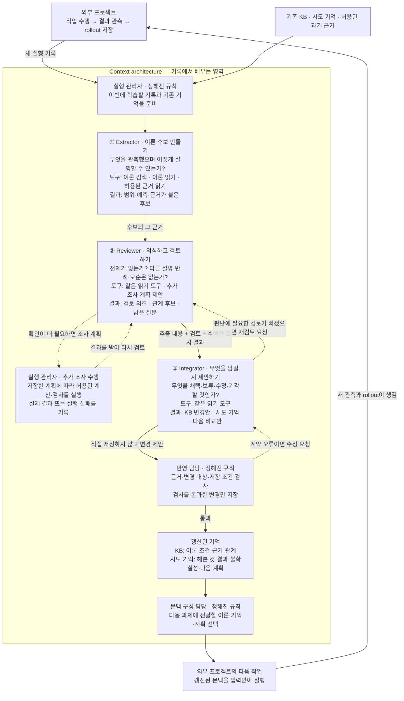
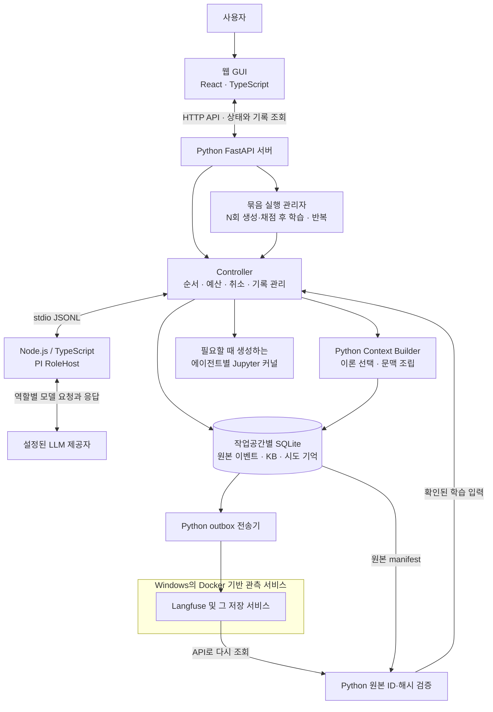
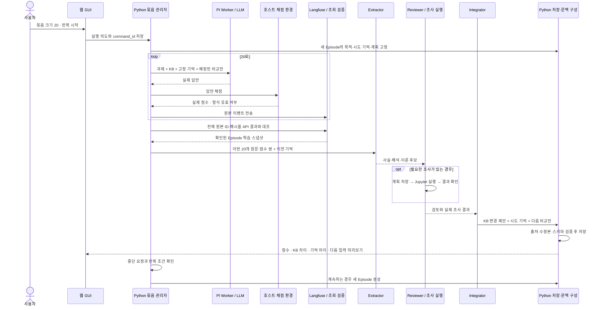
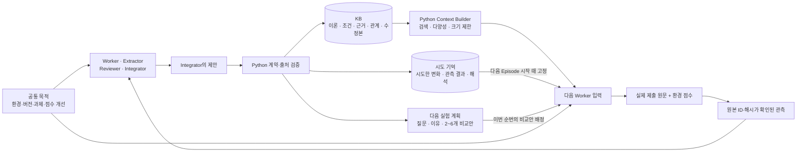
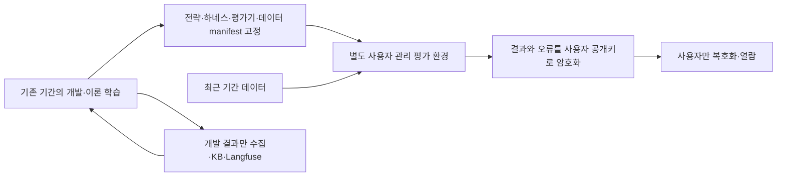

# Theory Lab 현재 구조와 한 번의 학습이 진행되는 방식

2026년 9월 구현 기준입니다. 향후 구상과 현재 구현을 구분하며, 실행 결과를 증명하는 평가 보고서를 대신하지 않습니다.

이 시스템은 **같은 LLM을 쓰면서도, 이전 시도에서 얻은 관측·이론·다음 실험 계획을 다음 입력에 전달하는 것**을 목표로 합니다. 모델 가중치를 학습하거나 하네스 코드를 스스로 수정하지는 않습니다. 문장 실험은 연결 사례로 남아 있으며 현재 중단한 상태입니다. 일반 프로젝트의 작업 목적·기록·KB를 받는 공통 경로와 별도 비금융 평가 경로를 사용합니다.

## 먼저 보는 논리 흐름: 누가 무엇을 어떻게 하나요?

**프로젝트는 일을 하고 기록을 남깁니다. Context architecture는 그 기록에서 배울 내용을 찾아 검토하고, 다음 작업에 쓸 기억과 문맥을 갱신합니다.** 문장 생성·채점이나 전략 백테스트는 바깥 프로젝트의 일입니다. 어떤 일을 몇 번 실행하는지는 이 학습 구조 자체의 정의가 아닙니다.

아래 그림은 서버나 통신 방식이 아니라 **역할 사이에 무엇이 전달되는지**를 보여줍니다. 실선은 작업·결과의 전달이며, 점선은 필요할 때 수행하는 추가 조사입니다.

**세 에이전트는 판단과 제안을 담당하고, 실행·검사·저장은 관리 규칙이 담당합니다.** 실행 관리자·반영 담당·문맥 구성 담당은 별도의 LLM 에이전트가 아닙니다. 검사를 통과했다는 것은 저장 계약과 근거 연결이 맞는다는 뜻이며, 이론이 참이라고 자동 증명됐다는 뜻은 아닙니다.

### 각자가 받는 것, 할 수 있는 것, 바꿀 수 있는 것

세 역할은 작업 목적과 적용 범위를 공유합니다. 일반 작업도 실행 접수 시 목적·최근 학습 요약·미해결 사항을 고정하여 전달합니다. 외부 프로젝트는 자신의 목적을 명시해야 하며, 목적이 없으면 일반 학습 목적을 사용했다는 표시를 남깁니다. 실제 제공 자료는 역할과 실행에 따라 다르며, 아래의 “근거 읽기”는 허용된 기록만 읽는 권한입니다.

| 담당 | 무엇을 받아서 | 무엇을 위해, 어떻게 일하나요? | 권한과 도구의 범위 |
|---|---|---|---|
| **Extractor — 후보 작성자** | 이번 기록, 작업 목적, 기존 시도 기억 | 관측 사실과 해석을 구분합니다. 설명 가능한 규칙·가설·교훈을 만들고 어디에 적용되며 무엇을 예측하는지 적습니다. | 이론 검색·읽기와 허용된 근거 읽기. 후보를 제안하며 KB를 직접 바꾸거나 조사를 실행하지 않습니다. |
| **Reviewer — 검토자** | 추출 후보와 원본 근거, 관련 기존 이론, 이전 시도 | 전제·범위·대안·반례를 따지고 이론 사이의 지지·의존·모순을 검토합니다. 확인이 필요하면 질문·예측·계산 방법을 담은 조사 계획을 냅니다. 실제 결과를 받으면 해석을 고칩니다. | 같은 읽기 도구와 조사 **계획 제안**. 조사 코드를 직접 실행하지 않으며, KB도 직접 바꾸지 않습니다. |
| **실행 관리자 — 조사 수행자** | Reviewer가 제안한 조사 계획 | 허용된 범위와 예산 안에서 계획을 실행하고 결과·실패를 돌려줍니다. | 현재 가능한 추가 조사는 로컬 계산·코드 검사입니다. 현실의 새 실험이나 금융 백테스트를 임의로 실행하는 만능 조사 도구는 아닙니다. |
| **Integrator — 통합안 작성자** | 추출 내용, 검토, 실제 조사 결과, 기존 KB, 허용된 근거 | 근거를 종합해 이론·관계 변경을 제안합니다. 부족한 검토는 Reviewer에게 되돌려 보냅니다. 결론이 안 나도 불확실성과 다음 확인 조건을 남깁니다. | 같은 읽기 도구. KB 저장·실험 실행 권한은 없습니다. 재검토 요청과 KB 변경을 같은 판단에서 동시에 수행하지 않습니다. 형식·출처 오류를 고치는 재요청에는 도구가 없습니다. |
| **반영 담당 — 저장 실행자** | Integrator의 변경안 | 출처가 실제로 존재하는지, 변경 대상과 형식이 맞는지 검사합니다. 맞지 않으면 수정 요청이나 중단으로 처리하고, 통과하면 기록합니다. | 실제 KB·시도 기억을 저장하는 역할. 제안의 의미적 진실성을 독자적으로 판정하는 별도 에이전트는 아닙니다. |
| **문맥 구성 담당 — 다음 입력 준비자** | 갱신된 KB·시도 기억·다음 계획과 과제 | 관련 내용을 골라 다음 작업에 전달합니다. | 저장된 내용의 선택·조립. 새 이론을 생성하거나 선택했다는 이유로 이론의 신뢰도를 높이지 않습니다. |

### 읽기 도구는 구체적으로 무엇을 하나요?

- **이론 검색:** 관련된 기존 주장을 찾습니다.
- **이론 읽기:** 선택한 이론의 내용·조건·근거·반대 근거를 자세히 봅니다.
- **근거 읽기:** 허용된 원본 기록이나 조사 결과를 확인합니다. 요약만 보고 결론 내리지 않도록 세부 내용을 찾아보는 수단입니다.

외부 PI Worker에도 이 세 읽기 도구와 **사용한 이론 보고** 도구를 연결할 수 있습니다. 사용 보고는 모델의 자기 보고이며 실제 인과적 기여의 증명이 아닙니다. 제공자에게 전송되는 최종 입력을 캡처하고, 캡처에 실패하면 기록 없이 모델을 호출하지 않습니다. 팀 Worker가 원래 갖고 있던 도구는 팀의 실행 정책으로 관리합니다.

읽기 권한은 **모든 프로젝트의 모든 기록을 자유롭게 탐색하는 권한이 아닙니다.** 현재 실행에 허용된 이론·근거 범위로 제한됩니다. 원본 기록을 읽었다고 그 안의 지시를 따르거나 기록을 수정할 권한이 생기지 않습니다. 사용자 전용 최종 평가 기록·결과는 어느 학습 역할에도 제공하지 않습니다.

### 어떤 경우에 무엇이 바뀌나요?

- **근거가 충분한 후보:** 적용 조건·한계와 함께 잠정 채택을 제안합니다.
- **설명은 가능하지만 확인이 부족한 후보:** 보류하고 무엇을 추가로 확인할지 남깁니다.
- **새 근거가 기존 설명과 어긋나는 경우:** 조건 수정·범위 축소·기각 또는 모순 관계를 검토합니다. 어긋났다는 이유만으로 자동 기각하지 않습니다.
- **유용한 이론을 못 찾은 경우:** KB 변경이 없을 수 있습니다. 일반 학습도 요약·미해결 사항을 남기고, 점수 실험 연결은 추가로 시도 기억과 다음 비교안을 남깁니다.

상상한 반례는 논리적 검토 재료이고, 실제 관측한 반례와 다릅니다. 조사 코드가 실패한 것도 가설이 틀렸다는 증거가 아닙니다. 이런 구분을 유지한 채 다음 시도에서 확인할 질문을 준비합니다.

### 과거 rollout은 지금 어떻게 쓰나요?

과거 기록은 보관하지만 **전체 원문을 매번 세 에이전트에게 한꺼번에 넣지는 않습니다.** 현재 문장 실험의 학습 입력에는 새 묶음의 제출·점수 쌍 전체와 기존 KB, 최근 시도 기억·일부 과거 관측·누적 통계를 사용합니다. 자세한 근거는 허용된 읽기 경로로 보충합니다. 전체 과거 기록을 대상으로 자유롭게 검색·재분석하는 구조가 완성됐다는 뜻은 아닙니다.

따라서 그림의 “기존 기억”은 **과거 경험을 재사용하는 입력**을 뜻합니다. 모든 과거 rollout 원문을 매번 전수 검토한다는 뜻으로 읽으시면 안 됩니다.

아래 1~2절은 기술 구성과 역할별 실제 입력의 상세입니다. 3절의 “20회 문장 실험”은 이 구조를 한 프로젝트에 적용한 실행 예시이며, context architecture 자체와 구분합니다.

## 1. 무엇이 어디에서 돌아가나요?

| 구성요소 | 현재 맡은 일 |
|---|---|
| 웹 GUI | 실행 시작·중단, 진행 상황, 점수, KB 변경, 각 모델의 실제 입력·출력을 보여 줍니다. 브라우저가 학습 루프를 실행하는 것은 아닙니다. |
| Python FastAPI 서버 | 작업공간별 API와 상태를 제공합니다. 실행 관리자·저장소·Langfuse 전송기를 연결합니다. |
| Python Controller | 어떤 역할을 어떤 입력으로 실행할지 정하고 결과를 검증합니다. 도구 실행, 체크포인트, 예산, 취소를 관리합니다. |
| PI RoleHost | Python의 요청을 받아 독립 PI 세션을 만들고 설정된 모델을 호출합니다. 도구 요청을 Python으로 전달합니다. |
| LLM | 과제 답안, 이론 후보, 검토, 조사 계획, 통합 제안을 생성합니다. Python의 상태 기계나 DB를 대신하지 않습니다. |
| Jupyter 커널 | 허용된 Python 코드를 실제로 실행하고 출력·오류를 돌려줍니다. |
| SQLite와 파일 저장소 | 실행 상태, 원본 이벤트, 불변 스냅샷, 이론 수정본, 시도 기억, 도구 결과와 파일 산출물을 보관합니다. |
| Langfuse | 모델·도구·실험 기록의 관측 경로입니다. 서버에서 조회 가능한 기록인지 확인한 뒤 학습 입력을 확정합니다. |
| Docker | 현재 Windows에서 Langfuse와 관련 서비스를 올리는 데 사용합니다. 에이전트마다 컨테이너를 만드는 구조는 아닙니다. |

PI 자체가 LLM인 것은 아닙니다. **Python이 작업을 지시하고, PI가 모델 제공자와 통신하며, 모델이 응답합니다.** 기본 모델과 Worker·Extractor·Reviewer·Integrator별 모델을 설정할 수 있습니다. 실행 시작 시 모델 설정을 고정하므로, 설정을 바꿔도 이미 시작한 실행의 모델이 중간에 바뀌지는 않습니다. 실행 도중 모델을 자동 선택·교체하는 별도 오케스트레이터는 아직 없습니다.

## 2. 에이전트는 몇 개이고, 각각 무엇을 받나요?

학습 역할은 **Extractor·Reviewer·Integrator의 세 가지**입니다. 여기에 과제를 수행하는 **Worker**, 사용자가 번역을 요청할 때 사용하는 **Translator**가 있습니다. “역할 세 가지”는 항상 프로세스나 모델 호출이 정확히 세 개라는 뜻은 아닙니다. Reviewer는 새 조사 결과에 따라 여러 차례 검토할 수 있고 Integrator도 재검토를 요청할 수 있습니다. 각 회차 입력·결과를 고정하며 예산을 소진하면 추가 근거가 필요한 상태를 보존합니다.

점수 실험에 연결된 네 역할에는 공통 목적을 시스템 지침과 구조화된 입력으로 전달합니다. 내용은 **이 환경에서 형식 제약을 지키며 관측 점수를 높이고, 실제 시도·점수에서 규칙을 찾되, 불확실성을 유지하고 다음 비교를 제안하라**는 것입니다. 숨겨진 채점 공식은 이 입력에 넣지 않습니다.

| 역할 | 주로 받는 입력 | 제공되는 도구 또는 실행 경로 | 남기는 결과 |
|---|---|---|---|
| **Worker — 과제 수행** | 원래 과제, 공통 목적, 고정된 KB 문맥, 이전 시도 기억, 연결된 경우 이번 제출의 비교안 | 제한된 KB 읽기와 `report_theory_usage`. 일반 Worker는 설정에 따라 Python 도구를 사용할 수 있습니다. | 실제 답안, 사용했다고 보고한 이론 수정본 ID. 점수는 이후 환경이 매깁니다. |
| **Extractor — 이론 추출** | 공통 목적, 이전 시도 기억, Langfuse에서 확인한 실행 기록, 이번 묶음의 모든 제출 원문·점수 쌍 | 이론 검색·전체 이론 읽기·허용된 근거 읽기 | 관측 사실, 해석, 요약, 이론 후보와 근거 참조 |
| **Reviewer — 검토** | 추출 결과, 관련 기존 이론, 원문·점수 쌍, 공통 목적, 이전 시도 기억 | 읽기 도구를 사용합니다. 조사할 Python 코드는 계획으로 제안하고, **Controller가 저장한 계획을 Jupyter에서 실행**합니다. | 검토 의견, 관계 후보, 조사 계획, 실제 조사 결과의 해석, 미해결 질문 |
| **Integrator — 통합 제안** | 추출·검토·실제 조사 결과, 고정된 KB 수정본 목록, 허용된 근거 ID, 공통 목적과 시도 기억 | 읽기 도구가 있으며 KB 쓰기나 실험 실행 권한은 없습니다. 계약 오류를 고치는 재호출에는 도구를 주지 않습니다. | 이론·관계 변경 제안과 별도의 시도 기억·다음 실험 계획. Python이 검증하고 저장합니다. |
| **Translator — 표시용 번역** | 사용자가 선택한 원문, 한국어 번역 요청 | 도구 없음 | 표시용 번역. 원래 입력이나 KB를 수정하지 않습니다. |

각 PI 역할 세션에는 허용된 도구만 등록합니다. PI의 일반 내장 도구를 그대로 열어 주지 않습니다. 문장 실험 Worker는 숨겨진 채점기를 실행하거나 그 설정 파일을 읽는 도구를 받지 않습니다. 추가 근거 읽기도 해당 작업공간의 고정된 KB와 허용된 관측 ID로 범위를 제한합니다.

## 3. 적용 예시: 문장 실험을 20회씩 실행하는 순서

이 절만 문장 생성·채점 프로젝트의 실행 순서를 설명합니다. `20회`는 바깥 실험의 실행 수이며, 이론 추출·검토·통합을 20번 수행한다는 뜻이 아닙니다. Context architecture의 역할과 권한은 문서 앞의 논리 흐름을 기준으로 보시면 됩니다.

용어부터 구분하시면 진행 화면을 읽기 쉽습니다.

| 단위 | 의미 |
|---|---|
| 제출·시도 | Worker가 답안 하나를 만들고 환경이 채점하는 1회입니다. |
| Episode | 함께 학습할 여러 제출과 점수를 담는 관측 묶음입니다. |
| Cycle | N회 생성·채점, 이론 추출·검토·통합, 학습 전후 비교까지의 한 사이클입니다. |
| Batch | 여러 Cycle을 차례로 수행하는 반복 실행입니다. 반복 횟수를 정하거나 무한 반복을 선택할 수 있습니다. |

같은 Episode 안에서는 이전에 학습된 기억과 다음 계획을 고정합니다. 비교안은 **순번에 따라 순환 배정**합니다. 예를 들어 비교안이 세 개이면 20회를 7·7·6회로 나눠 배정합니다. 무작위 배정은 아니며, 모든 변수와 표현을 정확히 통제한다는 뜻도 아닙니다.

해당 Episode의 앞선 제출 점수를 뒤의 Worker가 몰래 참고하여 전략을 바꾸지 않도록, 읽을 수 있는 과거 점수도 Episode 시작 이전으로 제한합니다. 20개가 모인 뒤 학습하고, 그 결과를 다음 Episode에서 사용합니다.

유효한 점수가 부족하거나 기록 조회가 끝나지 않았다면 학습 완료로 처리하지 않습니다. 추출할 새 이론이 없더라도 새 학습 계약에서는 검토·통합을 이어가며, “무엇을 해봤고 무엇이 아직 불명확한가”와 다음 실험 계획을 남기도록 요구합니다.

## 4. KB와 시도 기억은 무엇이 다른가요?

**KB(Knowledge Base)는 조건과 근거가 붙은 이론 저장소**입니다. **시도 기억은 그동안의 시도·결과·해석과 다음 행동 계획**입니다. 유용한 이론을 아직 발견하지 못해도 시도 기억은 남길 수 있습니다.

| 저장 내용 | 예시와 의미 |
|---|---|
| 관측 | “제출 A의 점수는 6이고 B는 8이었다.” 실제 원문과 채점 ID가 붙습니다. |
| 이론 | “특정 문장 특징이 점수에 영향을 줄 수 있다.” 적용 범위·가정·예측·지지/반대 근거·한계를 함께 기록합니다. |
| 시도 기억 | “길이를 늘린 비교를 했지만 다른 특징도 달라져 원인을 구분하지 못했다.” 실패나 불확실한 비교도 보존합니다. |
| 다음 실험 계획 | “같은 주제에서 문장 길이만 최대한 다르게 해 보자.” 실행 지시와 예상 결과이며, 관측된 사실은 아닙니다. |

시도 기억의 판단은 `improved`(개선 관측), `not_improved`(개선 확인 안 됨), `inconclusive`(판단 보류), `execution_failed`(실행 실패)로 나눕니다. **개선을 확인하지 못한 것과 가설을 반증한 것은 다릅니다.** 조사 코드가 오류로 끝났다고 가설이 틀렸다고 판단해서도 안 됩니다.

Integrator가 만든 시도 기억은 채택된 지식과 별도 상태로 저장합니다. 비교 결과를 주장하려면 해당 묶음에서 확인된 채점 ID를 연결해야 하며, 개선·미개선 판단에는 최소 두 관측을 요구합니다. 이것은 최소 형식·출처 검사이지, 통계적으로 올바른 비교를 자동 보증하는 장치는 아닙니다.

비교안별 누적 통계는 계획 ID와 비교안 ID를 함께 사용합니다. 다음 계획에서도 `baseline` 같은 이름을 재사용할 수 있으므로, 이름이 같다는 이유만으로 다른 계획의 비교안을 같은 처치로 합치지 않습니다.

현재 다음 입력에는 최근 구조화된 시도 기억 8묶음, 이전 형식의 요약 최대 5묶음, 최근 원문·점수 쌍 12개와 누적 통계를 넣습니다. 오래된 원본은 삭제하지 않습니다. 과거 버전에 구조화된 시도 기억이 없었다면, 실제로 기록하지 않은 전략이나 실패 원인을 사후에 만들어 넣지 않습니다.

### 입력을 요약하는 별도 에이전트가 있나요?

**현재 별도의 Context Builder 에이전트는 없습니다.** 역할은 다음처럼 나뉩니다.

1. Integrator가 새로운 이론과 시도 기억, 다음 실험 계획을 제안합니다.
2. Python이 검증한 결과를 저장합니다.
3. Python Context Builder가 고정된 KB에서 이론을 검색하고, 비슷한 주장으로 입력이 채워지지 않도록 순서를 조정합니다.
4. 다음 Worker에는 선택된 이론뿐 아니라 공통 목적·고정된 시도 기억·이번 비교안이 함께 들어갑니다.

Context Builder는 후보·기각 상태를 제외한 뒤 잠정 채택·보류 이론에서 최대 10개를 선택합니다. 적용 범위·가정·반대 근거·재검토 표시 등을 유지하며, 어떤 수정본을 선택하거나 제외했는지와 유사 주장 묶음 ID를 남깁니다. 예측과 근거 참조도 포함합니다. 크기가 부족하면 선택적 근거 요약을 먼저 빼고, 이론의 조건을 문장 중간에서 잘라 사실처럼 만들지 않습니다.

이 선택은 어휘·태그와 저장된 이론 관계를 활용하는 결정적 휴리스틱입니다. 논리적으로 동치인지 판정하여 KB 이론을 병합하거나 삭제하는 기능은 아닙니다. `context_tokens`의 기본값은 16,000이며 설정으로 바꿀 수 있습니다. 현재는 UTF-8 바이트 수로 보수적으로 적용되는 **이론 문맥의 크기 한도**입니다. 공통 목적·시도 기억·출력 스키마 등을 합친 모델 요청 전체 크기와는 다릅니다.

일반 프로젝트에는 최근 완료한 학습 요약 최대 12개와 해당 실행의 미해결 사항 최대 20개를 별도로 고정합니다. 독립 비교용 학습 분기는 이 공통 기억에 섞지 않습니다. 점수 실험의 비교안 배정 기능은 해당 프로젝트 전용이며 일반 학습의 필수 단계가 아닙니다.

### 검토 결과는 단순한 자유 서술인가요?

새 실행의 내부 출력 계약 V2는 관측·해석의 출처, 후보의 예측, 검토 대상 수정본, 사용한 논리 연산자, 대안 설명과 구별 조건을 구조화합니다. 여기서 V2는 내부 계약 버전이며 프로젝트 목표인 V1의 다음 제품 버전을 뜻하지 않습니다. 과거 실행은 당시 계약으로 재생합니다.

관계에는 조건·근거·검토 상태·공동 전제를 남깁니다. 전제가 바뀌면 의존한 이론의 재검토 필요성을 전파합니다. 방법 이론에는 절차와 비교 기준이 필요하며, 채택에는 단순한 논리 문장 이외의 관측 근거를 요구합니다. 이 검사는 근거의 존재와 연결을 강제하며 그 근거가 주장을 충분히 뒷받침하는지까지 자동 증명하지 않습니다.

조사 계획에는 바꿀 조건·고정할 조건·범위·한계·예산·실행 가능성을 적습니다. 지금 실행할 수 없는 조사는 보류 이유와 다시 시도할 조건을 기록합니다. Reviewer는 추가 조사 결과를 받은 뒤 다시 판단할 수 있습니다. 실제 결과를 읽는 것과 최종 저장을 승인하는 것은 다른 단계이므로, 결과 검토는 바로 진행하고 KB 반영 전 Langfuse 조회 검증을 마칩니다.

실행 가능한 추가 조사가 없으면 미해결 상태와 필요한 다음 조건을 유지한 채 Integrator에게 넘깁니다. 단지 검토가 미완료라는 이유로 같은 역할을 계속 호출하지 않습니다. 실제 조사를 수행했다면 결과를 다시 검토하고, Integrator가 구체적인 재검토를 요청했을 때에도 검토를 이어갈 수 있습니다. 잘못된 출처·관계 참조에는 오류 위치와 허용된 참조를 제공하며 모델의 문장을 임의의 근거 ID로 바꿔 저장하지 않습니다.

이미 완료한 조사를 다시 언급한 것은 새로운 실행 결과가 아닙니다. Integrator의 추가 요청을 검토했지만 실행 가능한 조사가 없다면, 필요한 외부 관측과 보류 이유를 남기고 통합을 마무리합니다. 확보할 수 없는 같은 관측을 계속 요구하며 왕복하지 않습니다. 출력 형식이나 실제 결과의 인용 위치가 틀리면 해당 필드와 오류 이유를 알려 수정하도록 하며, 그 과정에서 조사 도구를 다시 실행하지 않습니다.

## 5. 한 묶음이 실제로 무엇을 남겨야 하나요?

다음은 흐름을 설명하기 위한 가상 예시입니다. 실제 측정 결과나 학습된 규칙이 아닙니다.

과제는 “번호를 붙인 영어 문장 10개를 제출해 점수를 높이기”이고 채점 공식은 공개하지 않는다고 하겠습니다. 아직 유용한 단서가 없으면 초기 계획은 보통 길이의 문장, 더 긴 문장, 어휘·문법 패턴을 반복한 문장처럼 서로 다른 구성을 탐색합니다. 특정 정답 특징을 미리 알려 주지 않습니다.

20회 실행 후 긴 문장 비교안의 평균이 높게 나왔다고 해도, 바로 “길이가 점수를 결정한다”를 채택하면 안 됩니다. 주제·단어·문법도 함께 달라졌을 수 있기 때문입니다.

- **관측 기록:** 20개 원문·점수·비교안 ID를 모두 유지합니다.
- **추출·검토:** 길이와 점수의 관계를 후보로 삼되 다른 변화가 섞였음을 기록합니다.
- **KB 판단:** 근거가 부족하면 이론을 보류하고 적용 범위를 해당 실험으로 제한합니다.
- **시도 기억:** “긴 문장 비교안의 점수가 높았으나 원인을 분리하지 못했다”라고 기록합니다.
- **다음 계획:** 같은 주제와 유사한 어휘를 유지하며 길이를 다르게 한 비교안과 기준안을 제안합니다.
- **다음 Worker:** 이전의 막연한 조언만 다시 받는 대신, 해당 질문을 확인할 구체적인 비교안을 배정받습니다.

다음에도 개선이 보이지 않으면 그 결과를 기억에 추가하고 다른 특징을 시험하도록 계획을 바꿉니다. 모든 시도가 채택 이론으로 끝날 필요는 없습니다.

## 6. 웹에서 어디를 보면 되나요?

먼저 왼쪽 위 **작업공간**을 확인합니다. 일반 학습은 **실행 기록·에이전트·이론·논리·실험·LLM 입력·지식베이스**에서 살펴봅니다. **문장 실험**은 해당 연결 사례의 반복 실행과 학습 전후 비교 화면이며, 현재 중단한 실험을 열람하는 것만으로 다시 실행하지 않습니다.

| GUI 위치 | 확인할 수 있는 내용 |
|---|---|
| **문장 실험** | 생성·채점 횟수, 제출과 점수, 묶음 및 무한 반복의 현재 상태, 중단·재개, 현재 목적·시도 기억·다음 실험 계획 |
| **문장 실험 → 선택한 묶음** | 학습 단계, KB 추가·수정·관계 변화, 학습 전후 시도 기억, 선택된 이론 문맥 비교, 실제 모델 입력 링크 |
| **실행 기록** | 실행 종류·상태·단계, 오류, 재개 여부와 관련 기록 |
| **에이전트** | 역할별 실행 인스턴스, 모델 호출과 도구 실행 기록 |
| **이론** | 주장, 잠정 채택·보류·기각 상태, 적용 범위, 가정, 근거, 예측과 한계 |
| **논리·실험** | Reviewer 검토, 조사 계획과 실제 실행 결과, 이론 간 관계 |
| **LLM 입력** | 모델 호출별 실제 전송 payload와 결과, 입력 캡처 상태, 사용량 |
| **지식베이스** | KB 스냅샷·수정본과 관계. 특정 시점의 상태를 확인하는 데 사용합니다. |
| **시스템** | 모델 설정, 연결·운영 상태와 검토가 필요한 항목 |
| **테스트 채팅** | 모델 연결과 간단한 대화를 직접 확인하는 별도 화면 |

학습 후의 **이론 문맥 미리보기는 전체 프롬프트가 아닙니다.** 실제 요청에는 시스템 지침, 과제, 목적·시도 기억, 배정된 비교안, 출력 스키마, 필요하면 도구 결과가 더 들어갑니다. 무엇을 정말 전송했는지는 **LLM 입력의 실제 전송 입력**에서 확인하시면 됩니다.

선택한 과거 묶음과 지금 실행 중인 묶음은 구분하여 표시합니다. 과거 기록에 저장하지 않았던 학습 전후 기억은 현재 기억으로 덮어 보여 주지 않습니다. 한국어 번역은 표시를 돕는 별도 모델 호출이며 원본의 대체 기록이 아닙니다.

개요와 KB 화면에는 후보·보류·재검토 건수, 가장 오래 대기한 시간, 열린 질문, 정확히 같은 주장·범위의 중복 묶음을 표시합니다. 중복 표시는 의미적 동치 판정이 아닙니다. 학습 진행 화면은 반복 검토·통합 회차와 보류 조사, 원본 확인·KB 반영을 구분합니다. 인증 정보를 제거한 기록에는 제거 위치·이유를 표시하고 원래 값은 표시하지 않습니다.

KB 화면의 **열람할 KB 고정본**에서 현재 적용된 KB 또는 과거 학습 분기의 결과를 선택할 수 있습니다. 입력 미리보기도 선택한 고정본을 기준으로 만들며, 다른 학습이 끝나 현재 KB가 바뀌어도 선택한 과거 기록은 유지됩니다. 과거 고정본을 열람하는 것은 현재 KB에 적용하거나 채택하는 동작이 아닙니다.

## 7. 기록·분리·재시작은 어떻게 처리하나요?

### 원본과 Langfuse

원본 이벤트를 먼저 로컬 SQLite에 기록하고 outbox로 Langfuse에 전송합니다. 전송기의 `flush()`가 끝났다는 이유만으로 학습 가능한 기록이라고 판단하지 않습니다. **Langfuse API에서 다시 읽은 이벤트의 ID와 본문 해시가 원본 manifest와 모두 일치해야** 학습 스냅샷을 만듭니다. 일부만 보이면 기다리거나 해당 누락분을 재전송합니다. 전송 재시도 때문에 과제나 조사 도구를 다시 실행하지는 않습니다.

저장할 텍스트·JSON은 해시 계산과 영구 저장 전에 명시적 인증 필드, 알려진 토큰 형식, 설정된 비밀 값 패턴을 제거합니다. 제거 위치와 이유는 값 없이 별도로 기록합니다. 모든 종류의 비밀이나 임의 바이너리를 알아내는 탐지기는 아닙니다. 통신은 최대 32 MiB의 메모리 JSONL 프레임을 사용하며 큰 원문을 디스크 spool로 쓰지 않습니다. 초과 입력은 명시적으로 거부합니다. 과거 버전이 남긴 파일을 이 변경으로 자동 정리하거나 소급해서 안전하다고 간주하지 않습니다.

Langfuse에는 모델 생성·도구·검색·에이전트 관측 종류를 구분하고 제공된 상위 trace 연결을 유지합니다. 기록 제거 때문에 실제 요청과 저장본이 달라진 경우 제거 표시가 붙으며, 해시는 저장된 안전한 본문을 기준으로 합니다.

일반 진단 이벤트는 입력 크기 때문에 일부 생략될 수 있습니다. 하지만 새 학습 입력의 핵심인 **이번 묶음의 제출 원문·점수 쌍은 별도 목록으로 모두 전달**합니다. “점수 목록은 20개인데 실제 문장은 하나만 본다”는 상황을 막기 위한 구분입니다. 추가 원본은 허용된 ID를 통해 나눠 읽을 수 있습니다.

증거는 `logical_analysis`, `hypothetical_case`, `observed_evidence`, `executed_test`를 구분합니다. 모델이 상상한 반례는 관측이 아니며, Jupyter의 가상 채점기 실험은 가상 모델에 대한 관측입니다. 실제 환경에서 그 규칙이 참이라는 증거로 자동 승격하지 않습니다.

### 작업공간과 커널

작업공간은 각각 데이터 디렉터리·SQLite·KB·시도 기억·모델 설정과 Langfuse 연결을 가집니다. 현재 문장 실험 API는 **작업공간 하나를 실험 환경 하나에 연결**합니다. 다른 규칙의 실험을 하려면 다른 작업공간을 사용합니다. 다른 작업공간의 이론을 자동으로 섞어 넣는 기능은 없습니다.

Jupyter 커널은 코드 실행이 필요할 때 에이전트 인스턴스별로 지연 생성하며, 같은 인스턴스의 변수와 셀 상태를 유지합니다. 모든 역할이 시작과 동시에 커널을 만들거나 모두 Python 도구를 받는 것은 아닙니다.

**Jupyter 커널·작업 디렉터리 분리는 OS 보안 경계가 아닙니다.** 현재 커널은 호스트 사용자 권한으로 실행됩니다. Vetu나 에이전트별 컨테이너를 통한 OS 수준 격리는 이 구현에 연결되어 있지 않습니다. 문장 Worker의 도구 제한도 악성 코드 실행까지 막는 시스템 전체 보안 보장으로 해석하면 안 됩니다.

### 고정 입력, 취소와 복구

실행을 접수할 때 KB 기준 스냅샷, 역할 프롬프트, 모델 설정과 예산을 기록합니다. 실험 Episode는 당시의 시도 기억과 계획도 고정합니다. 완료한 단계는 체크포인트에서 다시 읽습니다. KB 쓰기는 기대한 기존 수정본과 현재 기준을 확인하고 새 수정본을 만듭니다.

하네스 스냅샷에는 Python·PI 코드 트리 해시, Git revision, 잠금 파일 해시, 런타임 버전, 도구 정의와 검색 정책 해시도 포함합니다. Git 커밋 번호만으로 수정 중인 소스를 같은 버전이라고 취급하지 않습니다. 이 manifest는 기록된 실행 조건이며, OS 전체를 복제하는 실행 이미지와는 다릅니다.

KB 커밋과 시도 기억 저장은 별도 단계입니다. 둘 사이에 중단되면 이미 커밋한 통합 결정을 사용해 시도 기억을 복구합니다. 실행·결정 ID에서 정한 저장 ID로 중복을 막으며, 같은 결정을 다시 모델에게 생성시키거나 KB를 중복 커밋하는 방식으로 복구하지 않습니다.

시작·취소·재개 요청에는 `command_id`가 있고, 같은 ID로 같은 요청이 다시 오면 기존 결과를 사용합니다. 도구 역시 실행 전에 호출 ID와 의도를 기록합니다. 다만 중단 시점에 따라 실제 외부 실행 결과가 불명확할 수 있으므로, 이를 무조건 성공이나 안전한 재실행으로 간주하지 않습니다.

반복 실행은 Python의 백그라운드 감시기가 상태와 다음 재시도 시각을 저장하면서 관리합니다. 따라서 브라우저 탭 이동·새로고침이 반복을 직접 중단시키지는 않습니다. 일시적 오류는 저장된 실행을 복구하지만, 도구 결과 불명처럼 판단이 필요한 상태는 차단될 수 있습니다. **무한 반복은 횟수 제한이 없다는 뜻이지 모든 오류를 자동 해결한다는 뜻은 아닙니다.**

사용자가 중단하면 추가 Cycle을 만들지 않고 현재 작업에 취소를 전달합니다. 이미 생성된 답안·점수·늦게 도착한 결과는 보존합니다. 취소된 묶음에 늦게 남은 미채점 답안은 별도로 보관해 다음 새 묶음을 막지 않도록 처리합니다. 취소를 다음 실행의 자동 시작 승인으로 해석하지 않습니다.

## 8. 아직 보장하지 않는 것과 관련 구현 위치

이번 구조는 **경험을 남기고 다음 시도를 바꾸는 경로**를 갖추는 데 목적이 있습니다. 이것만으로 점수가 상승하거나 채점 규칙을 발견했다고 주장할 수는 없습니다.

기능 검증에서는 원문·점수 쌍의 보존, 역할별 목적과 입력, 허용된 근거 읽기, 새 이론이 없는 경우의 시도 기억 저장, KB 커밋 직후 장애에서의 복구, GUI의 과거·현재 상태 구분을 확인합니다. 이 검증을 통과하는 것과 실제 점수 향상을 관측하는 것은 별개의 평가입니다.

별도 비금융 평가 실행기는 여섯 과정 사례와 A/B/C 비교를 제공합니다. A는 과제만, B는 추출 요약, C는 검토한 KB 문맥과 제한된 조회를 사용합니다. 같은 시작 기록에서 독립 학습 세 분기를 만들고 예비 8개·본평가 24개 과제를 각 조건에서 수행합니다. 본평가는 216회이며 학습 결과를 평가 시행 사이에 갱신하지 않습니다. 실제 실패와 중단된 시행은 보존하며, 미실행 시행만 재개합니다.

분기 간 분리는 읽기 도구뿐 아니라 오류를 고치는 입력에도 적용합니다. 현재 허용된 KB 밖의 근거 정의를 충돌 안내에 보여 주지 않습니다. 독립 분기에서 새로 만드는 근거와 조사는 실행별 이름 공간을 사용하며, 다른 분기에 같은 ID가 있는지 확인하기 전에 이 조건을 검사합니다.

PI 역할 실행에서 일시적으로 응답 스트림이 끊기면 같은 세션의 마지막 응답을 최대 추가 2회 재시도합니다. 매번 별도 모델 예약과 최종 입력 기록을 거치고, 실패 응답과 이미 완료된 도구 결과를 보존합니다. 역할 전체나 성공한 도구를 다시 실행하지 않습니다. 취소·시간 초과·예약·기록 실패는 재시도 대상이 아닙니다. 의미 계약을 고치는 요청은 도구 없이 진행하며, 같은 체크포인트의 이전 오류 조건도 함께 전달해 이미 고친 조건을 다시 깨뜨리지 않도록 안내합니다. 실제 출력은 매번 기존 검사를 모두 통과해야 합니다.

A/B/C에 동일한 도구 정의와 예산을 제공합니다. A/B의 읽기 범위는 빈 KB이며 C만 해당 분기의 학습 KB에 접근합니다. 공식 평가 실행기는 시작한 코드·잠금 파일·프롬프트를 고정하고 실행 도중 변경되면 실패 기록을 남깁니다. 다른 코드로 같은 평가 디렉터리를 재사용하지 않습니다. 수동 하네스 비교도 현재 실행 코드와 호환되는 프롬프트·모델·설정 snapshot만 허용하며, 과거 코드를 복원하는 기능은 아닙니다.

보고서는 전체·계열별·학습에 없던 계열 결과, 과제별 차이, 신뢰구간, 학습과 추론 토큰·비용을 분리합니다. 구독 모델의 금액 정보가 없으면 0원이 아닌 미상으로 기록하며 토큰을 Pro 잔여 사용률로 임의 환산하지 않습니다. 과정 평가의 판단 내용은 사람 검토용으로 남기며, 자동 정답 검사만으로 그 검토를 완료 처리하지 않습니다. 이 작은 통제 환경 결과가 실제 금융 성과나 일반 지능 향상을 입증하지는 않습니다.

- 모델이 제안한 비교안이 실제로 한 변수만 바꾸는지, Worker가 지시를 얼마나 충실히 따르는지는 추가 평가가 필요합니다. 현재 배정은 결정적 순환이며 무작위 대조 실험을 자동 보장하지 않습니다.
- 비교 결과의 출처·최소 관측 수는 검사하지만 효과 크기·통계적 유의성·인과적 타당성을 자동 판정하지 않습니다.
- 같은 모델을 여러 역할에서 쓰는 것은 독립 증거가 아닙니다. 역할별 다른 모델을 설정할 수 있어도 자동으로 편향이 해결되지는 않습니다.
- 이론 선택은 유사 문구를 줄이는 휴리스틱입니다. 완전한 의미 중복 제거·모순 탐지·KB 크기 최적화는 아닙니다.
- 시도 기억 전체를 매번 입력하지 않습니다. 최근 일부와 통계를 전달하므로 오래된 중요한 실패를 충분히 재사용하는지는 별도로 평가해야 합니다.
- N과 답안 길이가 커지면 원문·점수 쌍과 시도 기억의 입력 비용도 커집니다. 핵심 관측을 조용히 버리는 대신 모델 요청 예산과 실제 사용량을 함께 확인해야 합니다.
- 하네스 전체의 자율 진화, 모델 가중치 업데이트, 별도 LLM judge, OS 수준 에이전트 격리는 현재 반복 학습 경로의 구현 범위가 아닙니다.
- **최종 사용자 전용 백테스트는 분리 장치를 먼저 구현한 준비 단계입니다.** 아래의 수집 차단·암호화 기능은 있지만, 실제 시장 백테스트 엔진과 사용자 전용 실행 환경은 아직 연결되지 않았습니다.

### 최근 기간의 최종 평가를 어떻게 분리하나요?

사용자 지정에 따라 기존 개발 데이터는 UTC 기준 `[2025-07-01, 2026-08-01)`, 최종 평가는 `[2026-08-01, 2026-09-11)`로 고정했습니다. 최종 구간은 2026년 8월 1일부터 9월 10일까지이며 실행 날짜에 따라 자동으로 늘어나지 않습니다. 개발 구간 안의 후보 선택 기간은 아직 정하지 않았습니다.

학습 서버에는 준비 상태 조회, 고정 릴리스 등록, 개발 결과 수집 API만 연결합니다. 릴리스 등록은 참조 파일의 SHA256을 확인하고 같은 ID의 수정을 거부합니다. 개발 결과는 선언한 기간이 허용 구간 안에 있어야 합니다. 최종 실행·결과 업로드 경로는 거부하며, 최종·사용자 전용으로 분류된 내용은 저장·모델 입력·근거 읽기·Langfuse 전송 경계에서도 차단합니다.

별도 사용자 환경용 CLI는 키 생성, 결과·오류 암호화, 사용자 파일로 복호화를 제공합니다. 성과 수치, 순위, 합격 여부, 오류 내용은 학습 서버로 반환하지 않습니다. 공개 영수증에는 릴리스 ID와 암호화 봉투 버전·해시만 들어갑니다. 이 영수증이 평가기의 신원을 인증하는 것은 아닙니다.

**분류 검사는 임의의 문장이 최종 결과인지 알아맞히는 기능이 아닙니다.** 최근 데이터·결과·개인키가 처음부터 학습 호스트에 들어오지 않는 별도 실행 환경이 필요합니다. 같은 사용자 권한의 Jupyter나 디렉터리 분리만으로 이 보장이 생기지는 않습니다. 현재 상태는 `prepared_not_executable`이며 실제 최종 백테스트는 실행하지 않았습니다. GUI의 시스템 탭에서 기간과 미완성 구성요소를 확인할 수 있습니다.

구현을 확인하실 때는 다음 파일을 보시면 됩니다. 경로는 프로젝트 저장소 기준이며, 공개 문서 저장소 자체에 소스 코드가 함께 있다는 뜻은 아닙니다.

| 프로젝트 파일 | 확인할 내용 |
|---|---|
| `src/theory_learning/app.py`, `workspaces.py` | FastAPI 서버와 작업공간 구성 |
| `src/theory_learning/controller.py` | 역할 호출, 학습 순서, 실제 입력, 조사·검증·체크포인트 |
| `src/theory_learning/reasoning_contracts.py`, `reasoning_runtime.py`, `task_memory.py` | 구조화된 추론 계약, 반복 검토·통합, 일반 목적·최근 기억 고정 |
| `pi/role-host.ts`, `pi/protocol.ts` | PI 세션, 제공자 요청 캡처, Python과의 통신 |
| `src/theory_learning/experiment_routes.py` | 과제·Episode·채점 기록, 작업공간별 환경 |
| `src/theory_learning/experiment_cycles.py`, `experiment_batches.py` | N회 묶음, 반복, 상태와 취소·복구 |
| `src/theory_learning/experiment_memory.py` | 공통 목적, 시도 기억, 다음 계획, 비교안 배정 |
| `src/theory_learning/knowledge.py` | KB 검증·수정본 저장, 이론 검색과 문맥 다양성 |
| `src/theory_learning/worker_read_tools.py` | Worker의 허용된 KB·근거 읽기 범위 |
| `src/theory_learning/external_worker.py`, `worker_usage.py`, `pi/external-capture.ts`, `pi/team-worker.ts` | 외부 Worker의 제한된 조회, 사용 보고, 최종 제공자 입력 캡처 |
| `src/theory_learning/rollout.py`, `storage.py` | Langfuse 전송·조회 검증, 원본 이벤트와 스냅샷 |
| `src/theory_learning/redaction.py`, `harness_manifest.py`, `knowledge_diagnostics.py` | 인증 정보 제거, 실행 코드 manifest, KB 대기 현황 |
| `src/theory_learning/evaluation.py`, `evaluation_live.py`, `evaluation_costs.py` | 독립 A/B/C 평가, 과정 사례, 실패 보존과 비용 보고 |
| `src/theory_learning/kernels.py` | Jupyter 생성·실행·중단 |
| `src/theory_learning/evaluation_policy.py`, `backtest_preparation.py` | 최종 기간 경계, 개발 수집, 고정 릴리스와 준비 상태 |
| `src/theory_learning/private_reports.py`, `private_report_cli.py` | 별도 사용자 환경에서 결과·오류 암호화와 열람 |
| `prompts/` | 역할별 기본 시스템 지침 |
| `ui/src/ExperimentCycles.tsx`, `LearningMemory.tsx`, `main.tsx` | 묶음 비교, 목적·시도 기억·다음 계획, 전체 GUI |
