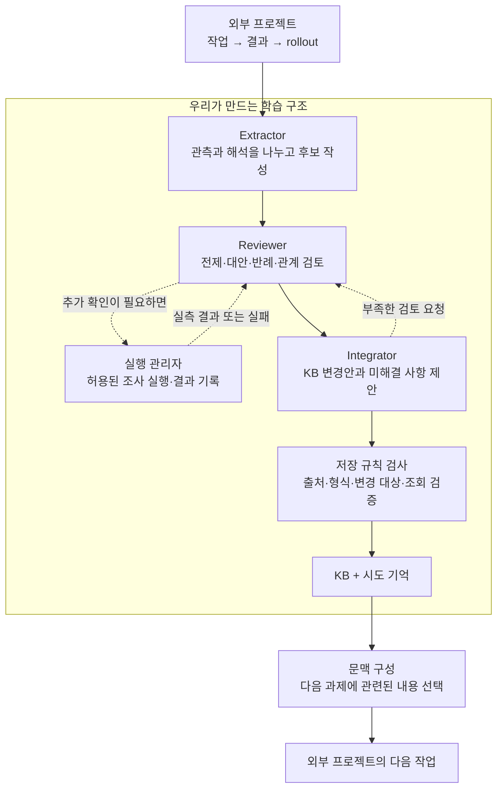

# Theory Learning V1 작업 현황

기준 시각: **2026년 9월 11일 13:36 KST**. 이 문서는 해당 시점의 작업 현황이며 실시간 상태판은 아닙니다.

**주요 기능 보완과 자동 회귀 검사는 완료했습니다. 실제 모델을 사용하는 여섯 과정 사례도 완료됐습니다. 현재는 학습한 KB의 효과를 비교하는 평가를 진행하면서 실행 실패를 확인하고 있습니다. 아직 V1 전체 수용 완료나 지능 향상을 선언할 단계는 아닙니다.**

## 1. 원래 무엇을 만들고 있나요?

모델 가중치를 업데이트하지 않고, 작업 기록에서 얻은 지식과 시도 기억을 다음 LLM 입력에 반영하는 구조입니다. 외부 프로젝트가 어떤 일을 하는지와 학습 구조를 분리합니다. 문장 생성·채점이나 전략 백테스트는 외부 프로젝트의 일입니다.

1. 작업 기록인 rollout을 저장합니다.
2. 관측 사실·해석·가설·교훈·방법을 추출하거나 생성합니다.
3. 전제·반례·대안·적용 범위를 검토하고 필요한 조사를 제안합니다.
4. 이론 사이의 지지·의존·모순을 검토하고 채택·보류·수정·기각을 제안합니다.
5. 검사한 변경을 KB와 시도 기억에 저장하고 다음 입력에 사용합니다.

KB는 **지식베이스**입니다. 이론 문장뿐 아니라 적용 조건, 근거, 반대 근거, 상태, 관계와 변경 이력을 보관합니다. 실행이 많아졌거나 문장이 그럴듯하다는 이유만으로 이론이 강화되지는 않습니다.

세 에이전트는 제안과 판단을 담당합니다. 실제 조사 실행, 검증, 저장, 문맥 선택은 Python의 관리 코드가 담당하며 별도 LLM 에이전트가 아닙니다.

## 2. 지금까지 만든 기본 구성

| 영역 | 현재 구성 |
|---|---|
| 실행 기반 | Python 관리 계층과 PI Agent 역할 실행기. 시험 모델은 `openai-codex / gpt-5.6-luna`이며 모델 설정을 분리했습니다. |
| 역할 | Extractor·Reviewer·Integrator. 외부 작업을 수행하는 Worker와 학습 역할을 구분합니다. |
| 도구 | 허용된 이론 검색·상세 읽기·근거 읽기. Reviewer는 추가 조사 계획을 제안하고 관리자가 실행합니다. 외부 PI Worker에도 KB 읽기와 사용 이론 보고를 연결했습니다. |
| 조사 실행 | Windows에서 Jupyter 커널로 코드·계산을 실행합니다. 커널 분리는 OS 보안 격리와 다릅니다. |
| 기록 | 로컬 원본·SQLite·고정 스냅샷과 Langfuse 전송·조회 검증 경로를 사용합니다. 재전송과 도구 재실행을 구분합니다. |
| KB 분리 | 작업공간별 KB·실행 기록을 나누고, 평가용 학습 분기는 같은 초기 KB에서 독립적으로 만듭니다. |
| 다음 입력 | 작업 목적, 관련 이론, 최근 시도 요약, 미해결 사항을 전달합니다. 과거 rollout 원문 전체를 매번 전수 입력하는 구조는 아닙니다. |
| 웹 GUI | 실행 기록, 역할별 입력·결과, 이론·관계·근거, 학습 진행, KB 고정본과 입력 미리보기를 볼 수 있습니다. |
| 평가 분리 | 비금융 통제 과제를 위한 과정·A/B/C 실행기와, 사용자 전용 금융 최종 평가 결과를 학습 입력에서 제외하는 경계를 마련했습니다. |

`the` 개수를 보상으로 주는 문장 실험은 중단했습니다. 현재 작업에서 다시 시작하지 않았습니다.

## 3. 이번 V1 보완에서 무엇을 고쳤나요?

| 문제 또는 부족했던 점 | 반영한 보완 |
|---|---|
| 관측·해석·가설이 느슨하게 섞일 여지 | 출처가 붙은 사실·해석, 예측과 범위, 방법 절차·비교 계획을 출력 계약으로 검사합니다. 상상한 반례를 실제 관측으로 자동 승격하지 않습니다. |
| 검토 결과와 관계 판단의 근거 부족 | 논리 연산자, 검토 대상 수정본, 대안과 구별 조건, 관계의 근거·조건·공동 전제를 기록합니다. 의존 전제가 바뀌면 재검토 대상으로 전파합니다. |
| 조사할 수 없는 질문으로 Reviewer와 Integrator가 계속 왕복 | 실행 가능한 새 조사나 실증 자료가 없는 상태를 명시하고, 미해결 사항을 남긴 최종 판단을 모델에 요청합니다. 관리 코드가 임의 결론을 만들어 넣지는 않습니다. |
| 잘못된 JSON 위치·참조를 고치지 못해 실패 | 오류가 난 필드와 실제 자료 구조, 필요한 근거 종류를 알려 수정하게 합니다. 인용을 고치기 위해 성공한 도구를 다시 실행하지 않습니다. |
| 마지막 반영 단계의 계약 검사 부족 | KB에 반영하기 직전에도 출력 계약과 출처를 다시 검사합니다. 추가 검토 요청이 남은 판단을 최종 변경으로 저장하지 않습니다. |
| 독립 학습 분기가 오류 메시지를 통해 다른 분기의 내용을 볼 수 있음 | 근거·조사 ID를 실행별로 구분하고, 허용된 KB 밖의 기존 정의를 오류 안내에도 노출하지 않도록 고쳤습니다. |
| 입력과 통신 기록에 인증 정보가 남을 위험 | 알려진 인증 필드·패턴·설정된 비밀 값을 저장·해시 전에 제거하고 위치·이유만 남깁니다. 새 원문 디스크 spool을 없애고 통신 크기 상한을 명시했습니다. 모든 종류의 비밀을 탐지한다는 보장은 아닙니다. |
| Langfuse 기록과 재현 근거가 불명확 | 생성·도구·검색·에이전트 관측을 구분하고, 조회로 원본 ID·해시를 검증합니다. 코드·잠금 파일·프롬프트·도구·검색 정책을 실행 manifest에 남깁니다. |
| GUI에서 진행과 과거 KB를 확인하기 어려움 | 검토·통합 회차, 보류 조사, 반영 전 확인, KB 대기 현황을 표시합니다. 과거 학습 결과 KB를 골라 그 고정본의 입력을 미리 볼 수 있습니다. |
| 평가 조건이나 실패 처리가 불명확 | 조건별 도구·예산을 맞추고, 코드 변경을 감지하며, 실패·중단 기록과 사용량을 보존합니다. 과제별 차이·신뢰구간·계열별 결과·누적 비용을 보고하도록 구현했습니다. |

출력 계약의 `V2`라는 이름은 **V1 제품을 보완한 내부 기록 형식**을 뜻합니다. 하네스 자율 진화 단계로 넘어갔다는 의미가 아닙니다.

## 4. 실제로 어디까지 확인했나요?

### 자동 검사와 연결 검사

- Python 전체 회귀 검사: **383개 통과**, 약 244초. 기존 라이브러리 deprecation 경고 2개가 남았습니다.
- PI 프로토콜·외부 입력 캡처·UI 검사와 TypeScript/Vite 빌드가 통과했습니다. 과거 KB 선택기에는 별도 컴포넌트 검사 4개도 추가했습니다.
- 실제 외부 PI Worker가 KB 검색 도구를 호출하고 응답했습니다. 해당 두 모델 호출의 제공자 전송 입력이 정확히 캡처됐습니다.
- 실제 Langfuse API 조회에서 모델 생성 15개와 실행 기록의 15회 호출이 일치하는 것을 확인했습니다. 모든 평가가 실제 Langfuse 서버를 사용했다는 뜻은 아닙니다.
- 완료된 과정 평가의 KB 고정본 여섯 개를 웹 API로 읽고 각각 입력 미리보기를 만들었습니다. 현재 적용 KB가 변하지 않았습니다. 실제 브라우저 클릭 검사는 아직 수행하지 못했습니다.

### 실제 모델을 사용한 여섯 과정 사례

**여섯 학습 과정과 여섯 후속 답변이 모두 완료됐고, 답안은 6/6 정답입니다. 총 모델 호출은 55회였습니다.**

| 사례 | 관측한 동작 |
|---|---|
| 틀린 이론 | 보편 주장을 기각하고 조건별 후보를 남겼습니다. |
| 그럴듯하지만 실측하지 않은 반론 | 가상 반례와 실제 조사 결과를 구분했습니다. 실패한 조사를 반증으로 간주하지 않았습니다. |
| 자료 부족 | 경쟁 설명을 보류하고 답을 `undetermined`로 남겼습니다. |
| 적용 범위 경계 | 주장 범위를 좁히고 범위 밖 과제를 구분했습니다. |
| 동일 근거 중복 | 독립 근거 개수를 1개로 답했습니다. 다만 Worker가 사용한 이론 ID가 없어 이 정답을 KB 효과의 증거로 보지는 않습니다. |
| 방법 비교 | 시험한 합성 환경에 한정해 비교 근거가 있는 방법을 채택했습니다. |

이것은 **실행·계약·답안 검사 결과**입니다. 판단 내용이 적절했는지에 대한 사람의 의미 검토는 여전히 `human_review_pending`입니다. 이 결과만으로 일반 지능이나 금융 성능이 향상됐다고 결론 내리지 않습니다.

과정 평가의 고정 코드는 `6cdfce1`, 이후 분기 격리를 보완한 현재 비교 코드의 기준은 `58f3cbe`입니다. 서로 다른 버전의 검증 결과를 같은 것으로 표시하지 않습니다.

## 5. 지금 무엇을 하고 있나요?

**독립 학습 세 번으로 만든 결과를 A/B/C 조건에서 비교하는 평가를 진행하고 있습니다.**

- **A:** 과제만 받습니다.
- **B:** 기록에서 추출한 요약을 추가로 받습니다.
- **C:** 검토·통합한 KB의 문맥과 해당 KB 조회 권한을 받습니다.

세 조건의 도구 정의와 예산은 같습니다. A/B의 KB 조회 범위는 빈 KB이고 C만 해당 학습 분기의 KB에 접근합니다. 평가 도중 KB를 다시 학습하지 않습니다.

계획은 독립 학습 3회, 예비 과제 8개씩 **72회**, 본 과제 24개씩 **216회**입니다. 주 비교는 C−B 성공률 차이이며, 개선의 사전 기준은 5%p 이상이면서 95% 신뢰구간 하한이 0보다 큰 것입니다. 이를 충족하지 못한 결과도 그대로 보고합니다.

**작성 시점의 실제 상태:**

| 항목 | 상태 |
|---|---|
| 비교 V7 첫 학습 분기 | 완료 |
| 두 번째 학습 분기 | 모델 응답 스트림 도중 `Error: terminated`로 실패. 원인은 확인 중이며, 네트워크 문제나 코드 결함으로 아직 단정하지 않았습니다. |
| 세 번째 학습 분기 | 진행 중 |
| 예비 72회 / 본평가 216회 | 아직 시작하지 않음 |

현재 구현은 학습 분기 실패를 빈 KB로 대체해 정상 비교처럼 진행하지 않습니다. 따라서 이번 실패가 남은 비교 V7은 그대로 유효한 A/B/C 성능 결론을 낼 수 없습니다. 원래 실패 기록을 보존하고 원인과 복구 방법을 확인하고 있습니다. 실패한 분기를 지우거나 성적이 좋은 학습만 골라 최종 결과로 삼지 않습니다.

이전 진단 실행에서도 검토 왕복, 참조 오류, 분기 간 오류 정보 노출을 실제로 발견해 고쳤습니다. 당시 실패·중단 기록과 코드 버전을 남겨 두었으며 최종 성공 기록으로 덮어쓰지 않았습니다.

## 6. 남은 일과 완료 판정

1. 모델 응답 중단의 원인을 확인하고, 필요한 경우 도구 중복 실행 없이 복구할 수 있는 범위를 보완합니다.
2. 고정된 조건의 비교 평가를 마무리하고 실패를 포함한 결과·신뢰구간·토큰·비용 자료를 확인합니다. 비교가 실패하면 그 자체를 결과로 명시합니다.
3. 과정 사례의 원본·판단·근거를 사람이 검토할 수 있게 제시합니다. AI가 사람 검토를 대신 완료 처리하지 않습니다.
4. 최신 코드의 서비스 반영 상태와 웹 사용 동작을 별도로 확인합니다.

현재 판정은 **“주요 기능 구현과 자동 회귀 검사 완료, 실제 수용 평가 마무리 중”**입니다. C의 점수가 B보다 높아야만 구현이 완료되는 것은 아닙니다. 반면 점수가 좋다는 이유로 기록·분리·검토의 결함을 통과시키지도 않습니다.

기존 8765 웹 서버를 종료하고 재시작하는 명령은 자동 승인 검토에서 차단됐습니다. 이를 우회해 강제 종료하지 않았습니다. 완료된 과정 기록은 모델을 연결하지 않은 별도 서버의 **8766 포트**에서 열 수 있도록 했습니다. 따라서 기존 8765 Python 프로세스가 최신 코드로 재시작됐다고 보고하지 않습니다. 별도 화면은 해당 PC에서 `http://127.0.0.1:8766/w/v1-process/?tab=knowledge`로 접근하고 **열람할 KB 고정본**에서 학습 결과를 선택하시면 됩니다.

## 7. 범위와 관련 문서

팀의 LLM judge, 금융 백테스터 완성, 하네스 전체 자율 진화, Vetu OS 격리는 이번 V1 학습 모듈의 완료 범위와 구분합니다.

금융 개발 구간은 2025-07-01 이상 2026-08-01 미만입니다. 이번 준비에서 고정한 사용자 전용 최종 구간은 **UTC 기준 2026-08-01 이상 2026-09-11 미만**이며, 그 데이터와 결과를 이번 개선·비금융 평가에 사용하지 않았습니다. 최종 결과를 LLM 피드백 루프에서 제외한다는 원칙을 유지합니다.

토큰 수와 제공자가 보고한 가격 추정치는 ChatGPT Pro의 실제 청구액·잔여 사용률과 다릅니다. 이를 임의로 환산하지 않습니다.

- [현재 아키텍처: 누가 무엇을 어떻게 하는가](theory-learning-current-architecture.md)
- [팀 과제와 백테스트 평가 준비](theory-learning-backtest-preparation.md)
- [V1 명세](theory-learning-v1-spec.md)

공개 문서에는 상태와 설명만 담았습니다. 원본 대화·실행 로그·인증 정보·실제 로컬 사용자 경로·사용자 전용 금융 결과는 함께 게시하지 않습니다.
