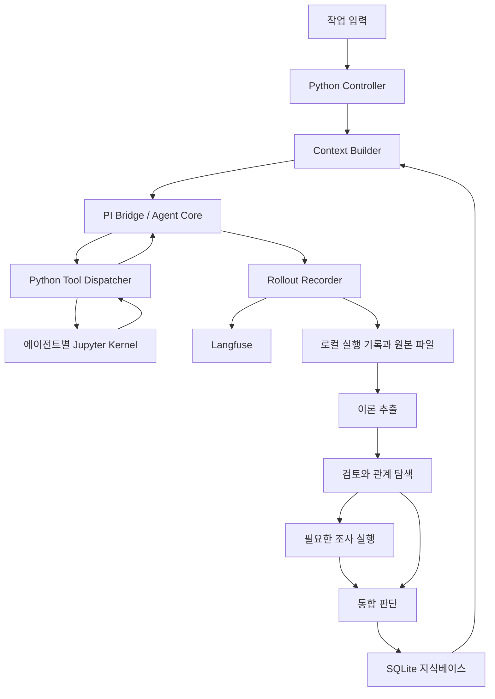

# 경험 기반 이론 학습 아키텍처 — V1 구현 명세

작성·기술 조사 기준일: 2026-09-10

상태: 초기 구현 명세 초안. 구현 및 학습 효과는 아직 검증하지 않았다.

## 1. 목표와 완료의 의미

모델 가중치를 업데이트하지 않고, 경험에서 설명과 사고 방법을 만들고 검토하며 다음 작업에 재사용하는 시스템을 구현한다. V1은 하나의 작업 환경에서 아래 다섯 기능이 실제로 연결되는 것을 목표로 한다.

1. LLM의 작업 기록(rollout)을 저장한다.
2. rollout에서 관측 사실과 요약을 정리하고, 설명 가설·교훈·사고 방법 등의 후보 이론(theory)을 추출하거나 생성한다.
3. 이론에 논리적 검토를 수행한다. 확장, 분해, 반례 탐색, 경쟁 설명, 가정 뒤집기, 전제 부정, 적용 범위 탐색 등을 상황에 맞게 사용한다.
4. 이론 간 지지·의존·모순 관계를 탐색하고, 필요한 경우 추가 관측·실험을 통해 채택·보류·수정·기각을 판단한다.
5. 지식베이스와 다음 작업의 LLM 입력에 반영하고, 실제 사용 결과를 다시 경험으로 축적한다.

**기능 완료와 능력 개선은 별도 판정이다.** 다섯 단계가 동작해도 지능 향상이 입증되는 것은 아니다. 새 과제에서 정확도·오류·비용을 비교하는 평가를 함께 만든다.

## 2. 확정 전제와 이번 명세의 선택

| 구분 | 내용 |
| --- | --- |
| 팀 전제 | PI agent를 기반으로 직접 구성한다. 주 언어는 Python이다. rollout 구성·관찰에는 Langfuse를 사용한다. |
| 실행 환경 | V1 개발 대상은 Windows 네이티브다. 각 에이전트 인스턴스에 별도 Jupyter kernel을 부여한다. |
| 장기 환경 방향 | 에이전트별 OS 환경 분리를 고려한다. Vetu의 Windows/WSL 적용 가능성은 12절에 정리한다. |
| V1 설계 선택 | Python 제어부 하나, PI 연결 모듈 하나, 순차 학습 단계, SQLite와 원본 파일, Langfuse를 사용한다. |
| 잠정 식별 | PI는 `badlogic/pi-mono`에서 연결되는 공식 PI 프로젝트를 기준으로 조사했다. 조사 시점 저장소는 `earendil-works/pi`다. 팀에서 뜻한 저장소·포크·버전의 일치 여부는 착수 시 확인한다. |
| 잠정 식별 | 표기가 불확실했던 vetu는 `openai/vetu`를 조사 대상으로 삼았다. 저장소에는 Cirrus Labs 계열 경로와 설치 안내가 남아 있으므로 팀에서 사용할 배포판을 고정해야 한다. |

Python 중심이라는 전제는 PI 코어까지 Python으로 재작성한다는 뜻으로 해석하지 않는다. 조사한 공식 PI 코어는 TypeScript/Node.js 기반이므로 얇은 연결 모듈을 둔다. 아래 연결 프로토콜은 **이 프로젝트에서 만들 인터페이스**이며 PI가 이미 제공하는 Python API가 아니다. [PI 코어][pi-core], [PI 패키지][pi-package]

## 3. V1에서 줄이는 범위

첫 구현은 로컬 사용자 한 명, 프로젝트 하나, 동시에 실행하는 작업 하나를 대상으로 한다. UI는 CLI와 Langfuse 화면이면 충분하다. 모델·추론 설정·프롬프트·의존성 버전을 실행 기록에 남긴다.

### 유지하는 기능

- 세계에 대한 이론과 사고 방법에 대한 이론을 모두 생성·검토·사용한다.
- 논리적 검토, 이론 간 관계 탐색, 실제 도구를 통한 조사, 상태 변경을 구현한다.
- 원본 근거와 수정 이력, 다음 작업에 실제로 넣은 문맥을 보존한다.
- 근거가 부족하면 여러 설명을 함께 보류할 수 있다.
- 실패·중단·예산 소진도 결과로 남기고 이후 명시적으로 재개할 수 있다.

### 이후로 미루는 기능

- 전용 Meta Agent, 연산자별 에이전트, 별도 Context Compiler 에이전트.
- 복잡한 이론 티어, 범용 온톨로지, 전용 그래프·벡터 DB.
- 상시 백그라운드 학습, 전체 지식베이스의 반복 전수 검토.
- 분산 실행, 다중 사용자, 자동 모델 선택, 학습된 검색·스케줄링 정책.
- Vetu 설치·운영과 Windows의 OS 수준 보안 격리.

전체 단계를 생략하는 대신 각 단계가 다루는 양과 지원 환경을 줄인다. 학습은 작업 종료 후 한 번 또는 명시적 명령으로 시작한다.

## 4. 구성과 책임



추출·검토·판단은 같은 PI 코어를 서로 다른 입력과 역할로 호출한다. 도식의 각 단계가 별도 서버라는 뜻은 아니다.

| 구성요소 | 책임 |
| --- | --- |
| Controller | 단계 실행, 식별자·예산·취소·재개 관리, 결과 스키마 검사, 저장 트랜잭션 수행 |
| PI Bridge | 공식 PI agent loop와 모델 호출 사용, 문맥 전달, 이벤트 전송, Python 도구 호출 중계 |
| Kernel Backend | 커널 생성·코드 실행·출력 수집·중단·재시작·종료 |
| Rollout Recorder | 실제 실행 이벤트와 근거 보존, Langfuse 관측 생성 및 전송 상태 관리 |
| Knowledge Store | 이론 수정본·관계·검토·조사·판단·문맥 사용 이력 저장 |
| Context Builder | 현재 과제에 관련된 이론과 필요한 근거를 분량 제한 안에 묶는 Python 함수 |

Python은 형식·참조·예산·실행 가능 여부를 검사한다. 무엇을 믿고 어떤 이론을 바꿀지에 관한 의미 판단은 LLM이 수행한다. 도구 결과와 사용자 피드백은 판단의 근거이며, Python의 임의 점수 공식으로 진위를 자동 결정하지 않는다.

### 4.1 에이전트 역할과 문맥

| 역할 | 입력과 출력 | 장기 이론 직접 변경 |
| --- | --- | --- |
| Worker | 현재 과제와 선택된 이론을 사용해 작업하고 결과를 남김 | 없음 |
| Extractor | 새 rollout과 관련 기존 이론에서 관측·요약·후보 이론·방법 가설 생성 | 없음 |
| Reviewer | 후보와 관련 이론·근거를 검토하고 관계 및 조사 계획 제안 | 없음 |
| Judge | 검토·관측·실험 결과에 근거한 상태 변경안과 이유 생성 | 없음. Controller가 유효한 변경안을 반영 |

각 역할은 인격이나 상시 프로세스가 아니라 실행 역할이다. 에이전트 인스턴스마다 PI 문맥과 Jupyter kernel을 분리하고 커널은 필요할 때 생성한다. 처음에는 순차 실행하며, 에이전트 수를 늘리는 것을 품질 개선으로 간주하지 않는다.

Reviewer는 작업자의 전체 대화를 무조건 상속하지 않는다. 검토에 필요한 이론·근거를 받고 원본을 추가 조회할 수 있다. 새 검토 작업에는 새 문맥을 사용한다. 같은 모델의 재검토가 독립적인 실증 근거를 만드는 것은 아니다.

### 4.2 PI와 Python의 연결

V1의 기본안은 **공식 PI agent-core + 얇은 TypeScript/Node.js bridge + Python 제어부**다. PI의 코딩 전용 기본 프롬프트와 파일·셸 도구를 기본값으로 상속하지 않고, 프로젝트 역할 프롬프트와 허용한 도구를 명시한다.

PI는 custom tools, 이벤트 구독, 문맥 변환과 모델 호출 함수 연결을 지원한다. 코딩 CLI의 RPC 모드도 별도 경로로 존재하지만, 이 명세는 도구 실행과 실제 입력 기록을 직접 제어하기 위해 코어 연결을 선택한다. [PI 코어][pi-core], [PI CLI RPC][pi-rpc]

프로젝트 bridge의 최소 메시지는 다음과 같다.

| 방향 | 메시지 | 주요 내용 |
| --- | --- | --- |
| Python → PI | `run` | protocol_version, request_id, agent_id, 역할, 모델 설정, 문맥, 도구 정의, 예산 |
| PI → Python | `event` | request_id, agent_id, event_seq, turn_id, 이벤트 종류, 내용 |
| PI → Python | `tool_request` | call_id, 도구 이름, 인자, 실행 제한 |
| Python → PI | `tool_result` | call_id, 성공/실패/중단, 모델에 전달할 결과, 원본 산출물 참조 |
| Python → PI | `cancel` | request_id와 취소 이유 |
| PI → Python | `done` / `error` | 종료 상태, 최종 출력, 사용량과 실패 정보 |

전송은 UTF-8 JSONL 기반 양방향 stdio로 시작한다. stdout은 프로토콜 전용, 진단 로그는 stderr로 보낸다. Python은 stdout·stderr를 비동기로 읽으며 도구 응답을 보내는 동안 이벤트 수신을 막지 않는다. 커널 하나의 코드 실행은 직렬화하고 PI의 도구 실행도 V1에서는 순차 모드로 고정한다.

모델 호출 직전의 PI `streamFn` 경계 등에서 변환이 끝난 system/messages/tools와 모델 설정을 기록한다. `agent.subscribe()` 이벤트만으로 최종 모델 입력 전체가 확보됐다고 가정하지 않는다. bridge 종료를 도구 실행의 취소 완료로 간주하지 않고 커널 취소 결과까지 수집한다.

## 5. 기능별 요구사항

### F1. Rollout 저장과 Langfuse 연결

rollout은 시스템이 확보할 수 있는 실제 입력·출력·도구 실행·관측·판단 기록이다. 제공자가 공개하지 않는 모델 내부 사고까지 저장한다는 뜻은 아니다.

필수 보존 항목:

- 사용자 입력·수정·피드백, 작업과 에이전트의 식별자.
- 모델 호출별 실제 문맥·도구 정의·모델 설정·반환 내용·토큰 사용량. 제공되지 않은 값은 추정 사실로 채우지 않는다.
- 수신한 스트리밍 이벤트, 최종 메시지, 도구 인자와 전체 반환 결과, 오류·중단·재시도.
- 실행 코드, stdout/stderr, 표시 결과, 파일 산출물의 해시와 위치, 커널 세대와 요청 ID.
- 추출·검토·조사·판단·문맥 구성의 입출력과 프롬프트 버전.

Langfuse는 rollout의 구조화된 관찰·조회·비교 화면으로 사용한다. 로컬 기록은 빠짐없는 입력 구성, 원본 보존, 전송 장애 복구를 위한 저널이다. 장기 이론 상태는 Langfuse trace를 덮어써 관리하지 않고 별도 Knowledge Store에 둔다.

| 프로젝트 개념 | Langfuse 표현 |
| --- | --- |
| 작업 및 관련 후속 학습 묶음 | `session_id = task_id` |
| 작업 실행 또는 학습 실행 한 번 | trace. 학습 실행은 원 작업 ID를 연결한 별도 trace |
| 역할 실행 | agent 또는 span observation |
| 모델 호출 | generation observation |
| 커널 실행·자료 조회 | tool observation |
| 이론 검색·문맥 구성 | retriever 또는 span observation |
| 검토·판단·평가 | span 또는 evaluator observation, 결과와 근거 참조 기록 |

Langfuse는 trace/session/observation 모델과 Python SDK를 제공한다. 프로젝트 식별자는 metadata에 함께 기록하고 자식 관측에도 전파한다. LLM 호출이 Node.js에 있어도 이벤트를 Python으로 받아 하나의 계측 경로로 전송한다. 자동 계측과 수동 계측으로 같은 호출을 이중 기록하지 않는다. [Langfuse 데이터 모델][lf-model], [Sessions][lf-sessions], [Python SDK][lf-python]

로컬 저널에는 `event_id`, 실행별 순서, 원인 이벤트, agent/turn/call ID, payload 또는 artifact 참조를 저장한다. Langfuse trace/observation ID와의 매핑 및 전송 상태도 남긴다. 스트리밍 조각을 관측 하나씩으로 만들 필요는 없으며, 원본 저널에 보존하고 generation 결과에 묶는다.

큰 결과는 원본 파일로 보존하고 Langfuse에는 크기·해시·참조와 표시용 발췌를 남긴다. 표시용 잘림과 원본 손실을 구분한다. 비밀 값과 인증 정보는 저장·전송 전 제거하고 제거 사실을 표시한다.

**장애 처리:** Langfuse 전송은 비동기다. 로컬 저널과 재전송 대기 상태를 먼저 남겨 네트워크 장애 중에도 작업을 복구할 수 있게 한다. SDK `flush()`가 서버 조회 가능 상태까지 보장하지는 않으므로, 전송 완료와 서버 조회 확인을 구분한다. 재전송은 원 event ID로 중복을 식별하며, 정확히 한 번 처리됨을 보장한다고 주장하지 않는다. V1에는 프로세스 종료 전 flush와 서버 조회 재시도 검사를 포함한다. [Python SDK][lf-python]

### F2. 관측 정리와 후보 이론 생성

Extractor는 완료되거나 명시적으로 중단된 rollout을 읽는다. 작업·검토·조사 기록을 모두 읽을 수 있지만, 모델이 생성한 문장과 독립적인 관측을 구분한다.

출력은 다음 네 묶음이다.

1. 원본 위치와 연결된 관측 및 그 관측의 해석.
2. 작업별 요약: 목표, 시도, 결과, 미완료 사항.
3. 세계에 대한 후보 이론: 주장, 가정, 적용 조건, 예상 결과.
4. 사고 방법에 대한 후보 이론: 사용 조건, 절차, 기대 이익·비용, 확인할 예측.

새 이론이 없으면 빈 후보 목록을 허용한다. 기존 이론의 수정 제안은 기존 ID와 수정본을 참조한다. 결론 문장이 비슷해도 가정·설명·적용 범위가 다르면 별도 후보로 유지한다.

관측에서 바로 일반적인 사용자 선호나 보편 법칙을 확정하지 않는다. 원자료의 같은 부분에서 만든 여러 요약은 같은 근거 계보를 공유한다. 사고 방법 가설은 `kind=method`로 같은 이론 저장 구조와 검토 절차를 사용한다.

### F3. 논리적 검토

Reviewer는 필요한 연산자를 선택하고 다음을 남긴다.

- 검토 대상 수정본과 선택한 연산자, 선택 이유.
- 전제·추론·적용 범위의 문제 또는 새롭게 도출한 함의.
- 경쟁 설명과 각 설명이 다른 결과를 예측하는 조건.
- 추가 근거가 필요한 부분과 제안하는 조사.

출발용 연산자 목록은 확장·합성, 분해, 반례 탐색, 경쟁 설명, 가정 뒤집기·전제 부정, 범위 탐색이다. 한 프롬프트가 목록에서 선택하며 별도 도구 서버를 만들지 않는다. 모든 이론에 모든 연산자를 적용하지 않는다.

결과의 성격을 `logical_analysis`, `hypothetical_case`, `observed_evidence`, `executed_test` 등으로 구분한다. 상상한 실패 시나리오는 실측 반례가 아니다. 코드로 확인한 반례도 실행한 조건과 대상에 한해 근거로 사용한다. “검토 완료”는 “참으로 증명됨”을 뜻하지 않는다.

### F4. 관계 탐색, 조사와 통합 판단

검색은 같은 프로젝트의 적용 범위·주제 태그·단어 및 기존 관계를 이용한다. V1은 SQLite 기반 조회로 관련 후보를 좁히고, LLM이 실제 관계를 판단한다. 후보 수를 제한하므로 전체 모순을 발견했다고 보장하지 않는다. 작은 시험 자료에서는 전수 비교로 누락을 확인한다.

필수 관계는 `supports`, `depends_on`, `contradicts`다. 관계에도 적용 조건·근거·판단 이유·검토 상태를 둔다. “이 기록에서 생성됨”을 뜻하는 출처와 “이 기록이 주장을 지지함”을 구분한다. 여러 전제가 함께 필요한 경우 전제 묶음을 기록해 각각이 독립적으로 충분한 증거처럼 보이지 않게 한다.

조사가 필요하면 실행 전에 다음을 저장한다.

- 구별할 이론 수정본과 질문.
- 이론별 예상 결과와 판단을 바꿀 조건.
- 유지할 조건, 바꿀 조건, 실행 코드 또는 관측 절차.
- 결과로 주장할 수 있는 범위와 알려진 한계.
- 실행 가능 여부, 시간·호출 예산.

V1에서 반드시 지원할 조사 경로는 **Jupyter kernel에서 실행 가능한 로컬 코드·자료 분석·통제된 실험**이다. 결과는 실제 도구 응답으로 돌아와야 한다. 환경을 모사한 코드의 결과는 그 모사 환경에 대한 관측이지 현실의 동일 현상에 대한 확인은 아니다. 외부 웹·운영 시스템 연결은 필수 범위에서 제외한다.

조사 상태는 `planned → running → completed / failed / interrupted`와 `deferred`를 사용한다. 실행이 불가능하거나 예산이 부족하면 이유와 다음 조건을 남기고 보류한다. 실패한 실행을 이론의 반증으로 자동 해석하지 않는다.

Judge는 채택·보류·기각·유지 또는 수정안을 제시한다. 채택은 현재 조건에서 사용할 잠정 판단이다. 수정은 기존 본문 덮어쓰기가 아니라 새 수정본과 변경 이유를 만드는 동작이다. 반대 근거를 숨기지 않으며 근거 없는 수치 확신을 기본 판정 기준으로 쓰지 않는다.

전제 수정·기각 시 의존한 이론을 `needs_review`로 표시한다. 직접 의존 이론을 시작으로 필요하면 다음 의존 이론까지 전파하고 방문 집합으로 순환을 처리한다. 관련 이론을 자동 기각하지 않는다. 재검토 전에는 정상 채택 이론처럼 무조건 주입하지 않는다.

### F5. 입력 구성과 다음 경험으로의 연결

Context Builder는 작업별로 다음을 묶는다.

1. 현재 목표·제약·실행 가능한 도구.
2. 관련 채택 이론의 본문·적용 조건·근거 요약·현재 수정본.
3. 결과에 영향을 줄 수 있는 반대 근거, 경쟁 설명, 재검토 표시.
4. 적용할 수 있는 사고 방법 이론.

보류 이론은 필요할 때 명확한 가설 표시와 함께 넣고, 기각 이론은 현재 사실로 넣지 않는다. 관련된 실패 사례를 이해하는 데 필요하면 기각 이유와 함께 읽을 수 있다. 대규모 근거를 모두 붙이지 않고 추가 조회 경로를 제공한다.

문맥 snapshot에는 선택된 수정본·근거 참조·정렬 순서·실제 입력 내용·분량 제한·제외 또는 잘린 부분을 기록한다. 실행 중 새로 나온 이론을 이미 진행 중인 모델 호출에 소급 적용하지 않는다.

Worker의 다음 결과에는 실제 사용한 theory ID와 예측·관측·실패·비용을 연결한다. 단순히 검색되거나 많이 사용됐다는 이유로 이론이 강화되지는 않는다. 새 근거를 해석하는 다음 검토에서 판단한다.

## 6. 최소 데이터 모델

논리적 데이터 종류와 물리적 테이블 수를 일치시킬 필요는 없다. V1은 SQLite의 구조화 필드와 JSON 본문을 조합해 시작한다.

| 기록 | 최소 내용 |
| --- | --- |
| Run / Event / Artifact | ID, task/agent/turn/call 연결, 종류, 순서·시간, 입력·출력, 모델·프롬프트·환경 버전, 원본 위치·해시 |
| Observation / Summary | 본문, 관측과 해석의 구분, 원 event·artifact의 정확한 부분 참조 |
| Theory / Revision | theory_id, revision_id, kind(world/method), 주장, 가정, 적용 범위, 예측, 근거·반대 근거, 상태 |
| Relation / Review / Investigation / Decision | 대상 수정본, 관계 또는 연산, 계획·실측·판단의 구분, 이유, 근거, 실행 상태 |
| ContextSnapshot / Usage | 과제, 포함한 수정본과 근거, 실제 입력, 사용 결과 참조 |

현재 채택 상태와 과거 수정본을 함께 보존한다. 근거 참조에는 파일·event ID만이 아니라 필요한 범위 또는 JSON 위치를 포함한다. 같은 원근거에서 파생된 자료는 공통 root evidence ID로 추적한다.

이론 상태는 `candidate`, `accepted`, `held`, `rejected`로 시작한다. `needs_review`는 별도 플래그이며, 수정되기 전 버전은 과거 기록으로 남는다. 관계는 제안과 확정된 판단을 구분하고 수정본을 참조한다.

Controller만 정상 쓰기 경로를 소유한다. 상태 변경, 새 수정본, 관계 변경, Decision은 하나의 트랜잭션으로 저장한다. 중단 후 재개는 처리한 입력 ID와 단계별 작업 ID를 확인해 같은 변경을 중복 반영하지 않는다. 이는 애플리케이션 쓰기 규칙이며 Jupyter 프로세스의 OS 권한 격리를 뜻하지 않는다.

## 7. Jupyter 실행 환경

### 7.1 생명주기

Python `jupyter_client`의 kernel manager/client와 `ipykernel`을 사용한다. notebook 웹 서버와 `.ipynb` UI는 필요하지 않다. [Kernel API][jupyter-api], [Kernel 구조][jupyter-kernels]

- 에이전트 인스턴스별 별도 커널 프로세스, 작업 디렉토리, 커널 세대 ID를 부여한다.
- 동일 인스턴스의 같은 작업 안에서는 변수와 import 상태를 유지한다.
- 새 독립 과제와 독립 실험은 새 커널 또는 명시적 초기화로 시작한다.
- 기본 의존성은 공통 고정 환경을 사용한다. 에이전트별 패키지 변경이 필요할 때만 별도 virtualenv를 추가한다.
- 모델 실행 프로세스와 코드 실행 커널을 구분한다. 커널은 에이전트 전체가 아니라 코드 도구의 실행 환경이다.

### 7.2 실행 결과 계약

`execute(agent_id, code, timeout)`는 execution ID, 코드, stdout/stderr, MIME 출력·산출물 참조, error 정보, 상태, 실행 시간과 커널 세대를 반환한다.

요청 ID와 `parent_header.msg_id`를 맞춰 결과를 수집한다. 해당 요청의 `execute_reply`와 IOPub `idle`을 모두 확인하고, `status=error`를 정상 성공과 구분한다. 시간 초과 시 interrupt를 시도하고 종료가 확인되지 않으면 커널을 종료·재생성한다. 상태 유실을 기록하고 같은 셀을 자동 재실행해 부작용을 반복하지 않는다. 늦게 도착한 출력은 원 execution에 연결하고 완료 결과를 조용히 바꾸지 않는다. [Jupyter 메시지 규약][jupyter-messaging]

### 7.3 격리의 한계

별도 커널은 Python 메모리 상태와 프로세스를 분리한다. 같은 Windows 계정의 파일 접근, 네트워크, OS 권한까지 격리하지 않는다. 별도 작업 폴더나 virtualenv도 보안 샌드박스가 아니다.

V1은 이 한계를 알고 사용하는 로컬 연구 환경이다. 도구 API는 인스턴스별 작업 경로와 산출물 교환을 명시하지만, 임의 Python 코드의 파일·네트워크 접근을 완전히 차단한다고 설명하지 않는다. VM 수준 환경 분리는 12절의 별도 backend로 확장한다.

## 8. 실행 제한과 재개

다음 수치는 성능 근거가 있는 최적값이 아니라 폭주를 막고 첫 실행을 작게 만드는 변경 가능한 시작값이다.

| 설정 | V1 시작값 |
| --- | --- |
| 한 학습 실행의 새 후보 이론 | 최대 5개 |
| 후보 하나의 관련 기존 이론 | 최대 10개 |
| 한 학습 실행의 조사 | 최대 2건, 조사당 재판단 후 추가 조사 1회 이하 |
| 역할 실행의 도구 호출 | 최대 5회 |
| 커널 셀 실행 | 기본 60초 제한, 조사별 조정 가능 |
| 추가 이론 문맥 | 기본 4,000토큰 상한, 모델 문맥의 예약분을 넘지 않음 |

전체 학습 실행에는 별도로 모델 호출 총수·총 토큰·경과 시간 상한을 설정하며 개별 단계의 상한보다 우선한다. 추출·검토·판단에도 같은 총예산을 적용한다. 남은 후보·미해결 조사에는 재개할 수 있는 상태를 남긴다.

형식이 틀린 LLM 출력은 원본과 검증 오류를 기록하고 제한된 횟수만 재요청한다. 예산 소진은 성공으로 처리하지 않는다. 이미 실행됐을 수 있는 도구를 통신 재시도만으로 다시 실행하지 않는다.

커널 상태 복원은 보장하지 않는다. 기록으로 당시 실행을 확인할 수 있는 것과 같은 결과를 재현할 수 있는 것은 구분한다. 복구 시 필요한 준비 코드·입력·산출물을 명시적으로 재구성한다.

## 9. 외부 사용 인터페이스와 모듈 범위

첫 인터페이스는 Python CLI다. 다음 명령은 구현할 프로젝트 인터페이스이며 현재 설치된 명령이 아니다.

```text
run-task       작업 수행과 rollout 기록
learn          특정 완료/중단 작업에서 한 번의 학습 실행
inspect        이론 수정본, 근거, 관계, 판단 이력 조회
resume         중단된 학습·조사 재개
evaluate       저장된 평가 과제와 조건으로 비교 실행
doctor         PI 연결, 커널 실행, Langfuse 기록의 연결 확인
```

Python 모듈은 controller, pi_client, kernel_backend, rollout, knowledge, learning, context, evaluation 정도로 시작한다. 역할 프롬프트는 파일로 버전 관리하고, TypeScript 코드는 PI 코어의 연결과 이벤트·도구 중계에 제한한다.

Langfuse 배포 주소·자격 증명과 LLM 제공자·모델은 환경 설정으로 주입한다. V1 spec 작성이 서비스 배포나 유료 계정 생성을 포함하지 않는다. 호스팅 방식과 모델은 팀에서 사용할 환경을 연결할 때 정하고 그때 의존성 버전을 lock한다.

## 10. 수용 기준과 학습 평가

### 10.1 기능 수용 기준

| 검사 | 통과 조건 |
| --- | --- |
| PI–Python 연결 | 실제 PI 모델 호출에서 Python 도구를 실행하고 결과를 다음 모델 턴에 반환한다. 실제 입력과 이벤트가 연결된다. |
| 에이전트별 커널 | A의 Python 변수가 B에는 없고 A에서는 유지된다. 재시작 후 상태 유실이 기록된다. OS 파일 접근 차단을 기대하는 테스트는 아니다. |
| F1 기록 | 오류·중단·도구 출력·실제 문맥을 원본으로 조회하며 Langfuse에서도 대응 trace와 관측을 확인한다. |
| F2 추출 | 관측·해석·가설이 구분되고 모든 생성물의 출처를 찾을 수 있다. 같은 원근거가 독립 증거로 중복 집계되지 않는다. |
| F3 검토 | 숨은 전제·적용 범위 문제·경쟁 설명을 다루며, 상상한 반례가 실측으로 기록되지 않는다. |
| F4 조사 | 다른 예측을 실행 전에 저장하고 실제 커널 결과를 수집해 상태 변경 또는 보류까지 이어진다. 의존 이론에 재검토 표시가 전파된다. |
| F5 재사용 | 다음 독립 과제의 실제 모델 입력에 선택된 수정본이 들어가고, 사용 결과가 해당 수정본에 연결된다. |
| 복구 | Langfuse 전송 실패 후 기록을 다시 보내 조회할 수 있다. 단계 재개가 같은 이론 수정본을 중복 생성하지 않는다. |
| 실패 처리 | 커널 timeout·bridge 종료·잘못된 JSON·예산 소진이 성공으로 둔갑하지 않고 이유와 상태가 남는다. |

### 10.2 전체 흐름을 확인할 작은 사례

초기 평가 환경은 코드로 조작·관찰 가능한 작은 실험 환경으로 만든다. 예를 들어 어떤 처리 결과가 입력 속성 A 때문인지, 함께 바뀐 설정 B 때문인지 모호한 사례를 제공한다.

1. 첫 경험에서 H1과 H2를 후보로 만든다.
2. Reviewer가 둘을 구분할 조건과 사전 예측을 제안한다.
3. 실제 환경 도구에서 A를 유지하고 B를 바꾸는 확인을 실행한다.
4. Judge가 이론을 수정·보류·채택하고 근거를 기록한다.
5. “자료를 더 모으기 전에 예측이 갈리는 조건을 찾는다” 같은 방법 가설도 후보로 남긴다.
6. 이름·값·조건이 달라진 새 과제에서 관련 이론과 방법을 선택해 사용한다.

환경의 정답 규칙과 평가용 답은 실험 제공 코드가 보유하며 에이전트 입력·커널 작업 폴더에는 전달하지 않는다. Jupyter가 보안 경계를 제공하지 않으므로, 이 테스트는 신뢰하는 실행에서의 데이터 분리이며 적대적 접근 방지 증명은 아니다. 이 예시는 전체 과정의 기능 검증이지 범용 지능 개선의 증명이 아니다.

### 10.3 개선 측정

같은 모델·추론 설정·과제·시험 시점 예산으로 다음 세 조건을 비교한다.

| 조건 | 과거 경험 활용 |
| --- | --- |
| A | 이전 학습 문맥 없이 수행 |
| B | 경험 요약·교훈만 재사용 |
| C | V1 전체 과정에서 검토·수정한 이론과 방법을 재사용 |

학습에 쓴 과제와 전이 평가 과제는 분리한다. 평가 시작 전에 Knowledge Store snapshot을 고정하고, 개별 평가 과제는 새 PI 문맥·커널에서 실행한다. 평가 정답을 후속 학습 입력으로 돌리지 않는다.

측정 항목은 과제 성공·정확도, 잘못된 일반화, 유용한 추가 관측 선택, 도구 호출·토큰·시간, 방법 가설의 사용 결과다. 시험 시점 비용과 사전 학습 비용을 분리해서 함께 보고한다. 모델 자체의 성공 선언만을 성능 점수로 쓰지 않고 환경의 관측 가능한 결과와 평가 규칙을 사용한다. 이는 연구 효과 측정이며, 운영 중 각 이론의 채택 판단을 외부 정답표로 대체하는 것은 아니다.

초기 소규모 사례로 기능을 확인한 뒤 여러 과제·반복 실행의 결과와 변동을 보고한다. 단일 성공을 일반적 개선으로 보고하지 않는다. 개선이 없거나 악화돼도 원인을 살필 수 있는 평가가 V1의 산출물이다.

## 11. 구현 순서

| 단계 | 결과물과 통과 기준 |
| --- | --- |
| 0. 연결 확인 | 사용할 PI 버전 식별·고정, Python↔PI 도구 왕복, 두 커널의 상태 분리, Langfuse trace 조회 |
| 1. 경험·상태 저장 | 원본 기록, 최소 스키마, 이론 수정본·관계·문맥 snapshot의 저장·조회 |
| 2. 추출·검토·판단 | 역할별 출력 계약, 논리 연산 선택, 관련 이론 탐색, 채택·보류·기각·수정 |
| 3. 실제 조사 연결 | 사전 예측 저장, 커널 실험, 결과 재판단, 의존 이론 재검토 |
| 4. 다음 작업 적용 | Context Builder, 실제 사용 기록, 전체 사례 통과 |
| 5. 복구·비교 평가 | 장애·예산 처리와 A/B/C 평가 결과 |

V1 완료에는 단계 0~5가 모두 필요하다. Vetu 검증은 병행 가능한 별도 기술 확인이며 이 완료 조건을 막지 않는다.

## 12. Vetu의 Windows 네이티브·WSL 가능성 조사

### 12.1 확인된 사실

- Vetu는 Linux 호스트에서 Cloud Hypervisor 기반 VM을 실행하는 도구다. 단순 virtualenv나 Python 프로세스 분리보다 강한 VM 환경 분리를 목표로 한다. [Vetu README][vetu-readme]
- 설치 문서는 `/dev/kvm` 접근을 전제로 한다. 조사한 빌드 설정은 `linux`의 `amd64`, `arm64`를 대상으로 하며 Windows 실행 파일 배포를 정의하지 않는다. README의 arm64 예시만 보고 arm64 전용으로 판단하면 안 된다. [설치][vetu-install], [빌드 설정][vetu-build]
- Vetu는 PATH의 Cloud Hypervisor를 우선 사용하고 없으면 다운로드할 수 있다. 반복 실험에서는 바이너리와 VM 이미지의 버전·digest를 고정해야 한다. [실행 연결 코드][vetu-ch]
- Cloud Hypervisor가 Windows **guest**를 지원한다는 것은 Vetu가 Windows **host**에서 네이티브 실행된다는 뜻이 아니다. [Cloud Hypervisor][cloud-hypervisor]

### 12.2 경로별 판정

| 경로 | 조사 결과 | V1 선택 |
| --- | --- | --- |
| Windows 네이티브 Vetu | 조사한 공식 코드·배포에는 지원 경로 없음. Go 바이너리 크로스 컴파일만으로 Linux/KVM 의존성이 해결되지 않음 | 사용하지 않음 |
| WSL1 | Vetu가 요구하는 Linux KVM VM 실행 경로로 채택할 근거 없음 | 제외 |
| Windows 11 x64 + WSL2 | 중첩 가상화와 KVM이 제공되면 시도할 수 있는 조건부 경로. Vetu의 해당 구성 부팅 성공은 이번 조사에서 실측하지 않음 | 후속 검증 후보 |
| Windows 10 + 현재 WSL 계열 | 조사한 WSL 서비스 소스는 Windows 11 미만에서 중첩 가상화를 비활성화함. 설정 한 줄로 가능하다고 안내할 수 없음 | 기본 경로에서 제외 |
| Windows ARM64 + WSL2 | Vetu arm64 빌드의 존재와 WSL 안의 KVM 호스트 가상화 제공은 별개. 하드웨어·WSL 지원 확인 필요 | 미검증, 기본 경로 아님 |
| Windows Python + 별도 Linux 호스트의 Vetu | Linux 쪽에서 요구 조건을 충족한 뒤 원격 실행 backend로 연결하는 설계 가능 | 향후 대안 |

WSL 공식 설정에는 `nestedVirtualization` 및 custom kernel 설정이 존재한다. 그러나 설정의 존재가 모든 Windows/CPU/WSL 조합의 동작을 보장하지는 않는다. 조사한 서비스 소스는 Windows 버전과 플랫폼의 `NestedVirt` 기능을 확인한다. **WSL2 경로의 가능성은 이 전제들을 연결한 기술적 판단이며, Vetu의 공식 WSL 지원 선언이나 이번 장비에서의 실행 성공 보고가 아니다.** [WSL 설정][wsl-config], [WSL 서비스 소스][wsl-source]

### 12.3 WSL2에서 실제 가능 여부를 판정할 절차

다음은 후속 검증 절차다. 이번 명세 작성 중에는 WSL 설치·재설정·커널 변경·VM 실행을 수행하지 않았다.

1. Windows 버전, CPU 아키텍처, WSL 버전과 배포판의 WSL2 여부를 확인한다.
2. 중첩 가상화가 실제 제공되는지 확인한다. 필요한 경우 `.wslconfig`의 `[wsl2]` 설정에서 `nestedVirtualization=true`를 검토한다. 변경 후 WSL 재시작은 실행 중인 배포판에 영향을 주므로 별도 작업으로 수행한다.
3. WSL 안에서 가상화 확장 노출, KVM 커널 지원, `/dev/kvm` 존재 및 실행 계정의 읽기·쓰기 권한을 각각 확인한다. 장치 파일의 존재만으로 성공 판정하지 않는다.
4. KVM이 없을 때는 권한 문제, 커널 설정·모듈 문제, 호스트의 가상화 확장 미제공을 구분한다. custom kernel은 커널 기능 부재를 해결할 후보이며, 노출되지 않은 하드웨어 기능까지 만들어주지는 않는다.
5. 호스트 아키텍처에 맞는 고정된 Vetu·Cloud Hypervisor·VM 이미지를 선택한다. VM 디스크는 우선 WSL Linux 파일시스템에 둔다.
6. 기본 NAT 네트워크로 VM 부팅, guest 명령 실행, 산출물 회수, VM 종료를 확인한다. x64 호스트에서 README의 arm64 예시 이미지를 그대로 사용할 수 있다고 가정하지 않는다.
7. 서로 다른 VM 두 개의 상태·파일 분리와 정리까지 검증하고 나서 backend 지원으로 표시한다.

읽기 중심의 진단 명령 예시는 다음과 같다. 설치·설정 변경 명령과 실제 VM 실행은 별도 단계다.

```powershell
wsl --version
wsl --list --verbose
```

```bash
uname -m
uname -r
ls -l /dev/kvm
test -r /dev/kvm && test -w /dev/kvm
# x86 계열에서만 가상화 확장 플래그를 확인한다.
grep -E -m 1 'vmx|svm' /proc/cpuinfo
```

최종 통과 증거는 **Vetu guest 부팅·명령 실행·결과 회수·종료**다. WSL 실행 성공이나 `/dev/kvm` 확인만으로 완료라고 하지 않는다. 직접적인 WSL 지원·성공 근거를 확보하지 못한 부분은 미검증으로 남긴다.

### 12.4 이후 교체할 경계

현재는 `KernelBackend`가 아래 동작을 제공한다.

```text
create(agent_id, environment_spec)
execute(agent_id, code, timeout)
collect_artifacts(agent_id)
interrupt(agent_id)
reset(agent_id)
close(agent_id)
```

향후 `VetuBackend`는 같은 외부 계약 아래 Linux VM 안에서 커널 또는 실행기를 구동하도록 구현할 수 있다. 이는 설계상 확장 지점이며 V1에서 해당 backend를 구현했다는 뜻은 아니다. 파일 전송·guest 초기화·네트워크·종료 방식은 별도 구현이 필요하고 커널과 VM의 reset 의미 차이도 환경 기록에 남긴다.

## 13. 착수 시 확정할 항목

이 문서를 작성하는 데 추가 결정이 필수적인 부분은 잠정값으로 드러내고, 연결 확인 단계에서 해결한다.

- 팀에서 의미한 PI 저장소·포크·버전. 이 문서는 공식 PI 코어를 기준으로 함.
- Python 주 언어 원칙 아래 얇은 TypeScript bridge를 사용하는 현재 선택과 팀 실행 환경의 적합성.
- LLM 제공자·모델과 토큰·시간·비용 상한.
- Langfuse 프로젝트와 endpoint, SDK/서버 조합, 보존 정책. 자격 증명은 문서나 rollout에 넣지 않음.
- 첫 실험 과제 묶음과 성공·오류를 측정할 규칙.
- Vetu 후속 검증 여부. Windows 기본 V1의 구현 선행 조건은 아님.

## 14. 조사 출처와 기준 버전

아래 자료는 외부 기능의 근거다. V1의 구성·프로토콜·상태·예산·평가 방식은 이 프로젝트의 설계 선택이다. 조사 시점의 최신 소스를 사용하는 것과 구현 의존성을 검증·고정하는 것은 별개다.

| 대상 | 조사 기준 |
| --- | --- |
| PI | `earendil-works/pi` commit `400d6905ce46ec46e79da8a7701b1b48850192df`; 확인한 agent package version `0.85.1`, Node 요구 `>=22.19.0` |
| Vetu | `openai/vetu` commit `8a1e5f639b6529f06754193e55ff1bc2a61765fe` |
| WSL 서비스 소스 | `microsoft/WSL` commit `03f6b0e5dd8bdbcb90406813699f616534a25eb3` |
| Langfuse | 2026-09-10에 확인한 공식 데이터 모델·Sessions·Python SDK 문서. 구현 시 설치 버전과 서버 호환성을 별도로 고정 |
| Jupyter | 2026-09-10에 확인한 stable jupyter_client 문서(표시 버전 8.10.0). 실제 설치 버전은 연결 시험 후 고정 |

[pi-core]: https://github.com/earendil-works/pi/blob/400d6905ce46ec46e79da8a7701b1b48850192df/packages/agent/README.md
[pi-package]: https://github.com/earendil-works/pi/blob/400d6905ce46ec46e79da8a7701b1b48850192df/packages/agent/package.json
[pi-rpc]: https://github.com/earendil-works/pi/blob/400d6905ce46ec46e79da8a7701b1b48850192df/packages/coding-agent/docs/rpc.md
[lf-model]: https://langfuse.com/docs/observability/data-model
[lf-sessions]: https://langfuse.com/docs/observability/features/sessions
[lf-python]: https://python.reference.langfuse.com/langfuse
[jupyter-api]: https://jupyter-client.readthedocs.io/en/stable/api/jupyter_client.html
[jupyter-kernels]: https://jupyter-client.readthedocs.io/en/stable/kernels.html
[jupyter-messaging]: https://jupyter-client.readthedocs.io/en/stable/messaging.html
[vetu-readme]: https://github.com/openai/vetu/blob/8a1e5f639b6529f06754193e55ff1bc2a61765fe/README.md
[vetu-install]: https://github.com/openai/vetu/blob/8a1e5f639b6529f06754193e55ff1bc2a61765fe/INSTALL.md
[vetu-build]: https://github.com/openai/vetu/blob/8a1e5f639b6529f06754193e55ff1bc2a61765fe/.goreleaser.yml
[vetu-ch]: https://github.com/openai/vetu/blob/8a1e5f639b6529f06754193e55ff1bc2a61765fe/internal/externalcommand/cloudhypervisor/cloudhypervisor.go
[cloud-hypervisor]: https://github.com/cloud-hypervisor/cloud-hypervisor#1-what-is-cloud-hypervisor
[wsl-config]: https://learn.microsoft.com/en-us/windows/wsl/wsl-config
[wsl-source]: https://github.com/microsoft/WSL/blob/03f6b0e5dd8bdbcb90406813699f616534a25eb3/src/windows/service/exe/WslCoreVm.cpp
