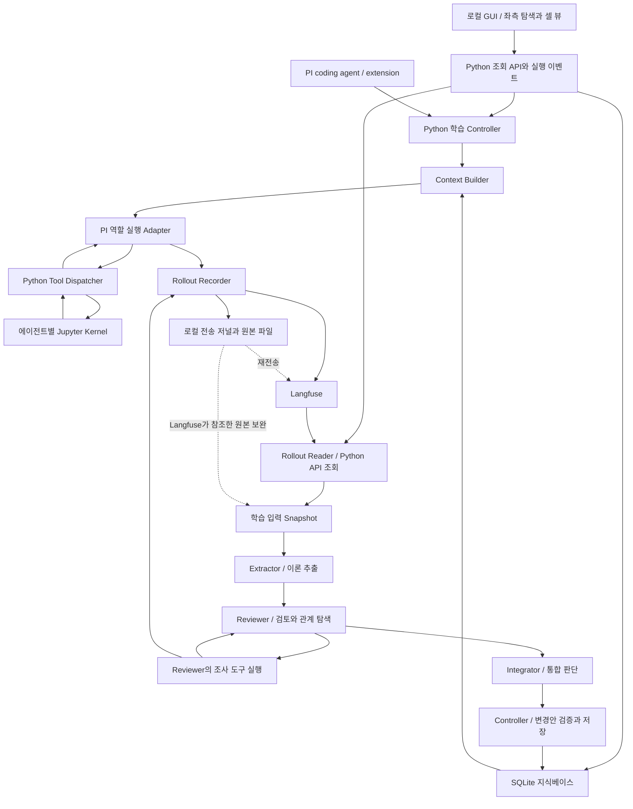

# 경험 기반 이론 학습 아키텍처 — V1 구현 명세

작성·기술 조사 기준일: 2026-09-10

상태: 초기 구현 명세 초안. 구현 및 학습 효과는 아직 검증하지 않았다.

개정: 학습 역할 3개, Langfuse API 기반 학습 입력, 좌측 탭 GUI, 이후 개선을 위한 실행 계약과 진단 기록을 반영했다. 구현·학습 과정·성능을 구분하는 평가와 A/B/C 비교 절차를 명시했다. 팀 judge 및 하네스 전체의 자동 진화는 V1에서 제외한다.

## 1. 목표와 완료의 의미

모델 가중치를 업데이트하지 않고, 경험에서 설명과 사고 방법을 만들고 검토하며 다음 작업에 재사용하는 시스템을 구현한다. V1은 하나의 작업 환경에서 아래 다섯 기능이 실제로 연결되는 것을 목표로 한다.

1. LLM의 작업 기록(rollout)을 저장한다.
2. rollout에서 관측 사실과 요약을 정리하고, 설명 가설·교훈·사고 방법 등의 후보 이론(theory)을 추출하거나 생성한다.
3. 이론에 논리적 검토를 수행한다. 확장, 분해, 반례 탐색, 경쟁 설명, 가정 뒤집기, 전제 부정, 적용 범위 탐색 등을 상황에 맞게 사용한다.
4. 이론 간 지지·의존·모순 관계를 탐색하고, 필요한 경우 추가 관측·실험을 통해 채택·보류·수정·기각을 판단한다.
5. 지식베이스와 다음 작업의 LLM 입력에 반영하고, 실제 사용 결과를 다시 경험으로 축적한다.

**기능 완료와 능력 개선은 별도 판정이다.** 다섯 단계가 동작해도 지능 향상이 입증되는 것은 아니다. 새 과제에서 정확도·오류·비용을 비교하는 평가를 함께 만든다.

### 1.1 담당 범위

이 명세는 팀 전체 하네스가 아니라 **경험·이론 학습 모듈**의 V1이다. 팀의 LLM judge 구현·운영, 전략 결함 심사, 백테스트 엔진과 성과 판정은 담당 범위에 포함하지 않는다. 다른 모듈에서 받은 결과는 출처와 함께 경험으로 읽을 수 있지만 그 판정기를 이 모듈에서 만들거나 대체하지 않는다.

하네스 전체의 프롬프트·도구 코드·미들웨어를 자동 변경하고 후보 버전을 경쟁·채택·롤백하는 기능도 V1에서 제외한다. 이는 이후 팀 공동 작업이다. V1에서 바뀌는 것은 이론·관계·사고 방법에 관한 지식과 다음 작업에 제공할 문맥이다. 역할 프롬프트의 버전 추적은 포함하지만 역할 프롬프트 자체의 자동 진화는 포함하지 않는다.

이론의 채택·보류·수정·기각은 다섯 기능에 필요한 내부 통합 판단으로 유지한다. 이 역할을 `Integrator`라고 부르며 팀의 별도 LLM judge와 구분한다. V1의 기능 시험 및 소규모 비교도 이 모듈에 한정한다.

V1은 현재 방식의 한계를 기록하고 이후 구성을 비교할 수 있는 출발점이다. 반증 전담 에이전트 자동 생성, 자동 모델 선택, 프롬프트·도구 코드의 자동 개조는 이후 팀 작업으로 남긴다. 역할 교체 경계와 버전 추적, 사람이 선택한 두 구성의 수동 비교는 포함한다. 반증 절차를 모든 주장에 대해 완성하거나 성능 개선을 반드시 얻어야 구현 완료인 것은 아니다.

## 2. 확정 전제와 이번 명세의 선택

| 구분 | 내용 |
| --- | --- |
| 팀 전제 | PI 코딩 에이전트의 extension에서 호출할 수 있는 모듈로 구성한다. 주 언어는 Python 3.13 이상이며 uv를 사용한다. rollout 구성·관찰에는 Langfuse를 사용한다. |
| 실행 환경 | V1 개발 대상은 Windows 네이티브다. 각 에이전트 인스턴스에 별도 Jupyter kernel을 부여한다. |
| 장기 환경 방향 | 에이전트별 OS 환경 분리를 고려한다. Vetu의 Windows/WSL 적용 가능성은 12절에 정리한다. |
| V1 설계 선택 | 얇은 PI extension 연결부, Python 제어부 하나, 순차 학습 단계, SQLite와 원본 파일, 로컬 Langfuse를 사용한다. |
| 확인된 PI 대상 | 공식 `earendil-works/pi`의 coding agent extension. 팀의 최소 요구는 pi 0.84 이상이며 실제 사용할 버전은 연결 시험에서 고정한다. |
| Langfuse 환경 | 개발자별 로컬 셀프호스팅 서버 v4. Python SDK `>=4.7,<5`, TypeScript에서 직접 계측할 경우 SDK `>=5.4,<6`을 연결 시험의 시작 범위로 삼는다. 정확한 버전은 시험 후 고정한다. Windows 구성은 9.1절에 명시한다. |
| 잠정 식별 | 표기가 불확실했던 vetu는 `openai/vetu`를 조사 대상으로 삼았다. 저장소에는 Cirrus Labs 계열 경로와 설치 안내가 남아 있으므로 팀에서 사용할 배포판을 고정해야 한다. |

Python 중심이라는 전제는 PI 코어까지 Python으로 재작성한다는 뜻으로 해석하지 않는다. 공식 PI extension과 필요한 PI 런타임 연결부는 TypeScript/Node.js로 두고 학습·저장·커널 관리는 Python으로 구현한다. 아래 연결 프로토콜은 **이 프로젝트에서 만들 인터페이스**이며 PI가 이미 제공하는 Python API가 아니다. [PI extension][pi-extension], [PI 코어][pi-core]

## 3. V1에서 줄이는 범위

첫 구현은 로컬 사용자 한 명, 프로젝트 하나, 동시에 실행하는 작업 하나를 대상으로 한다. **학습 과정을 확인하는 전용 로컬 GUI를 V1 필수 범위에 포함한다.** PI는 기존 작업 실행을 담당하고, GUI는 실행·이론·검토·입력·지식베이스를 연결해 보여준다. Langfuse 원본 화면에도 이동할 수 있다. Python CLI는 모듈 시험용으로 둔다. 팀 전체 실행 커맨드와 상위 루프는 이 모듈의 구현 책임이 아니다. 모델·추론 설정·프롬프트·의존성 버전을 실행 기록에 남긴다.

### 유지하는 기능

- 세계에 대한 이론과 사고 방법에 대한 이론을 모두 생성·검토·사용한다.
- 논리적 검토, 이론 간 관계 탐색, 실제 도구를 통한 조사, 상태 변경을 구현한다.
- 원본 근거와 수정 이력, 다음 작업에 실제로 넣은 문맥을 보존한다.
- 근거가 부족하면 여러 설명을 함께 보류할 수 있다.
- 실패·중단·예산 소진도 결과로 남기고 이후 명시적으로 재개할 수 있다.

### 이후로 미루는 기능

- 전용 Meta Agent, 연산자별 에이전트, 별도 Context Compiler 에이전트.
- 복잡한 이론 티어, 범용 온톨로지, 전용 그래프·벡터 DB.
- 상시 백그라운드 학습, 전체 지식베이스의 반복 전수 검토.
- 분산 실행, 다중 사용자, 자동 모델 선택, 학습된 검색·스케줄링 정책.
- Vetu 설치·운영과 Windows의 OS 수준 보안 격리.

전체 단계를 생략하는 대신 각 단계가 다루는 양과 지원 환경을 줄인다. 학습은 작업 종료 후 한 번 또는 명시적 명령으로 시작한다.

## 4. 구성과 책임



추출·검토·판단은 같은 PI 코어를 서로 다른 입력과 역할로 호출한다. 도식의 각 단계가 별도 서버라는 뜻은 아니다.

**학습의 기본 경로는 `Langfuse → Rollout Reader → 학습 입력 snapshot → Extractor`다.** 로컬 저널은 전송 복구에, 원본 파일은 Langfuse에 저장된 참조의 상세 내용 보완에 사용한다. Langfuse에 쓰기만 하고 로컬 기록만으로 학습하는 흐름은 V1 완료로 인정하지 않는다. 모든 역할의 실행도 Recorder로 기록하며, 이미 시작한 학습이 자신의 기록을 다시 추출하는 순환은 F2의 입력 고정 규칙으로 막는다.

| 구성요소 | 책임 |
| --- | --- |
| Controller | 단계 실행, 식별자·예산·취소·재개 관리, 결과 스키마 검사, 저장 트랜잭션 수행 |
| PI Adapter | extension과 Python의 연결, 필요한 역할 실행에 공식 PI 런타임 사용, 문맥·이벤트·도구 호출 중계 |
| Kernel Backend | 커널 생성·코드 실행·출력 수집·중단·재시작·종료 |
| Rollout Recorder | 실제 실행 이벤트와 근거 보존, Langfuse 관측 생성 및 전송 상태 관리 |
| Rollout Reader | Langfuse API의 페이지 조회, 실행 순서 복원, 입력 완전성 확인, 원본 참조 해석, 학습 입력 snapshot 생성 |
| Knowledge Store | 이론 수정본·관계·검토·조사·판단·문맥 사용 이력 저장 |
| Context Builder | 현재 과제의 후보 이론을 검색 규칙으로 좁히고 근거와 함께 분량 제한 안에 묶는 Python 함수. 실제 적용 여부는 읽는 LLM이 판단 |
| GUI / Read API | 실행 상태·셀·이론·검토·실제 입력·KB의 연결 조회, 갱신 이벤트 전달, Controller를 통한 명시적 학습 제어 |

Python은 형식·참조·예산·실행 가능 여부를 검사한다. 무엇을 믿고 어떤 이론을 바꿀지에 관한 의미 판단은 LLM이 수행한다. 도구 결과와 사용자 피드백은 판단의 근거이며, Python의 임의 점수 공식으로 진위를 자동 결정하지 않는다.

### 4.1 에이전트 역할과 문맥

| 역할 | 입력과 출력 | 장기 이론 직접 변경 |
| --- | --- | --- |
| Worker — 팀의 기존 작업 에이전트 | 이론·근거를 읽고 적용 조건을 판단해 작업. 부족하면 추가 검색하고 사용 결과를 남김 | 없음 |
| Extractor | Langfuse에서 조회한 학습 입력 snapshot과 관련 기존 이론에서 관측·요약·후보 이론·방법 가설 생성 | 없음 |
| Reviewer | 논리 검토·관계 탐색·조사 계획 수립, 허용된 도구로 조사 실행, 결과 해석 및 재검토 | 없음 |
| Integrator | 검토·관측·실험 결과에 근거한 이론 상태 변경안과 이유 생성 | 없음. Controller가 유효한 변경안을 반영 |

각 역할은 인격이나 상시 프로세스가 아니라 실행 역할이다. 에이전트 인스턴스마다 PI 문맥과 Jupyter kernel을 분리하고 커널은 필요할 때 생성한다. 처음에는 순차 실행하며, 에이전트 수를 늘리는 것을 품질 개선으로 간주하지 않는다.

Reviewer는 작업자의 전체 대화를 무조건 상속하지 않는다. 검토에 필요한 이론·근거를 받고 원본을 추가 조회할 수 있다. 새 검토 작업에는 새 문맥을 사용한다. 같은 모델의 재검토가 독립적인 실증 근거를 만드는 것은 아니다.

#### 3개 학습 역할의 구현 경계

V1에서 새로 만드는 학습 역할은 **Extractor, Reviewer, Integrator의 3개**다. Worker는 팀의 기존 에이전트다. 역할 수, 모델 호출 수, OS 프로세스 수, 커널 수는 서로 다르다. 각 역할에 별도 입력·프롬프트·출력 스키마·도구 권한을 부여하고, 커널은 해당 인스턴스가 코드 실행을 요구할 때 생성한다.

| 기능 | LLM 책임 | Python 책임 |
| --- | --- | --- |
| F1 기록 | 없음 | Recorder의 보존·전송, Reader의 Langfuse 조회·snapshot 고정 |
| F2 추출 | Extractor의 후보 생성 | 입력 선택·크기 제한·출처 참조 검사 |
| F3 논리 검토 | Reviewer의 연산 선택·추론 | 도구 제공·출력 형식 검사 |
| F4 관계·조사·상태 판단 | Reviewer의 관계 판단·실험·해석, Integrator의 최종 변경안 | 검색 후보 제한, 실행 예산, 참조 검사, 상태 변경 트랜잭션 |
| F5 재사용 | Worker의 적용 판단·추가 조회 | Context Builder의 검색·포장·주입, 사용 이력 기록 |

- **Extractor:** 우선 제한된 구조화 모델 호출로 구현한다. 필요한 원자료는 Reader와 조회 도구로 공급하며 별도 장기 자율 루프를 요구하지 않는다.
- **Reviewer:** 도구를 쓰는 역할이다. `검토·계획 → 조사 실행·해석 → 필요 시 추가 조사`를 단계별 입출력으로 나누고 전체 예산 안에서 반복한다. 이를 하나의 거대한 프롬프트에 모두 끝내도록 요구하지 않는다.
- **Integrator:** 후보·기존 수정본·검토 보고서·실측 근거를 별도 문맥으로 받아 변경안을 반환한다. 부족한 근거는 조회하거나 Reviewer에 돌려보내며, 재검토 횟수와 총예산을 넘으면 보류한다. 직접 새 근거를 꾸며 저장을 정당화하지 않는다.

세 역할은 V1의 기능을 배분하기에 충분하다는 설계 판단이며, 성능이 검증됐다는 뜻은 아니다. 우선 Reviewer의 문맥 초과·조사 누락·예산 소진과 Worker의 검색 누락을 측정한다. 문제가 반복될 때 조사 실행 역할이나 읽기 역할을 분리한다. 연산자마다 에이전트를 만들거나 기록·검색·커널 관리에 LLM을 추가하지 않는다.

#### Codex memory에서 참고한 실행 방식

공개 코드의 쓰기 1단계는 rollout별 입력으로 구조화된 모델 출력을 받는 추출 작업이며 여러 작업을 제한된 병렬도로 실행한다. 쓰기 2단계는 전역 조정 아래 별도 consolidation subagent를 실행해 메모리 파일을 통합한다. 읽기는 일반 작업 세션에 요약과 읽기 지침을 주입하고 그 작업 에이전트가 필요한 파일을 조회하는 구조다. 읽기·쓰기라는 이름만으로 상주 에이전트 두 개라고 해석하지 않는다. V2에서도 이 구분은 유지되지만 1단계 출력은 V1의 `raw_memory`를 포함한 형식과 달리 `rollout_summary`와 `rollout_slug`를 사용한다. [추출 코드][codex-phase1], [통합 코드][codex-phase2], [읽기 지침 구성][codex-read], [V2 읽기 지침][codex-read-v2]

이 구현에서 역할과 실행 단계를 구분하는 방식을 참고한다. 우리 모듈의 논리 검토·이론 관계·실험·채택 이력은 별도 요구사항이며 Codex의 메모리 프롬프트를 기본 명세로 삼지 않는다.

### 4.2 PI와 Python의 연결

V1의 기본안은 **PI coding agent extension + 얇은 TypeScript/Node.js adapter + Python 학습 모듈**이다. 별도 최상위 코딩 에이전트를 만들지 않는다. Python은 학습 단계·저장·커널을 관리하고 extension은 상위 작업의 기록·문맥과 연결한다. 학습용 역할을 별도로 실행할 때는 역할 프롬프트와 도구를 명시한다.

PI extension은 도구·커맨드·이벤트 훅·문맥 주입을 지원한다. extension에서 Python으로 원본 기록과 작업 요청을 넘기고 다음 문맥을 받는다. 별도 학습 역할의 모델 호출은 필요한 범위에서 PI SDK/core를 감싼 adapter가 담당할 수 있다. 코어 직접 사용은 내부 연결 선택이며 별도 제품 실행기의 요구가 아니다. 별도 역할 실행·취소·실제 입력 기록은 0단계에서 확인한다. [PI extension][pi-extension], [PI 코어][pi-core]

프로젝트 bridge의 최소 메시지는 다음과 같다.

| 방향 | 메시지 | 주요 내용 |
| --- | --- | --- |
| PI extension → Python | `learn` / `build_context` | 상위 실행 ID, rollout 참조 또는 과제, 부모 trace 문맥 |
| Python → PI extension | `learning_result` / `context_result` | 새 지식 snapshot, 이론 변경 요약 또는 주입할 문맥과 참조 |
| Python → PI | `run` | protocol_version, request_id, agent_id, 역할, 모델 설정, 문맥, 도구 정의, 예산 |
| PI → Python | `event` | request_id, agent_id, event_seq, turn_id, 이벤트 종류, 내용 |
| PI → Python | `tool_request` | call_id, 도구 이름, 인자, 실행 제한 |
| Python → PI | `tool_result` | call_id, 성공/실패/중단, 모델에 전달할 결과, 원본 산출물 참조 |
| Python → PI | `cancel` | request_id와 취소 이유 |
| PI → Python | `done` / `error` | 종료 상태, 최종 출력, 사용량과 실패 정보 |

전송은 UTF-8 JSONL 기반 양방향 stdio로 시작한다. stdout은 프로토콜 전용, 진단 로그는 stderr로 보낸다. Python은 stdout·stderr를 비동기로 읽으며 도구 응답을 보내는 동안 이벤트 수신을 막지 않는다. 커널 하나의 코드 실행은 직렬화하고 PI의 도구 실행도 V1에서는 순차 모드로 고정한다.

모델 호출 직전의 extension 모델 이벤트 또는 adapter의 모델 호출 경계에서 변환이 끝난 system/messages/tools와 모델 설정을 기록한다. 기록 지점 이후의 추가 변환도 연결 시험에서 확인한다. 이벤트 구독만으로 최종 모델 입력 전체가 확보됐다고 가정하지 않는다. bridge 종료를 도구 실행의 취소 완료로 간주하지 않고 커널 취소 결과까지 수집한다.

### 4.3 이후 개선을 위한 최소 계약

각 학습 역할은 입력·출력 스키마, 역할 프롬프트, 사용 모델, 허용 도구, 예산, 실패·보류 결과를 명시한다. Controller는 이 계약으로 역할을 호출한다. V1은 세 역할을 순차 실행하며, 이후 역할을 추가·교체할 수 있도록 특정 프롬프트나 모델에 저장·실행 로직을 결합하지 않는다. 범용 플러그인 시장이나 자동 역할 설계기를 구현할 필요는 없다.

실행마다 `HarnessSnapshot`을 고정한다. 모듈 코드 버전, 역할 구성과 순서, 역할 프롬프트 본문·버전, 모델·추론 설정, 도구 정의·버전, 예산·검색·문맥 설정과 환경 버전을 보존하고 run·이론 생성·검토·판단에 연결한다. PI 코어 공유는 동일 모델 사용을 뜻하지 않으며, 실제 사용 모델을 기록한다.

반대 근거를 충분히 찾지 못함, 조사 수단 없음, 예산 부족, 검색 누락 의심, 결과 불명 등의 미해결 사항은 `OpenIssue`로 남긴다. 관련 run·이론 수정본·근거, 관찰된 현상, 진단 가설, 후속 조사 조건, 생성·갱신 시각과 상태를 포함한다. 관측한 오류와 추정한 원인을 구분하며, 이 기록이 자동 하네스 변경을 실행하지 않는다.

KB의 후보·보류·재검토 대기 수와 대기 기간, 보류 이유, 중복 의심을 조회할 수 있게 한다. 단일 실행 예산과 별도로 누적 상태를 관찰하되 V1에서 복잡한 자동 병합·보관·재검토 스케줄러를 만들지는 않는다. 같은 근거를 반복 인용하거나 후보를 많이 생성하는 것을 성능 개선으로 집계하지 않는다.

## 5. 기능별 요구사항

### F1. Rollout 저장과 Langfuse 연결

rollout은 시스템이 확보할 수 있는 실제 입력·출력·도구 실행·관측·판단 기록이다. 제공자가 공개하지 않는 모델 내부 사고까지 저장한다는 뜻은 아니다.

필수 보존 항목:

- 사용자 입력·수정·피드백, 작업과 에이전트의 식별자.
- 모델 호출별 실제 문맥·도구 정의·모델 설정·반환 내용·토큰 사용량. 제공되지 않은 값은 추정 사실로 채우지 않는다.
- 수신한 스트리밍 이벤트, 최종 메시지, 도구 인자와 전체 반환 결과, 오류·중단·재시도.
- 실행 코드, stdout/stderr, 표시 결과, 파일 산출물의 해시와 위치, 커널 세대와 요청 ID.
- 추출·검토·조사·판단·문맥 구성의 입출력과 프롬프트 버전.

Langfuse는 rollout을 저장·관찰하고 **학습에 쓸 실행 기록을 API로 읽어오는 기본 경로**다. 로컬 기록은 원본 보존과 전송 장애 복구를 위한 저널이다. Langfuse에서 조회한 기록과 그 기록의 원본 참조로 학습 입력을 구성한다. 장기 이론 상태는 Langfuse trace를 덮어써 관리하지 않고 별도 Knowledge Store에 둔다.

| 프로젝트 개념 | Langfuse 표현 |
| --- | --- |
| 상위 작업 묶음 | 팀에서 전달한 session ID. 독립 시험에서는 task ID |
| 팀의 세대 실행 | 상위가 소유하는 trace에 학습 단계를 자식 observation으로 연결 |
| 독립 시험 또는 세대 종료 후 별도 학습 | 별도 trace, 원 task/generation/trace ID를 metadata로 연결 |
| 역할 실행 | agent 또는 span observation |
| 모델 호출 | generation observation |
| 커널 실행·자료 조회 | tool observation |
| 이론 검색·문맥 구성 | retriever 또는 span observation |
| 이론 검토·통합 판단 | span observation, 결과와 근거 참조 기록. 팀 LLM judge를 구현하는 단계가 아님 |

Langfuse는 trace/session/observation 모델과 Python SDK를 제공한다. 프로젝트 식별자는 metadata에 함께 기록하고 자식 관측에도 전파한다. LLM 호출이 Node.js에 있어도 이벤트를 Python으로 받아 하나의 계측 경로로 전송한다. 자동 계측과 수동 계측으로 같은 호출을 이중 기록하지 않는다. [Langfuse 데이터 모델][lf-model], [Sessions][lf-sessions], [Python SDK][lf-python]

상위가 trace를 생성했다면 부모 trace/span 문맥을 명시적으로 전달받는다. 프로세스·언어 경계를 건너 자동 전파된다고 가정하지 않는다. 팀에서 생성한 judge 결과나 성과 지표는 원본 참조를 소비하는 것까지 담당하며, 점수 계산·judge 모델 운영은 맡지 않는다.

로컬 저널에는 `event_id`, 실행별 순서, 원인 이벤트, agent/turn/call ID, payload 또는 artifact 참조를 저장한다. Langfuse trace/observation ID와의 매핑 및 전송 상태도 남긴다. 스트리밍 조각을 관측 하나씩으로 만들 필요는 없으며, 원본 저널에 보존하고 generation 결과에 묶는다.

큰 결과는 원본 파일로 보존하고 Langfuse에는 크기·해시·참조와 표시용 발췌를 남긴다. 표시용 잘림과 원본 손실을 구분한다. 비밀 값과 인증 정보는 저장·전송 전 제거하고 제거 사실을 표시한다.

**장애 처리:** Langfuse 전송은 비동기다. 로컬 저널과 재전송 대기 상태를 먼저 남겨 네트워크 장애 중에도 작업을 복구할 수 있게 한다. SDK `flush()`가 서버 조회 가능 상태까지 보장하지는 않으므로, 전송 완료와 서버 조회 확인을 구분한다. 재전송은 원 event ID로 중복을 식별하며, 정확히 한 번 처리됨을 보장한다고 주장하지 않는다. V1에는 프로세스 종료 전 flush와 서버 조회 재시도 검사를 포함한다. [Python SDK][lf-python]

#### Langfuse에서 학습 입력을 읽는 계약

1. Controller는 학습 대상 run과 trace ID, 실행 시간 범위, 종료 상태를 고정한다. Recorder는 해당 run의 최종 observation ID 목록과 payload 해시 또는 revision을 담은 manifest를 만들고 Langfuse의 run 관측에도 참조를 남긴다. 팀 trace 전체가 아닌 학습 대상 run의 범위를 기준으로 확인한다.
2. Rollout Reader는 Python SDK `client.api.observations.get_many(...)`로 조회한다. `trace_id`와 제한된 시간 범위를 지정하고 cursor가 없어질 때까지 페이지를 읽는다. 모델 호출뿐 아니라 도구·오류·결과 관측도 포함한다. [SDK 조회][lf-query]
3. Observations API v2의 `fields`에 `core,basic,time,io,metadata,model,usage,prompt,trace_context`를 요청한다. 기본 응답에는 입출력이 없으므로 `io`를 생략하지 않는다. API가 반환한 문자열 입출력은 기록 당시의 형식에 따라 해석하고 원문을 보존한다. trace·부모 observation·프로젝트 event 순서로 실행을 복원한다. [Observations API][lf-observations]
4. manifest의 관측·최종 payload와 조회 결과를 대조하고 참조된 필수 원본의 해시를 검사한다. `flush()` 성공, root 관측 종료 또는 조회 행 수만으로 완전성을 판정하지 않는다. 실패·중단된 작업도 기록이 확정됐다면 학습할 수 있다. 작업 성공 여부와 기록 완전성은 별개다.
5. 조회 결과와 해석한 원본을 `LearningInputSnapshot`으로 고정한다. Langfuse endpoint·project·trace·observation ID, 조회 시각, manifest 버전, 내용 해시, 원본 참조를 보존한다. 이후 역할은 이 입력을 재사용하므로 학습 중 원격 데이터 변경에 따라 판단 근거가 몰래 바뀌지 않는다.

조회 지연이나 누락은 제한된 시간 동안 재조회한 뒤 `waiting_for_rollout`으로 남긴다. 로컬 기록만으로 우회해 추출을 완료하지 않는다. 일반 작업과 재전송은 계속할 수 있고 학습은 조회 복구 후 재개한다. 이미 조회·고정한 snapshot의 재사용은 허용하되 새로 수집한 자료라고 표시하지 않는다. 큰 원본이 없으면 필요한 근거가 빠졌음을 표시하고 해당 근거에 의존하는 추출·판단을 보류한다.

서버 v4의 Observations API v2를 사용한다. 현재 문서는 새 수집 경로에 Python SDK 4.7 이상, JS/TS SDK 5.4 이상을 안내하며 이전 수집 경로에서는 조회가 지연될 수 있다. 이 최소 범위도 즉시 조회를 보장하지 않으므로 위 확인 절차를 유지한다. [버전 호환성][lf-compatibility], [Observations API][lf-observations]

### F2. 관측 정리와 후보 이론 생성

Extractor는 완료되거나 명시적으로 중단된 rollout을 Langfuse에서 조회해 고정한 `LearningInputSnapshot`을 읽는다. 작업·검토·조사 기록을 모두 읽을 수 있지만, 모델이 생성한 문장과 독립적인 관측을 구분한다. 새 학습은 대상 source run ID와 snapshot ID를 명시하며 현재 학습 실행 자체는 대상에서 제외한다. 학습용 trace가 생겼다는 이유만으로 다시 학습을 자동 시작하지 않는다. 나중에 학습 기록을 검토하더라도 그 안의 이론 반복을 새로운 실증 근거로 세지 않는다.

출력은 다음 네 묶음이다.

1. 원본 위치와 연결된 관측 및 그 관측의 해석.
2. 작업별 요약: 목표, 시도, 결과, 미완료 사항.
3. 세계에 대한 후보 이론: 주장, 가정, 적용 조건, 예상 결과.
4. 사고 방법에 대한 후보 이론: 사용 조건, 절차, 기대 이익·비용, 확인할 예측.

새 이론이 없으면 빈 후보 목록을 허용한다. 기존 이론의 수정 제안은 기존 ID와 수정본을 참조한다. 결론 문장이 비슷해도 가정·설명·적용 범위가 다르면 별도 후보로 유지한다.

관측에서 바로 일반적인 사용자 선호나 보편 법칙을 확정하지 않는다. 원자료의 같은 부분에서 만든 여러 요약은 같은 근거 계보를 공유한다. 사고 방법 가설은 `kind=method`로 같은 이론 저장 구조와 검토 절차를 사용한다.

### F3. 논리적 검토

Reviewer는 필요한 연산자를 선택하고 다음을 남긴다.

- 검토 대상 수정본과 선택한 연산자, 선택 이유.
- 전제·추론·적용 범위의 문제 또는 새롭게 도출한 함의.
- 경쟁 설명과 각 설명이 다른 결과를 예측하는 조건.
- 추가 근거가 필요한 부분과 제안하는 조사.

출발용 연산자 목록은 확장·합성, 분해, 반례 탐색, 경쟁 설명, 가정 뒤집기·전제 부정, 범위 탐색이다. 한 프롬프트가 목록에서 선택하며 별도 도구 서버를 만들지 않는다. 모든 이론에 모든 연산자를 적용하지 않는다.

결과의 성격을 `logical_analysis`, `hypothetical_case`, `observed_evidence`, `executed_test` 등으로 구분한다. 상상한 실패 시나리오는 실측 반례가 아니다. 코드로 확인한 반례도 실행한 조건과 대상에 한해 근거로 사용한다. “검토 완료”는 “참으로 증명됨”을 뜻하지 않는다.

### F4. 관계 탐색, 조사와 통합 판단

검색은 같은 프로젝트의 적용 범위·주제 태그·단어 및 기존 관계를 이용한다. V1은 SQLite 기반 조회로 관련 후보를 좁히고, LLM이 실제 관계를 판단한다. 후보 수를 제한하므로 전체 모순을 발견했다고 보장하지 않는다. 작은 시험 자료에서는 전수 비교로 누락을 확인한다.

필수 관계는 `supports`, `depends_on`, `contradicts`다. 관계에도 적용 조건·근거·판단 이유·검토 상태를 둔다. “이 기록에서 생성됨”을 뜻하는 출처와 “이 기록이 주장을 지지함”을 구분한다. 여러 전제가 함께 필요한 경우 전제 묶음을 기록해 각각이 독립적으로 충분한 증거처럼 보이지 않게 한다.

조사가 필요하면 실행 전에 다음을 저장한다.

- 구별할 이론 수정본과 질문.
- 이론별 예상 결과와 판단을 바꿀 조건.
- 유지할 조건, 바꿀 조건, 실행 코드 또는 관측 절차.
- 결과로 주장할 수 있는 범위와 알려진 한계.
- 실행 가능 여부, 시간·호출 예산.

V1에서 반드시 지원할 조사 경로는 **Jupyter kernel에서 실행 가능한 로컬 코드·자료 분석·통제된 실험**이다. 결과는 실제 도구 응답으로 돌아와야 한다. 환경을 모사한 코드의 결과는 그 모사 환경에 대한 관측이지 현실의 동일 현상에 대한 확인은 아니다. 외부 웹·운영 시스템 연결은 필수 범위에서 제외한다.

Reviewer가 조사 도구를 요청하고 Python이 실행한다. 조사 결과는 즉시 도구 응답으로 Reviewer에 반환하는 동시에 Langfuse에 기록한다. Integrator의 최종 변경안 반영 전에는 이번 판단에 사용한 추가 조사 기록도 Reader로 조회·확인해 근거 snapshot에 추가한다. 조사 실행 중 응답 전달과 장기 근거의 조회 확인은 별도 단계다.

조사 상태는 `planned → running → completed / failed / interrupted`와 `deferred`를 사용한다. 실행이 불가능하거나 예산이 부족하면 이유와 다음 조건을 남기고 보류한다. 실패한 실행을 이론의 반증으로 자동 해석하지 않는다.

`kind=method`도 같은 조사 경로를 사용한다. 개발용 과제에서 기준 방법과 비교할 때는 method 수정본·적용 조건·기준 절차·사전 지표·실제 결과·비용을 연결한다. 작은 비교는 확인한 조건의 근거이며 넓은 과제 분포에서의 우월성 증명이 아니다. 최종 성능 평가 자료는 이 조사 루프에 사용하지 않는다. 시험 수단이나 자료가 없으면 이를 미해결 사항으로 남기며, 사용 횟수만으로 강화하지 않는다.

Integrator는 이론의 채택·보류·기각·유지 또는 수정안을 제시한다. 채택은 현재 조건에서 사용할 잠정 판단이다. 수정은 기존 본문 덮어쓰기가 아니라 새 수정본과 변경 이유를 만드는 동작이다. 반대 근거를 숨기지 않으며 근거 없는 수치 확신을 기본 판정 기준으로 쓰지 않는다. 이 내부 판단은 전략 결함 심사나 적합도 평가를 수행하지 않는다.

전제 수정·기각 시 의존한 이론을 `needs_review`로 표시한다. 직접 의존 이론을 시작으로 필요하면 다음 의존 이론까지 전파하고 방문 집합으로 순환을 처리한다. 관련 이론을 자동 기각하지 않는다. 재검토 전에는 정상 채택 이론처럼 무조건 주입하지 않는다.

### F5. 입력 구성과 다음 경험으로의 연결

Context Builder는 작업별로 다음을 묶는다.

1. 현재 목표·제약·실행 가능한 도구.
2. 관련 채택 이론의 본문·적용 조건·근거 요약·현재 수정본.
3. 결과에 영향을 줄 수 있는 반대 근거, 경쟁 설명, 재검토 표시.
4. 적용할 수 있는 사고 방법 이론.

보류 이론은 필요할 때 명확한 가설 표시와 함께 넣고, 기각 이론은 현재 사실로 넣지 않는다. 관련된 실패 사례를 이해하는 데 필요하면 기각 이유와 함께 읽을 수 있다. 대규모 근거를 모두 붙이지 않고 추가 조회 경로를 제공한다.

읽기 책임은 Worker와 공통 Python 조회 도구로 나눈다. Context Builder의 후보 검색·정렬은 적용 가능성에 대한 최종 판단이 아니다. Worker가 조건·반례를 읽어 사용 여부를 판단하고 부족하면 `search_theories`, `read_theory`, `read_evidence`를 호출한다. 학습 역할도 같은 조회 도구를 사용할 수 있다. 이론은 Knowledge Store에서, rollout 근거는 Langfuse 조회 및 이미 고정한 snapshot과 원본 참조에서 읽는다. V1에는 별도 Reader LLM을 추가하지 않는다. `Rollout Reader`는 API와 자료 처리를 담당하는 Python 구성요소다.

문맥 snapshot에는 선택된 수정본·근거 참조·정렬 순서·실제 입력 내용·분량 제한·제외 또는 잘린 부분을 기록한다. 실행 중 새로 나온 이론을 이미 진행 중인 모델 호출에 소급 적용하지 않는다.

Worker의 다음 결과에는 실제 사용한 theory ID와 예측·관측·실패·비용을 연결한다. 단순히 검색되거나 많이 사용됐다는 이유로 이론이 강화되지는 않는다. 새 근거를 해석하는 다음 검토에서 판단한다.

## 6. 최소 데이터 모델

논리적 데이터 종류와 물리적 테이블 수를 일치시킬 필요는 없다. V1은 SQLite의 구조화 필드와 JSON 본문을 조합해 시작한다.

| 기록 | 최소 내용 |
| --- | --- |
| Run / Event / Artifact | ID, task/agent/turn/call 연결, 종류, 순서·시간, 입력·출력, 모델·프롬프트·환경 버전, 원본 위치·해시 |
| RolloutManifest / LearningInputSnapshot | source run·Langfuse project/trace/observation 연결, 확정 관측 목록·payload 버전, 조회 시각·범위, 원본 참조·해시, 고정 입력, 조회 대기 상태 |
| HarnessSnapshot / OpenIssue | 실행 구성·코드·역할·모델·도구·예산 버전, run 연결; 미해결 현상·진단 가설·근거·후속 조건·대기 기간 |
| Observation / Summary | 본문, 관측과 해석의 구분, 원 event·artifact의 정확한 부분 참조 |
| Theory / Revision | theory_id, revision_id, kind(world/method), 주장, 가정, 적용 범위, 예측, 근거·반대 근거, 상태 |
| Relation / Review / Investigation / Decision | 대상 수정본, 관계 또는 연산, 계획·실측·판단의 구분, 이유, 근거, 실행 상태 |
| ContextSnapshot / Usage | 과제, 포함한 수정본과 근거, 실제 입력, 사용 결과 참조 |
| EvaluationPlan / EvaluationResult | 과제·계열·분할·채점 버전, 조건·반복·KB와 하네스 snapshot, 사전 지표·예산·분석·종료 규칙, 결과·실패·비용·진단 참조 |

현재 채택 상태와 과거 수정본을 함께 보존한다. 근거 참조에는 파일·event ID만이 아니라 필요한 범위 또는 JSON 위치를 포함한다. 같은 원근거에서 파생된 자료는 공통 root evidence ID로 추적한다.

이론 상태는 `candidate`, `accepted`, `held`, `rejected`로 시작한다. `needs_review`는 별도 플래그이며, 수정되기 전 버전은 과거 기록으로 남는다. 관계는 제안과 확정된 판단을 구분하고 수정본을 참조한다.

Controller만 정상 쓰기 경로를 소유한다. 상태 변경, 새 수정본, 관계 변경, Decision은 하나의 트랜잭션으로 저장한다. 중단 후 재개는 처리한 입력 ID와 단계별 작업 ID를 확인해 같은 변경을 중복 반영하지 않는다. 이는 애플리케이션 쓰기 규칙이며 Jupyter 프로세스의 OS 권한 격리를 뜻하지 않는다.

## 7. Jupyter 실행 환경

### 7.1 생명주기

Python `jupyter_client`의 kernel manager/client와 `ipykernel`을 사용한다. notebook 웹 서버와 `.ipynb` UI는 필요하지 않다. [Kernel API][jupyter-api], [Kernel 구조][jupyter-kernels]

- 에이전트 인스턴스별 별도 커널 프로세스, 작업 디렉토리, 커널 세대 ID를 부여한다.
- 동일 인스턴스의 같은 작업 안에서는 변수와 import 상태를 유지한다.
- 새 독립 과제와 독립 실험은 새 커널 또는 명시적 초기화로 시작한다.
- 기본 의존성은 공통 고정 환경을 사용한다. 에이전트별 패키지 변경이 필요할 때만 별도 virtualenv를 추가한다.
- 모델 실행 프로세스와 코드 실행 커널을 구분한다. 커널은 에이전트 전체가 아니라 코드 도구의 실행 환경이다.

### 7.2 실행 결과 계약

`execute(agent_id, code, timeout)`는 execution ID, 코드, stdout/stderr, MIME 출력·산출물 참조, error 정보, 상태, 실행 시간과 커널 세대를 반환한다.

요청 ID와 `parent_header.msg_id`를 맞춰 결과를 수집한다. 해당 요청의 `execute_reply`와 IOPub `idle`을 모두 확인하고, `status=error`를 정상 성공과 구분한다. 시간 초과 시 interrupt를 시도하고 종료가 확인되지 않으면 커널을 종료·재생성한다. 상태 유실을 기록하고 같은 셀을 자동 재실행해 부작용을 반복하지 않는다. 늦게 도착한 출력은 원 execution에 연결하고 완료 결과를 조용히 바꾸지 않는다. [Jupyter 메시지 규약][jupyter-messaging]

### 7.3 격리의 한계

별도 커널은 Python 메모리 상태와 프로세스를 분리한다. 같은 Windows 계정의 파일 접근, 네트워크, OS 권한까지 격리하지 않는다. 별도 작업 폴더나 virtualenv도 보안 샌드박스가 아니다.

V1은 이 한계를 알고 사용하는 로컬 연구 환경이다. 도구 API는 인스턴스별 작업 경로와 산출물 교환을 명시하지만, 임의 Python 코드의 파일·네트워크 접근을 완전히 차단한다고 설명하지 않는다. VM 수준 환경 분리는 12절의 별도 backend로 확장한다.

## 8. 실행 제한과 재개

다음 수치는 성능 근거가 있는 최적값이 아니라 폭주를 막고 첫 실행을 작게 만드는 변경 가능한 시작값이다.

| 설정 | V1 시작값 |
| --- | --- |
| 한 학습 실행의 새 후보 이론 | 최대 5개 |
| 후보 하나의 관련 기존 이론 | 최대 10개 |
| 한 학습 실행의 조사 | 최대 2건, 조사당 재판단 후 추가 조사 1회 이하 |
| 역할 실행의 도구 호출 | 최대 5회 |
| 커널 셀 실행 | 기본 60초 제한, 조사별 조정 가능 |
| 추가 이론 문맥 | 기본 4,000토큰 상한, 모델 문맥의 예약분을 넘지 않음 |

전체 학습 실행에는 별도로 모델 호출 총수·총 토큰·경과 시간 상한을 설정하며 개별 단계의 상한보다 우선한다. 추출·검토·판단에도 같은 총예산을 적용한다. 남은 후보·미해결 조사에는 재개할 수 있는 상태를 남긴다.

형식이 틀린 LLM 출력은 원본과 검증 오류를 기록하고 제한된 횟수만 재요청한다. 예산 소진은 성공으로 처리하지 않는다. 이미 실행됐을 수 있는 도구를 통신 재시도만으로 다시 실행하지 않는다.

커널 상태 복원은 보장하지 않는다. 기록으로 당시 실행을 확인할 수 있는 것과 같은 결과를 재현할 수 있는 것은 구분한다. 복구 시 필요한 준비 코드·입력·산출물을 명시적으로 재구성한다.

## 9. 외부 사용 인터페이스와 모듈 범위

팀과의 연결은 PI extension에서 Python 모듈의 `learn`과 `build_context`를 호출하는 방식이다. 상위 커맨드·전략 루프·LLM judge·하네스 진화는 외부 책임이다. 아래 Python CLI는 독립 기능 시험용으로 구현할 인터페이스이며 현재 설치된 명령이 아니다.

```text
run-task       작업 수행과 rollout 기록
learn          특정 완료/중단 작업에서 한 번의 학습 실행
inspect        이론 수정본, 근거, 관계, 판단 이력 조회
resume         중단된 학습·조사 재개
evaluate       저장된 평가 과제와 조건으로 비교 실행
doctor         PI 연결, 커널 실행, Langfuse 기록의 연결 확인
serve          로컬 학습 GUI와 조회 API 실행
```

Python 모듈은 controller, pi_client, kernel_backend, rollout, knowledge, learning, context, evaluation, gui_api 정도로 시작한다. evaluation은 이 모듈의 기능·재사용 비교 시험이며 팀의 판정기를 구현하지 않는다. 역할 프롬프트는 Langfuse prompt management의 버전과 연결하고 실제 사용 본문도 snapshot에 보존한다. PI 측 TypeScript 코드는 extension 연결과 필요한 역할 실행·이벤트·도구 중계를 담당한다. 브라우저 UI 코드는 별도 얇은 화면 계층으로 두고 학습·판단·저장 로직은 Python에 둔다.

Langfuse는 Windows에서 Docker Desktop으로 로컬 셀프호스팅하며 Python은 호스트에서 HTTP로 접속한다. LLM 제공자·모델과 자격 증명은 환경 설정으로 주입한다. 실제 의존성 버전은 연결 시험에서 lock한다. 이번 문서 개정은 설치·서비스 실행 완료 보고가 아니다.

### 9.1 Windows에서 Langfuse 사용하기

#### 실행 배치

```text
Windows 호스트
  PI coding agent + TypeScript extension
  Python 3.13+ / uv / 학습 모듈 / Jupyter kernels
       │ HTTP: http://localhost:3000
       ▼
Docker Desktop — Linux containers
  Langfuse web + worker
  PostgreSQL + ClickHouse + Redis + MinIO
  Docker named volumes에 서버 데이터 보존
```

Langfuse 공식 로컬 배포 경로는 Docker Compose이며 Windows에서는 Docker Desktop을 안내한다. 공식 Compose에는 web·worker와 위 저장·큐 서비스가 포함된다. Python SDK만 설치해서 Langfuse 서버가 생기는 것은 아니다. [공식 로컬 배포][lf-compose-guide], [조사한 Compose 원본][lf-compose-source]

**PI·Python·커널은 Windows 네이티브로 유지한다.** Langfuse 서버만 Linux 컨테이너로 실행한다. 이 컨테이너들은 관찰 서비스용이며 에이전트 코드의 실행 환경을 Docker로 바꾸는 것이 아니다.

| Docker 실행 방식 | V1의 취급 |
| --- | --- |
| Docker Desktop + WSL2 backend | 기본안. PowerShell에서 Docker를 제어하고 Windows Python에서 localhost로 접속한다. 별도의 Ubuntu 개발 배포판이나 코드 이전은 필요 없다. |
| Docker Desktop + Hyper-V backend | WSL2를 사용하지 않으려는 경우의 대안. 해당 Windows 에디션·하드웨어와 all-users 설치 조건을 확인한다. |
| Windows containers 모드 | 이 명세의 Langfuse Linux 이미지 실행 경로가 아님. Linux containers로 설정한다. |

Docker 공식 문서는 WSL2 backend의 Windows 터미널 사용과 별도 Linux 배포판 없이 실행하는 구성을 설명한다. Hyper-V backend의 가용 조건은 설치 문서를 따른다. 베타 backend는 V1의 기본안에 포함하지 않는다. [Docker WSL2][docker-wsl], [Windows 설치 조건][docker-windows]

Vetu와 달리 이 구성은 WSL 안에서 KVM VM을 다시 띄우지 않는다. 따라서 Langfuse 사용을 위해 `/dev/kvm`, Vetu, 중첩 가상화를 준비하지 않는다. 호스트 자체가 다른 VM인 특수 환경의 요구사항은 별도 확인한다.

#### 저장·접속 설정

- 공식 Compose를 별도 인프라 디렉토리에 확보하고 기준 commit과 컨테이너 이미지 버전·digest를 기록한다. 아래 실행 명령은 수정·고정한 Compose가 있는 디렉토리에서 사용한다.
- ClickHouse의 데이터·로그와 PostgreSQL·MinIO·Redis 데이터는 공식 예제처럼 **named volume**을 사용한다. DB 저장 경로를 Windows 폴더에 직접 bind mount하는 방식은 V1 기본안에서 제외한다. 개발 코드와 산출물의 Windows 파일 저장은 그대로 유지한다. [Compose 원본][lf-compose-source], [Docker volumes][docker-volumes]
- 공식 예제의 `CHANGEME` 비밀 값은 로컬에서 교체한다. Compose가 읽는 서버용 환경 설정과 Python이 읽는 SDK 프로젝트 키는 서로 다른 설정이다. 실제 값은 Git에 넣지 않는다.
- 로컬 전용 배포의 웹 포트는 `127.0.0.1:3000:3000`으로 바인딩한다. MinIO를 호스트에 노출해야 하면 해당 포트도 localhost에 한정한다. 내부 DB 포트를 새로 공개할 필요는 없다.
- Windows SDK의 `LANGFUSE_BASE_URL`은 `http://localhost:3000`이다. Docker 내부의 `http://langfuse-web:3000` 서비스 이름을 Windows 프로세스에 사용하지 않는다. 포트를 변경하면 SDK·웹 URL 설정을 함께 맞춘다.
- 먼저 텍스트 trace와 로컬 artifact 참조를 연결한다. MinIO로 직접 미디어를 업로드하는 기능은 V1 필수가 아니며, 추가할 때 호스트와 Docker 내부 endpoint 차이를 검증한다.

#### 설치 후 연결 순서

1. Docker Desktop을 설치하고 Linux containers 엔진을 실행한다. backend·Windows 지원 조건과 사용 가능한 자원을 확인한다.
2. 공식 Compose의 버전, 비밀 값, localhost 바인딩, named volume 구성을 확정한다.
3. PowerShell에서 서비스를 시작하고 상태와 로그를 확인한다.

```powershell
docker version
docker compose version
docker compose up -d
docker compose ps
docker compose logs --tail 50 langfuse-web langfuse-worker clickhouse
```

4. 브라우저에서 `http://localhost:3000`을 열고 로컬 사용자·프로젝트를 만든 뒤 프로젝트의 public/secret API key를 발급한다. 계정 비밀번호와 SDK secret key를 혼동하지 않는다.
5. Windows Python 프로세스에 SDK 설정을 제공하고 LLM을 호출하지 않는 연결 시험을 수행한다. 아래 키는 자리표시자다. 실제 값은 로컬 비밀 설정에 보관한다.

```powershell
$env:LANGFUSE_BASE_URL = 'http://localhost:3000'
$env:LANGFUSE_PUBLIC_KEY = '<local-project-public-key>'
$env:LANGFUSE_SECRET_KEY = '<local-project-secret-key>'
```

예를 들어 다음 내용을 `scripts/langfuse_smoke.py`로 구현해 확인할 수 있다. 이 문서 개정에서 해당 스크립트를 설치·실행한 것은 아니다.

```python
from uuid import uuid4
from langfuse import get_client

client = get_client()
name = f"windows-smoke-{uuid4().hex}"
with client.start_as_current_observation(
    as_type="span",
    name=name,
    input={"source": "windows-native-python"},
) as span:
    span.update(output={"ok": True})
client.flush()
print(f"조회할 trace 이름: {name}")
```

```powershell
uv run --with 'langfuse>=4.7,<5' scripts/langfuse_smoke.py
```

위 버전 범위는 최초 연결 시험용이다. 프로젝트에 통합할 때는 검증한 정확한 SDK 버전을 uv lock에 고정한다. SDK 생성·갱신·flush 사용법과 uv 실행은 공식 문서를 기준으로 한다. [Python SDK][lf-python], [uv script 실행][uv-scripts]

6. 출력된 고유 이름으로 Langfuse에서 입력·출력을 조회한다. 이어서 실제 모델 호출과 커널 도구 호출의 부모·자식 관계를 확인한다. Reader의 Observations API 조회로 같은 입출력·관측 ID를 회수하고 학습 입력 snapshot까지 생성한다. 여러 페이지와 지연된 도구 관측도 시험한다. 위 짧은 스크립트는 전송 예시이며 이 전체 검증을 대신하지 않는다.
7. `docker compose stop` 후 `docker compose start`로 재시작하고 기록이 유지되는지 확인한다. 컨테이너를 재생성할 때도 같은 Compose project 이름과 volume을 사용한다. 일상 종료는 `docker compose down`까지 사용하며, 데이터를 지우는 `down -v`는 사용하지 않는다. named volume은 지속 저장이며 별도 백업을 대신하지 않는다.

#### 완료 기준과 문제 구분

| 확인할 문제 | 먼저 확인할 것 |
| --- | --- |
| Docker에 연결되지 않음 | Desktop 실행, 선택한 backend의 준비 상태, Linux containers 모드 |
| UI에 접속되지 않음 | 컨테이너 상태·로그, localhost 포트 충돌·매핑 |
| ClickHouse가 시작되지 않음 | named volume 사용, 로그의 실제 원인, 자원·디스크. 데이터 폴더 삭제를 첫 해결책으로 삼지 않음 |
| SDK 인증 실패 | 동일한 로컬 프로젝트의 키인지, base URL이 맞는지 |
| 전송했지만 trace가 안 보임 | worker 상태·전송 오류·비동기 반영 지연을 구분하고 제한된 시간 내 재조회 |
| 재시작 후 기록이 사라짐 | Compose project 이름·volume 변경 여부와 영속성 설정 |

**이 단계의 완료 증거는 Windows Python에서 보낸 기록의 API 회수·학습 입력 생성과 서버 재시작 후 보존이다.** Docker 설치, Compose 시작, SDK 호출 성공은 각각 중간 확인이다. Langfuse 자체의 LLM judge·자동 평가 기능을 설정하는 것은 이 모듈의 V1 요구가 아니다.

### 9.2 학습 과정을 보는 로컬 GUI

#### 목적과 화면 배치

사용자가 현재 실행, 발견한 이론, 논리 검토와 실험, 채택·수정 이유, 현재 KB, 각 에이전트에 실제 전달한 입력과 반환 결과를 한 화면 체계에서 추적할 수 있어야 한다. GUI는 V1 완료 조건이며 Langfuse 링크만 제공하는 것으로 대체하지 않는다.

참고 화면의 셀별 입력·실행 결과, 표·차트 출력, 좌우 분할 방식을 참고한다. 좌측에는 이름이 보이는 탐색 탭을 고정하고, 중앙에는 목록과 셀, 우측에는 선택 항목의 상세·근거를 보여준다. 금융 쿼리 화면 자체를 복제하지 않는다. 제공받은 참고 이미지 원본은 공개 문서에 포함하지 않는다.

```text
┌─────────────────────────────────────────────────────────────────────┐
│ 프로젝트 / 실행 선택     실행 상태·단계·예산      검색     연결 상태 │
├──────────────┬──────────────────────────────┬───────────────────────┤
│ 개요         │ 선택 탭의 목록 / 실행 셀     │ 선택 항목 상세        │
│ 실행 기록    │                              │ 근거 / 원문 / 변경점  │
│ 에이전트     │ [입력]                       │                       │
│ 이론         │ [모델 응답]                  │ 원본 rollout          │
│ 논리·실험    │ [도구 코드 / 실행 결과]      │ 연결 이론·검토        │
│ LLM 입력     │ [검토 / 상태 변경]           │ Langfuse에서 열기     │
│ 지식베이스   │                              │                       │
│ 시스템       │                              │                       │
├──────────────┴──────────────────────────────┴───────────────────────┤
│ 마지막 갱신 / 수집·조회 상태 / 실행 오류                             │
└─────────────────────────────────────────────────────────────────────┘
```

탭을 바꿔도 선택한 프로젝트·run·agent 필터를 유지하고 전역 KB 조회로 전환할 때 범위를 표시한다. 상세 링크는 run/agent/call/theory/revision/review/snapshot ID를 포함해 새로고침과 브라우저 뒤로 가기 후에도 같은 대상을 연다. 작은 창에서는 우측 상세를 접고 별도 패널로 연다. 한국어 본문, 긴 코드, JSON, 가로로 긴 표를 잘리지 않게 볼 수 있어야 한다.

#### 좌측 탭과 필수 정보

| 탭 | 기본 화면 | 상세에서 확인할 내용 |
| --- | --- | --- |
| 개요 | 현재 run, Extractor→Reviewer→Integrator 단계, 실행 중인 역할·도구, 남은 예산, 최근 변경 | 마지막 이벤트 시각, 대기·중단·실패 이유, 발견·수정·기각·보류 이론과 해당 근거로 이동 |
| 실행 기록 | task/run별 시간순 셀과 부모·자식 실행 트리, 상태·역할·종류 필터 | 사용자 입력, 모델 호출, 도구 호출, 산출물, 오류, 학습 입력 snapshot, 원본 Langfuse 관측 |
| 에이전트 | Worker 및 3개 학습 역할의 실행 인스턴스 목록 | 역할 프롬프트·모델 설정, 모든 호출의 실제 입력·응답, 도구 요청·결과, 커널 ID·세대·실행 상태, 호출별 사용량 |
| 이론 | 발견·변경 시각, world/method 종류, 상태·범위·재검토 표시로 검색 | 주장·가정·예측·방법 절차, 관측과 해석, 지지·반대 근거, 생성 출처, 수정 전후 차이, 채택·보류·기각 이유 |
| 논리·실험 | 검토 대상별 연산·관계·조사·판단 목록 | 선택 연산과 이유, 전제→함의, 경쟁 설명, 상상 사례와 실측 구분, 사전 예측, 실행 코드·결과, 후속 판단·미해결점 |
| LLM 입력 | 역할·호출별 실제 입력과 다음 작업의 문맥 미리보기 | system/messages/tools, 삽입된 이론 수정본·근거·순서·분량, 제외·잘림, 이전 호출과 차이, 연결된 최종 응답 |
| 지식베이스 | 현재 KB 또는 과거 snapshot의 이론·관계·관측·요약·방법·판단 목록 | 저장된 구조화 필드와 JSON 원문, 개별 이력, 선택 이론 주변 관계 그래프와 동등한 관계 표, 근거 역추적 |
| 시스템 | PI·Python·kernel·Langfuse·KB 연결 상태 | 계측 전송 대기, Langfuse 조회 지연·누락, 실패한 작업, 버전·저장 사용량, 복구 상태. 비밀 값은 표시하지 않음 |

이론 탭은 사람이 주장을 검토하는 화면이고 KB 탭은 저장 상태와 연결 구조를 확인하는 화면이다. 두 화면은 같은 데이터와 상세 컴포넌트를 사용한다. 관계 그래프는 선택 이론과 한 단계 이웃부터 보여주고 필요할 때 확장한다. 지지·의존·모순의 방향·조건·근거와 제안/확정 상태를 표시한다. 전체 KB를 한 번에 그리는 그래프 편집기는 V1에서 제외한다.

개요와 KB 탭에는 후보·보류·재검토 대기 수와 대기 기간을, 논리·실험 탭에는 미해결 사항과 다음 관측 조건을 표시한다. 실행 상세에서 하네스 snapshot을 열 수 있어야 한다. 평가는 별도 최상위 탭을 늘리지 않고 실행 기록의 평가 필터와 상세 결과로 조회한다. 조건·반복·과제별 성공·실패·비용에서 해당 에이전트 입력과 원본 근거로 이동한다.

#### 주피터 스타일 실행 셀

셀은 실제 실행을 보여주는 순서 단위다. `자연어 입력`, `모델 응답`, `도구·Python 실행`, `표·차트·파일 결과`, `검토 보고서`, `통합 판단`을 구분하고 접기·펼치기, 복사, 원문 보기를 제공한다. 각 셀에 역할·호출 ID, 실행 순서·시간·상태, 출처와 연결 근거를 표시한다. 스트리밍 중인 내용과 확정된 응답을 구분하고 오류·취소·부분 출력도 보존한다.

Python 셀은 실행 코드와 stdout/stderr, 오류, 표·이미지·지원되는 MIME 출력을 보여준다. 큰 출력은 요약 미리보기와 페이지 조회 또는 전체 파일 열기를 제공하고 생략 여부를 표시한다. 파일 내용은 허용된 artifact 참조를 통해 제공하며 실행 가능한 HTML 등은 그대로 실행하지 않는다. notebook 웹 서버를 띄우거나 `.ipynb`를 데이터 원본으로 삼을 필요는 없다.

V1의 셀은 기록 열람을 기본으로 한다. 과거 셀의 편집으로 이미 실행된 기록을 바꾸지 않는다. GUI의 실행 제어는 **선택 run에서 학습 시작, 중단 요청, 보류·중단 학습 재개**로 한정하며 Controller의 동일한 예산·상태 규칙을 사용한다. 중단 버튼은 요청 상태와 실제 중단 확인을 구분한다. 페이지 새로고침이나 재연결이 실행을 반복하지 않도록 command ID로 중복을 막는다. 임의 코드 편집·셀 재실행, 팀 전체 실행기와 별도 IDE는 후속 범위다.

#### 각 에이전트의 실제 LLM 입력·결과

호출별로 다음을 원문과 읽기 쉬운 형태로 모두 조회할 수 있어야 한다.

- 최종 모델 호출 경계에서 확보한 system/developer 지침, 순서가 있는 메시지와 역할, 도구 정의·인자 스키마, 출력 스키마, 모델·추론·생성 설정, 역할 프롬프트 버전.
- 주입한 이론·근거·요약, 검색 도구로 추가 읽은 자료, 압축·절단 후 실제 전달된 내용과 이전 입력의 차이. 작성 중 초안과 실제 전송 입력을 구분한다.
- 반환 메시지, 제공된 스트리밍 내용, 도구 호출 인자·반환값·오류, 최종 구조화 출력, 파싱 실패 원문과 재시도 이력, 제공된 토큰·비용·지연 정보.
- 연결된 `ContextSnapshot`, `LearningInputSnapshot`, source run, 관측·artifact·이론 수정본. 입력의 이론에서 해당 근거와 검토로 이동하고 근거에서도 사용한 호출을 찾는다.

미리보기는 다음 호출의 예정 입력이며 실제 호출이 시작되기 전까지 확정 입력이라고 표시하지 않는다. 기록한 입력과 모델이 반환한 결과를 우선하며 제공자가 공개하지 않는 내부 사고는 존재하는 것처럼 생성하지 않는다. 비밀 제거·잘림·미수집은 해당 위치에 표시한다. 화면 기본 접기나 미리보기 제한 때문에 보존된 원문을 볼 수 없어서는 안 된다.

#### 데이터 경로와 실시간 갱신

Windows Python 프로세스가 로컬 HTTP 조회 API와 브라우저 UI를 제공한다. 기본 URL은 다른 서비스와 구분되는 `http://127.0.0.1:8765`로 두고 설정으로 바꾼다. API는 Controller, Rollout Reader, Knowledge Store를 호출한다. 브라우저에 Langfuse secret key를 전달하지 않는다. 프론트엔드는 화면·탐색·갱신을 담당하고 역할 실행·저장 정책을 중복 구현하지 않는다.

| 화면 데이터 | 조회 경로와 표시 |
| --- | --- |
| 진행 중 이벤트·스트리밍 | Recorder의 로컬 이벤트를 Python API로 전달. `로컬 수집 / Langfuse 전송 대기 / 서버 조회 확인` 상태와 마지막 갱신 표시 |
| 확정 rollout·학습 입력 | Langfuse API로 확인한 기록 또는 그 기록으로 고정한 snapshot. 출처와 조회 시각 표시 |
| 이론·관계·검토·현재 KB | Knowledge Store와 버전 이력. 현재값과 과거 snapshot 구분 |
| 다음 입력·실제 호출 입력 | Context Builder 미리보기와 실제 모델 호출 snapshot을 구분해 조회 |
| 원본 파일·큰 결과 | 관측 또는 snapshot의 artifact 참조를 해석해 내용·해시 조회 |

진행 상태는 HTTP 이벤트 스트림(SSE)으로 갱신하고 순번 기반 재연결을 지원한다. 끊긴 동안의 이벤트는 다시 조회하며 중복 제거 후 표시한다. 화면을 열거나 새로고침하는 것이 에이전트를 실행하지 않는다. 서버 반영 지연 중에도 로컬 진행 상황은 보이지만, 이것이 Langfuse 조회를 기다리는 학습 입력 경로를 우회하지는 않는다.

최소 API는 실행 목록·상세·이벤트, agent별 호출, 호출 입력·결과, 이론 목록·수정본, 검토·조사·판단, KB snapshot·관계, 문맥 미리보기·실제 snapshot, artifact 및 시스템 상태 조회를 제공한다. 학습 시작·중단·재개는 별도 명령 API로 제공한다. 목록에는 검색·필터·페이지 처리를, 큰 본문에는 지연 로딩을 적용한다. 이는 우리 모듈이 구현할 API 계약이며 PI 또는 Langfuse의 기존 엔드포인트 명세가 아니다.

#### V1 크기를 유지하는 방법

여덟 탐색 탭을 공통 목록·필터, 셀 뷰, 상세 패널, JSON/차이 보기, 작은 관계 그래프로 구성한다. 우선 완전한 조회와 근거 이동을 구현하고 자유로운 창 도킹, 공동 편집, 대시보드 편집기, 별도 인증 서비스, 임의 SQL·코드 콘솔은 추가하지 않는다. 단일 로컬 사용자 GUI와 기존 Controller 하나로 시작한다. 이 범위에서도 5개 기능과 모든 역할의 실제 입출력을 조회할 수 있어야 한다.

## 10. 수용 기준과 학습 평가

평가는 **구현의 정확성, 경험에 따른 판단·행동 변화, 실제 성능 개선**을 나눈다. 하나의 종합 점수로 합치지 않는다. 아래 초기 규모와 최소 관심 효과는 합의한 시작값이며 통계적으로 최적인 값이나 검출력 보장이 아니다. 예비 시험 이후 본 평가 전에 확정하고 결과를 본 뒤 유리하게 바꾸지 않는다.

### 10.1 기능 수용 기준

| 검사 | 통과 조건 |
| --- | --- |
| PI–Python 연결 | 실제 PI 모델 호출에서 Python 도구를 실행하고 결과를 다음 모델 턴에 반환한다. 실제 입력과 이벤트가 연결된다. |
| 에이전트별 커널 | A의 Python 변수가 B에는 없고 A에서는 유지된다. 재시작 후 상태 유실이 기록된다. OS 파일 접근 차단을 기대하는 테스트는 아니다. |
| F1 기록 | 오류·중단·도구 출력·실제 문맥을 원본으로 조회하며 Langfuse에서도 대응 trace와 관측을 확인한다. |
| Windows Langfuse | 로컬 Linux 컨테이너 서비스에 Windows SDK로 전송하고 API로 회수해 학습 입력을 만든다. 재시작 후 기록이 유지되며 상위 trace와의 연결이 확인된다. |
| Langfuse 기반 추출 | 여러 페이지의 모델·도구 관측과 IO를 회수하고 manifest와 대조한 snapshot이 실제 Extractor 입력에 들어간다. source observation ID와 해시를 역추적할 수 있다. |
| 조회 지연·자기 반복 | 필수 관측 누락 시 학습이 대기하며 로컬 입력으로 몰래 완료되지 않는다. 조회 복구 후 재개한다. 학습 trace 생성이 자기 자신에 대한 새 학습을 자동 유발하지 않는다. |
| F2 추출 | 관측·해석·가설이 구분되고 모든 생성물의 출처를 찾을 수 있다. 같은 원근거가 독립 증거로 중복 집계되지 않는다. |
| F3 검토 | 숨은 전제·적용 범위 문제·경쟁 설명을 다루며, 상상한 반례가 실측으로 기록되지 않는다. |
| F4 조사 | 다른 예측을 실행 전에 저장하고 실제 커널 결과를 수집해 상태 변경 또는 보류까지 이어진다. 의존 이론에 재검토 표시가 전파된다. |
| F5 재사용 | 다음 독립 과제의 실제 모델 입력에 선택된 수정본이 들어가고, 사용 결과가 해당 수정본에 연결된다. |
| 읽기 책임 | Worker가 초기 문맥에 없는 관련 이론·근거를 공통 도구로 추가 조회하고 조건에 따라 적용하거나 배제한다. 별도 읽기 LLM 없이 해당 경로가 동작한다. |
| 3개 학습 역할 | Extractor 후보 생성→Reviewer 논리·관계 검토 및 실제 조사→Integrator 변경안→Controller 저장을 확인한다. 조사 누락·예산 소진·재검토 요청도 추적한다. |
| 복구 | Langfuse 전송 실패 후 기록을 다시 보내 조회할 수 있다. 단계 재개가 같은 이론 수정본을 중복 생성하지 않는다. |
| 실패 처리 | 커널 timeout·bridge 종료·잘못된 JSON·예산 소진이 성공으로 둔갑하지 않고 이유와 상태가 남는다. |
| GUI 탐색 | 좌측 8개 탭에서 실행·이론·검토·KB를 조회한다. 선택 이론→검토→실험 셀→원본 근거→사용 호출의 입력으로 이동하고 새로고침 후 같은 대상을 연다. |
| GUI 실제 입력·결과 | Worker와 3개 학습 역할의 모든 호출에 대해 최종 입력·도구 정의·원문 응답·도구 결과를 조회한다. 예정 입력과 실제 입력, 화면 생략과 원본 미수집을 구분한다. |
| GUI 지식·논리 | 채택·보류·기각·수정과 의존 재검토를 구별하고 변경 이유·전후 본문·근거를 확인한다. 관계 표와 선택 이론 주변 그래프의 방향·상태가 일치한다. |
| GUI 갱신·복구 | 스트리밍·오류·중단·전송 대기 상태를 표시한다. 연결을 끊었다 복구해도 누락·중복 셀이나 중복 학습 실행이 없다. 큰 출력의 원문을 열 수 있다. |
| GUI 제어 | 학습 시작·중단·재개가 동일 Controller를 사용한다. 버튼 클릭 후 요청 상태와 확정 상태가 구분되며, 열람·새로고침은 모델·커널 실행을 시작하지 않는다. |
| 이후 개선의 관찰 기반 | 실행·이론·판단에서 하네스 snapshot을 조회하고, 미해결 사항·관련 근거·대기 기간을 확인한다. 수동 구성 비교 결과에서 원본 실행으로 이동할 수 있다. |

저장·참조·복구 등의 규칙은 고정된 입력과 강제 오류 조건으로 검사한다. 판단 품질은 10.2~10.5에서 측정한다. 필수 기능의 결함은 수정해야 하지만 낮은 성능이나 불확실한 개선 결과를 기능 성공으로 바꾸거나, 모든 LLM 판단이 항상 정답이어야 구현이 완료된다고 정의하지 않는다.

### 10.2 학습 과정 평가

다음 여섯 종류의 사례를 모두 실행하고 최종 상태뿐 아니라 근거·판단 변화·다음 행동을 확인한다. 사례별 성공·실패·보류와 반복 결과를 그대로 보고한다. 채택 수나 기각 수를 늘리는 것이 성공 기준은 아니다.

| 사례 | 기대 행동과 관찰 항목 |
| --- | --- |
| 잘못된 이론 | 실제 반례를 얻은 뒤 수정·기각하고 변경된 지식을 다음 작업에 사용 |
| 맞는 이론과 그럴듯한 반론 | 상상한 반론을 실측으로 승격하거나 그 이유만으로 무조건 기각하지 않음 |
| 자료가 부족한 이론 | 근거를 만들어내지 않고 보류 이유와 필요한 관측을 남김 |
| 특정 조건에서만 맞는 이론 | 적용 범위를 좁히고 범위 밖의 작업에서 무조건 사용하지 않음 |
| 중복 근거 | 같은 경험의 재조회·요약 복제가 별도 실증으로 집계되지 않음 |
| 방법 이론 | 기준 방법과 실제 결과·비용을 비교하고 확인된 조건에 맞게 다음 작업에서 사용 |

정답과 조건을 통제할 수 있는 작은 환경에서 실행 실패·모호한 결과·불필요한 조사도 포함한다. 자동 채점은 환경의 관측 가능한 결과로 수행한다. 설명과 근거 연결은 사람이 사전에 고정한 기준으로 검토하며 가능하면 조건 이름을 가린다. 별도 LLM judge를 만들지 않는다. 팀 과제에서는 팀이 제공하는 판정 결과를 연결한다.

아래 사례는 처음 다섯 기능을 연결하는 예시이며 여섯 종류의 과정 평가 전체를 대신하지 않는다.

초기 평가 환경은 코드로 조작·관찰 가능한 작은 실험 환경으로 만든다. 예를 들어 어떤 처리 결과가 입력 속성 A 때문인지, 함께 바뀐 설정 B 때문인지 모호한 사례를 제공한다.

1. 첫 경험에서 H1과 H2를 후보로 만든다.
2. Reviewer가 둘을 구분할 조건과 사전 예측을 제안한다.
3. 실제 환경 도구에서 A를 유지하고 B를 바꾸는 확인을 실행한다.
4. Integrator가 이론을 수정·보류·채택하고 근거를 기록한다.
5. “자료를 더 모으기 전에 예측이 갈리는 조건을 찾는다” 같은 방법 가설도 후보로 남긴다.
6. 이름·값·조건이 달라진 새 과제에서 관련 이론과 방법을 선택해 사용한다.

환경의 정답 규칙과 평가용 답은 실험 제공 코드가 보유하며 에이전트 입력·커널 작업 폴더에는 전달하지 않는다. Jupyter가 보안 경계를 제공하지 않으므로, 이 테스트는 신뢰하는 실행에서의 데이터 분리이며 적대적 접근 방지 증명은 아니다. 이 예시는 전체 과정의 기능 검증이지 범용 지능 개선의 증명이 아니다.

### 10.3 A/B/C 비교 조건과 평가 규모

같은 모델·추론 설정·과제·시험 시점 예산으로 다음 세 조건을 비교한다.

| 조건 | 과거 경험 활용 |
| --- | --- |
| A | 이전 경험을 제공하지 않음 |
| B | 경험에서 만든 요약·교훈을 제공 |
| C | 검토·조사·수정을 거친 이론과 방법을 제공 |

B와 C에는 같은 출발 rollout을 제공한다. C가 추가 조사로 얻은 경험·도구 결과와 비용은 별도로 기록한다. 이는 전체 학습 방식의 효과를 비교하는 실험이다. C가 더 좋아도 논리 검토 한 요소의 인과적 효과라고 해석하지 않는다.

시험 Worker의 모델·추론 설정·도구·문맥 상한·실행 예산을 맞추고 실제 사용량을 측정한다. 조건과 과제의 실행 순서는 사전에 정한 방식으로 균형 있게 배치해 시간·순서 영향을 줄인다. 제공자가 난수 seed를 지원하지 않으면 동일 seed 재현을 가정하지 않는다.

| 구분 | 초기 계획 |
| --- | --- |
| 개발용 예비 과제 | 8개. 실행 비용·결과 변동·채점·과제 난이도 문제를 확인하며 본 평가에 재사용하지 않음 |
| 본 평가 | 24개. 학습한 계열의 미사용 문제 12개, 학습하지 않은 계열의 문제 12개. 각 묶음에 복수 계열을 포함 |
| 독립 반복 | 3회. B와 C는 각 반복에서 같은 출발 자료로 학습부터 다시 실행하고 별도 KB를 생성. A도 각 과제를 3회 독립 실행 |
| 기본 과제 실행량 | 24 × 3조건 × 3회 = 216회. 학습·조사·예비 시험은 별도이며 실제 LLM 호출 수는 과제 실행 수보다 많을 수 있음 |

같은 과제의 반복은 새 과제 수로 세지 않는다. 예비 시험으로 비용과 관심 효과의 검출 가능성을 확인한 뒤, 본 평가의 과제·계열 수, 반복 수, 예산, 채점, 분석 방법, 실패 처리와 종료 규칙을 `EvaluationPlan`에 고정한다. 초기 규모를 조정했다면 이유와 예상 비용을 본 평가 전에 기록한다. 본 결과를 보고 표본을 늘리거나 과제를 바꾸어 같은 확인 평가의 연장으로 보고하지 않는다.

### 10.4 자료 분리와 실행 규칙

학습·개발용 조사, 예비 시험, 본 평가 과제를 구분한다. 계열의 기준과 분할은 결과를 보기 전에 정한다. 같은 틀에서 이름·숫자만 바꾼 문제를 새 계열로 세지 않는다. 같은 계열의 새 문제에서 얻은 개선과 미사용 계열로의 전이는 따로 보고하며, 후자가 없다고 전자의 결과까지 무효로 취급하지 않는다.

본 평가 전에 반복별 조건의 KB와 하네스 snapshot을 고정하고 과제마다 새 작업 문맥·커널을 사용한다. 과제 내부에서 허용된 도구 사용은 가능하지만, 결과·피드백·새 이론이 다음 평가 과제의 입력이나 공용 KB에 반영되지 않도록 한다. 평가가 끝나도 해당 자료를 후속 학습에 사용했다면 다음 확인 평가에는 새로운 자료가 필요하다.

10.2는 반례에 따른 지식 갱신을, 본 A/B/C는 이미 학습한 지식의 재사용 효과를 측정한다. 두 실험을 혼합하지 않는다. 정답은 평가 제공 측에 두며 학습 역할·Worker에 노출하지 않는다. Jupyter 분리는 적대적 정답 접근을 막는 보안 경계로 주장하지 않는다.

작업 실패·시간 초과·예산 소진은 사전 채점 규칙에 따라 분모에 포함한다. 인프라 장애의 무효 처리·재시도 조건도 미리 정하고 원기록을 보존한다. 불리한 실행만 버리거나 성공할 때까지 반복하지 않는다. 팀의 백테스트 엔진·LLM judge 구현은 평가 범위에 포함하지 않는다.

### 10.5 지표와 판정

주 지표는 과제별 사전 성공 조건으로 판정한 **C−B 성공률 차이**다. 과제를 동일 가중치로 두고 반복 결과를 집계하며, 근거리·미사용 계열 전이 결과와 계열별 결과도 별도로 보고한다. C−A, B−A, 잘못된 일반화, 불필요한 기각, 추가 관측의 유용성, 방법 사용 결과와 비용은 보조 지표다. 주 지표가 불리하다는 이유로 사후에 보조 지표를 주 지표로 바꾸지 않는다.

| 판정 | 기준 |
| --- | --- |
| V1 구현 완료 | 10.1의 필수 기능·복구·GUI 검사를 통과하고 과정 평가와 비교 평가 보고서를 완성. 성능 이득 자체는 구현 완료 조건이 아님 |
| 학습 효과 관측 | C−B의 점추정치와 불확실성, 과제·계열·반복별 결과를 보고. 방향만으로 일반적 개선을 단정하지 않음 |
| 유의미한 개선 근거 | 평가 전에 고정한 기준에 따라 C−B가 최소 5퍼센트포인트이고 차이의 95% 신뢰구간 하한이 0보다 큼. 해당 평가 범위에서의 결과로 한정 |
| 실용성 판단 | 개선 폭과 학습·추론 비용을 함께 비교해 별도 판정. 예상 사용량과 비용상 합격선이 미정이면 판정을 보류 |
| 판정 유보 또는 악화 | 자료가 부족하거나 변동이 커서 구분하기 어려우면 유보. 악화 근거가 있으면 이를 보고하고 원인을 진단 |

5퍼센트포인트는 합의한 초기 최소 관심 효과이며 최적값이 아니다. 개선 기준을 충족해도 참 효과가 최소 5퍼센트포인트 이상임을 신뢰구간으로 입증했다는 뜻은 아니다. 그 더 강한 주장은 신뢰구간 하한도 해당 값 이상이어야 한다. 기준 미달은 효과가 없다는 증명과 구분한다.

과제별 paired delta를 사용하고 과제·계열 및 공통 학습 반복에서 생기는 의존성을 반영한 신뢰구간 분석을 본 평가 전에 정한다. 예를 들어 paired resampling에서 공통 KB를 공유하는 결과를 독립 호출처럼 취급하지 않는다. 적은 계열·학습 반복에서는 구간 추정도 불안정할 수 있으므로 원자료와 한계를 함께 공개한다. 216회 실행이 5퍼센트포인트 차이를 검출하기에 충분하다고 보장하지 않는다. 점추정치만으로 비교하는 위험은 기존 연구도 다루지만 해당 강화학습 연구가 이 프로젝트의 표본 수를 직접 정하지는 않는다. [평가 불확실성 연구][evaluation-uncertainty]

### 10.6 비용과 실패 진단

학습·조사 비용과 시험 시점 비용을 분리하고 모델 호출·토큰·도구 호출·실행 시간·오류를 기록한다. 제공자가 비용을 반환하지 않으면 고정한 단가와 계산 근거를 표시하며 미수집 값을 0으로 채우지 않는다. 조건별 일회 학습 비용과 과제당 추론 비용으로 **10회·100회·1,000회 재사용 시 누적 비용**을 계산한다. 이는 같은 KB를 재사용한다는 시나리오이며 재학습이 필요하면 그 비용을 별도로 더한다. 실제 예상 사용량이 정해지기 전에는 비용 합격선을 임의 확정하지 않는다.

실패는 이론 생성, 검증, 검색, 적용, 도구·환경, 예산 문제로 나누어 근거와 함께 기록한다. 복수 원인과 원인 불명을 허용하며 분류를 확정 인과로 간주하지 않는다. GUI에서 결과→이론 수정본→검토·실험→원본 rollout→실제 LLM 입력을 따라갈 수 있어야 한다.

필요하면 동일한 고정 KB에서 사람이 이론을 선택하는 진단 조건 D를 작은 별도 표본에 실행한다. 선택자에게 정답·시험 결과를 주거나 새 이론을 작성하게 하지 않고 Worker·문맥 상한·표시 형식을 맞춘다. D의 개선은 검색·선택을 개선할 여지에 대한 근거이며 완벽한 오라클이나 순수 이론 품질의 측정으로 간주하지 않는다. 본 A/B/C 결과와 분리해 보고한다.

고정한 과제·KB·예산에서 사람이 선택한 두 하네스 구성을 같은 평가 실행기로 비교할 수 있게 한다. 어느 구성을 시험할지는 사람이 정하며 변경 내역과 snapshot을 남긴다. 반증 역할 추가 등의 후속 실험이 필요하다는 진단은 허용하지만, V1이 역할을 자동 생성하거나 하네스를 자동 채택·개조하지 않는다.

최종 산출물은 고정된 평가 계획, 기능 검사 결과, 여섯 종류의 과정 평가, A/B/C 원자료·불확실성·비용, 실패 진단과 연결된 실행 참조다. 개선이 없거나 결과가 불확실해도 현재 방식의 한계와 다음에 시험할 변경을 판단할 수 있어야 한다.

## 11. 구현 순서

| 단계 | 결과물과 통과 기준 |
| --- | --- |
| 0. 연결 확인 | PI extension↔Python 호출과 역할 실행, 두 커널 상태 분리, Windows 로컬 Langfuse 기동·SDK 전송·API 회수, 로컬 GUI 접속 |
| 1. 경험·상태 저장 | 원본 기록, manifest·Langfuse Reader·학습 입력·하네스 snapshot, 이론 수정본·관계·문맥·미해결 사항 저장, GUI 실행 셀과 실제 입력·결과 조회 |
| 2. 추출·검토·판단 | 역할별 출력 계약, 논리 연산 선택, 관련 이론 탐색, 채택·보류·기각·수정 |
| 3. 실제 조사 연결 | 사전 예측 저장, 커널 실험, 결과 재판단, 의존 이론 재검토 |
| 4. 다음 작업 적용 | Context Builder와 Worker 조회 도구, 실제 사용 기록, GUI 8개 탭·근거 연결·KB·대기 상태·실제 문맥 표시, 학습 과정 사례의 실행·추적 |
| 5. 복구·비교 평가 | 기능·장애·GUI 검증, 여섯 종류의 과정 평가, 예비 시험 후 계획 고정, A/B/C 결과·불확실성·비용·실패 진단, 수동 구성 비교 |

V1 완료에는 단계 0~5가 모두 필요하다. Vetu 검증은 병행 가능한 별도 기술 확인이며 이 완료 조건을 막지 않는다.

## 12. Vetu의 Windows 네이티브·WSL 가능성 조사

### 12.1 확인된 사실

- Vetu는 Linux 호스트에서 Cloud Hypervisor 기반 VM을 실행하는 도구다. 단순 virtualenv나 Python 프로세스 분리보다 강한 VM 환경 분리를 목표로 한다. [Vetu README][vetu-readme]
- 설치 문서는 `/dev/kvm` 접근을 전제로 한다. 조사한 빌드 설정은 `linux`의 `amd64`, `arm64`를 대상으로 하며 Windows 실행 파일 배포를 정의하지 않는다. README의 arm64 예시만 보고 arm64 전용으로 판단하면 안 된다. [설치][vetu-install], [빌드 설정][vetu-build]
- Vetu는 PATH의 Cloud Hypervisor를 우선 사용하고 없으면 다운로드할 수 있다. 반복 실험에서는 바이너리와 VM 이미지의 버전·digest를 고정해야 한다. [실행 연결 코드][vetu-ch]
- Cloud Hypervisor가 Windows **guest**를 지원한다는 것은 Vetu가 Windows **host**에서 네이티브 실행된다는 뜻이 아니다. [Cloud Hypervisor][cloud-hypervisor]

### 12.2 경로별 판정

| 경로 | 조사 결과 | V1 선택 |
| --- | --- | --- |
| Windows 네이티브 Vetu | 조사한 공식 코드·배포에는 지원 경로 없음. Go 바이너리 크로스 컴파일만으로 Linux/KVM 의존성이 해결되지 않음 | 사용하지 않음 |
| WSL1 | Vetu가 요구하는 Linux KVM VM 실행 경로로 채택할 근거 없음 | 제외 |
| Windows 11 x64 + WSL2 | 중첩 가상화와 KVM이 제공되면 시도할 수 있는 조건부 경로. Vetu의 해당 구성 부팅 성공은 이번 조사에서 실측하지 않음 | 후속 검증 후보 |
| Windows 10 + 현재 WSL 계열 | 조사한 WSL 서비스 소스는 Windows 11 미만에서 중첩 가상화를 비활성화함. 설정 한 줄로 가능하다고 안내할 수 없음 | 기본 경로에서 제외 |
| Windows ARM64 + WSL2 | Vetu arm64 빌드의 존재와 WSL 안의 KVM 호스트 가상화 제공은 별개. 하드웨어·WSL 지원 확인 필요 | 미검증, 기본 경로 아님 |
| Windows Python + 별도 Linux 호스트의 Vetu | Linux 쪽에서 요구 조건을 충족한 뒤 원격 실행 backend로 연결하는 설계 가능 | 향후 대안 |

WSL 공식 설정에는 `nestedVirtualization` 및 custom kernel 설정이 존재한다. 그러나 설정의 존재가 모든 Windows/CPU/WSL 조합의 동작을 보장하지는 않는다. 조사한 서비스 소스는 Windows 버전과 플랫폼의 `NestedVirt` 기능을 확인한다. **WSL2 경로의 가능성은 이 전제들을 연결한 기술적 판단이며, Vetu의 공식 WSL 지원 선언이나 이번 장비에서의 실행 성공 보고가 아니다.** [WSL 설정][wsl-config], [WSL 서비스 소스][wsl-source]

### 12.3 WSL2에서 실제 가능 여부를 판정할 절차

다음은 후속 검증 절차다. 이번 명세 작성 중에는 WSL 설치·재설정·커널 변경·VM 실행을 수행하지 않았다.

1. Windows 버전, CPU 아키텍처, WSL 버전과 배포판의 WSL2 여부를 확인한다.
2. 중첩 가상화가 실제 제공되는지 확인한다. 필요한 경우 `.wslconfig`의 `[wsl2]` 설정에서 `nestedVirtualization=true`를 검토한다. 변경 후 WSL 재시작은 실행 중인 배포판에 영향을 주므로 별도 작업으로 수행한다.
3. WSL 안에서 가상화 확장 노출, KVM 커널 지원, `/dev/kvm` 존재 및 실행 계정의 읽기·쓰기 권한을 각각 확인한다. 장치 파일의 존재만으로 성공 판정하지 않는다.
4. KVM이 없을 때는 권한 문제, 커널 설정·모듈 문제, 호스트의 가상화 확장 미제공을 구분한다. custom kernel은 커널 기능 부재를 해결할 후보이며, 노출되지 않은 하드웨어 기능까지 만들어주지는 않는다.
5. 호스트 아키텍처에 맞는 고정된 Vetu·Cloud Hypervisor·VM 이미지를 선택한다. VM 디스크는 우선 WSL Linux 파일시스템에 둔다.
6. 기본 NAT 네트워크로 VM 부팅, guest 명령 실행, 산출물 회수, VM 종료를 확인한다. x64 호스트에서 README의 arm64 예시 이미지를 그대로 사용할 수 있다고 가정하지 않는다.
7. 서로 다른 VM 두 개의 상태·파일 분리와 정리까지 검증하고 나서 backend 지원으로 표시한다.

읽기 중심의 진단 명령 예시는 다음과 같다. 설치·설정 변경 명령과 실제 VM 실행은 별도 단계다.

```powershell
wsl --version
wsl --list --verbose
```

```bash
uname -m
uname -r
ls -l /dev/kvm
test -r /dev/kvm && test -w /dev/kvm
# x86 계열에서만 가상화 확장 플래그를 확인한다.
grep -E -m 1 'vmx|svm' /proc/cpuinfo
```

최종 통과 증거는 **Vetu guest 부팅·명령 실행·결과 회수·종료**다. WSL 실행 성공이나 `/dev/kvm` 확인만으로 완료라고 하지 않는다. 직접적인 WSL 지원·성공 근거를 확보하지 못한 부분은 미검증으로 남긴다.

### 12.4 이후 교체할 경계

현재는 `KernelBackend`가 아래 동작을 제공한다.

```text
create(agent_id, environment_spec)
execute(agent_id, code, timeout)
collect_artifacts(agent_id)
interrupt(agent_id)
reset(agent_id)
close(agent_id)
```

향후 `VetuBackend`는 같은 외부 계약 아래 Linux VM 안에서 커널 또는 실행기를 구동하도록 구현할 수 있다. 이는 설계상 확장 지점이며 V1에서 해당 backend를 구현했다는 뜻은 아니다. 파일 전송·guest 초기화·네트워크·종료 방식은 별도 구현이 필요하고 커널과 VM의 reset 의미 차이도 환경 기록에 남긴다.

## 13. 착수 시 확정할 항목

이 문서를 작성하는 데 추가 결정이 필수적인 부분은 잠정값으로 드러내고, 연결 확인 단계에서 해결한다.

- 사용할 PI coding agent의 정확한 버전과 extension에서 학습용 역할을 실행하는 연결 방식.
- Windows의 Docker Desktop 설치 여부, WSL2 또는 Hyper-V backend 가용 여부와 로컬 자원.
- LLM 제공자·모델과 토큰·시간·비용 상한.
- 로컬 Langfuse 프로젝트·SDK/서버 고정 버전·보존 정책. 호스팅 방식은 9.1절의 로컬 Docker로 정하며 자격 증명은 문서나 rollout에 넣지 않음.
- 첫 실험 과제 묶음과 성공·오류를 측정할 규칙.
- 10절의 초기 계획에 따른 예비 시험 후 본 평가 과제·계열·반복 수·분석·종료 규칙 고정. 실제 예상 재사용량과 비용 합격선은 별도 확정 전까지 미정으로 표시.
- GUI의 프론트엔드·Python HTTP 라이브러리와 정확한 버전. 9.2절의 화면·데이터·행동 계약은 V1 필수로 고정하며 라이브러리 선택 때문에 조회 범위를 줄이지 않는다.
- Vetu 후속 검증 여부. Windows 기본 V1의 구현 선행 조건은 아님.

## 14. 조사 출처와 기준 버전

아래 자료는 외부 기능의 근거다. V1의 구성·프로토콜·상태·예산·평가 방식은 이 프로젝트의 설계 선택이다. 조사 시점의 최신 소스를 사용하는 것과 구현 의존성을 검증·고정하는 것은 별개다.

| 대상 | 조사 기준 |
| --- | --- |
| PI | `earendil-works/pi` commit `400d6905ce46ec46e79da8a7701b1b48850192df`; 확인한 agent package version `0.85.1`, Node 요구 `>=22.19.0` |
| Vetu | `openai/vetu` commit `8a1e5f639b6529f06754193e55ff1bc2a61765fe` |
| WSL 서비스 소스 | `microsoft/WSL` commit `03f6b0e5dd8bdbcb90406813699f616534a25eb3` |
| Langfuse | 공식 문서 및 Compose commit `2c44151e2a1fe8736b3e73b087c761ae2a1edabc`. 서버 v4, SDK는 Python `>=4.7,<5`·계측용 TypeScript `>=5.4,<6`으로 연결 시험 후 고정 |
| Codex memory 참고 | `openai/codex` commit `0adfc1f2f2022b8c6fbc6526b953c4dd1865f7fa`의 쓰기 1·2단계와 읽기 지침 구성. 제품의 모든 배포 설정을 확인한 것은 아님 |
| Docker Desktop | 2026-09-10에 확인한 공식 Windows 설치·WSL2·volume 문서. 설치된 버전과 backend는 실제 연결 시 확인 |
| Jupyter | 2026-09-10에 확인한 stable jupyter_client 문서(표시 버전 8.10.0). 실제 설치 버전은 연결 시험 후 고정 |

[pi-core]: https://github.com/earendil-works/pi/blob/400d6905ce46ec46e79da8a7701b1b48850192df/packages/agent/README.md
[pi-package]: https://github.com/earendil-works/pi/blob/400d6905ce46ec46e79da8a7701b1b48850192df/packages/agent/package.json
[pi-rpc]: https://github.com/earendil-works/pi/blob/400d6905ce46ec46e79da8a7701b1b48850192df/packages/coding-agent/docs/rpc.md
[pi-extension]: https://pi.dev/docs/latest/extensions
[lf-model]: https://langfuse.com/docs/observability/data-model
[lf-sessions]: https://langfuse.com/docs/observability/features/sessions
[lf-python]: https://python.reference.langfuse.com/langfuse
[lf-query]: https://langfuse.com/docs/api-and-data-platform/features/query-via-sdk
[lf-observations]: https://langfuse.com/docs/api-and-data-platform/features/observations-api
[lf-compatibility]: https://langfuse.com/docs/compatibility
[codex-phase1]: https://github.com/openai/codex/blob/0adfc1f2f2022b8c6fbc6526b953c4dd1865f7fa/codex-rs/memories/write/src/phase1.rs
[codex-phase2]: https://github.com/openai/codex/blob/0adfc1f2f2022b8c6fbc6526b953c4dd1865f7fa/codex-rs/memories/write/src/phase2.rs
[codex-read]: https://github.com/openai/codex/blob/0adfc1f2f2022b8c6fbc6526b953c4dd1865f7fa/codex-rs/ext/memories/src/prompts.rs
[codex-read-v2]: https://github.com/openai/codex/blob/0adfc1f2f2022b8c6fbc6526b953c4dd1865f7fa/codex-rs/ext/memories/templates/memories/read_path_v2.md
[evaluation-uncertainty]: https://arxiv.org/abs/2108.13264
[lf-compose-guide]: https://langfuse.com/self-hosting/deployment/docker-compose
[lf-compose-source]: https://github.com/langfuse/langfuse/blob/2c44151e2a1fe8736b3e73b087c761ae2a1edabc/docker-compose.yml
[docker-wsl]: https://docs.docker.com/desktop/features/wsl/
[docker-windows]: https://docs.docker.com/desktop/setup/install/windows-install/
[docker-volumes]: https://docs.docker.com/engine/storage/volumes/
[uv-scripts]: https://docs.astral.sh/uv/guides/scripts/
[jupyter-api]: https://jupyter-client.readthedocs.io/en/stable/api/jupyter_client.html
[jupyter-kernels]: https://jupyter-client.readthedocs.io/en/stable/kernels.html
[jupyter-messaging]: https://jupyter-client.readthedocs.io/en/stable/messaging.html
[vetu-readme]: https://github.com/openai/vetu/blob/8a1e5f639b6529f06754193e55ff1bc2a61765fe/README.md
[vetu-install]: https://github.com/openai/vetu/blob/8a1e5f639b6529f06754193e55ff1bc2a61765fe/INSTALL.md
[vetu-build]: https://github.com/openai/vetu/blob/8a1e5f639b6529f06754193e55ff1bc2a61765fe/.goreleaser.yml
[vetu-ch]: https://github.com/openai/vetu/blob/8a1e5f639b6529f06754193e55ff1bc2a61765fe/internal/externalcommand/cloudhypervisor/cloudhypervisor.go
[cloud-hypervisor]: https://github.com/cloud-hypervisor/cloud-hypervisor#1-what-is-cloud-hypervisor
[wsl-config]: https://learn.microsoft.com/en-us/windows/wsl/wsl-config
[wsl-source]: https://github.com/microsoft/WSL/blob/03f6b0e5dd8bdbcb90406813699f616534a25eb3/src/windows/service/exe/WslCoreVm.cpp
