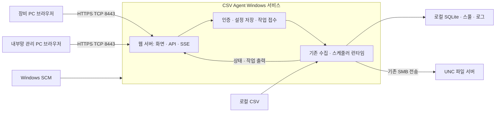

# CSV 수집 에이전트 — Windows 서비스·웹 관리 전환 설계변경서

| 항목 | 내용 |
|---|---|
| 문서 버전 / 작성일 | 0.1 / 2026-09-10 |
| 상태 | 구현 전 설계안. 실행 코드·설치 환경은 아직 변경하지 않음 |
| 기준 | [사양서 v0.3](https://github.com/sicarius01/csv_edge/blob/0f717fbc681c54387e3b98398cadb02850430923/csv-agent-spec.md), [설계서 v0.1](https://github.com/sicarius01/csv_edge/blob/0f717fbc681c54387e3b98398cadb02850430923/csv-agent-design.md), 현재 구현 `0f717fb` |
| 사용자 확정 요구 | Windows 서비스로 실행, GUI를 웹으로 교체, 로컬·내부망 접속, 웹 기능 전체를 포트 하나로 제공 |
| 문서 범위 | 구조·화면·API·보안·서비스 운영·데이터 전환·검증 기준. 서버 적재기와 QuestDB는 제외 |

이 문서는 기존 사양과 설계의 변경분을 정의한다. 아래에 교체한다고 명시한 요구는 서비스 버전에서 이 문서를 따른다. CSV 증분 수집·조각 형식·UNC 전송의 기존 규칙은 유지한다. 포트 번호와 제한값은 본 설계의 제안 기본값이며 회사 배포 환경에 맞춰 확정한다.

## 1. 변경 목적과 배포 전제

사용자가 장비 PC에서 GUI 실행 파일을 직접 실행하는 운용을, 관리자가 설치한 Windows 서비스와 브라우저 관리 화면으로 전환한다. 로그인·로그오프 및 브라우저 종료와 관계없이 수집을 지속한다. 관리 PC에는 별도 클라이언트 설치가 필요하지 않다.

**Windows 서비스도 실행 파일이다.** SCM은 등록된 서비스 바이너리를 실행하므로, 서비스 전환만으로 회사의 EXE 예외등록 요건이 없어지지는 않는다. 실행 허용 정책은 EXE 외에 스크립트·설치 파일에도 적용될 수 있다. 이 설계는 **회사에서 승인한 서비스 바이너리와 설치 방식을 사용할 수 있음**을 배포 전제로 한다. 기존 예약 명령이 실행하는 프로그램·스크립트도 해당 정책의 적용을 받는다. [Microsoft CreateServiceW](https://learn.microsoft.com/en-us/windows/win32/api/winsvc/nf-winsvc-createservicew), [Application Control](https://learn.microsoft.com/en-us/windows/security/application-security/application-control/app-control-for-business/appcontrol)

전환 후에도 설치·업데이트 때 관리자 작업과 필요한 실행 허용 등록은 남는다. 반복적인 사용자가 실행하는 GUI 대신 서비스 배포를 승인받을 수 있는지는 회사 담당자가 확인할 항목이다. 본 문서 작성 과정에서는 서비스 설치, 방화벽 변경, 코드 구현을 수행하지 않는다.

## 2. 주요 변경 결정

| 항목 | 현재 | 서비스 버전 |
|---|---|---|
| 실행 주체 | 로그인 사용자의 트레이 앱 | SCM이 시작하는 Windows 서비스 |
| 관리 화면 | egui 네이티브 3개 탭 | 브라우저의 동일한 3개 업무 화면 |
| 사용자 로그오프 | 수집 중단 | 수집 계속 |
| 브라우저 닫기 | 해당 없음 | 화면 연결만 종료, 서비스·작업 계속 |
| 자동 시작 | 사용자 HKCU Run | 서비스 자동 시작, 기본 지연 자동 시작 |
| 로컬·내부망 접속 | 로컬 GUI | 동일 HTTPS 포트·동일 로그인·동일 화면 |
| 테스트 실행 출력 | 별도 CMD 출력 창 | 웹 실시간 출력 패널 |
| 명령·UNC 실행 신원 | 로그인한 Windows 사용자 | 설치 시 지정한 서비스 계정 |
| 설정 저장 | GUI에서 파일 저장 후 코어에 전달 | 서버의 단일 저장 경로에서 검증·저장·적용 |
| 수집 설정·진행 상태 | ProgramData의 TOML·SQLite·스풀 | 기존 경로·형식 유지 |
| 설치 권한 | 사용자 실행 중심 | 관리자 설치 및 계정·폴더 ACL 설정 |

서비스는 Session 0에서 실행되므로 사용자 데스크톱과 직접 상호작용하는 GUI를 제공하지 않는다. 기존의 **“테스트 실행 때 CMD 창 표시” 요구는 “웹 화면에 실시간 콘솔 출력 표시”로 교체**한다. 별도 사용자 세션 도우미를 추가하지 않는다. [Microsoft Interactive Services](https://learn.microsoft.com/en-us/windows/win32/services/interactive-services)

## 3. 전체 구조와 단일 포트

### 3.1 배치 구조



장비마다 서비스 하나와 관리 포트 하나를 사용한다. 중앙 관리 서버를 신설하지 않는다. 여러 장비는 각각 `https://장비호스트명:8443/`으로 접속한다.

### 3.2 포트 규칙

| 구분 | 설계 |
|---|---|
| 기본 리스너 | IPv4 `0.0.0.0:8443`, TLS 전용 |
| 로컬 접속 | 장비 PC에서도 인증서에 등록된 장비 호스트명으로 접속 |
| 내부망 접속 | 내부망 관리 PC에서 같은 호스트명·같은 포트로 접속 |
| 웹 화면 | `/`, `/assets/*` |
| JSON API | `/api/v1/*` |
| 상태·작업 출력 스트림 | `/api/v1/events`의 SSE |
| 로그·설정 내려받기 | 인증된 API 응답으로 제공 |
| 별도 포트 | 프런트엔드 서버, WebSocket 전용 포트, 관리·메트릭 포트 모두 없음 |
| HTTP 리다이렉트 | 제공하지 않음. 80·8080 등 추가 리스너를 열지 않음 |

**단일 포트는 웹 관리 기능 전체에 적용한다.** SSE도 일반 HTTPS 응답 스트림이므로 화면·API와 같은 포트를 사용한다. 연결이 여러 개 생겨도 목적지 포트 번호는 하나다. HTTP/3·QUIC용 UDP 포트도 사용하지 않는다. IPv6는 1차 범위에서 제외하며, 추가할 경우에도 동일 포트와 동일 접근 제한을 적용한다. [Axum SSE 공식 문서](https://docs.rs/axum/latest/axum/response/sse/)

기존 UNC 전송은 파일 서버로 향하는 SMB 통신을 유지한다. 따라서 **장비에 새로 여는 웹 인바운드 포트는 TCP 하나**이며, 기존 SMB 아웃바운드 통신이나 조직의 DNS·도메인 인증까지 HTTPS 포트에 합치는 변경은 아니다. 파일 서버의 SMB 접근이 차단되어 있다면 그 연결은 별도 운영 조건이다.

### 3.3 방화벽·주소·인증서

- 설치 시 선택한 포트에 대해 장비의 인바운드 규칙 하나를 만든다. 원격 주소는 관리 PC 또는 승인된 관리망 CIDR로 제한하고, 적용 프로필은 승인된 Domain/Private로 제한한다. Public 프로필에 무제한 허용하지 않는다.
- `0.0.0.0` 바인딩은 로컬 루프백과 장비 네트워크 인터페이스에서 같은 포트를 받기 위한 것이다. 방화벽 제한과 웹 인증은 각각 적용한다. 회사 GPO가 로컬 규칙을 덮어쓰는 경우 중앙 정책에서 같은 범위를 반영한다.
- 기본 포트 `8443`이 충돌하면 설치 시 다른 포트 하나를 지정한다. 임의의 빈 포트로 자동 변경하지 않는다. 포트를 바꾸면 방화벽·접속 URL·허용 Host 설정을 함께 갱신한다.
- 인증서는 사내 CA 또는 회사가 신뢰하도록 배포한 인증서를 사용한다. 장비의 접속 호스트명이 SAN에 있어야 하며 IP로 접속하려면 그 IP도 인증서에 포함한다.
- 로컬에서도 같은 장비 호스트명을 쓰면 동일 인증서를 사용할 수 있다. `https://localhost:8443/` 또는 `127.0.0.1` 접속은 해당 이름·주소가 인증서와 허용 Host에 포함된 경우에만 지원한다. 인증서 경고 무시는 운영 절차로 삼지 않는다.
- HTTPS는 서비스 내부에서 종료한다. 별도 IIS·Nginx나 인증서 발급용 HTTP 포트를 필수 구성으로 두지 않는다. 인증서 갱신은 관리자가 파일을 안전하게 교체하고 재시작하는 절차로 제공한다.

## 4. 크레이트와 런타임 경계

```text
crates/
  core/       기존 수집·전송·스케줄러·상태 저장
  service/    신규 csv-agent-service.exe: SCM·서비스 수명주기·운영 로그
  web/        신규 라이브러리: HTTPS·인증·DTO·API·SSE·정적 파일
    assets/   HTML·CSS·JavaScript, 빌드 시 서비스 바이너리에 포함
  cli/        개발·진단 도구 유지, 일반 운영 배포물에는 필수 아님
  app/        전환 기간 기존 GUI 소스 유지, 서비스 운영 배포에서는 제외
```

초기 웹 화면은 HTML·CSS·JavaScript로 구성하고 외부 CDN을 사용하지 않는다. 모든 정적 파일을 서비스 바이너리에 포함하여 관리 PC와 장비에 Node.js·개발 서버·추가 GUI 실행 파일 설치를 요구하지 않는다. 설치 패키지는 바이너리 외에 호스트별 설정·인증서·인증 자료를 배치한다.

서버는 Axum과 TLS 서버 어댑터를 사용하고, 서비스 등록·상태 보고는 `windows-service`를 후보로 한다. 조사 시 공식 문서 버전은 Axum 0.8.9, axum-server 0.8.0, windows-service 0.8.1이다. 구현 시작 시 Rust 1.93 MSRV와 TLS 암호화 공급자의 빌드 의존성을 확인한 뒤 `Cargo.lock`에 고정한다. 현재의 Rust MSVC·C++ Build Tools·Windows SDK 빌드 전제는 유지한다. [Axum TLS 서버 문서](https://docs.rs/axum-server/latest/axum_server/), [windows-service 문서](https://docs.rs/windows-service/latest/windows_service/)

### 4.1 재사용과 필수 수정

| 현재 코드 | 변경 |
|---|---|
| `core/{watch,debounce,chunk,spool,upload,heartbeat,state}` | 기본 수집 알고리즘과 저장 형식 재사용 |
| `core/runtime::start`, `AgentHandle` | 서비스가 소유. GUI 깨우기 콜백은 상태 이벤트 브리지로 교체 |
| `app/ui/mod.rs`의 저장 처리 | 검증·파일 저장·런타임 적용을 공통 제어 계층으로 이동 |
| `core/runtime::reload_effects` | HKCU Run 변경을 코어 효과에서 분리. 서비스 모드에서는 호출하지 않음 |
| `core/task::open_test_console` | 명령 실행과 출력 전달 분리. 서비스 경로에서 콘솔 뷰어 실행 제거 |
| `core/bus` | 웹 DTO와 분리하고 설정 적용 완료 응답·작업 접수/출력/취소 메시지 추가 |
| `app/platform`의 전원 복귀 알림 | 서비스 제어 이벤트에서 `SystemResumed`로 연결 |
| `app`의 egui·트레이·창 메시지·Show 이벤트 | 서비스 호스트에서 사용하지 않음 |
| `core/win/instance`의 전역 잠금 | DB·스풀 중복 접근 방지를 위해 유지, 계정 간 ACL 검증 |

현재 `TestTask`는 `current_exe --task-console-viewer`를 실행하고 준비 응답을 받아야 명령을 시작한다. 서비스 이름으로 실행 파일만 바꾸면 이 의존성이 남는다. `TaskOutputSink`와 같은 출력 전달 경계를 도입하여 서비스 실행에서는 웹 이벤트만 발행하도록 바꾼다.

## 5. Windows 서비스 운영

### 5.1 설치와 실행 신원

서비스 이름 제안은 `CsvEdgeAgent`, 표시 이름은 `CSV Edge Agent`이다. 바이너리는 `%ProgramFiles%\CsvEdgeAgent\csv-agent-service.exe`, 데이터는 기존 `%ProgramData%\csv-agent`를 사용한다. SCM 등록 경로는 따옴표로 감싼 절대 실행 경로와 절대 `--data-dir`를 사용하며 현재 작업 폴더에 의존하지 않는다.

설치 관리자가 서비스 계정을 지정한다. 도메인 환경에서는 전용 gMSA 또는 전용 서비스 계정을 우선 검토한다. NetworkService를 선택하면 파일 서버에서 장비의 컴퓨터 계정에 적절한 권한을 부여해야 한다. LocalService의 네트워크 신원은 익명이고, NetworkService는 컴퓨터 자격 증명을 사용한다. 편의를 위해 LocalSystem을 기본값으로 두지 않는다. 비도메인 환경의 SMB 인증 방식은 파일 서버 정책에 맞게 별도 확인한다. [LocalService](https://learn.microsoft.com/en-us/windows/win32/services/localservice-account), [NetworkService](https://learn.microsoft.com/en-us/windows/win32/services/networkservice-account), [서비스 계정 선택](https://learn.microsoft.com/en-us/entra/architecture/service-accounts-on-premises)

서비스 계정에는 서비스 로그온 권한, CSV 원본 읽기, 데이터·스풀·로그 쓰기, 대상 공유와 NTFS의 필요한 권한을 부여한다. 프로그램 설치 디렉토리와 실행할 스크립트는 일반 사용자가 변경하지 못하게 한다. 서비스 계정 암호는 SCM의 계정 설정 절차에서 관리하며 `config.toml`, 웹 요청, 로그에 저장하지 않는다.

**브라우저 로그인 사용자와 서비스 Windows 계정은 서로 다르다.** UNC 테스트, 업로드, 예약·테스트 명령은 모두 서비스 계정으로 실행한다. 탐색기에서 공유가 열리는 것만으로 서비스 접근이 검증되지는 않는다. 매핑 드라이브는 로그온 세션마다 다르므로 서비스의 네트워크 경로는 UNC로 지정한다. [Services and Redirected Drives](https://learn.microsoft.com/en-us/windows/win32/services/services-and-redirected-drives)

### 5.2 상태와 장애

SCM에는 `START_PENDING → RUNNING → STOP_PENDING → STOPPED`를 보고하고, 초기화·정리 중에는 checkpoint와 wait hint를 갱신한다. 제어 핸들러는 이벤트만 전달하고 즉시 반환한다. 현재의 블로킹 `AgentHandle::shutdown()`을 제어 콜백에서 직접 호출하지 않는다. [Service State Transitions](https://learn.microsoft.com/en-us/windows/win32/services/service-status-transitions), [Service Control Handler](https://learn.microsoft.com/en-us/windows/win32/services/service-control-handler-function)

| 상황 | 동작 |
|---|---|
| 장비 설정 미완료·UNC 단절 | 서비스 RUNNING, 웹에 업무 오류 표시. 가능한 로컬 수집·스풀 유지 |
| 수집 설정 TOML 손상 | 원본 보존, 임의 초기화·자동 저장 금지. 웹에서 오류와 복구 기능 제공 |
| 인증·TLS·포트 초기화 실패 | 무인증·평문 리스너로 대체하지 않음. 유효한 수집 코어는 계속 유지하고 관리 화면 장애를 Event Log에 기록 |
| DB 잠금 충돌·데이터 접근 불가 | 수집 인스턴스를 중복 시작하지 않음. 시작 실패와 경로·권한 오류 기록 |
| 필수 코어 워커 비정상 종료 | 호스트 supervisor가 감지하여 서비스 실패로 보고. SCM 복구 정책에 연결 |
| 웹 요청 하나의 오류 | 해당 요청만 실패, 코어 유지 |
| 로그오프·브라우저 종료 | 수집과 작업 유지 |

서비스 전체 생존 상태와 수집 상태·웹 관리 상태를 구분한다. 웹이 열리지 않으면 Windows 서비스 관리자와 Event Log에서 서비스 상태·포트·인증서·설정 파일 오류를 확인한다. 시작·종료·치명 오류는 Windows Event Log, 상세 실행·감사 기록은 회전 파일 로그에 남긴다.

비정상 종료 시 SCM 재시작 정책은 초기안으로 30초 후 1회, 120초 후 1회, 이후 자동 재시작 중단을 사용한다. 복구 배열은 `RESTART(30초), RESTART(120초), NONE`으로 끝내고 실패 횟수 초기화 기간은 24시간으로 제안한다. Windows는 배열 소진 후 마지막 작업을 반복하므로 마지막 재시작 항목만 두지 않는다. 정상 중지는 자동 복구 대상으로 삼지 않는다. 무한 재시작으로 `run_on_start` 작업이 반복 실행되지 않게 한다. [SCM Failure Actions](https://learn.microsoft.com/en-us/windows/win32/api/winsvc/ns-winsvc-service_failure_actionsw)

### 5.3 종료와 전원 복귀

1. STOP/SHUTDOWN을 받으면 새 변경 요청과 신규 작업 접수를 막는다.
2. 스케줄러·파일 이벤트 수신을 중단하고 작업 취소를 전달한다. Job Object로 자식 프로세스 트리를 정리한다.
3. 진행 중인 로컬 조각·상태 커밋을 마무리하고 미전송 스풀을 보존한다. 네트워크 업로드 완료를 무한정 기다리지 않는다.
4. SSE를 닫고 리스너·로그·DB를 정리한 뒤 STOPPED를 보고한다.

관리자 STOP에 대한 정리 목표는 20초, 자체 운영 상한 제안은 30초다. OS SHUTDOWN에서는 Windows가 더 짧은 유예 후 종료할 수 있으므로 30초를 보장하지 않는다. 현재 SMB 호출 일부는 `spawn_blocking` 안에서 수행되므로 Tokio 작업 취소만으로 OS I/O가 즉시 중단되지는 않는다. 상한 초과 시 진단을 남기고 호스트 종료 정책으로 프로세스를 끝내며 다음 시작에서 DB·스풀 복구를 검증한다. 모든 네트워크 I/O가 고정 시간 안에 정상 완료된다고 보장하지 않는다.

전원 복귀 이벤트는 SCM HandlerEx 계열 알림을 통해 기존 `SystemResumed`에 연결한다. suspend 동안은 Windows 절전 정책을 따르고, 복귀 후 감시 재등록·전송 재시도·하트비트를 깨운다. [HandlerEx](https://learn.microsoft.com/en-us/windows/win32/api/winsvc/nc-winsvc-lphandler_function_ex)

## 6. 웹 화면

기존 3개 탭의 업무 구성을 유지한다. 상단 공통 영역에는 장비 ID, 서비스 실행 계정, 서비스 버전, 연결 상태, 적용된 설정 상태를 표시한다. 브라우저 연결이 끊어지면 마지막 갱신 시각과 연결 끊김을 표시하고 기존 값을 최신 정상 상태처럼 보여 주지 않는다.

| 화면 | 기능 |
|---|---|
| 전역 설정 | 장비 정보·UNC·수집 설정, 저장 및 적용, 서비스 신원으로 연결 테스트, 설정 경로·내보내기·가져오기 |
| 주기 명령 | 목록·편집·예약 실행 사용·테스트 실행·명시적 취소, stdout/stderr·종료 결과·실행 이력 |
| 파일 감시/전송 | 감시 패턴·미리보기·파일 진행 상태·지금 전송·선택 파일 처리·offset 초기화 확인 |

### 6.1 전역 설정과 상태 표현

- `확인 필요`에는 실제 검증·감시·전송 오류 원인을 함께 표시한다. 사용자가 수정만 한 경우는 `설정 저장 필요`로 구분한다.
- 연결 테스트 성공은 테스트한 UNC와 요청 ID에 연결한다. 입력값을 바꾸면 이전 성공 및 늦게 도착한 응답을 현재 경로의 성공으로 표시하지 않는다.
- 연결 테스트는 저장하지 않은 경로도 확인할 수 있지만, 성공만으로 수집 설정을 저장·적용하지 않는다. 적용된 UNC의 테스트 성공 시 전송 재시도는 기존 동작을 유지한다.
- 설정 파일의 실제 경로와 마지막 저장·적용 상태를 화면에 표시한다. 서버 경로는 장비 PC의 경로이며 브라우저를 실행한 관리 PC의 경로가 아니다.
- 브라우저 파일 선택기로 장비의 실행 파일·감시 폴더를 선택하지 않는다. 장비 경로 입력과 서버측 검증을 사용한다. 무제한 원격 파일 탐색·임의 파일 다운로드 API는 제공하지 않는다.
- 종료 안내·로그인 시 자동 실행 체크박스는 제거한다. 서비스 시작 유형·계정·포트는 설치 관리자 설정으로 표시하고 일반 수집 설정 저장으로 바꾸지 않는다.

### 6.2 웹 테스트 콘솔

사용자가 현재 편집 중인 명령으로 **테스트 실행**을 누르면 저장 없이 한 번 실행한다. `예약 실행 사용`이 꺼져 있어도 테스트할 수 있다. 테스트·예약·수동 실행은 같은 작업 중복 방지와 시간 제한을 공유한다.

콘솔 패널에는 실행 계정, 프로그램, 인수, 작업 폴더, 시작 시각, stdout/stderr, 종료 코드, 시간 초과·취소 여부, 소요 시간을 표시한다. 예약과 테스트 모두 실제 Windows 창은 만들지 않는다. 표준 입력은 닫고 대화형 입력·GUI 의존 명령은 지원하지 않는다.

명령의 프로그램과 작업 폴더는 절대경로로 지정한다. 서비스의 PATH·개인 프로필·현재 작업 폴더에 의존하지 않는다. 작업 폴더 생략 시 실행 파일 디렉토리로 해석하도록 정책을 명시하고, 기존 설정 이전 시 그 의미가 바뀌는 항목을 사용자에게 표시한다. 배치 파일은 승인된 시스템 `cmd.exe`와 명시적 인수로 실행하도록 검증하며, 웹 요청 문자열을 별도 셸 명령으로 임의 조합하지 않는다.

**웹 출력창을 닫거나 네트워크가 끊겨도 실행 중인 작업은 계속된다.** 취소 버튼은 해당 실행 ID에 대한 명시적 요청으로만 동작한다. 서비스 중지는 실행 중인 작업 전체를 취소한다. 재접속은 실행 결과를 조회하며 테스트 명령을 자동으로 다시 보내지 않는다.

## 7. 인증과 관리 권한

웹의 명령 편집·테스트 기능은 서비스 계정 권한으로 프로그램을 실행하는 관리 기능이다. 로컬 접속에도 내부망 접속과 같은 인증을 적용한다. 1차 버전은 **인증된 관리자 전용**으로 제공하며 익명 상태 조회·익명 UNC 테스트·일반 사용자 실행 권한은 두지 않는다. 읽기 전용 역할 분리는 후속 확장으로 둔다.

| 항목 | 설계 |
|---|---|
| 초기 관리자 | 설치 단계에서 장비별 일회용 초기 암호 발급, 첫 로그인에서 변경 |
| 암호 저장 | 무작위 salt를 사용하는 Argon2id 해시, 공용 기본 암호 없음 |
| 세션 | 서버측 세션, 추측 불가능한 쿠키 ID, 로그인 시 교체·로그아웃/만료 시 폐기 |
| 쿠키 | `Secure`, `HttpOnly`, `SameSite=Strict`, `Path=/`, Domain 미지정 |
| 만료 제안 | 사용자 조작 없이 30분, 절대 8시간. SSE 수신만으로 무한 연장하지 않음 |
| 요청 보호 | 변경 요청의 CSRF 토큰·Origin 확인, Host 허용 목록, JSON Content-Type 검증 |
| 교차 출처 | 외부 Origin에 CORS 허용하지 않음. 화면·API·SSE는 같은 origin |
| 표시 데이터 | 명령 출력·경로·오류를 텍스트로 렌더링, HTML 실행 금지 |
| 브라우저 정책 | CSP, 프레임 삽입 차단, 민감 응답 `Cache-Control: no-store` |
| 과도한 요청 | 로그인 시도·UNC 테스트·명령 실행 동시성 및 본문 크기 제한 |
| 감사 | 로그인, 설정 변경, 테스트/수동 실행·취소, offset 초기화의 사용자·시각·대상·결과 기록 |

초기 암호로 만든 `must_change_password` 세션은 암호 변경·세션 조회·로그아웃만 허용한다. 나머지 업무 API와 SSE는 거부하고 암호 변경 후 세션을 교체한다. 세션 쿠키·암호·TLS 개인키·초기 등록 비밀은 URL, 일반 로그, 설정 내보내기에 넣지 않는다. 초기 암호 전달 파일이 필요하면 생성 때부터 관리자만 읽을 수 있게 ACL을 제한하고 사용 후 삭제한다. 인증 자료가 없거나 손상된 상태에서는 무인증 관리 API를 열지 않고 설치 관리자 복구 절차를 사용한다. [OWASP Session Management](https://cheatsheetseries.owasp.org/cheatsheets/Session_Management_Cheat_Sheet.html), [OWASP CSRF Prevention](https://cheatsheetseries.owasp.org/cheatsheets/Cross-Site_Request_Forgery_Prevention_Cheat_Sheet.html)

TLS 개인키와 인증 파일은 Administrators 및 서비스 신원에 필요한 권한만 부여한다. 서비스 계정·리스너 정책·방화벽·바이너리 변경 전용 웹 API는 제공하지 않는다. 명령 실행이 가능한 웹 관리자는 서비스 계정과 동일한 권한을 가진 신뢰 주체로 취급한다. 실행 명령은 그 계정이 읽을 수 있는 인증 자료·개인키에도 접근할 수 있으므로, API를 없애는 것만으로 명령 실행에 대한 보안 격리가 생기지는 않는다. 서비스 계정 자체를 최소 권한으로 운용하고 웹 관리자 자격을 그 권한을 부여해도 되는 사람에게만 제공한다. 명령 실행과 웹 서버 간 계정 격리는 별도 프로세스·권한 경계가 필요한 후속 설계 범위다.

## 8. API와 이벤트 계약

모든 경로는 같은 HTTPS 리스너에 연결한다. 아래 이름과 응답은 구현할 계약이며 현재 코드에 존재하는 API가 아니다. 로그인 외 업무 API에는 인증을 요구한다. GET은 변경을 일으키지 않는다.

| 메서드·경로 | 동작 |
|---|---|
| `POST /api/v1/auth/login`, `POST /api/v1/auth/logout` | 세션 생성·폐기 |
| `POST /api/v1/auth/password` | 초기 암호·관리자 암호 변경 |
| `GET /api/v1/auth/session` | 세션 상태·CSRF 토큰 확인 |
| `GET /api/v1/status` | 서비스·수집·웹 상태 및 revision |
| `GET /api/v1/config`, `PUT /api/v1/config` | 수집 설정 읽기, 조건부 저장·적용 |
| `POST /api/v1/config/apply` | 지정한 저장 revision의 적용 재시도, 파일 재저장 없음 |
| `GET /api/v1/config/export` | 수집 설정 TOML 내려받기 |
| `POST /api/v1/config/import-preview` | 업로드 TOML 검증·차이 미리보기, 자동 적용 없음 |
| `POST /api/v1/unc-tests` | 입력한 UNC를 서비스 계정으로 테스트 |
| `POST /api/v1/pattern-previews` | 장비의 감시 패턴 미리보기 |
| `POST /api/v1/task-tests` | 현재 작업 초안 테스트 접수 |
| `POST /api/v1/tasks/{name}/runs` | 저장된 작업 1회 실행 |
| `GET /api/v1/tasks/{name}/history` | 보관된 실행 결과 |
| `GET /api/v1/jobs/{id}`, `GET /api/v1/jobs/{id}/output` | 비동기 요청 상태·출력 꼬리 |
| `POST /api/v1/jobs/{id}/cancel` | 해당 명령 실행 취소 |
| `GET /api/v1/files` | 파일 상태 페이지 조회 |
| `POST /api/v1/transfers/flush` | 전송 재시도 요청 |
| `POST /api/v1/files/{id}/process`, `POST /api/v1/files/{id}/reset-offset` | 등록된 파일 처리·확인 후 offset 초기화 |
| `GET /api/v1/logs` | 허용된 로그 범위만 크기 제한 조회 |
| `GET /api/v1/events` | 상태 변화·작업 출력·완료 이벤트 SSE |

서비스 설치·중지·삭제·바이너리 업데이트와 범용 셸 터미널 API는 제공하지 않는다. 서비스 수명주기는 SCM·승인된 배포 도구에서 관리한다. 파일 조작 API의 ID는 서버가 등록한 파일에 매핑하며 임의 파일 경로로 접근하지 않는다.

### 8.1 접수와 완료

명령 실행·UNC 테스트·패턴 미리보기처럼 오래 걸릴 수 있는 요청은 `202 Accepted`와 `job_id`를 반환한다. `202`는 완료 성공이 아니다. 작업은 `queued/running/succeeded/failed/timed_out/cancelled` 상태와 최종 결과를 갖고, 비정상 재시작의 복구 상태는 `interrupted/unknown`으로 구분한다. UI는 최종 결과를 받은 후 성공 표시한다.

변경 요청의 `request_id`를 서비스 실행 회차인 `boot_id`와 함께 관리한다. 동일 회차의 동일 요청 ID·동일 본문 재전송은 기존 작업을 반환하고, 다른 본문은 거부한다. 요청 메타데이터는 별도 `service-state.db`에 작업 접수 전에 저장한다. 이 저장소에는 `job_id`, `boot_id`, `request_id`, 요청 해시, 관리자 식별자, 수집 DB의 작업 실행 ID, 상태·취소 사유를 기록한다. 기존 수집 DB 스키마에는 웹 제어 필드를 추가하지 않는다. 요청 이력은 예를 들어 24시간·최대 1,000건으로 제한하며 활성 작업은 제거하지 않는다. 이미 실행 중인 같은 이름의 작업은 충돌로 응답한다.

서비스 재시작 시 `boot_id`가 바뀌며 이전 작업의 실행 핸들은 만료된다. 브라우저는 이전 요청을 자동 재실행하지 않고 보관된 작업 이력을 조회한다. 이전 회차에서 `finished_at` 없이 남은 이력은 실행 중으로 계속 표시하지 않고 중단된 이력으로 처리한다. 수집 DB와 서비스 제어 DB의 커밋은 하나의 원자적 트랜잭션이 아니므로, 실행 연결 여부를 확인할 수 없는 요청은 `unknown`으로 남기고 자동 재실행하지 않는다. 이 규칙은 임의 명령의 정확히 한 번 실행을 보장한다는 뜻은 아니다. 제어 메타데이터 보관 기간이 지난 이력은 기존 DB가 제공하는 종료 코드·시간 초과·출력 정보까지만 표시한다.

### 8.2 상태·출력 스트리밍

내부 `StatusSnapshot`을 그대로 직렬화하지 않는다. `tokio::time::Instant`는 API에 노출하지 않고 RFC3339 시각·`retry_after_ms`·명시적 상태 문자열을 가진 DTO로 변환한다. 파일 목록은 페이지로 나누어 상태 갱신마다 전체 목록을 전송하지 않는다.

브라우저는 최초 스냅샷을 읽고 SSE로 상태 변경과 작업 출력을 받는다. 이벤트에는 `boot_id`, 순서 번호, 종류, 대상 실행 ID를 포함한다. 재접속 시 버퍼에 남은 범위만 재전송하고, 누락되었으면 `resync_required`를 보내 스냅샷·최종 결과를 다시 읽게 한다.

- 상태 이벤트는 `watch` 기반으로 최신 값을 합친다. 느린 클라이언트 때문에 코어를 기다리게 하지 않는다.
- 실행별 출력 링 버퍼 제안은 stdout·stderr 합계 256 KiB이며 초과분은 생략 바이트 수를 표시한다. 영구 이력은 기존 스트림별 마지막 16 KiB를 유지한다.
- 완성되지 않은 UTF-8 바이트를 스트림별로 보관하여 한글이 읽기 경계에서 깨지지 않게 한다. UTF-8 외 인코딩은 장비 명령의 실제 인코딩을 확인하고, 1차 버전에서 자동 감지를 보장하지 않는다.
- SSE 연결 제안 상한은 장비당 8개, 요청 본문 1 MiB, 동시 UNC 테스트 2개다. 프런트엔드는 페이지당 SSE 하나를 공유하며 초과·바쁜 상태를 명시적으로 응답한다.
- SSE keep-alive는 연결된 클라이언트에만 약 30초 간격으로 전송한다. 상태 폴링·파일 전체 주기 스캔은 추가하지 않는다. 서비스 유휴 CPU 검증은 브라우저 미접속과 접속 상태를 나눠 측정한다.

## 9. 설정 저장과 파일 호환

### 9.1 파일 분리

```text
%ProgramData%\csv-agent\
  config.toml          기존 수집·전송·작업 설정, 복사·내보내기 대상
  service-host.toml    신규: 리스너·허용 Host·TLS/인증 파일 위치, 관리자 관리
  security\           신규: 인증 해시·인증서·개인키, 장비별 ACL 적용
  state.db             기존 진행 상태·작업 이력
  service-state.db     신규: 웹 요청·실행 연결·취소 사유, 수집 DB와 분리
  spool\               기존 미전송 조각
  logs\                상세 운영·감사 로그
```

다음은 설치 관리자가 생성할 `service-host.toml`의 **형식 제안**이다. 암호·개인키 자체를 포함하지 않는다. 상대 TLS·인증 경로는 이 파일의 디렉토리 기준으로 해석한다.

```toml
schema_version = 1

[web]
listen = "0.0.0.0:8443"
allowed_hosts = ["edge-host.example.internal:8443"]
max_sse_connections = 8
max_body_bytes = 1048576

[tls]
certificate_chain = "security/server-chain.pem"
private_key = "security/server-key.pem"

[auth]
database = "security/admin-auth.json"
idle_timeout_sec = 1800
absolute_timeout_sec = 28800
```

기존 `[equip]`, `[server]`, `[[watch]]`, `[[task]]` 및 수집 관련 `[agent]`, `[log]` 필드는 유지한다. `agent.autostart`는 레거시 필드로 읽되 서비스 모드에서 HKCU를 수정하지 않는다. `ui.exit_confirm_message`도 호환 읽기만 하고 웹 서비스 중지 기능으로 연결하지 않는다. `config.example.toml`은 계속 예제이며 실제 설정 저장 대상이 아니다.

수집 설정 내보내기는 서비스 계정·웹 관리자 인증·인증서·호스트 리스너·수집 및 서비스 제어 DB·스풀을 제외한다. 새 PC에 설정을 복사한 뒤 장비 ID·경로를 변경하는 기존 절차를 유지하되, 서비스 설치와 권한 설정은 별도다. 스풀이 남은 기존 장비의 ID를 바꿀 때는 기존 조각이 새 ID로 전송되지 않도록 배출 또는 명시적인 이전 절차를 먼저 수행한다.

### 9.2 저장·적용 계약

현재 GUI의 `config::save`와 코어의 `ReloadConfig`는 분리되어 있다. 웹에서는 다음 단일 제어 경로를 구현한다.

1. GET 응답에 저장 파일의 원문 해시를 기준으로 한 `revision`/ETag, 실제 파일 경로, 적용 상태를 포함한다. 적용된 메모리 값과 저장된 파일을 별도로 관리한다.
2. 클라이언트는 초안을 수정하고 저장 시 `If-Match`로 읽었던 revision을 제출한다.
3. 서버는 저장 요청을 직렬화하고 파일을 다시 읽어 revision·전체 설정·서비스 모드 제약을 검증한다. 충돌은 `412`, 잘못된 값은 필드별 검증 오류로 돌려준다.
4. 원자적 파일 교체로 설정을 저장한 뒤 런타임에 적용을 요청한다. 메모리 설정만 바꾸는 기존 `ReloadConfig`를 그대로 HTTP에 노출하지 않는다.
5. 런타임의 적용 응답을 받아 `saved_revision`, `applied_revision`, `restart_pending_fields`, `apply_errors`를 구분해 응답한다. `applied_revision`은 해당 저장본의 동적 설정 적용 완료를 뜻한다. 재시작 필요 필드는 실행 중인 실제 설정에 먼저 넣지 않고 이전 적용값을 유지한다.
6. 적용 ACK는 채널 접수만이 아니라 동적 설정 교체와 로그 레벨 등 관련 효과의 처리 결과를 포함한다. 일부 효과만 성공하면 항목별 실제 적용값과 실패를 표시하고 새 revision 전체가 적용됐다고 보고하지 않는다. UNC가 현재 연결 가능한지는 설정 적용 완료와 별도의 업무 상태다.
7. 파일 저장 후 적용 실패 시 저장된 새 설정과 실제 적용 상태를 모두 표시한다. 자동으로 이전 파일로 되돌리거나 후속 사용자의 저장을 덮어쓰지 않는다. `POST /api/v1/config/apply`에 `saved_revision`을 제출해 재시도하거나 관리자 재시작으로 복구한다. 재시도 시 저장 revision이 바뀌었으면 충돌로 응답한다.

스풀 경로·로그 경로·로그 보관 수는 기존처럼 재시작 필요로 표시한다. 리스너·TLS·인증 정책·서비스 계정 변경은 일반 수집 설정 API 밖에서 관리하고 재시작 때 반영한다. 파일 직접 편집은 서비스를 중지한 후 수행하며, 실행 중 수정이 발견되면 기존 화면의 revision으로 덮어쓰지 않는다.

손상된 TOML을 웹에서 고칠 때는 원본을 보관하고 명시적인 복구 저장을 요구한다. 검증 실패를 이유로 기본 설정을 자동 저장하지 않는다. 설정 내용에 오류가 있어도 유효한 웹 호스트 설정이 있으면 관리 화면을 열어 복구할 수 있게 한다.

## 10. 전환·업데이트·롤백

### 10.1 기존 트레이 버전에서 이전

1. 실제 데이터·스풀·로그 경로와 장비 ID를 기록하고 기존 사용자의 HKCU 자동실행 항목을 확인한다.
2. 기존 앱을 트레이에서 완전히 종료하고 DB·스풀 잠금 해제를 확인한다. 새 서비스와 기존 앱을 동시에 같은 데이터로 실행하지 않는다.
3. 종료된 상태에서 설정·SQLite 관련 파일·스풀을 같은 시점으로 백업한다. WAL이 남아 있으면 함께 보관하거나 SQLite가 지원하는 일관된 백업 방법을 사용한다. 실행 중 `state.db` 하나만 복사하지 않는다.
4. 승인된 서비스 바이너리를 설치하고 서비스 계정·폴더 ACL·SMB 권한·인증서·초기 관리자·단일 포트 방화벽 규칙을 설정한다.
5. 기존 `config.toml`, `state.db`, 스풀 경로를 유지해 연결한다. 1차 전환에서는 기존 수집 DB 스키마 버전 1과 조각 형식을 바꾸지 않는 것을 원칙으로 한다.
6. 첫 검증 시작은 예약·`run_on_start` 실행을 보류하는 설치 검증 모드로 수행한다. 서비스 계정으로 UNC 테스트, 로컬 감시 권한, 샘플 수집·전송, 승인된 명령 테스트를 확인한다.
7. 기존 사용자 컨텍스트의 HKCU Run 등록을 제거한다. 서비스 계정의 HKCU만 수정해서는 기존 사용자 자동실행이 없어지지 않는다. 여러 사용자로 등록했다면 해당 항목을 각각 확인한다.
8. 검증 모드를 해제해 운영 시작하고 재부팅·로그오프·내부망 웹 접속을 확인한다. 이후 `run_on_start`는 서비스가 시작될 때마다 실행된다는 의미를 안내한다.

설치 검증 모드·SCM 설치 절차는 신규 구현 범위이며 현재 바이너리에 존재하는 옵션으로 안내하지 않는다. 전역 DB·스풀 잠금은 계속 유지하여 구 GUI·CLI가 잘못 실행되어도 이중 수집을 막는다. 계정 간 잠금 객체 접근 거부도 안전하게 실패시키고 원인을 기록한다.

### 10.2 업데이트와 롤백

업데이트는 서비스 중지·동일 시점 백업·바이너리 교체·재시작·상태 확인 순서다. 사용자 쓰기 가능한 위치의 바이너리를 서비스로 등록하지 않는다. 제거 시 서비스·해당 방화벽 규칙을 제거하되 설정·DB·스풀은 명시적 데이터 삭제 없이 유지한다.

웹 서비스 버전에만 문제가 있고 수집 DB 스키마가 호환되면, 서비스를 완전히 중지한 뒤 이전 바이너리로 현재 데이터를 이어 사용하는 것을 우선한다. 백업 복원이 필요하면 DB와 스풀을 같은 시점으로 복원한다. 오래된 DB만 단독 복원하지 않는다. 백업 이후 파일 서버에 전송된 데이터는 로컬 롤백으로 취소되지 않으므로 중복 전송 가능성과 서버 데이터 정합성을 함께 확인한다.

구 GUI로의 롤백은 해당 GUI 실행이 회사 정책상 허용된 경우에만 가능하다. 허용되지 않으면 이전에 승인된 서비스 빌드로 되돌리거나 서비스를 중지하고 스풀·원본을 보존한다.

## 11. 구현 순서와 완료 기준

| 단계 | 작업 | 통과 기준 |
|---|---|---|
| 1 | 출력 sink·설정 제어·호스트 효과 분리 | 기존 수집·작업 회귀 테스트 유지, 서비스 경로에 GUI·HKCU 실행 없음 |
| 2 | SCM 호스트·계정·로그·정상 종료 | 로그인 없이 시작, 정상 STOP, 실패 복구, 잠금·권한 진단 |
| 3 | 단일 HTTPS 리스너·인증·정적 화면 | 장비 PC와 내부망 PC가 같은 포트로 로그인·화면 사용 |
| 4 | 3개 화면·API·revision·SSE | 저장 충돌, 오류 원인, 실시간 상태·명령 출력·취소 동작 |
| 5 | 설치·기존 데이터 이전·롤백 | 기존 offset·스풀·장비 ID 보존, 실행 허용·ACL·방화벽 절차 검증 |
| 6 | 현장 수용 시험·문서 갱신 | 아래 항목 통과 후 서비스 버전을 운영 배포 |

### 수용 시험

| 범주 | 검증 내용 |
|---|---|
| 단일 포트 | 서비스 PID의 리스너는 지정 TCP 포트 하나. 웹·API·SSE·출력·설정 다운로드 모두 같은 origin. 추가 HTTP/UDP/개발 서버 리스너 없음 |
| 접속 | 로컬 장비·승인된 내부망 관리 PC 모두 접속. 허용되지 않은 관리망 주소와 Public 프로필에서는 방화벽 정책대로 차단 |
| 서비스 | 재부팅 후 미로그인 상태 수집, 로그오프·브라우저 종료 후 지속, 서비스 STOP·복구 정책·Event Log 확인 |
| 인증 | 익명 API 거부, 잘못된 Host/Origin·CSRF 거부, 세션 만료 시 SSE도 종료, 출력 HTML 삽입 방지 |
| 설정 | 저장 위치 표시, 미저장·검증 오류 구분, 다른 UNC의 늦은 테스트 결과 폐기, 동시 저장 충돌, 디스크 저장 실패·적용 실패 구분 |
| UNC | 실제 서비스 계정으로 쓰기·이름 변경·삭제, 공유/NTFS 권한 거부, 네트워크 단절·복귀·절전 복귀 |
| 명령 | 비활성 초안 테스트, 예약/테스트 중복 차단, 한글 분할 출력, 대량 출력 생략, 종료 코드, timeout·취소 시 자식 트리 정리 |
| 웹 단절 | 느린 SSE가 코어를 막지 않음, 재접속 때 테스트 중복 실행 없음, 서비스 재시작 후 오래된 job 상태를 실행 중으로 오표시하지 않음 |
| 데이터 | 기존 DB·스풀 재사용, 전송 중 강제 종료 후 복구, 구 GUI/CLI와 동시 접근 거부, 롤백 시 동일 시점 보존 |
| 장애·성능 | 포트 충돌·TLS/인증 손상 때 평문 대체 없음, 수집 코어 유지/치명 오류 구분, 10분 유휴 측정과 브라우저 접속 시 별도 부하 측정 |

기존 구현의 자동 테스트 48개는 현재 버전의 기준선이다. 위 서비스·웹 수용 시험은 아직 수행하지 않았으며 새 구현의 완료 조건이다.

## 12. 기존 문서의 변경 대상과 남은 배포 결정

| 원본 위치 | 서비스 버전에서 변경할 내용 |
|---|---|
| 사양 1.2, 5.1~5.4, 7.1 | 트레이·로그인 필수·비관리자 설치 전제를 서비스·관리자 배포로 교체 |
| 사양 2.10, 5.5 및 현재 README 테스트 설명 | CMD 출력 창을 웹 출력 패널로 교체, 실행 계정·비대화형 조건 추가 |
| 사양 3, 5.5 | 설정 경로 유지, 서비스 호스트·웹 인증 설정 분리, 저장 상태·충돌 규칙 추가 |
| 설계 1~3, 7~9 | service/web 크레이트, 설정 제어 계층, SCM·SSE·인증 경계 추가 |
| 설계 11 및 구현 순서 | 서비스 설치·권한·네트워크·다중 브라우저·이전 시험 추가 |

배포 전에 확인할 환경값은 다음과 같다. 이 값이 아직 없어도 본 구조의 설계·구현은 진행할 수 있지만 운영 배포 완료로 판정할 수는 없다.

- 승인 가능한 서비스 바이너리·서명·설치 패키지와 예약 명령의 실행 허용 방식
- 서비스 계정 종류, 원본·데이터 디렉토리 ACL, 파일 서버 공유·NTFS 권한
- 단일 관리 포트 번호(기본 제안 8443), 허용 관리망 범위, GPO 방화벽 반영 주체
- 접속 호스트명·인증서 발급/신뢰 배포·갱신 담당, 초기 관리자 비밀 전달 방법

원본 사양서·설계서는 이번 문서 작성에서 수정하지 않는다. 구현에 들어갈 때 변경표에 따라 정식 버전을 갱신하고, 실제 동작과 미구현 설계가 혼동되지 않도록 README를 함께 정리한다.
