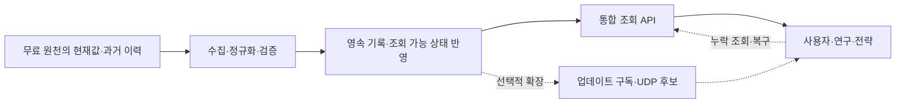

# 크립토 데이터 수집 범위·공급처·비용 조사

공개 열람본 · 함께 읽기: [실행 설계·다음 단계](implementation-plan.md) · [M1 API](api.md)

**호가·체결 틱을 제외한 신규 데이터 수집 시스템 검토**

- 조사 기준일: **2026-09-15**
- 조사 당시 상태: 데이터 종류 및 획득 가능성 조사. 구현·공급자 선정 전.
- 조사 방법: 거래소, 프로토콜, 데이터 공급자, 공공기관의 공식 API 문서·가격표·방법론 확인.
- 검증 수준: 문서에 명시된 제공 범위와 가격을 확인했다. 유료 계정의 실제 응답, 전 종목의 과거 결측률, 적재 성능을 검증한 것은 아니다.
- 가격: USD 공개 표시가. 월결제와 연납 환산을 구분했다. 최종 계약·세금·초과 사용료는 별도다.

**후속 진행(2026-09-16):** 이 문서는 조사 당시의 범위·가격과 목표 수준을 보존한다. 이후 상품 정보·확정 봉의 M1을 구현했으며, 현재 구현과 다음 단계는 [실행 설계](implementation-plan.md), 실제 조회 계약은 [M1 API](api.md)를 참조한다. 13절의 전체 제안이 모두 구현됐다는 뜻은 아니다.

## 요약

**호가·틱을 제외해도 수집 후보는 거래소 집계, 파생상품, 온체인, DeFi, 토큰 펀더멘털, 기관·거시, 뉴스·심리·대체 데이터까지 확장된다.**

무료 원본과 공개 집계만으로 넓은 기본 데이터층을 만들 수 있다. 비용이 집중되는 곳은 여러 거래소의 장기 과거 이력, 과거 옵션 체인, 지갑 소유자 라벨, 당시 알려진 값의 이력, 정형화된 언락·재무, 소셜 원문이다. 공개 원장을 직접 가공하는 방법도 있지만, 다중 체인 전체 이력을 재구축하는 데에는 서버·색인·정의 유지 비용이 든다.

새 시스템의 범위를 결정할 때는 데이터 종류마다 다음 네 가지를 구분해야 한다.

| 획득 형태 | 예시 | 주요 비용·제약 |
|---|---|---|
| 공개 원본·공식 집계 | 거래소 봉·확정 펀딩, 체인 원장, 공시, 경제 통계 | 호출 제한, 조회 기간, 정규화·정정 관리 |
| 유료 정규화·역사 | 여러 거래소의 OI·청산, 과거 옵션 평가값, 이벤트 이력 | 대상 거래소·종목·기간·해상도별 구독 및 반출 비용 |
| 유료 해석·추정 | 주소 라벨, 엔티티 자금 흐름, 딜러 감마, 소셜 감성 | 모델 정의, 추정 오차, 과거 값 수정, 사용권 |
| 부분 공개·외부 관측 불가 | CEX 전체 고객 포지션, OTC 전체 장부, 비공개 투자 계약 | 제휴 또는 공시 범위만 확보 가능. 전체 시장 복원 불가 |

## 목차

1. [범위와 읽는 법](#scope)
2. [거래소 가격 집계·기준정보](#market)
3. [선물·무기한·옵션·신용](#derivatives)
4. [온체인·네트워크·자금 흐름](#onchain)
5. [DeFi·스테이블코인·RWA](#defi)
6. [토큰·프로젝트 펀더멘털](#fundamentals)
7. [기관·전통 금융·거시](#institutional)
8. [뉴스·심리·보안·기타 대체 데이터](#alternative)
9. [주요 공급자 비용표](#pricing)
10. [실제 적재를 가로막는 제약](#hurdles)
11. [재구축 범위를 정할 때의 판단](#selection)
12. [1차 필터 결과: 무료·정형·거래 시점에 이용 가능한 데이터](#free-actionable-filter)
13. [추천 제공 수준: 과거·현재를 함께 쓰는 통합 데이터 API](#unified-data-service)

<a id="scope"></a>
## 1. 범위와 읽는 법

### 포함·제외 기준

- **제외:** order book snapshot/delta, 개별 체결, aggTrade, 개별 체결을 다시 포장한 틱 데이터. 호가에서 직접 산출하는 가격대별 depth·queue 지표도 이번 범위에 넣지 않는다.
- **포함:** 거래소가 제공하는 OHLCV 봉, 구간별 거래량·매수/매도 집계, 펀딩, OI, 청산 집계, 옵션 평가 지표, 온체인·펀더멘털·대체 데이터.
- 온체인 토큰 전송·계약 상태는 거래소 체결 틱과 다른 원천이므로 포함한다. DEX 매매는 개별 swap 대신 봉·풀·시간 구간 집계 위주로 검토한다.
- 기존 bv_sync의 코드·저장 형식·소스 선택은 전제하지 않는다. 거래소 공식 아카이브는 다른 공개 공급처와 동일한 후보로 평가한다.
- 여기서 ‘모든 종류’는 **원천과 의미가 다른 데이터군을 넓게 분류한다는 뜻**이다. 모든 공급자의 모든 endpoint나 무한히 만들 수 있는 파생 지표를 열거했다는 뜻은 아니다.

### 용어

- **OHLCV:** 시가·고가·저가·종가·거래량.
- **OI(Open Interest):** 아직 청산·상계되지 않은 미결제약정 규모.
- **IV / Greeks:** 옵션 가격에 내재된 변동성과 가격의 민감도.
- **TVL:** 프로토콜에 예치된 자산 가치. 중복 예치 처리 등에 따라 정의가 달라진다.
- **PIT(Point-in-Time):** 특정 과거 시점에 실제로 알 수 있었던 값을 보존한 이력.
- **백필:** 수집 시작 이전의 과거 데이터를 채우는 작업.
- **무료 원본:** 별도 데이터 구독료 없이 접근 가능한 원천. 무제한 호출·상업 이용·무비용 운영을 뜻하지 않는다.

<a id="market"></a>
## 2. 거래소 가격 집계·기준정보

공식 REST, 봉 WebSocket, 다운로드 아카이브가 주요 경로다. 거래소별 제공 필드와 기간이 다르므로 한 거래소의 기능을 모든 거래소에 일반화하면 안 된다.

| ID | 데이터 종류 | 얻을 수 있는 값 | 확보 경로·비용 | 적재 시 핵심 제약 |
|---|---|---|---|---|
| A01 | 현물·선물 OHLCV | 시간 구간별 가격, 거래량·거래대금 | 거래소 공개 API·아카이브 무료, 통합 공급자 유료 | 확정/미완성 봉, 무거래 구간, 코인/계약/USD 단위 |
| A02 | 구간별 거래 활동 | 체결 수, taker 매수·매도량, 순매수량, 24h 통계 | 일부 거래소 공식 봉·통계 API 무료 | 모든 거래소가 방향별 집계를 제공하지 않음. 이동 24h와 일봉은 다름 |
| A03 | Mark·Index·Premium 가격 | 평가·청산 기준 가격, 지수, 펀딩 산식의 프리미엄과 각 봉 | 거래소 공개 API 무료 | 실제 체결가와 의미가 다름. 지수 구성·산식 변경 |
| A04 | 가격 차이·시장 연결 | 현선 basis, 연율 basis, 만기 구조, 거래소 간 가격 차이, 김치 프리미엄 | 공식 basis 또는 봉·FX로 자체 계산 | 같은 시각·통화·가격 기준 정렬. 만기·환율·연율 정의 필요 |
| A05 | 연속선물·정산 | 롤 연결 가격, 만기 settlement·delivery·exercise 가격 | 거래소 일부 무료, CME 등 상품별 유료 | 롤·가격 조정 방식, 과거 만기 계약 목록 |
| A06 | 상품·심볼 기준정보 | 상장·상폐·만기, base/quote/settlement, 승수, linear/inverse, tick/step/min-notional | 거래소 공개 instrument API 무료 | 현재 목록만으로 과거 종목군 복원 불가. 심볼 재사용·리네임·단위 변경 |
| A07 | 지수 구성 | 구성 거래소·상품·가중치, benchmark 구성·리밸런싱 | 거래소 일부 무료, 지수 사업자 상품별 계약 | 현재 구성과 과거 구성 구분. 지수 사용권 별도 |
| A08 | 거래 조건·운영 상태 | 수수료·리베이트·margin tier·최대 레버리지, 거래/입출금 중단·점검·상장 공지 | 공개 규칙·공지, 일부 인증 API | 개인 적용 수수료·차입 한도는 계정별. 공지일과 발효일 분리 |

공식 근거: [Bybit 봉](https://bybit-exchange.github.io/docs/v5/market/kline), [Mark 봉](https://bybit-exchange.github.io/docs/v5/market/mark-kline), [Index 봉](https://bybit-exchange.github.io/docs/v5/market/index-kline), [Premium 봉](https://bybit-exchange.github.io/docs/v5/market/premium-index-kline), [상품정보](https://bybit-exchange.github.io/docs/v5/market/instrument), [지수 구성](https://bybit-exchange.github.io/docs/v5/market/index-components), [위험 한도](https://bybit-exchange.github.io/docs/v5/market/risk-limit), [공지](https://bybit-exchange.github.io/docs/v5/announcement). 공개 아카이브 예시는 [Binance Public Data](https://github.com/binance/binance-public-data), [OKX Historical Data](https://www.okx.com/en-us/historical-data).

<a id="derivatives"></a>
## 3. 선물·무기한·옵션·신용

| ID | 데이터 종류 | 얻을 수 있는 값 | 확보 경로·비용 | 적재 시 핵심 제약 |
|---|---|---|---|---|
| B01 | 확정 펀딩 | 실제 정산 funding rate·시각 | 거래소 무료, Velo·CoinGlass 등 통합 유료 | 종목별 정산 주기가 다름. 모든 상품을 8시간으로 가정하면 안 됨 |
| B02 | 예상 펀딩·규칙 | 정산 전 예상 rate, 다음 시각, cap/floor·주기 | 거래소 현재 snapshot 무료 | 확정 펀딩 이력으로 당시 예상값을 복원할 수 없음 |
| B03 | OI | 종목·거래소별 계약/코인/USD 미결제약정, 합산 OI | 거래소 무료, 장기 통합 이력 유료 | 단측/양측, 명목 단위, 갱신 주기·조회 기간 차이 |
| B04 | 포지셔닝 비율 | 전체/상위 트레이더의 계정·포지션 long/short 비율 | 일부 거래소 무료·API key 필요, 통합 유료 | 계정 수 비율과 자금 규모 비율은 다름. 상위 집단 정의도 보존 |
| B05 | 실현 청산 집계 | 구간별 long/short 청산 금액·횟수·비율 | CoinGlass·Velo·Coinalyze 등 무료/유료 | 원천 feed가 일부 사건만 전달하면 집계도 전체 시장 총액이 아님 |
| B06 | 청산 위험 추정 | 예상 청산 가격대·규모, liquidation heatmap | 전문 업체 유료 중심 | 계정별 실제 청산 주문장이 아닌 모델 산출물 |
| B07 | 옵션 계약·평가 | 만기·행사가·콜풋·승수, mark·IV·Greeks·OI·거래량 | Deribit·Bybit·OKX 현재값 무료, 과거 chain은 별도 확인·구매 | 만기 상품 누락, 비유동 계약의 모델값, 과거 전체 snapshot 부재 |
| B08 | 옵션 구조·변동성 | IV surface·term structure·skew·risk reversal·butterfly, put/call, DVOL, 실현변동성 | 공식 일부 무료, Laevitas·Amberdata·Velo 등 유료 또는 자체 계산 | 보간·금리·forward·만기 선택에 따라 수치 달라짐 |
| B09 | 딜러 노출 추정 | dealer gamma/GEX, delta·vega 노출, hedge 수요 추정 | 전문 파생 데이터 업체 | 실제 딜러 장부를 본 값이 아님. 포지션 방향과 상대방 추정이 들어감 |
| B10 | 보험기금·ADL | 보험풀 잔액, 위험 상태·임계치 | 거래소 공개 API 일부 무료 | 보험풀 공유 종목을 중복 합산하지 않기. 현재값의 장기 이력은 직접 보존 |
| B11 | 거래소 대출·차입 | 대출금리·기간·이용률·공급액·차입액·통화별 한도 | Bitfinex·OKX 등 공개 일부 무료, 계정별 값은 인증 | 대출시장 funding과 perpetual funding 구분. 실제 금리는 신용·계정별 |
| B12 | 공개 온체인 파생 포지션 | 주소별 포지션·증거금·펀딩 누적, 시장 OI·한도 | Hyperliquid 등 공개 API·원장 | 공개되는 거래 장소에 한정. CEX 전체 고객 포지션으로 확대 해석 불가 |

제공 범위 근거: [Binance 선물 시장데이터](https://developers.binance.com/en/docs/catalog/core-trading-derivatives-trading-usd-s-m-futures/api/rest-api/market-data), [Bybit OI](https://bybit-exchange.github.io/docs/v5/market/open-interest), [L/S](https://bybit-exchange.github.io/docs/v5/market/long-short-ratio), [보험기금](https://bybit-exchange.github.io/docs/v5/market/insurance), [Deribit 옵션 평가](https://docs.deribit.com/api-reference/market-data/public-ticker), [DVOL](https://docs.deribit.com/api-reference/market-data/public-get_volatility_index_data), [Bitfinex 대출 통계](https://docs.bitfinex.com/reference/rest-public-funding-stats), [Hyperliquid 계정·시장 정보](https://hyperliquid.gitbook.io/hyperliquid-docs/for-developers/api/info-endpoint/perpetuals).

**관측과 추정을 분리해야 한다.** CoinGlass는 청산 heatmap을 시장 데이터와 레버리지 수준으로 계산한다고 설명한다. Amberdata의 GEX도 독자적인 휴리스틱으로 딜러 재고를 추정한다. 두 데이터 모두 관측된 실제 청산 금액과 같은 종류로 취급하면 안 된다. [CoinGlass 모델 설명](https://docs.coinglass.com/reference/liquidation-aggregate-heatmap-model2), [Amberdata GEX](https://docs.amberdata.io/http/analytics/derivatives/gamma-snapshots-gex).

<a id="onchain"></a>
## 4. 온체인·네트워크·자금 흐름

원장 공개 여부와 연구용 집계의 준비 여부를 구분해야 한다. Dune도 raw 원장, 계약을 해석한 decoded 데이터, 정규화한 curated 데이터를 별도로 제공한다. [Dune 데이터 계층](https://docs.dune.com/web-app/query-editor/data-explorer).

| ID | 데이터 종류 | 얻을 수 있는 값 | 확보 경로·비용 | 적재 시 핵심 제약 |
|---|---|---|---|---|
| C01 | 블록·체인 사용량 | 블록 시각·크기·사용량, 전송/계약 호출 수, 성공·실패율 | 노드/RPC 공개 원본, Dune·Coin Metrics 집계 | 재구성(reorg)·확정성, 체인별 tx 의미, 시스템 tx 제외 규칙 |
| C02 | 잔고·보유자 분포 | 주소별 잔고, 홀더 수, 잔고 구간·상위 집중도, 보유 기간 | RPC·Dune·Nansen·Glassnode 등 | 과거 상태는 archive 또는 이벤트 재구축 필요. 전체 주소 스캔 고비용 |
| C03 | 활동·채택 | 신규/활성 주소, 재방문·유지율·코호트, 전송량 | 공개 원장·집계 API | 주소 수는 사람 수가 아님. bot·Sybil·내부 이동 보정 |
| C04 | 자금 흐름·엔티티 | 거래소·채굴자·기관·재단·고래 잔고와 유출입, smart money·연관 지갑 | 자체 주소 목록, Nansen·Glassnode·CryptoQuant 등 | 주소 라벨과 군집화가 유료 가공 자산. 잘못된 라벨·사후 수정 |
| C05 | 코인 연령·원가 지표 | UTXO, 휴면 공급, HODL waves, CDD, realized cap/price, MVRV·SOPR·실현손익 | 노드 자체 계산, Glassnode·Coin Metrics 등 | 마지막 이동 가격은 실제 매수단가와 다름. 공급자별 방법론 차이 |
| C06 | 가스·mempool·혼잡 | base/priority fee, 수수료 분포, backlog·대기시간·실패율 | RPC·mempool.space·Dune | mempool은 관측 노드마다 다름. 과거 대기열은 확정 블록만으로 복구 불가 |
| C07 | PoW·채굴 | 난이도·해시레이트 추정, 풀 점유율, 보상·수수료 수입 | 노드·mempool.space·Coin Metrics | 해시레이트는 추정치. 전력비·장비 효율·실제 채굴 원가는 외부 자료 필요 |
| C08 | PoS·검증자 | 스테이킹 규모, 입출금 대기열, 보상·APR, slashing·missed duties·집중도 | consensus API·beaconcha.in·집계 업체 | execution RPC만으로 부족. 운영자별 주소 매핑 필요 |
| C09 | MEV·블록 생산 | builder/relay 점유율, proposer 지급액, arbitrage·sandwich 추정 집계 | Flashbots·Dune·Coin Metrics | relay 관측 범위 한정. 검증자 지급액이 전체 MEV 이익은 아님 |
| C10 | L1/L2 경제·운영 | 활동, fees/revenue, blob·DA 비용, sequencer 수익, state-root 제출·finality·중단 | L2BEAT·growthepie·Dune·RPC | TVS와 TVL 구분, L2별 시스템 비용·거래 집계 정의 차이 |
| C11 | 브리지·크로스체인 | 체인쌍·토큰별 유출입, 잠금 잔고, 지연·실패 | 브리지 계약·Dune·DefiLlama | 양쪽 사건 연결, wrapped/native 매핑, 공급 중복 제거 |
| C12 | Lightning 공개망 | 공개 노드·채널·capacity·네트워크 구성 | mempool.space·자체 노드 | 공개 채널 용량으로 비공개 채널·전체 결제량·방향별 잔고를 알 수 없음 |

대표 원문: [Coin Metrics 활성 주소 정의](https://gitbook-docs.coinmetrics.io/network-data/network-data-overview/addresses/active-addresses), [mempool API](https://mempool.space/docs/api/rest), [검증자 API](https://beaconcha.in/api), [Flashbots 관측 범위](https://boost.flashbots.net/mev-boost-status-updates/introducing-the-flashbots-transparency-dashboard), [L2BEAT 지표](https://l2beat.com/faq), [growthepie 데이터](https://docs.growthepie.com/), [Glassnode PIT](https://docs.glassnode.com/basic-api/endpoints/pit).

<a id="defi"></a>
## 5. DeFi·스테이블코인·RWA

DefiLlama 공개 API는 TVL·수익률·스테이블코인·DEX/수수료 계열을 제공한다. Pro API에는 브리지·사고·조달·언락·treasury·RWA 등 추가 데이터군이 있다. 무료/유료 구분은 데이터군뿐 아니라 endpoint별로 확인해야 한다. [공개 API 목록](https://github.com/DefiLlama/api-docs/blob/main/llms.txt), [Pro API 목록](https://github.com/DefiLlama/api-docs/blob/main/llms-pro.txt).

| ID | 데이터 종류 | 얻을 수 있는 값 | 확보 경로·비용 | 적재 시 핵심 제약 |
|---|---|---|---|---|
| D01 | TVL·자금 유입 | 체인/프로토콜/풀 TVL, 토큰별 잔고·순유입 | DefiLlama 일부 무료, 원장·Dune | 가격 상승과 실제 입금 분리. receipt token·재담보 중복 |
| D02 | DEX 집계 | 풀/토큰 OHLCV, 거래량·거래건수·수수료·풀 생성 | 공식 subgraph·The Graph·GeckoTerminal·Dune | 멀티홉 중복·wash trading·USD 평가 가격 |
| D03 | AMM·LP 상태 | reserve·TVL·LP 입출금, 수수료 수입·실현 수익 | 프로토콜 계약·subgraph·Dune | 가격대별 유동성 지도는 호가에 가까워 이번 대상에서 제외. TVL이 즉시 사용 가능한 유동성과 같지 않음 |
| D04 | 대출·담보 위험 | supply/borrow·utilization·APR, 담보 구성, health factor 분포, 청산 집계·bad debt | 계약·Dune·Aavescan·DefiLlama | oracle·담보 계수·이자 누적·프로토콜 버전 변경 |
| D05 | Vault·수익률 시장 | base/reward APY, vault share price, 전략별 수익, PT/YT·만기별 수익률 | 프로토콜·DefiLlama yields | 표시 APY와 실현 수익 구분, 인센티브·복리 가정 |
| D06 | LST/LRT·리스테이킹 | 공급·입출금·staking 환율·depeg·보상·담보 집중도 | 계약·Dune·DefiLlama | 중첩 예치·재담보 중복, 교환비율·보상 회계 |
| D07 | 스테이블코인 | 체인별 공급, mint/burn, peg·디페깅 기간, 보유처·담보 | 원장·DefiLlama·발행자 공시 | 발행자 재고와 유통 구분, 브리지 중복, 준비금 공시 지연 |
| D08 | 결제·경제적 이전 | stablecoin 전송량·활동, 조정 전송량, 실제 merchant 결제 표본 | 원장·Artemis, 결제 사업자 보고/제휴 | 단순 전송액은 소비·결제액이 아님. 내부 이체·MEV·중복 보정 |
| D09 | RWA·토큰화 자산 | 국채·펀드·금·주식·신용의 공급, NAV·수익률·만기·보유자 | 발행자·RWA.xyz·DefiLlama Pro | 온체인 공급만으로 오프체인 자산 실재성·상환성을 검증할 수 없음 |
| D10 | 준비금·PoR | 거래소 공개지갑, 고객부채 대비 자산, 검증 보고서·담보 구성 | 거래소·발행자 공개 보고, 전문 집계 | 검증 시점·대상 자산 한정. 숨은 부채·담보권은 관측 밖일 수 있음 |
| D11 | Oracle 상태 | 기준 가격·게시 시각·갱신 지연·confidence, 피드 변경·중단 | Pyth·Chainlink 계약/공식 서비스 | feed timestamp와 수집 시각 구분. 피드 버전·heartbeat·가격 이월 |

구체적 제공 예시: [Uniswap subgraph](https://developers.uniswap.org/docs/ecosystem/subgraphs/concepts/v3/queries), [v4 시간·일 집계 schema](https://github.com/Uniswap/v4-subgraph/blob/main/schema.graphql), [Aavescan](https://aavescan.com/api/docs/aave-live-markets), [Artemis 조정 전송량](https://app.artemisanalytics.com/docs/api-reference/stablecoins/fetch-artemis-filtered-stablecoin-transfer-volume), [Circle 준비금](https://www.circle.com/transparency), [Kraken PoR 한계](https://www.kraken.com/proof-of-reserves), [Pyth 과거 가격](https://docs.pyth.network/price-feeds/core/use-historical-price-data), [Pyth 가격 필드 해석](https://docs.pyth.network/price-feeds/pro/understanding-price-data), [Chainlink 피드](https://data.chain.link/).

<a id="fundamentals"></a>
## 6. 토큰·프로젝트 펀더멘털

| ID | 데이터 종류 | 얻을 수 있는 값 | 확보 경로·비용 | 적재 시 핵심 제약 |
|---|---|---|---|---|
| E01 | 자산 식별·분류 | 고유 ID, 체인·contract·decimals, 섹터, 문서·저장소·소셜 링크 | CoinGecko·CMC 무료/유료 | ticker 충돌, migration·wrapped 자산 연결, 당시 분류 이력 |
| E02 | 공급·가치평가 | circulating/total/max supply, 시총·FDV·순위·dominance·섹터 규모 | 원장·CoinGecko·CMC·Tokenomist | totalSupply와 유통량은 다름. 수정 이력·발행자 지갑 분류 필요 |
| E03 | 토크노믹스·언락 | cliff/linear vesting, 수혜자별 배분, emission, 일정·실제 claim, burn·buyback | 프로젝트 문서·계약 무료, Tokenomist 등 유료 정규화 | 언락 예정·실제 claim·시장 매도는 별개. 일정의 당시 버전 중요 |
| E04 | 자금조달·투자자 | 라운드·금액·투자자·공개 valuation, ICO/IEO/IDO/TGE | 공식 발표, Tokenomist·DefiLlama 등 | 미공개 계약·할인·side letter·실제 납입 누락 |
| E05 | 프로토콜 재무·treasury | fees·revenue·인센티브·earnings, 보유 자산·지출·grant·runway | 공개 원장/보고서, Token Terminal·DefiLlama | LP 몫과 프로토콜 수입 구분. 미공개 은행/CEX 잔고, 자기토큰 가치 |
| E06 | 개발·기술 활동 | commit·PR·issue·release·contributor, dependency·취약점 공지 | GitHub 무료 API, Santiment 가공 지표 | 봇·fork·monorepo·비공개 개발 편향. commit 수를 생산성과 동일시하지 않기 |
| E07 | 거버넌스 | 제안·투표·위임·quorum·참여율·가결·실행·parameter 변경 | Snapshot·forum·onchain governor | offchain 가결과 실제 실행 구분. 투표 시점 voting power |
| E08 | 프로젝트 일정·사건 | upgrade/fork·mainnet·migration·airdrop·snapshot·claim·제휴·상장/상폐 | 공식 공지 무료, CoinMarketCal 등 유료 이력 | 연기·취소·수정, 발표/예정/실행 시각, 날짜 정밀도 |

공식 근거: [CoinGecko 시장·자산 데이터](https://docs.coingecko.com/docs/market-research), [유통량 과거 API](https://docs.coingecko.com/reference/coins-id-circulating-supply-chart-range), [Tokenomist 범위·플랜](https://tokenomist.ai/pricing), [Token Terminal 재무 정의](https://docs.tokenterminal.com/docs/financial-data), [GitHub 제한](https://docs.github.com/en/rest/using-the-rest-api/rate-limits-for-the-rest-api), [Snapshot API](https://docs.snapshot.box/tools/graphql-api), [CoinMarketCal](https://coinmarketcal.com/developer).

<a id="institutional"></a>
## 7. 기관·전통 금융·거시

| ID | 데이터 종류 | 얻을 수 있는 값 | 확보 경로·비용 | 적재 시 핵심 제약 |
|---|---|---|---|---|
| F01 | ETF/ETP·신탁 | 순유출입, AUM·코인/현금 보유, NAV·발행 주식 수·괴리율·보수·설정환매 | 발행자·Farside 공개 표, 정규화 API 유료 | AUM 변화는 flow와 다름. 휴장일·늦은 확정·정정 |
| F02 | 기업·정부 보유 | 보유량·취득원가, 매입/매각·조달·전환사채, 기관 ETF 보유 공시 | SEC EDGAR·기업 IR·정부 자료·DART, CoinGecko 등 | 분기 말 잔고와 발표일 구분. 공개한 범위만 파악 가능 |
| F03 | 규제 시장 파생 | CME volume/OI·settlement·옵션, CFTC 투자자군별 long/short/spreading | CFTC 무료, CME 일부 무료·정식 데이터 상품 유료 | 특정 규제 시장의 표본. COT는 관측일과 발표일이 다름 |
| F04 | 거시 경제·발표 | CPI/PCE·고용·GDP 등 실적·수정치·발표 시각, 중앙은행 대차대조표·통화량 | 원 통계기관·중앙은행, FRED/ALFRED | 최초 발표와 개정치 구분. 시장 예상치(consensus)는 보통 별도 상업 데이터 |
| F05 | 유동성·금리·FX | SOFR·EFFR·repo/RRP·TGA, 국채 곡선·실질금리·FX·신용 spread | NY Fed·US Treasury·중앙은행·FRED | 영업일·공시 지연·제3자 시계열 사용 조건. fixing과 거래가 구분 |
| F06 | 연관 자산·지수 | 주가지수·금·원유·달러·VIX, crypto 주식/ETF 봉, benchmark·구성 종목 | 일부 공개 지연값, 거래소·지수·상용 데이터 업체 | 지수 라이선스, corporate action·배당·선물 롤 처리 |
| F07 | 정책·캘린더·법적 사건 | FOMC·지표 발표·연설, 만기·휴장, 규제 공시·ETF 심사·소송·파산 일정 | Fed·SEC/CFTC·법원·거래소 등 공식 자료 | 시차/DST·일정 변경, 추정 deadline과 공식 날짜 구분 |
| F08 | OTC·신용·기관 내부 | OTC 대출금리·haircut·credit exposure·desk flow·inventory 표본 | dealer 보고 일부 공개, 고객 계약·제휴·견적 | 전체 시장 장부 비공개. 제공 업체의 부분 표본이라는 한계 |

원문: [ETF 발행자 데이터 예시](https://www.ishares.com/us/products/overview-v3-ishares-fund-data?portfolioId=333011), [Farside BTC flow](https://farside.co.uk/btc/), [SEC API](https://www.sec.gov/search-filings/edgar-application-programming-interfaces), [OpenDART](https://opendart.fss.or.kr/), [CFTC COT](https://www.cftc.gov/MarketReports/CommitmentsofTraders/index.htm), [CME 데이터](https://www.cmegroup.com/market-data/browse-data/cryptocurrency-data.html), [FRED/ALFRED](https://fred.stlouisfed.org/docs/api/fred/), [NY Fed](https://www.newyorkfed.org/markets/data-hub/), [미 재무부 일일 보고](https://fiscal.treasury.gov/accounting/daily-treasury-statement), [FOMC 일정](https://www.federalreserve.gov/monetarypolicy/fomccalendars.htm), [기관 OTC 금융 상품 예시](https://www.falconx.io/services/financing).

<a id="alternative"></a>
## 8. 뉴스·심리·보안·기타 대체 데이터

| ID | 데이터 종류 | 얻을 수 있는 값 | 확보 경로·비용 | 적재 시 핵심 제약 |
|---|---|---|---|---|
| G01 | 뉴스·발표 원문 | 제목·본문·출처·게시/수정 시각, 자산·사건 분류·감성·신규성 | 공식 RSS/공지·GDELT 공개, RavenPack 등 계약 | 전문 보관·재배포 권리, 중복 보도·번역·수집 지연 |
| G02 | 소셜·커뮤니티 | 게시물·mention·engagement·팔로워·influencer·narrative·감성 | X 종량, Reddit 승인/계약, LunarCrush·Santiment 유료 | 삭제·수정·봇·구매 follower·언어·동명 심볼, 과거 전문 비용 |
| G03 | 검색·관심 | Google/Naver 검색 관심·지역 분포, Wikipedia 조회, trending | 공개 웹·제한 API·시장 데이터 API | 상대 관심도를 절대 검색 건수로 해석하면 안 됨. API 접근·정규화 제약 |
| G04 | 종합 심리·레짐 | Fear & Greed, social dominance, altcoin season, narrative score | Alternative.me 일부 무료, CMC·소셜 업체 | 여러 원천을 재조합한 모델. 방법론 변경·기초 변수 중복 |
| G05 | 웹·앱 이용 | 거래소/지갑 방문량·유입 채널·국가, 다운로드·DAU·retention 추정 | Similarweb 등 API 계약·종량 | 표본·추정치이며 사업자 내부 실측과 다름. 국가·기간·해상도별 과금 |
| G06 | 보안·계약 통제 | audit, owner/proxy·upgrade·mint/pause/blacklist, tax·honeypot·악성 주소 | 공개 코드·감사 원문, GoPlus 무료 일부, CertiK 계약 | unknown은 안전을 뜻하지 않음. 지원 체인·분석 시점·모델 범위 |
| G07 | 사고·신용 위험 | hack·rug·depeg·chain halt, 피해/회수액·위험 점수 | 프로젝트·보안사 보고, DefiLlama·GoPlus·CertiK | 초기 추정과 최종 피해액 다름. 발표·인지 시점과 수정 이력 |
| G08 | NFT·게임·디지털 자산 | collection 거래량·floor 집계·홀더·mint·royalty, 게임 지갑 활동 | OpenSea·프로토콜·DappRadar·원장 | 개별 매매 틱 제외. wash trading·metadata 변경·봇, 게임 내부 매출 비공개 |
| G09 | DePIN·AI 네트워크 | 장치/핫스폿·네트워크 사용·소각·보상, subnet 배출·staking | Helium·Taostats 등 프로토콜별 공개 API/원장 | 통일된 표준 없음. 보상 지급과 실제 수요·매출 구분. offchain 실적은 사업자 공개 범위 |
| G10 | 예측시장 | 사건별 확률 이력·거래량·OI·마감·정산 결과 | Polymarket 등 공개 API | 호가·개별 체결 제외. 질문 문구·규칙·분쟁·해결 결과 버전 관리 |

공식 근거: [GDELT](https://gdeltproject.org/data.html), [RavenPack crypto](https://www.ravenpack.com/solutions/alpha-generation/crypto), [X 가격](https://docs.x.com/x-api/getting-started/pricing), [Reddit 접근 정책](https://support.reddithelp.com/hc/en-us/articles/14945211791892-Developer-Platform-Accessing-Reddit-Data), [Google Trends API](https://developers.google.com/search/apis/trends), [Naver DataLab](https://developers.naver.com/docs/serviceapi/datalab/search/search.md), [Wikimedia Analytics](https://doc.wikimedia.org/generated-data-platform/aqs/analytics-api/documentation/getting-started.html), [Fear & Greed API](https://alternative.me/crypto/fear-and-greed-index/).

추가 원문: [Similarweb 데이터·접근 조건](https://docs.similarweb.com/api-v5), [Similarweb 과금](https://docs.similarweb.com/api-v5/guides/data-credits-calculations), [GoPlus 필드](https://docs.gopluslabs.io/reference/response-details), [CertiK API](https://api.certik-skynet.com/public-docs/quickstart), [OpenSea API key](https://docs.opensea.io/reference/api-keys), [Helium 네트워크 데이터](https://docs.helium.com/network-data/network-data/), [Helium 무료 Entity API](https://docs.helium.com/network-data/entity-api/), [Taostats subnet 배출](https://docs.taostats.io/reference/get-subnet-emission), [Polymarket API](https://docs.polymarket.com/api-reference/rate-limits).

<a id="pricing"></a>
## 9. 주요 공급자 비용표

**2026-09-15 공식 페이지 확인값이다.** 가격 옆에 연납이라고 적힌 항목은 월 단위로 해지 가능한 동일 가격의 월결제 상품을 뜻하지 않는다. 공개 정액가를 확정하지 못한 서비스는 견적 또는 조건 확인으로 표시했다.

### 9.1 거래소·시장·파생상품

| 공급처 | 확인한 비용 | 실제 적재 관점의 조건 |
|---|---|---|
| 거래소 공식 REST·아카이브 | 다수 공개 시장 endpoint에 별도 구독료 없음 | 거래소·종목·데이터별 보존기간, API key·호출 제한. 통합된 장기 coverage 보장 없음. [Binance](https://developers.binance.com/en/docs/catalog/core-trading-derivatives-trading-usd-s-m-futures/api/rest-api/market-data), [OKX](https://www.okx.com/en-us/historical-data) |
| Coinalyze | **무료 API** | 40 calls/분/key. 일중 해상도는 최근 **1,500~2,000개 포인트** 유지, 오래된 값은 삭제. 일봉은 삭제하지 않는다고 안내. 배치 요청도 종목마다 호출량 소비. [공식 문서](https://api.coinalyze.net/v1/doc/) |
| CoinGecko | 월결제 Basic **$35**, Analyst **$129**, Lite **$499**; 무료 Demo 존재 | 무료·하위 플랜의 history와 endpoint 제약. **과거 유통량 전용 API는 Enterprise**이며 가격·시총 이력과 별도. [가격](https://www.coingecko.com/en/api/pricing), [공급량 API](https://docs.coingecko.com/reference/coins-id-circulating-supply-chart-range) |
| CoinMarketCap | 무료 Basic. 연납 표시 Builder **$348/년**, Startup **$948/년**, Growth **$3,588/년**, Professional **$8,388/년** | 무료 월 15,000 credits·50회/분. all-time 표시와 세부 endpoint의 일중 history 기간을 구분. [가격](https://coinmarketcap.com/api/pricing/) |
| CoinGlass | 연납 Hobbyist **$348/년**, Startup **$948/년**, Standard **$3,588/년**, Professional **$8,388/년** | 월환산 $29/$79/$299/$699. 앞 두 플랜은 개인용, Standard 이상 상업용 표기. **해상도별 과거 제한이 큼.** [가격](https://www.coinglass.com/pricing) |
| Velo API | **$199/월** | **월결제는 과거 3개월**, 연결제는 업체가 보유한 전체 이력. futures/options/spot 집계·CSV 등. 전체 이력도 종목별 최초 수집 이전은 포함하지 못함. [API 안내](https://docs.velo.xyz/api) |
| CoinAPI | 월결제 Startup **$79**, Streamer **$249**, Pro **$599**; PAYG 별도 | 일 1,000/10,000/100,000 REST credits. endpoint에 따라 반환 포인트 수로 credit 계산. **방향별 매수/매도량 집계는 제공하지 않는다고 FAQ에 명시.** [가격](https://www.coinapi.io/products/market-data-api/pricing), [FAQ](https://www.coinapi.io/products/market-data-api/faq) |
| Kaiko·Amberdata·Laevitas | 상품·범위별 견적 또는 과금 조건 확인 | 과거 옵션, IV·Greeks·surface·GEX, 통합 시장 이력 등. Amberdata는 월결제 1년/연결제 전체 보유 history 안내. Laevitas 현재 API는 별도 카탈로그·과금 확인 필요. [Kaiko](https://www.kaiko.com/), [Amberdata 조건](https://www.amberdata.io/online-market-data-ordering-faq), [Laevitas API](https://apiv2.laevitas.ch/swagger) |
| CME DataMine·벤치마크 | 구매 상품·사용 방식별 비용 | 무료 웹 열람과 대량 파일/API·재배포 사용권은 별개. 일반 EOD 패키지 가격을 crypto 전체 패키지로 해석하면 안 됨. [Crypto data](https://www.cmegroup.com/market-data/browse-data/cryptocurrency-data.html), [DataMine API](https://www.cmegroup.com/datamine/datamine-api.html) |

### 9.2 온체인·DeFi·주소 분석

| 공급처 | 확인한 비용 | 실제 적재 관점의 조건 |
|---|---|---|
| 직접 노드·색인기 | 데이터 구매료 대신 서버·디스크·네트워크·운영비 | 여러 체인의 전체 과거 상태·trace를 유지하면 비용이 커짐. 일반 full node와 archive는 별도. [Ethereum 노드](https://ethereum.org/developers/docs/nodes-and-clients), [Geth archive](https://geth.ethereum.org/docs/fundamentals/archive) |
| Alchemy | 무료 **30M CU/월**, PAYG **$0.525/1M CU** | CU는 요청 건수와 다름. PAYG 요금은 무료분 초과에만 붙는 방식이 아니라 PAYG 전체 사용량에 적용. trace 등 기능 권한 별도. [가격](https://www.alchemy.com/pricing) |
| QuickNode | Build **$49/월**, 연납 환산 **$34/월**; 80M credits·50 RPS | 무료는 1개월·10M credits 체험. archive·trace·stream·add-on 조건 확인. [가격](https://www.quicknode.com/pricing) |
| The Graph | **100,000 queries/월 무료**, 이후 종량 | 원하는 subgraph의 존재·시작 블록·색인 상태·과거 조회 지원 확인. query 수만으로 모든 비용을 예측할 수 없음. [안내](https://thegraph.com/docs/en/subgraphs/querying/introduction/), [과금](https://thegraph.com/docs/en/gateways/subgraphs/consumer-side/pricing-payments/) |
| Dune | Analyst **$75/월**, Plus **$399/월**; 연납 환산 $65/$349 | 쿼리 계산과 결과 반출이 각각 credit 소비. 대규모 raw export는 비쌀 수 있음. 신규 계정 무료/체험 조건은 아래 주의 참조. [요금](https://docs.dune.com/resources/credits-billing/how-credits-work), [API 과금](https://docs.dune.com/api-reference/overview/billing) |
| DefiLlama | 공개 API 무료. 유료 **API $300/월 또는 $3,000/년** | 1M calls/월·1,000회/분, 초과 $0.60/1,000회. **웹 Pro $49/월에는 API가 포함되지 않음.** 시간 단위·raw DB·맞춤 라이선스는 Enterprise. [공식 가격](https://docs.llama.fi/pro-api) |
| Nansen API | **$10/10,000 credits**, Pro 구독 없이 구매 가능 | endpoint별 credit 비용 상이. 최신 도움말은 과거 무료 계정의 10배 credit 가산을 폐지했다고 명시. 주소·entity 분석 범위와 사용권 확인. [최신 API 안내](https://release.nansen.ai/en/help/articles/0938495-get-started-with-api) |
| CryptoQuant | 무료·유료 플랜별 API 권한 | 현재 API 표에서 온체인은 **Professional 이상**. 웹 차트 이력과 API 이력이 다름. Premium은 공개 가격표에서 **$799/월·연납 전용** 표시. [API 권한](https://www.cryptoquant.com/apis), [가격](https://cryptoquant.com/en/pricing) |
| Glassnode | Advanced **$49/월·연납**, Professional 견적 | 이 가격을 장기 역사 API 구매가로 보면 안 됨. API·PIT·해상도·credits·상업 이용은 별도 권한 확인. 공식 페이지 내 API 표기도 아래 주의 참조. [가격](https://studio.glassnode.com/pricing) |
| Coin Metrics | Community 일부 무료, Pro 견적 | Community 10회/6초/IP, 데이터·자산별 제한. 무료 Community의 **비상업적 이용 조건** 확인. [Community](https://gitbook-docs.coinmetrics.io/packages/coin-metrics-community-data), [API·라이선스 안내](https://docs.coinmetrics.io/api) |
| Artemis·RWA.xyz·전문 체인 집계 | 공개 화면/일부 자료, API·대량 이력은 상품별 확인 | 공개 화면만 보고 API 가격·모든 이력 접근을 가정하지 않기. [Artemis API 예시](https://app.artemisanalytics.com/docs/api-reference/stablecoins/fetch-artemis-filtered-stablecoin-transfer-volume), [RWA.xyz](https://app.rwa.xyz/) |

### 9.3 펀더멘털·일정·소셜·뉴스

| 공급처 | 확인한 비용 | 실제 적재 관점의 조건 |
|---|---|---|
| Tokenomist | **연납 총액** Pro $828, Standard $2,999.40, Elite $5,399.40 | 월환산 $69/$249.95/$449.95. API 300/50,000/500,000 calls/월. supply 범위 각각 과거1+미래1 / ±2 / ±3년. **Pro에도 API는 있으나 제한적.** [가격](https://tokenomist.ai/pricing) |
| Token Terminal | 무료 웹 일부, **REST API·Data Room 견적** | 웹 Pro와 API 계약을 분리해서 확인. 재무 정의·지원 프로토콜·과거 버전 검토. [가격](https://tokenterminal.com/pricing) |
| Santiment | Sanbase Pro **$49/월**, Max **$249/월**, 무료 API 일부 | restricted metrics API는 Free·Pro에서 **1년 이력·최근 30일 제외**, Max는 **2년 이력·실시간**. 이 제한을 모든 free metric에 적용하면 안 됨. [가격](https://app.santiment.net/pricing), [API 권한](https://academy.santiment.net/products-and-plans/sanapi-plans/) |
| LunarCrush | 월결제 Individual **$90**, Builder **$300**, Scale **$900** | 연납 환산 $72/$240/$720. Individual 제한 endpoint, Builder 이상 전체 endpoint. 전체 endpoint가 모든 종목의 모든 과거를 무제한 제공한다는 뜻은 아님. [가격](https://lunarcrush.com/pricing), [API](https://lunarcrush.com/en/developers/api) |
| CoinMarketCal | 무료 일부. **연납 월환산** Standard $99, Pro $299, Elite $429 | Standard 과거 없음, Pro 30일, Elite 2017년부터 catalog. 무료는 top100·향후7일·24h 지연·월3,000회. [가격](https://coinmarketcal.com/developer) |
| X API | 선불 종량, **반환 게시물당 $0.005** | 100만 게시물 읽기만 **$5,000**. 사용자 정보 등 다른 resource 비용 별도. 다음 UTC 날짜 재조회는 재과금될 수 있음. [현재 가격](https://docs.x.com/x-api/getting-started/pricing) |
| Reddit | 승인 필요, 상업 이용 별도 허가·계약 | key를 만들면 무제한 무료 수집 가능한 구조로 가정하지 않기. [접근 안내](https://support.reddithelp.com/hc/en-us/articles/14945211791892-Developer-Platform-Accessing-Reddit-Data), [정책](https://support.reddithelp.com/hc/en-us/articles/42728983564564-Responsible-Builder-Policy) |
| GitHub·Snapshot | 공개 API 무료 | GitHub 비인증 60회/시간·인증 기본 5,000회/시간, Snapshot 공개 60회/분. 대규모 이력은 pagination·추가 제한 고려. [GitHub](https://docs.github.com/en/rest/using-the-rest-api/rate-limits-for-the-rest-api), [Snapshot](https://docs.snapshot.box/tools/graphql-api) |
| Google Trends | 공개 웹, 공식 API는 **alpha 신청** | 일반 공개 API·상용 SLA를 전제하기 어려움. rolling 약 5년, 제한된 tester. [공식 안내](https://developers.google.com/search/apis/trends) |
| GoPlus·CertiK | GoPlus 무료 **30회/분**, CertiK API 견적 | 지원 체인·필드·상위 quota·상업 계약 확인. [GoPlus](https://docs.gopluslabs.io/reference/support), [CertiK](https://api.certik-skynet.com/public-docs/quickstart) |
| GDELT·공식 공지·공공 통계 | 공개 데이터 중심 | 뉴스 전문 이용권, 기관별 공정 접근 정책, 제3자 시계열 이용권은 별도. [GDELT](https://gdeltproject.org/data.html), [SEC API](https://www.sec.gov/search-filings/edgar-application-programming-interfaces) |
| RavenPack·Similarweb 등 | 계약·견적, 데이터량/상품별 과금 | 뉴스 정규화·감성·웹/앱 이용 추정. 단말 화면 구독과 자동 적재 권한을 구분. [RavenPack](https://www.ravenpack.com/solutions/alpha-generation/crypto), [Similarweb 과금](https://docs.similarweb.com/api-v5/guides/data-credits-calculations) |

### 9.4 가격표만 보고 결정하면 틀리기 쉬운 사례

1. **Velo $199/월:** 월결제에서 5년치 백필을 받을 수 있다는 뜻이 아니다. 공식 문서는 월결제 3개월과 연결제 전체 보유 이력을 구분한다.
2. **DefiLlama $49/월:** 웹 Pro 가격이다. API는 $300/월 또는 $3,000/년이다.
3. **Tokenomist Pro의 웹 전체 과거 unlock:** Pro API의 과거 조회 기간과 다르다. 연납 최저 플랜은 API 호출량도 월 300회다.
4. **Santiment 웹 실시간:** restricted metric API는 Pro에서도 최근 30일을 제외한다. 웹 표시와 API 이용권은 별개다.
5. **Glassnode Advanced:** 공식 비교표는 API Light의 짧은 이력을 표시하지만 FAQ는 Advanced API 미포함으로 설명해 표기가 상충한다. 장기 API 적재용으로 확정하지 말고 실제 API 권한을 확인해야 한다.
6. **Dune Free:** 공식 요금 문서의 무료 credit 표와 신규 계정 14일 체험 후 view-only 안내가 함께 존재한다. 영구 무료 계산·export 예산으로 확정하지 않는다.
7. **X 한도:** 가격 문서는 월 300만 post reads, 별도 usage 문서는 200만으로 표기가 상충한다. 이 문서에서는 단가만 계산에 쓰고 실제 계정 한도는 확인 대상으로 남긴다. [별도 usage 문서](https://docs.x.com/x-api/fundamentals/post-cap).

위 사례의 근거는 각 공급자의 9.1~9.3 가격·권한 링크다. 공개 페이지가 상충하는 부분은 한쪽을 임의로 확정하지 않았다.

### 9.5 비용 규모를 보는 단순 예시

다음은 **일부 데이터 구독료만 합산한 예시**다. 전체 데이터 확보 견적이나 구매 권고가 아니다.

| 구성 예시 | 데이터 구독료 | 빠지는 부분 |
|---|---|---|
| 공개 거래소 API·공개 DeFi 집계·공시 중심 | 구독료 $0부터 가능 | 자체 서버·저장·운영비, 유료 history·라벨·전문 소셜 |
| CoinGecko Basic + Velo 월결제 | $35 + $199 = **$234/월** | Velo 3개월 이전 history, 과거 공급량 전용 API, DeFi Pro·주소 라벨 등 |
| 위 구성 + DefiLlama API 월결제 | $234 + $300 = **$534/월** | 언락 전문 API·PIT·주소 라벨·소셜 원문·기관 데이터 사용권 등 |
| X 게시물 100만 건 추가 읽기 | 읽기 항목만 **$5,000** 추가 | 다른 resource·재조회·처리·저장 비용 |

총비용은 **거래소/체인 수 × 종목/프로토콜 수 × 기간 × 해상도 × 갱신 빈도 × 반환량**과 사용권에 좌우된다. 한 번의 과거 백필 비용과 이후 월간 갱신 비용도 따로 계산해야 한다.

<a id="hurdles"></a>
## 10. 실제 적재를 가로막는 제약

### 10.1 현재 API가 있어도 과거를 채울 수 없는 경우

| 사례 | 공식 문서상 제약 | 새 수집 시스템에 미치는 영향 |
|---|---|---|
| Binance OI·비율·taker·basis | OI 최근 1개월, 여러 비율·집계 최근 30일 | REST만으로 수년치 이력을 확보하는 설계 불가. 아카이브·공급자·자체 누적의 범위 대조. [문서](https://developers.binance.com/en/docs/catalog/core-trading-derivatives-trading-usd-s-m-futures/api/rest-api/market-data) |
| Bybit OI | 상장 시점까지 조회 가능 안내, 200행/페이지 | 긴 이력도 pagination 필요. coin/USD 및 단측·양측 필드 확인. [문서](https://bybit-exchange.github.io/docs/v5/market/open-interest) |
| Bybit 종목 목록 | linear 기본 500개이며 상품 수가 이를 넘는다고 공식 경고 | 정상 HTTP 응답이어도 pagination 누락으로 종목이 빠질 수 있음. [문서](https://bybit-exchange.github.io/docs/v5/market/instrument) |
| OKX funding | REST 최근 3개월; 다운로드 아카이브는 2022-03 이후 안내 | API 보존기간과 전체 확보 가능 기간을 구분. [REST](https://app.okx.com/docs-v5/en/#public-data-rest-api-get-funding-rate-history), [아카이브](https://www.okx.com/en-us/historical-data) |
| Coinalyze 일중 이력 | 1,500~2,000 포인트 유지 | 5분과 1시간 데이터의 달력상 보존 길이가 다름. 무료 장기 intraday archive로 사용 불가. [문서](https://api.coinalyze.net/v1/doc/) |
| CoinGlass | 예: Standard 1분 이력 6일·5분 30일, Professional 1분 12일·5분 60일 | 비싼 플랜이라도 세밀한 해상도의 수년치 이력을 뜻하지 않음. [가격·권한표](https://www.coinglass.com/pricing) |
| Deribit 과거 옵션 목록 | expired=true는 최근 만기 상품 안내 | 현재 endpoint만으로 모든 과거 option chain을 재구축할 수 있다고 가정하지 않기. [상품 목록](https://docs.deribit.com/api-reference/market-data/public-get_instruments) |
| Bybit Historical Volatility | 실현변동성, 시간별 최근 2년·요청당 30일 이하 | URL에 iv가 있어도 옵션 과거 IV로 오인하면 안 됨. [문서](https://bybit-exchange.github.io/docs/v5/market/iv) |
| CoinMarketCal | 무료·Standard 과거 없음, Pro 30일; V1 폐지 | 장기 이벤트 백필은 별도 플랜. 새 구현은 V2 기준. [가격](https://coinmarketcal.com/developer), [이관](https://coinmarketcal.com/developer/docs/migration-v1) |

**history 가능 여부는 endpoint × 거래 장소 × 종목 × 해상도 단위로 판정해야 한다.** 업체 홈페이지의 ‘full history’ 문구 하나로 범위를 정하면 안 된다.

### 10.2 당시 알 수 있었던 값과 지금 다시 계산한 값

관측 대상 시각 하나만 저장하면 백테스트에서 미래정보가 섞일 수 있다.

| 예시 | 필요한 구분 |
|---|---|
| CFTC COT | 통상 화요일 포지션을 금요일 15:30 ET에 발표. 화요일부터 알려진 값으로 쓰면 오류 |
| ETF 어제 flow | 어제 거래분이라도 집계·확정·정정이 오늘 이뤄질 수 있음 |
| 주소 라벨 | 오늘 거래소 지갑으로 밝혀진 주소를 과거부터 알고 있었다고 처리하면 오류 |
| 토큰 unlock | 현재 수정된 일정과 당시 공개되어 있던 일정은 다를 수 있음 |
| 경제 통계 | 현재 개정치와 최초 발표치가 다름 |
| 펀딩 | 정산 전 예상값, 정산 확정값, 다음 정산 규칙을 구분 |

따라서 의미상 **대상 시각, 공개 시각, 처음 수집한 시각, 적용 시각, 수정 버전**을 구분할 필요가 있다. 이는 특정 DB schema의 확정안이 아니라 데이터 선정·적재 품질 기준이다. [CFTC 발표 주기](https://www.cftc.gov/MarketReports/CommitmentsofTraders/index.htm), [Glassnode PIT](https://docs.glassnode.com/basic-api/endpoints/pit), [ALFRED/FRED vintage API](https://fred.stlouisfed.org/docs/api/fred/series_vintagedates.html).

### 10.3 숫자의 정의와 대상 범위

- **OI:** 코인/계약/USD, 단측/양측, contract multiplier가 다르다.
- **펀딩:** 비율의 정산 기간과 연율화 방식을 함께 봐야 한다.
- **매수/매도량:** taker 방향, 거래대금 통화, 집계 구간이 다르다.
- **청산:** 사건이 누락된 원천을 합산하면 ‘전체 청산량’이 되지 않는다.
- **시총:** 유통량 정의와 가격의 기준 시각이 다를 수 있다.
- **TVL·수익:** 중복 담보, LP 몫, protocol revenue, tokenholder revenue를 구분해야 한다.
- **활성 주소·사용자:** 주소를 사람으로, 전송액을 실제 결제액으로 치환하면 안 된다.
- **상장폐지:** 오늘의 거래 가능 종목만 모아 과거를 조회하면 생존편향이 생긴다.

청산 coverage 차이의 구체적 예로 Binance feed는 종목별 1초 구간의 최신 청산 사건을 전달하는 방식이고, Bybit 현행 allLiquidation은 모든 청산을 500ms 주기로 전달한다고 설명한다. 이번 수집 대상은 원시 청산 틱이 아니라 **그 원천을 사용한 집계 데이터의 coverage 확인**이다. [Binance 공식 SDK 설명](https://github.com/binance/binance-connector-python/blob/master/clients/derivatives_trading_usds_futures/src/binance_sdk_derivatives_trading_usds_futures/websocket_streams/websocket_streams.py), [Bybit allLiquidation](https://bybit-exchange.github.io/docs/v5/websocket/public/all-liquidation).

### 10.4 온체인 데이터의 실제 비용

원장은 공개되어 있어도 원하는 연구 지표가 이미 준비되어 있는 것은 아니다. 과거 계약 상태, internal call/trace, ABI, protocol upgrade, 토큰 교환비율을 재구성해야 할 수 있다.

Geth의 archive 안내에는 path-based archive flat state 약 2TB, historical trie를 포함하는 경우 약 6.5TB의 예시가 있다. 이는 특정 구성의 저장량 예시이며 전체 노드·색인·다중 체인 서비스 비용은 아니다. 자체 구축 비용은 저장량 외에 재계산·장애 복구·버전별 해석 유지까지 포함한다. [Geth archive](https://geth.ethereum.org/docs/fundamentals/archive).

또한 체인에서 복원할 수 없는 과거도 있다. 당시 mempool, 아직 알려지지 않았던 주소 라벨, 웹 발표의 최초 내용, 거래소의 과거 예상 펀딩은 확정 원장만 읽어도 나오지 않는다.

### 10.5 사용권·인증·대량 반출

검토할 계약 항목은 **API 접근, 과거 백필, bulk export, 내부 상업 이용, 구독 종료 후 보관, 파생 지표 이용, 재배포**다. 웹에서 열람 가능하다는 사실만으로 이 권한이 모두 생기지는 않는다.

- CoinGlass의 개인용/상업용 플랜을 구분한다. Amberdata도 내부 이용과 재판매·재배포 계약을 구분한다. [CoinGlass](https://www.coinglass.com/pricing), [Amberdata](https://www.amberdata.io/online-market-data-ordering-faq).
- Coin Metrics Community는 비상업적 이용 조건을 확인해야 한다. [API 안내](https://docs.coinmetrics.io/api).
- FRED는 제3자 시계열의 원 저작권 조건이 있고, 현재 전체 약관에 AI·ML 개발/학습 이용 제한 문구도 있다. 모델 연구 목적이면 적용 조건을 확인해야 한다. **이를 모든 미국 정부·중앙은행 원본 통계의 공통 제한으로 확대하면 안 된다.** [API 약관](https://fred.stlouisfed.org/docs/api/terms_of_use.html), [전체 약관](https://fred.stlouisfed.org/legal/terms/).
- 소셜·뉴스는 수집 권한과 원문 장기 보관·재배포 권한이 다를 수 있다. 삭제·수정 반영 정책도 함께 확인한다.
- API key, 계정 승인, 지역별 서비스 접근, IP·계정별 rate limit, 반환량 credit, egress·bulk export 비용이 적재 규모를 제한할 수 있다.

### 10.6 돈을 내도 완전하게 얻기 어려운 것

| 데이터 | 현실적인 확보 범위 |
|---|---|
| 모든 CEX 고객의 실제 포지션·레버리지·청산가·stop 주문 | 거래소 공개 비율·집계 또는 자체 계정 데이터. 전체 고객 장부는 비공개 |
| 전체 OTC 거래·신용·재담보·딜러 재고 | 공시·제휴·제공 desk 표본. 전체 시장을 대표한다고 보장할 수 없음 |
| 모든 주소의 실제 소유자 | 공개 표명·사업자 라벨·군집화 추정. 완전한 신원 원장 없음 |
| 실제 전체 dealer gamma | 옵션 OI 및 포지션 방향 추정으로 만든 모델. 실제 장부와 구분 |
| 모든 토큰의 실제 유통 가능량·미공개 vesting | 계약·발표로 확인한 범위. 내부 계약·수정·미공개 보유분 한계 |
| 모든 프로토콜의 실제 사람 수·유료 고객·오프체인 매출 | 공개 원장·사업자 공시·표본 추정. bot·다중 주소·비공개 사업 데이터 |
| PoR만으로 확정한 지급능력 | 공개된 대상·시점의 검증. 숨은 부채·담보권까지 보장하지 않음 |

위 표는 공개 데이터 구조에 대한 판단이다. 특정 기관과 비공개 제휴 협상을 진행하거나 확보 불가를 계약상 확정한 결과는 아니다. PoR의 구체적 한계는 [Kraken 설명](https://www.kraken.com/proof-of-reserves), GEX 추정 구조는 [Amberdata 문서](https://docs.amberdata.io/http/analytics/derivatives/gamma-snapshots-gex)를 참조한다.

<a id="selection"></a>
## 11. 재구축 범위를 정할 때의 판단

### 11.1 직접 수집과 구매를 나누는 기준

| 접근 | 적합한 대상 | 판단 이유 |
|---|---|---|
| 공식 원본부터 확보 | 봉·확정 펀딩·상품정보·상장/상폐 공지·공시·거시 원본 | 원천 정의가 명확하고 비교적 낮은 데이터 구매비로 시작 가능 |
| 지금부터 snapshot 보존 | 예상 펀딩·옵션 IV/Greeks·보험/ADL·마진/수수료·지수 구성·unlock 버전 | 나중에 현재 endpoint로 되돌아가 구하지 못하는 과거 상태 |
| 공개 집계 활용 | TVL·fees·yield·stablecoin·DEX 집계·기본 체인 통계 | 전체 원장을 직접 색인하는 초기 부담을 줄일 수 있음 |
| 유료 샘플을 비교할 대상 | 장기 통합 파생 이력·과거 옵션 chain·청산·주소 라벨·PIT·언락·재무 | 정규화·해석·과거 보존이 상품의 핵심 가치 |
| 필요성이 입증된 후 확장 | 소셜 전문 대량 수집·모든 체인의 모든 과거 state/trace | 반환량·저장·가공 비용이 커지고 범위 통제가 어려움 |

이는 구현·구매 지시가 아니라 이번 조사에서 도출한 범위 선정 제안이다.

### 11.2 원천과 계산 지표를 구분

수익률·모멘텀·실현변동성·상관·beta·drawdown·계절성·김치 프리미엄·일부 basis·옵션 skew는 확보한 원천에서 계산할 수 있다. 판매 중인 모든 지표를 개별 구독 대상으로 볼 필요는 없다.

반면 주소 라벨, 과거 옵션 체인, 수정 이전 언락 일정, 발표 당시 뉴스, 누락 없는 장기 거래소 집계는 원천을 보유하지 않았다면 단순 계산으로 만들 수 없다. **구매 여부는 지표 이름보다 원천의 대체 가능성으로 판단하는 편이 맞다.**

### 11.3 다음 단계에서 결정해야 할 범위

1. **대상 시장:** CEX·체인·DEX/프로토콜·자산군과 상장폐지 포함 여부.
2. **이력 시작일:** 최근 1~2년인지, 거래소/프로토콜 시작부터인지.
3. **시간 해상도:** 1분·5분·1시간·일별·이벤트별 중 실제 연구에 필요한 수준.
4. **현재 수집 지연:** 실시간, 수분, 하루 지연 중 허용 가능한 수준.
5. **PIT 필요 범위:** 라벨·언락·재무·거시·뉴스의 당시 정보 재현 여부.
6. **사용 방식:** 개인 연구·내부 상업 운영·외부 배포 중 필요한 권한.
7. **예산:** 일회성 백필 비용과 월간 운영/구독 비용을 분리.

이 범위가 정해진 뒤 후보 공급자의 실제 샘플로 **상장폐지 coverage, 최초/최종 시각, 결측·중복, 단위, 수정 정책, 발표 지연, 백필 비용**을 비교해야 한다. 그 검증을 거쳐야 저장 형식과 수집 구조를 확정할 수 있다.

---

## 결론

**새 수집 시스템의 후보 범위는 이 문서의 69개 데이터군이다.** 기본 시장·공시·공개 DeFi 데이터는 무료 원천으로 넓게 확보할 수 있고, 장기 이력·주소 해석·PIT·옵션·전문 소셜에서 비용과 계약 조건이 중요해진다.

가장 먼저 결정할 것은 공급자 한 곳이 아니라 **어떤 데이터군을 어느 기간·해상도·가용 시각으로 보유할 것인지**다. ‘모든 현재 endpoint 조회’와 ‘연구에 쓸 수 있는 신뢰할 만한 과거 데이터셋 확보’는 별도의 작업이다.

---

<a id="free-actionable-filter"></a>
## 12. 1차 필터 결과: 무료·정형·거래 시점에 이용 가능한 데이터

**조건 추가일: 2026-09-15. 이 절이 현재의 수집 범위 판단이다. 앞의 1~11절은 조건 적용 전 전체 조사로 남긴다.**

### 12.1 이번에 적용한 조건

| 조건 | 적용 방식 |
|---|---|
| 실제 거래 시점에 사용할 수 있어야 함 | 당시 공개된 현재값·완성 집계 또는 짧은 계산으로 얻는 값을 우선한다. 사후에야 만들어지는 값, 공개 지연을 확인할 수 없는 가공 이력은 핵심 입력에서 제외 |
| 유료 데이터 제외 | 공개 API 또는 지속되는 무료 한도 안에서 구성. 기간 한정 체험·일회성 무료 credit·유료 계정 필수 endpoint는 제외 |
| 완전 거시 데이터 제외 | CPI·고용·GDP·금리·중앙은행·FX·주가지수·거시 캘린더 등은 이번 범위 밖. 개별 코인·거래소·프로토콜의 가격·수급·위험 상태는 남김 |
| 완전 비정형 문서 제외 | 뉴스·공지 본문·PDF·재무 보고·소셜 원문을 읽고 사건을 추출하는 작업 제외. JSON 안에 본문이 들어 있다고 정형 데이터로 보지 않음 |
| 기존 제외 범위 유지 | 호가·체결·aggTrade·개별 swap·개별 청산 틱 제외. 제공자가 이미 만든 봉·기간 집계만 이용 |
| 현재 처리 여력 고려 | 전체 체인 재색인·주소 군집화·복잡한 회계/문서 해석이 필요한 것은 보류. 제한된 종목·풀·계약의 현재 상태 조회는 확장 후보로 유지 |

여기서 **거래에 사용 가능**은 ‘해당 시점에 실제로 확보해 판단에 넣을 수 있음’을 뜻한다. 수익성이나 예측력이 검증됐다는 뜻은 아니다. 또한 무료는 데이터 사용료 기준이며 기존 서버·저장·개발 비용까지 0원이라는 의미는 아니다.

정확한 매매 주기는 아직 정하지 않았으므로 임의의 지연 한도 하나로 모두 자르지 않았다. **거래소 직접 데이터는 우선 유지, 공개 주기가 느리거나 지연 검증이 필요한 외부 집계는 조건부, 사후 가공·유료·문서 처리는 제외**로 나눈다. 조건부 항목은 이번 핵심 구성에 자동 포함하지 않는다.

### 12.2 남는 핵심 후보 — 거래소 직접 데이터 14개 묶음

다음은 기존 69개 분류 중 조건에 맞는 부분을 다시 묶은 것이다. **무료·정형 획득 경로가 확인된 후보**이며, 모든 거래소가 모든 항목을 제공한다거나 실측 지연 검증까지 끝났다는 뜻은 아니다.

| 묶음 | 남기는 데이터 / 기존 ID | 실제 거래에서의 용도 | 이용 가능한 시점·제약 |
|---|---|---|---|
| K01 | **확정 OHLCV·거래량·거래대금** / A01·A02 | 가격·변동성·거래 활성도 입력 | 구간 종료 후 완성된 봉을 실제 수신한 시점부터 사용. 1분봉 시작 시각에 종가를 알았다고 처리하지 않음 |
| K02 | **구간별 taker 매수/매도·체결 수** / A02 | 매수/매도 압력·순매수 집계 | 공식 봉 또는 집계 API가 있는 거래소만. 없는 거래소의 값은 틱 재구축으로 채우지 않음 |
| K03 | **Mark·Index·Premium 가격 및 봉** / A03 | 평가 기준, 괴리·펀딩 압력·위험 상태 | 현재 snapshot/완성 봉. 체결 가능 가격 자체로 해석하지 않음 |
| K04 | **확정·현재 예상 펀딩, 다음 정산 시각·주기·상하한** / B01·B02 | 보유 비용·carry·포지션 비용 판단 | 확정값은 정산 후, 예상값은 수집 당시 상태. 과거 예상값은 별도로 누적해야 함 |
| K05 | **현재·기간별 OI** / B03 | 포지션 증가·감소, 거래량과 결합한 참여 규모 | 현재 snapshot과 5분 등 집계 주기를 구분. 조회 이력 제한·단위 차이 있음 |
| K06 | **계정/포지션 long-short 비율** / B04 | 시장 참여자 포지셔닝 참고 | 거래소가 제공하는 집계가 공개된 뒤 사용. 상위 트레이더 지표는 key 등 접근 조건 확인 |
| K07 | **Basis·만기 구조·가격 괴리·stablecoin peg** / A04·D07 일부 | 현선 차이·carry·디페깅 감시 | 같은 시각의 무료 가격에서 단순 계산. 오랜 모델 계산 불필요. 김치 프리미엄은 적합한 시점의 FX를 별도 확보하기 전까지 보류 |
| K08 | **옵션 계약 목록·mark·IV·Greeks·OI·거래량** / B07 | 옵션 평가 상태·변동성·만기별 위험 입력 | Deribit 등 무료 현재값을 제한한 만기·종목부터 수집. 과거 전체 chain의 무료 복원은 보장 안 됨 |
| K09 | **공식 변동성 지수·가벼운 옵션/가격 파생값** / B08 일부 | DVOL, 실현변동성, 단순 put/call·선택 만기의 IV 비교 | 공개된 지수/옵션 snapshot과 완료 봉만 사용. 대규모 IV surface fitting·딜러 GEX 모델은 제외 |
| K10 | **상품·심볼·계약 기준정보·지수 구성** / A06·A07·E01 일부 | 거래 가능 종목, 단위·승수·만기·주문 규격 해석 | 현재 구조화된 필드를 수집. 과거 상폐·지수 구성은 현재 목록으로 대체하지 않음 |
| K11 | **정형 수수료·margin tier·레버리지·위험 한도** / A08 일부 | 비용·포지션 크기·증거금 제한 | 공개 endpoint와 필요한 경우 자신의 계정 조회. 적용 대상이 다른 Pro/MM 수수료를 가져오지 않음 |
| K12 | **정형 거래 상태·만기 정산·점검 일정** / A05·A08 일부 | 거래 금지/제한, 만기 처리, 운영 제약 | 상태 코드·시작/종료·정산가처럼 의미가 고정된 필드만. 공지 제목·본문을 읽어 상장 사건을 추출하는 작업은 제외 |
| K13 | **공개 대출·차입 금리·이용 상태** / B11 | 차입 비용·carry·마진 전략 조건 | Bitfinex 등 정형 공개 통계가 있는 시장만. 본인의 실제 적용 금리·한도는 별개 |
| K14 | **보험기금·ADL 상태** / B10 | 거래소·상품 위험에 따른 보유/거래 제한 | 갱신 주기가 느린 값은 위험 보조정보로만 사용. 보험풀 잔액을 실시간 진입 신호라고 가정하지 않음 |

무료 경로와 필드의 공식 근거: [Binance 시장데이터](https://developers.binance.com/en/docs/catalog/core-trading-derivatives-trading-usd-s-m-futures/api/rest-api/market-data), [Bybit 봉](https://bybit-exchange.github.io/docs/v5/market/kline), [OI](https://bybit-exchange.github.io/docs/v5/market/open-interest), [L/S](https://bybit-exchange.github.io/docs/v5/market/long-short-ratio), [상품정보](https://bybit-exchange.github.io/docs/v5/market/instrument), [위험 한도](https://bybit-exchange.github.io/docs/v5/market/risk-limit), [Deribit 옵션 평가](https://docs.deribit.com/api-reference/market-data/public-ticker), [DVOL](https://docs.deribit.com/api-reference/market-data/public-get_volatility_index_data), [Bitfinex 대출 통계](https://docs.bitfinex.com/reference/rest-public-funding-stats), [OKX 정형 상태 API](https://app.okx.com/docs-v5/en/#status).

**K01~K09는 매매 판단용 수치 후보, K10~K14는 거래 가능 여부·비용·위험을 판단하는 보조 데이터 성격이 강하다.** 두 부류 모두 실거래에 사용할 수 있으므로 남긴다. 다만 갱신 빈도와 필요한 신선도는 다르게 설정해야 한다.

### 12.3 무료지만 조건부로 남는 것

아래는 유료 서비스를 구독하지 않고도 가능한 경로가 있다. 다만 지연·한도·용도 또는 개별 프로토콜 해석을 확인해야 해서 **핵심 14개 묶음과 분리**한다.

| 후보 | 남길 수 있는 범위 | 현재 판정·조건 |
|---|---|---|
| **청산 집계 — Coinalyze** / B05 | 이미 집계된 long/short 청산량 | 무료 정형 API는 존재. 일중 이력 짧고 갱신 지연·실매매 용도 조건이 확정되지 않아 **채택 보류**. 원시 청산 틱을 받아 자체 합산하는 우회는 이번 범위 밖 |
| **DEX 봉·풀 집계 — GeckoTerminal** / D02·D03 | 선택한 풀의 OHLCV·거래량·reserve 가치 등 | 지속 무료 endpoint의 한도 내 소수 풀만. 색인·cache 지연 확인 후 사용. 풀의 가격대별 유동성·개별 swap 제외 |
| **프로토콜 TVL·대출·수익률·토큰별 공급 — DefiLlama 공개 API** / D01·D04~D07·E05 일부 | 특정 프로토콜·풀·토큰의 정형 수치 | **시간~일 단위 보조 후보**. 모든 항목을 빠른 매매 입력으로 남기지 않는다. 무료 endpoint와 timestamp·개정 여부 확인 필요 |
| **선택한 계약의 현재 상태 — 무료 RPC** / C02·D03~D07·D11 일부 | pool reserve, 대출 이용률, vault/LST 교환비율, totalSupply, oracle 상태 | 소수의 알려진 계약과 검증된 ABI로 제한. 최신 state 조회와 단순 계산으로 끝나는 경우만. 전체 주소·전 체인·과거 재구축 제외 |
| **현재 gas·mempool·체인 진행 상태** / C01·C06 일부 | 수수료·혼잡·최신 블록·지연 | 정형 조회는 가능. 온체인 이동·DEX 실행 비용을 판단할 때 유용한 보조 후보. 전체 네트워크 장기 채택 지표로 확장하지 않음 |
| **Hyperliquid 공개 주소 포지션** / B12 | 미리 정한 주소의 포지션·증거금·현재 상태 | 공개 주소 watchlist로 한정. 모든 계정 탐색이나 유료 smart-money 라벨 없이 구성. 다른 CEX 고객 전체 포지션으로 일반화하지 않음 |
| **자산 ID·현재 시총/공급 — CoinGecko Demo** / E01·E02 | 정형 자산 매핑, 현재 값의 느린 종목 필터 | 무료 quota·freshness 및 실매매 용도 확인 전 **보류**. 가격표에서 상업용 라이선스는 유료 플랜에 표시돼 있어 Demo 권한을 임의 확정하지 않음 |
| **토큰 위험 필드 — GoPlus** / G06 일부 | honeypot·owner 권한·거래 제한 등 JSON 필드 | 분석 시점·지원 여부 확인 후 거래 허용/제외 필터로 검토. unknown은 안전이 아님. 사건 원문 해석·실시간 해킹 탐지는 제외 |
| **정형 프로젝트 사건** / E03·E06~E08 일부 | GitHub release 시각/버전·기여 통계, Snapshot 투표 수/결과·시각, 알려진 vesting 계약의 기계적 일정 | 숫자·코드·시각처럼 문서 해석 없이 쓰는 부분만. 주제·찬반 정책 효과를 읽거나 전체 프로젝트를 수작업 분류해야 하는 작업은 제외 |
| **특정 NFT·게임·DePIN·예측시장 수치** / G08~G10 일부 | 거래 대상과 연결된 collection/pool/subnet/market의 정형 현재값·기간 집계 | 해당 자산/사건을 거래하는 전략이 있고 무료 경로·지연이 확인될 때만. 섹터 전체 조사·질문/보고서 원문 해석은 제외 |

이 조건부 목록은 ‘일단 다 수집하자’는 뜻이 아니다. **거래소 직접 데이터만으로 시작하는 구성에는 의존성으로 넣지 않고**, 필요한 전략이 있을 때 하나씩 검증할 후보이다.

### 12.4 지연 조건을 적용하면 달라지는 것

**집계 구간, 공급자 갱신 주기, 실제 공개 지연, 우리가 조회하는 주기는 서로 다르다.** 5분 집계라고 해서 구간 종료 후 5분 안에 나온다는 뜻은 아니고, 1초마다 호출한다고 원천이 1초마다 갱신되는 것도 아니다.

| 원천 | 이번에 공식 문서에서 확인한 내용 | 필터 결과 |
|---|---|---|
| 거래소 완성 봉·확정 펀딩 | 정해진 구간·정산 사건의 결과. 실제 반환/완료 상태를 확인 가능 | **유지.** 확정된 뒤부터 사용하면 됨. 오래된 구간을 뒤늦게 사후 계산하는 지표와 일괄 취급하지 않음 |
| 거래소 현재 옵션 IV·Greeks | 현재 mark·평가 모델값을 API로 제공 | **유지.** 모델로 계산했다는 이유만으로 사후 정보가 되지는 않음. 당시 응답을 보존해야 함 |
| Bybit 보험풀 | isolated 1분, shared 24시간 갱신 | 분 단위 위험 상태와 일별 잔액을 분리. **shared 잔액은 빠른 진입 신호에서 제외**, 느린 위험 참고용으로만 유지 |
| DefiLlama TVL·수익률·stablecoin 공급 | 매시간 갱신 안내 | **시간 단위 이상 보조정보로 조건부.** 빠른 진입용 현재값으로 취급하지 않음 |
| DefiLlama DEX volume·fees·revenue | 대부분 hourly, 일부 protocol은 매일 00:00 UTC 갱신 | protocol별 구분. **일별 배치 adapter는 이번 빠른 입력 구성에서 제외** |
| GeckoTerminal 독립 Public API | 무료 정형 API 확인. 해당 무료 API의 수치화된 최신성 보장은 확인 못 함 | **소수 풀 조건부.** CoinGecko 유료 API의 cache 수치를 가져와 무료 API 지연 보장으로 쓰지 않음 |
| Coinalyze 청산 집계 | 무료 집계 API 확인. endpoint 갱신 지연 SLA는 확인 못 함 | **실매매 핵심 후보에서 보류.** 다른 제품의 지연 수치를 대신 쓰지 않음 |
| CoinGecko Demo | 가격표 freshness는 from 60 sec, 월 10,000 calls | 전체 종목 빠른 가격 수집의 핵심 소스로 두지 않음. 무료 용도 확인 후 느린 메타데이터 후보 |
| 국내 거래소 입출금 현황 | Upbit는 수분 지연 가능·거래전략 사용 부적합 안내 | **빠른 거래 판단에서 제외.** 공개 종목 경보/상태 코드와 동일한 것으로 취급하지 않음 |
| 무료 RPC·mempool·GoPlus | 현재 상태/정형 결과는 얻을 수 있으나 전 구간 지연·가용성 보장은 확인 못 함 | **소수 대상 보조 기능으로 조건부.** 갱신 여부·결측·가용성을 실제 확인하기 전 핵심 의존성으로 넣지 않음 |

근거: [Bybit 보험풀](https://bybit-exchange.github.io/docs/v5/market/insurance), [DefiLlama 갱신 주기 FAQ](https://docs.llama.fi/faqs/frequently-asked-questions), [GeckoTerminal Public API](https://apiguide.geckoterminal.com/), [Coinalyze API](https://api.coinalyze.net/v1/doc/), [Coinalyze disclaimer](https://coinalyze.net/disclaimer/), [CoinGecko Demo 조건](https://www.coingecko.com/en/api/pricing), [Upbit 입출금 현황 안내](https://docs.upbit.com/kr/v1.5.9/reference/입출금-현황), [GoPlus](https://docs.gopluslabs.io/reference/support).

DefiLlama FAQ의 ‘웹 화면은 API보다 최대 1시간 늦을 수 있음’은 **웹 화면 cache에 대한 설명**이다. API 자체가 반드시 추가로 한 시간 늦는다는 뜻으로 쓰지 않는다. 또한 hourly 갱신이 특정 시각의 값에 대한 최대 1시간 지연 보증을 뜻하는 것도 아니다.

#### 느린 지표를 모두 사용할 수 없는 정보로 판정하지는 않는다

- **느리게 변하는 거래 규칙:** 수수료·승수·만기·margin tier는 분마다 바뀌지 않아도 현재 적용되는 규칙이면 거래에 쓸 수 있다.
- **구간을 마친 뒤 생기는 관측값:** 완성 봉·확정 펀딩은 공개 이후 사용할 수 있다.
- **시간 단위 집계:** TVL·수익률은 공개된 이후의 시간 단위 전략에는 후보가 될 수 있다. 다만 이번 빠른 입력의 본체에는 넣지 않는다.
- **무거운 사후 해석:** 과거 전체를 재색인해야 하는 지표나 수정 시점을 알 수 없는 이력은 현재 처리 여력과 당시 정보 재현 조건에 맞지 않아 보류한다.

즉 **과거 데이터를 이용한 계산 자체를 제외하는 것은 아니다.** 완료 봉으로 계산한 수익률·실현변동성·basis처럼 짧게 계산 가능한 값은 남는다. 제외하는 것은 필요한 시점에 결과를 얻기 어렵거나 당시 공개 상태를 복원하지 못하는 경로다.

### 12.5 이번 구성에서 빠지는 것과 이유

| 제외·보류 묶음 | 해당 데이터 | 적용 이유 |
|---|---|---|
| 유료 통합 시장 데이터 | CoinGlass·Velo·CoinAPI·Kaiko·Amberdata 등의 유료 history/현재값, 유료 옵션·청산 상품 | 무료 조건 위반. 무료 거래소 원본으로 확보 가능한 부분만 K 목록에 남김 |
| 유료 온체인 해석 | Nansen/Glassnode/CryptoQuant 등의 유료 라벨·entity flow·smart money·PIT | 유료 또는 제한 무료분에 의존. 현 무료 구성에서는 공급자로 채택하지 않음 |
| 무거운 온체인 통계 | 전체 홀더 분포·전 주소 코호트·MVRV·SOPR·HODL waves·실현손익·MEV 사후 분류 | 무료·가벼운 처리로 현재값을 지속 확보하는 경로가 이번에 확인되지 않음. 전 원장 가공 작업은 현재 범위 밖 |
| 네트워크·산업 전체 장기 통계 | 해시레이트·난이도·전체 활성 주소·검증자 집중도·전체 L2/Lightning/bridge 성장·시장 전체 TVL | 이번에는 개별 거래 대상의 직접 상태에 집중. 이러한 시장·네트워크 전반 배경 지표는 후순위로 제외 |
| 전통 거시·연관 금융시장 | F04~F07의 거시 통계·금리·유동성·FX·주가지수·중앙은행/정책 일정, CME/COT | 거시 범위 및 일부 유료·지연 조건. 이번 무료 크립토 직접 입력에서 제외 |
| ETF·기업/정부 보유·RWA·PoR | F01·F02·D09·D10 및 관련 발표 | 모두 본질적으로 거래 불가능하다는 뜻은 아님. 이번에는 늦은 확정·문서/공시 처리·정형 무료 경로 검증 부담으로 **보류** |
| 뉴스·소셜·공시 본문 | G01·G02·G07 및 E08의 공지 본문, 감사·재무·준비금·거버넌스 원문 | 비정형 해석 또는 유료. JSON의 title/body도 이 필터에서는 원문 |
| 언락·재무·조달 전문 가공 | Tokenomist·Token Terminal·유료 CoinMarketCal, 전체 토큰 vesting·재무 정규화 | 무료 정형·당시 일정 확보 조건 미충족. 알려진 계약의 기계적 상태 조회만 조건부 유지 |
| 검색·종합 심리·웹/앱 추정 | G03~G05의 광범위 검색 관심·Fear & Greed·social score·traffic 추정 | 공개 지연/접근·유료·가공/시장 전체 보조 성격. 이번 핵심 매매 입력에서는 제외 |
| 관측 불가능한 장부·위험 모델 | B06·B09·F08의 실제 전체 청산지도·dealer GEX·OTC 전체 포지션 | 무료 정형 관측값으로 확보되지 않음. 추정치와 실제 장부도 구분 필요 |
| 만료되는 무료 접근 | 무료 체험, 일회성 credit, 유료 플랜에 붙는 소량 API | 지속 무료 구성의 기반이 될 수 없음 |
| 원시 호가·틱 및 전수 사건 재구축 | book, trade, aggTrade, 개별 swap/청산을 직접 모아 만드는 집계 | 기존 제외 조건 유지 |

온체인 지표나 ETF 흐름이 **원천적으로 실거래에 쓸 수 없어서 빠지는 것은 아니다.** 이번 조건에서 무료·가벼운 정형 처리·가용 시각 검증을 함께 만족시키는 경로를 우선 남긴 결과다. 네트워크 전체 장기 통계를 후순위로 둔 부분도 이번 범위 축소에 대한 판단이며, 사용자가 향후 별도로 원하면 다시 검토할 수 있다.

### 12.6 무료 범위의 현실적인 크기

무료 API에 현재값이 있다는 것과 모든 종목을 계속 수집할 수 있다는 것은 별개다.

| 소스 | 무료 구성에서 특히 걸리는 부분 |
|---|---|
| 거래소 직접 API | IP·endpoint별 호출 가중치, 종목별 pagination, 상품 수, 과거 보존기간. 거래소별로 수집 대상과 주기를 계산해야 함 |
| Coinalyze | 40 calls/분/key이며 배치도 종목마다 차감. 예를 들어 100종목을 매분 조회하면 100회/분으로 한도 초과. 짧은 일중 history도 별도 제약 |
| CoinGecko Demo | 월 10,000회. 30일 동안 분마다 한 번만 호출해도 43,200회이므로 초과. 여러 종목을 묶더라도 메타데이터 등 느린 용도부터 검토 |
| GeckoTerminal | 공식 FAQ 30회/분과 다른 공식 소개의 10회/분 표기가 상충. 특정 한도를 확정해 전수 수집을 약속하지 않음. 실제 허용량 안에서 관심 풀로 제한 |
| 무료 RPC | 최신 contract read는 온체인 가스비가 없어도 RPC 제공자의 제한은 남음. 일부 공식 공개 RPC는 production 부적합을 명시하므로 상시 운영 가능성을 별도 확인 |
| GoPlus | 무료 30회/분. 모든 토큰의 잦은 전수 분석 대신 편입·보유 대상 중심으로 사용 가능성 검토 |

근거: [Coinalyze](https://api.coinalyze.net/v1/doc/), [CoinGecko](https://www.coingecko.com/en/api/pricing), [GeckoTerminal FAQ](https://apiguide.geckoterminal.com/faq), [다른 공식 DEX 소개](https://www.geckoterminal.com/dex-api), [Ethereum contract read](https://ethereum.org/developers/docs/smart-contracts/interacting/), [공개 RPC 운영 제약 예시](https://docs.optimism.io/app-developers/reference/rpc-providers), [GoPlus](https://docs.gopluslabs.io/reference/support).

CoinGecko Demo와 GeckoTerminal 독립 Public API는 별도 접근 경로다. 한쪽의 quota·cache·라이선스 조건을 다른 쪽에 그대로 적용하지 않는다. Coinalyze와 CoinGecko의 실매매 용도 확인 필요 표시는 **현재 확인이 부족하다는 뜻**이며, 이 문서가 법적으로 거래 사용 금지를 단정하는 것은 아니다.

### 12.7 과거 적재와 앞으로의 실매매 수집을 나누면

| 데이터 | 무료 과거 적재 | 앞으로의 거래 시점 수집 |
|---|---|---|
| 확정 봉·펀딩·일부 OI/비율 | 거래소 REST·공식 아카이브 범위에서 가능 | 직접 API로 최신 완료분/현재값 수집 후보 |
| 예상 펀딩·옵션 chain·상품/위험 규칙 snapshot | 과거 전체가 무료로 준비됐다고 보장 못 함 | 지금부터 당시 응답을 누적하는 방식은 가능 |
| 일별 ZIP 아카이브 | 과거 백필·원본 대조용으로 유지 가능 | **실시간 판단 원천에서는 제외.** 오늘 값을 ZIP 공개 시점까지 기다리는 구조로 만들지 않음 |
| DefiLlama 등 집계 이력 | 무료 endpoint가 제공하는 기간 조회 가능 | 원천의 발표·개정 시점을 확인. 과거 date만으로 당시 사용 가능 시각을 확정하지 않음 |
| 유료 장기 history만 있는 데이터 | 이번에는 미확보 상태로 남김 | 현재 무료 endpoint가 있으면 이후 누적 가능. 과거를 허위로 채우지 않음 |

‘무료로 지금부터 받을 수 있는 데이터’ 중 일부는 과거 백테스트 이력이 부족할 수 있다. **즉시 장기 백테스트 가능한 것과 앞으로 쌓아야 하는 것을 별도로 표시해야 한다.**

### 12.8 실거래 투입 전 확인할 최소 항목

이번 문서 수정에서는 API 수집기를 실행하거나 지연을 실측하지 않았다. 후보를 실제로 채택할 때 아래를 확인해야 한다.

1. **시각:** 구간 종료/원천 갱신 시각과 실제 수신 시각을 구분한다. 예를 들어 10:00~10:05 봉을 10:05:08에 받았다면 그 실행에서는 10:05:08 이후 판단에만 사용할 수 있다. 이 숫자는 설명용 예시다.
2. **현재성:** endpoint별 갱신·수신 지연 분포와 누락을 측정하고, 전략의 판단 주기보다 지나치게 오래된 값은 사용하지 않는다. timestamp가 없는 현재값은 적어도 최초 관측 시점을 보존하며, 그 이전 가용성을 주장하지 않는다.
3. **빈 값의 의미:** 무거래·수집 실패·미지원·미갱신·0을 구분한다. 청산 API 결측을 청산 0, 위험 API unknown을 안전으로 바꾸지 않는다.
4. **정합:** OI 단위·펀딩 주기·계약 승수·봉 확정 여부를 확인한다. 거래소의 현재 규칙을 과거 전체에 적용하지 않는다.
5. **무료 범위:** 계정/key·호출량·용도를 포함해 지속 운영 가능한 범위를 확인한다. 무료 quota 소진 시 유료 전환을 전제로 하지 않는다.

### 12.9 이번 필터의 결론

**우선 남는 것은 ‘거래소가 직접 제공하는 가격·거래활동 집계 + 파생상품 현재 상태 + 상품·비용·위험 규칙’이다.**

- 기본 매매 입력: **봉·거래량·taker 집계·Mark/Index/Premium·펀딩·OI·L/S·basis**.
- 옵션을 사용할 때 추가: **현재 option chain·IV·Greeks·OI·DVOL 및 가벼운 계산 지표**.
- 실거래 운영 보조: **상품/상태·단위·수수료·증거금·정산·차입·보험/ADL**. 느린 값은 빠른 신호와 분리.
- 다음 검토 후보: **무료 DEX 집계, 소수 계약의 현재 상태, gas/mempool, 정형 토큰 위험, 시간 단위 프로토콜 집계**. 아직 핵심 구성에 넣지 않음.

이렇게 좁히면 유료 구독, 거시 피드, 뉴스·문서 해석, 전체 체인 색인 없이 시작할 수 있다. **원천 가용성 필터를 통과한 후보를 고른 단계이며, 실제 수익성·지연·결측 검증을 통과한 운영 데이터 목록은 아니다.**

---

<a id="unified-data-service"></a>
## 13. 추천 제공 수준: 과거·현재를 함께 쓰는 통합 데이터 API

**작성일: 2026-09-15. 12절의 무료·정형·실거래 가용성 조건을 적용한 서비스 수준 제안이다. 구현·구독 방식·UDP 바이트 규격을 확정한 문서는 아니다.**

### 13.1 추천 결론

**하나의 데이터 카탈로그와 조회 규약으로 과거 구간, 특정 시점, 최신값을 모두 제공하는 서비스를 먼저 만든다. 최초 전달 방식은 HTTP API를 추천한다. 구독은 같은 규약을 사용하는 선택 기능으로 남기고, 도입할 때 UDP 배포를 검토한다.**

사용자는 ‘무슨 데이터, 어느 상품, 어느 시각을 알고 싶은지’를 요청하면 된다. 서버가 거래소 API, 저장소, 최신값 저장 영역, 과거 채우기를 처리한다. 사용자가 원천별 endpoint·ZIP·DB 테이블·현재값 저장 위치를 알아야 하는 구조는 피한다.

사용자에게 제공할 수준은 다음과 같다.

| 사용자 요구 | 추천하는 동작 |
|---|---|
| 무엇을 조회할 수 있는지 알고 싶다 | 데이터 종류·상품·주기·단위·보유 기간·현재 수집 상태를 카탈로그에서 조회 |
| 지금 OI/펀딩/최근 봉을 알고 싶다 | 최신 유효 레코드와 원천 시각·수신 시각·현재성 상태를 반환 |
| 지난달 또는 특정 날짜의 값을 알고 싶다 | 같은 데이터 ID와 필드 정의로 기간/시점 조회 |
| 과거 데이터가 아직 준비되지 않았다 | 채울 수 있는 범위인지 판정하고 준비 상태·작업 ID·현재 제공 가능한 구간을 반환 |
| 그 당시 알고 있었을 값으로 백테스트하고 싶다 | 당시 버전이 보존된 범위에서 조회. 그 범위 밖은 PIT 미지원으로 명시 |
| 계속 최신 업데이트를 받고 싶다 | 우선 같은 API의 최신/변경분 조회로 사용. 구독을 도입하면 같은 레코드를 배포 |

**통합한다는 것은 데이터의 이름·시간·값·품질·조회 의미를 통일한다는 뜻이다.** 원천에 없는 과거를 새로 만들어낼 수는 없으므로, 미보유·미지원·결측도 이 API가 정확하게 알려줘야 한다.

### 13.2 최초에 추천하는 데이터와 주기

처음부터 12절의 14개 묶음을 같은 완성도로 약속하지 않는다. **분 단위 매매·연구에 필요한 공통 데이터를 먼저 과거와 현재 양쪽에서 사용할 수 있게 하는 수준**을 추천한다. 아래 주기는 수집·제공 방식의 제안이며, 원천의 실제 게시 지연이나 성능 보장이 아니다.

| 제공 순서 | 데이터 | 최초 추천 수준 | 과거·현재 연결 |
|---|---|---|---|
| **기본 제공** | 상품·심볼·계약 정보, 정형 거래상태 / K10~K12 일부 | 거래소/상품 구분·승수·단위·만기·거래 가능 상태, 변경 이력 | 현재 snapshot 수집 시작 이후 이력 보존. 그 이전 규칙은 확인된 자료만 |
| **기본 제공** | OHLCV·거래량·거래대금 / K01 | 공식 **1분 봉부터**, 필요한 5분·1시간 등 상위 주기 제공 | 무료 원천에서 복원되는 이력 + 이후 확정 봉. 전 상품 1분 이력을 일괄 보장하지 않음 |
| **기본 제공** | 체결 수·taker 매수/매도 집계 / K02 | 원천이 제공하는 봉/집계 주기 그대로 | 필드별 지원 여부 표시. 없는 필드를 0으로 채우거나 틱으로 재구축하지 않음 |
| **기본 제공** | Mark·Index·Premium / K03 | 현재 snapshot 및 공식 가격 봉. 현재 조회용 수집은 **30~60초부터 검토** | 공식 봉 이력과 snapshot 이력은 의미가 다르면 별도 계열 |
| **기본 제공** | 확정·현재 예상 펀딩·정산 규칙 / K04 | 확정 펀딩 사건 + **현재 상태 약 1분** 수집 검토 | 확정 이력은 백필, 과거 예상값은 수집 시작 이후만 |
| **기본 제공** | OI / K05 | 현재 snapshot **약 1분**, 공식 기간 통계는 제공되는 주기 | snapshot과 원천의 5분 통계를 구분. 수집하지 않은 중간 변화를 복원했다고 하지 않음 |
| **그다음 제공** | L/S·상위 계정 비율 / K06 | 공식 **5분 등 제공 주기** | 무료 history 범위 + 이후 공개된 집계. 종목·지표별 접근 조건 확인 |
| **그다음 제공** | Basis·peg·실현변동성 등 / K07·K09 일부 | 준비된 원천에서 짧게 계산되는 지표 | 입력 시각·원천·계산 버전을 고정해 과거/현재 동일한 계산 적용 |
| **전용 대상부터** | 옵션 계약·IV·Greeks·OI·DVOL / K08·K09 | 기초자산·만기를 제한한 **약 1분 snapshot**부터 검토 | 현재 조회와 수집 시작 이후 이력 제공. 무료 전체 과거 chain은 미확보로 표시 |
| **필요 전략부터** | 계정별 수수료·위험 한도·차입·보험/ADL / K11~K14 | 변경/관측 주기에 맞춘 상태 데이터 | 느린 위험 참고값과 빠른 값 구분. 계정별 정보는 해당 사용자 범위에서만 제공 |
| **추후 검증** | 12.3의 무료 DEX·계약 상태·DeFi·위험 JSON | 필요 자산·프로토콜 한정 | 무료 quota·현재성·해석 검증을 통과한 조합만 같은 카탈로그에 추가 |

초기 거래소 확대 순서는 **Binance·Bybit·OKX의 현물/무기한 공통 항목 → 필요한 국내 현물 → 옵션·대출 등 전문 항목**을 추천한다. 실제 지원은 거래소 × 상품 × 데이터 × 주기 조합으로 선언한다. 카탈로그에 검증된 조합부터 등록하고, 단순히 거래소 하나를 지원한다는 이유로 그 거래소의 모든 지표를 지원한다고 표시하지 않는다.

1분 원본을 확보했다고 모든 상위 봉을 무조건 정상 생성할 수 있는 것은 아니다. 원본 봉 누락·무거래 구간 처리·봉 경계를 검증해야 한다. 반대로 5분 원본만 있다면 1분 조회를 지원한다고 표시하지 않는다.

원천의 무료 제공 및 역사 제약 근거는 9~12절과 [Binance 시장데이터](https://developers.binance.com/en/docs/catalog/core-trading-derivatives-trading-usd-s-m-futures/api/rest-api/market-data), [Bybit 봉](https://bybit-exchange.github.io/docs/v5/market/kline), [OI](https://bybit-exchange.github.io/docs/v5/market/open-interest), [Deribit 현재 옵션 평가](https://docs.deribit.com/api-reference/market-data/public-ticker)를 참조한다. 위 제공 순서·샘플링 주기는 이번 설계 제안이다.

### 13.3 API에서 공통으로 정할 것

#### 데이터의 식별

한 계열은 **데이터 종류 + 상품 ID + 관측/집계 주기 + 정의 버전**으로 구분한다. 예를 들어 ‘BTC OI’만으로는 거래소·선물 종류·명목 단위를 알 수 없으므로 조회 대상을 특정할 수 없다.

| 항목 | 규약에 넣을 내용 |
|---|---|
| 데이터 종류 | 봉, OI snapshot, OI 기간 통계, 예상 펀딩, 확정 펀딩, 옵션 평가, 상품 규칙 등 |
| 상품 | 거래소·현물/무기한/만기선물/옵션·기초/표시/결제 자산·만기/행사가/콜풋을 식별하는 고유 ID |
| 표시 이름 | 기존 A^B 심볼과 거래소명 규칙 활용. 옵션·만기선물의 고유성은 심볼 문자열 하나에 의존하지 않음 |
| 주기 | 봉/집계 간격, snapshot 수집 정책, 사건형 데이터 여부 |
| 값 정의 | 코인/계약/USD, 단측/양측 OI, rate 정산 기간, 수치 정밀도, null 의미 |
| 원천·버전 | 직접 관측/공식 집계/자체 계산 구분, source와 schema·계산 버전 |

공통 메타데이터를 두고 값 부분은 데이터 종류별로 정의한다. 봉의 OHLCV, 옵션의 Greeks, 계층형 margin tier를 한 개의 숫자 컬럼으로 억지로 합치지 않는다.

**예상 펀딩과 확정 펀딩, 현재 OI snapshot과 과거 5분 집계는 별도 데이터 종류로 구분하는 것을 추천한다.** 조회 인터페이스는 같게 하되 서로 다른 측정치를 한 계열처럼 이어 붙이지 않는다. 의미가 동일하다고 검증된 무료 백필과 현재 수집분만 연결한다.

#### 시간 조회

| 조회 | 추천 의미 |
|---|---|
| **latest** | 지정 데이터 계열에서 가장 최근 대상 시각의 유효 레코드 또는 최근 N개. 나중에 들어온 오래된 백필이 latest를 덮으면 안 됨 |
| **range** | UTC 기준 시작 포함·끝 제외의 기간 조회. 정렬·경계·봉 선택 기준을 고정 |
| **at** | 특정 시점의 정확한 관측값 또는 그 시점까지 유효한 상태. 직전 값 허용 여부와 최대 오래됨을 명시 |
| **as_of** | 위 조회에 추가하는 ‘이 시각까지 시스템에서 이용 가능했던 버전만’이라는 조건. range와 함께 사용할 수 있음 |

as_of는 시간 조회의 별도 축이다. 예를 들어 **8월 1일~7일 데이터 중 8월 8일 당시 알고 있던 버전**을 요청할 수 있어야 한다. 현재 수정된 과거 값 조회와 당시 버전 조회를 명확히 구분한다.

at에서 직전 값을 허용하더라도 오래된 펀딩 추정치를 무기한 이월하지 않는다. 거래량·청산량처럼 구간의 양을 나타내는 값을 이전 구간에서 가져와 채우지도 않는다. 상태 데이터와 구간 집계의 시간 규칙은 다르게 정의한다.

### 13.4 사용자가 보는 조회 형태의 예시

아래 이름과 형식은 이해를 위한 **인터페이스 초안**이며 현재 실행되는 endpoint가 아니다. 하나의 API 서비스 안에 다음 기능을 둔다.

| 기능 | 예시 경로 | 사용자 관점 |
|---|---|---|
| 카탈로그·제공 범위 | GET /data/v1/catalog | 어떤 종류·상품·주기·기간을 지원하는지 확인 |
| 공통 조회 | POST /data/v1/query | latest/range/at와 필요시 as_of로 조회. 여러 종목도 같은 방식 |
| 준비 진행 상황 | GET /data/v1/jobs/{job_id} | 미보유 구간의 백필·준비 상태 확인 |

예를 들어 현재 OI를 조회하는 요청은 다음 정도면 된다.

```json
{
  "dataset": "derivatives.open_interest.snapshot",
  "instrument": {
    "venue": "binance-futures",
    "symbol": "BTC^USDT",
    "product": "perpetual",
    "settlement": "USDT"
  },
  "time": { "mode": "latest" },
  "quality": { "max_source_age_ms": 120000 }
}
```

같은 계열의 저장된 과거를 요청하려면 time만 바꾼다.

```json
{
  "mode": "range",
  "from": "2026-09-01T00:00:00Z",
  "to": "2026-09-08T00:00:00Z"
}
```

여기에 as_of를 지정하면 보존된 당시 버전만 사용한다. 이 예시의 날짜에 실제 데이터가 있다는 뜻은 아니며, 120,000ms도 설명용 사용자 허용치이지 권장 지연 보증이 아니다. 원천 시각을 알 수 없으면 이 조건을 통과했다고 표시하지 않는다.

카탈로그를 매번 호출하게 만들 필요는 없다. 사용자가 바로 조회하더라도 서버가 동일한 지원·가용성 규칙으로 판정하고, 준비 가능하면 제한된 대기 후 반환하거나 작업 ID를 준다. 지원하지 않는 조합이면 이유와 지원 가능한 주기를 알려준다.

### 13.5 응답은 값과 사용 조건을 함께 반환

값 배열만 주면 오래된 현재값·짧은 과거·원천 미지원이 모두 정상 데이터처럼 보일 수 있다. 다음 정보까지 반환하는 수준을 추천한다.

| 응답 정보 | 필요한 이유 |
|---|---|
| 데이터·상품·주기·정의 버전 | 무엇을 받았는지, 과거/현재가 같은 정의인지 확인 |
| 대상 시각 또는 구간 시작/끝 | 값이 어느 시점·구간의 것인지 확인 |
| 원천 갱신/공개 시각, 최초 수신·이용 가능 시각 | 과거 정보와 실거래 가용성 구분. 모르는 원천 시각은 null로 유지 |
| 현재성: fresh / stale / unknown | 원천별 갱신 정책과 요청 허용 지연에 따라 판정. HTTP 성공 시각만으로 fresh 판정하지 않음 |
| 확정·정정 상태와 revision | 미완성 봉과 확정 봉, 이후 수정된 같은 레코드를 구분 |
| 실제 보유 구간·결측·부분 반환 여부 | 앞뒤 날짜만 있고 중간이 빈 상태를 완전한 history로 표시하지 않기 |
| 다음 페이지·조회 기준점 | 대량 history를 여러 번 받아도 중복·누락 없이 같은 버전으로 읽기 |
| 원천·단위·정밀도·계산 버전 | 직접 값과 계산값, 코인/계약/USD·스케일을 구분 |

지원 여부, 기간 완전성, 현재성은 별개다. **지원되는 데이터라도 일부 기간이 비어 있고 최신값은 stale일 수 있다.** 이를 단일 성공/실패 플래그에 뭉개지 않는다.

| 상황 | 권장 처리 |
|---|---|
| 지원하며 요청 범위가 준비됨 | 데이터와 품질·coverage 반환 |
| 일부만 준비됨 | 부분 결과·빠진 구간·진행 중 작업 반환. 전 범위 필수 요청이면 완료로 표시하지 않음 |
| 무료 원천에서 채울 수 있으나 아직 없음 | pending과 작업 ID 반환. 긴 백필 동안 요청을 무기한 붙잡지 않음 |
| 지원하지만 수집 전 기간이라 복원 불가 | not_collected 등 명시적 사유. 수집 시작일과 확보 가능 범위 반환 |
| 원천 자체가 제공하지 않음 | unsupported. 빈 배열을 정상 조회 결과처럼 주지 않음 |
| 최신값이 너무 오래됨 | strict 조회에서는 사용할 값으로 채택하지 않고 stale 사유 반환. 참고용 마지막 값은 명시적으로 요청한 경우만 |
| 당시 버전이 보존되지 않음 | PIT/as_of 미지원으로 반환. 현재 수정값을 당시 값으로 위장하지 않음 |

수치 표현도 공통으로 정한다. 기존 가격/수량 ×10⁸·OI ×10⁴ 규칙을 고려하되, HTTP에서 큰 정수를 부동소수점으로 잘못 읽지 않도록 **정확한 십진 문자열 또는 스케일이 명시된 정수 문자열**을 사용하고 클라이언트가 일관되게 해석하게 한다. UDP를 도입하면 같은 의미를 고정형 정수 payload로 대응시킨다.

### 13.6 과거와 현재를 하나로 보이게 만드는 내부 원칙

사용자가 저장 위치를 구분하지 않아도 되려면 서버 쪽 판정이 일관되어야 한다.



이 그림은 새 서비스의 논리적 역할을 나타낸다. 프로세스 수·DB 종류·실제 배치 위치는 아직 정하지 않는다.

1. **현재값은 저장할 수 있는 표준 레코드로 먼저 만든다.** 조회에 반영된 같은 레코드를 현재값으로 내보낸다. 그 결과 앞으로의 현재 snapshot이 이후 과거 조회의 재료가 된다.
2. **과거 백필도 같은 검증·단위·식별 규약을 통과한다.** 의미가 동일한 원천만 같은 계열에 넣고, 원천 우선순위·정정 규칙을 명시한다.
3. **메모리와 DB 경계에서 결과의 의미가 달라지면 안 된다.** 최근 N개를 요청했는데 메모리에 적다고 조용히 적은 개수만 주지 않는다. 다른 보유 영역을 포함해 조회하거나 부족한 이유를 반환한다.
4. **현재와 백필의 수집 예산을 분리한다.** 큰 과거 요청 때문에 무료 API 한도를 모두 써서 현재 수집이 멈추면 안 된다. 같은 백필 요청은 합쳐 처리하고 동시 작업·기간·대상 수를 제한한다.
5. **현재 조회가 사용자 수만큼 원천 호출을 늘리지 않게 한다.** 서버가 중앙에서 관리하는 최신 관측값을 제공한다. 미수집 종목은 허용 범위 안에서 준비 상태를 명시하고 수집을 시작하는 정책을 둔다.
6. **조회는 같은 판정 시점으로 끝까지 읽는다.** 긴 기간을 여러 페이지로 받는 동안 새 정정이 들어와도 그 요청의 페이지들이 서로 다른 버전으로 섞이지 않도록 조회 기준점과 cursor를 유지한다.

카탈로그에는 **로컬 보유 범위, 원천에서 무료로 채울 수 있는 범위, 결측 구간, 현재 수집 주기, PIT 지원 범위**를 각각 표시한다. min/max 시각만으로 중간 구간의 완전성을 판정하지 않는다.

#### 현재 snapshot이 곧 전체 원천 이력은 아니다

OI를 1분마다 읽어 저장했다면 생기는 것은 **우리의 1분 관측 이력**이다. 그 사이 거래소에서 일어난 모든 변화를 저장한 것은 아니다. 옵션·예상 펀딩도 같다. 이 샘플링 정책을 카탈로그에 남겨야 한다.

과거 백필을 오늘 받아도 당시 우리 시스템이 그 값을 알고 있었던 것으로 기록하지 않는다. 원천 대상 시각과 이번에 처음 이용 가능해진 시각을 분리한다. 해당 기간의 실제 당시 버전이 없다면 일반 역사 분석용으로만 제공하고 엄격한 PIT를 주장하지 않는다.

또한 백테스트에서 range에 마지막 날짜의 as_of 하나를 붙였다고 모든 매매 시점의 미래정보가 제거되는 것은 아니다. **각 판단 시각 T에서 사용 가능한 레코드·버전만 선택**해야 한다. 고정 as_of는 데이터셋 버전을 고정하는 데에도 유용하지만, 각 레코드의 가용 시각 제한을 대신하지 않는다.

### 13.7 구독·UDP에 대한 추천

**현재는 조회 API만으로도 사용할 수 있는 수준을 먼저 완성하고, 구독 채택은 이후 소비자 수·조회 빈도·측정 지연을 보고 결정하는 것을 추천한다.** 원천이 분 단위로 갱신된다면 전송 방식을 바꾸는 것만으로 원천 정보가 더 빨리 생기지는 않는다.

| 방식 | 추천 용도 | 이 단계의 판단 |
|---|---|---|
| HTTP 요청/응답 | 카탈로그, latest/range/at, 대량 이력, 준비 상태, 복구 | **최초 기본 제공** |
| 같은 API의 변경분 조회 | 여러 소비자가 마지막으로 받은 기준점 이후만 조회 | 필요 시 제공. 같은 timestamp의 정정도 잡도록 시간만 아닌 revision/변경 cursor 사용 |
| UDP multicast 구독 | 내부 LAN에서 같은 업데이트를 여러 전략에 배포 | **유력한 확장 후보. 도입 미정** |
| 신뢰성 있는 연결형 스트림 | 구독이 필요하면서 연결별 흐름 제어·일반 클라이언트 접근이 중요한 경우 | UDP와 비교할 대안으로 남김. 구독이라는 이유만으로 UDP가 필수인 것은 아님 |

HTTP의 요청·응답 의미는 [RFC 9110](https://www.rfc-editor.org/rfc/rfc9110.html), UDP의 전달·순서·메시지 크기 관련 제약은 [RFC 8085](https://www.rfc-editor.org/rfc/rfc8085.html)를 참조한다. UDP는 기본적으로 best-effort이므로 사용자가 필요한 누락 감지·복구·재접속 의미는 서비스 규약에서 보완해야 한다.

초기 HTTP 응답은 JSON과 pagination으로 시작할 수 있다. 대규모 과거 반출에서 필요성이 확인되면 같은 조회 결과를 Arrow IPC 같은 타입 보존 형식으로 전달하는 옵션을 추가한다. **전달 형식이 달라져도 데이터 ID·값·시각·정정 의미는 동일해야 한다.** [Arrow IPC 형식](https://arrow.apache.org/docs/format/Columnar.html#serialization-and-interprocess-communication-ipc).

#### UDP를 선택한다면 포함해야 할 수준

| 항목 | 필요한 의미 |
|---|---|
| 공통 레코드 식별 | 조회 결과와 UDP가 같은 데이터·상품·record ID·revision을 가리킴 |
| 타입·정밀도 | schema 버전·단위·스케일을 카탈로그와 공유. 바이너리 ID 사전을 사용하면 그 버전도 확인 |
| 유실·역순·중복 | stream/partition별 sequence, 재시작 epoch, 중복 적용 방지. 필터 때문에 안 받은 패킷과 실제 유실을 구분 |
| 분할 | payload가 커질 때 분할 수·순서·완전성 식별. 큰 옵션 체인이나 전체 규칙을 단일 거대 UDP 패킷으로 만들지 않음 |
| 영속 기준점 | 패킷 sequence와 별도로 조회·변경 재생에 연결되는 cursor 또는 checkpoint 정의 |
| 상태 확인 | heartbeat·stream 상태를 통해 마지막 패킷 유실·무변경·송신 중단을 구분 |
| 정정·삭제 | 같은 record ID의 새 revision·무효화를 표현. 과거 정정이 현재값을 되돌리지 않도록 소비자가 처리 |
| 보존 범위 밖 복구 | replay 가능한 기간을 넘기면 재동기화 필요 상태를 반환. 과거 모든 업데이트가 복원된 것처럼 처리하지 않음 |

초기 구독 payload는 각 관측 레코드를 자체 해석할 수 있는 형태로 보내는 편을 추천한다. 누락된 이전 delta가 없으면 해석할 수 없는 상태를 최소화한다. 메타데이터·큰 초기 snapshot·과거 대량 복구는 조회 API로 받는다.

#### 첫 접속·재접속 시 과거와 현재 연결

구독을 도입할 때는 다음과 같은 접속 절차를 규약에 포함해야 한다.

1. 구독 업데이트를 임시로 받을 준비를 한다.
2. 조회 API에서 동일한 기준점까지의 초기 snapshot과 stream별 checkpoint를 받는다.
3. 해당 checkpoint 이후의 변경분을 재생 API로 보충하고, 버퍼에 받은 중복 업데이트를 record ID·revision으로 제거한다.
4. 연속성이 확인된 지점부터 현재 구독 처리로 이어간다. 중간 유실은 같은 변경 조회로 보충한다.
5. 변경 기록의 보존 범위를 넘었으면 새 snapshot으로 동기화하고 **중간 사건 이력을 완전히 복원하지 못했음**을 표시한다. 사건별 실행이 필요한 소비자는 이 상태에서 정상 연속 처리로 진행하면 안 된다.

세부 순서는 구독 기술에 맞춰 확정하되, **초기 조회와 구독 시작 사이의 누락이 없어야 한다는 조건**이 핵심이다. 이 동작을 보장하려면 변경 기록·조회 기준점·소비자 중복 처리까지 있어야 한다. 단순히 UDP 헤더에 sequence 하나를 넣는 것으로는 충분하지 않다.

### 13.8 기존 규약에서 참고할 것

프로젝트 내부의 Feeding REST API 문서와 UDP v2 문서를 읽고 다음을 확인했다. 해당 참고 문서 자체는 이 공개본에 포함하지 않는다. 아래는 문서에 적힌 계약을 검토한 내용이며, 이번 작업에서 기존 서버의 실제 동작이나 성능을 재검증한 것은 아니다.

| 기존 문서의 내용 | 새 통합 규약에서 필요한 판단 |
|---|---|
| bars/all-latest는 ring에 부족하면 DB 보충 없이 있는 만큼 반환 | 사용자에게 최근 N개를 약속할 때 저장 위치에 따라 조용히 완전성이 달라지지 않게 설계 |
| ring lag는 최신 봉 시작 시각과 현재의 차이 | 이 값에는 봉 구간 길이도 포함. 새 규약의 원천 게시 지연·수집 지연으로 그대로 사용하지 않기 |
| UDP local_timestamp는 송신 시각 | 최초 수신·조회 이용 가능 시각·영속 반영 시각을 대신하지 못함 |
| UDP sequence는 패킷 순서 번호 | 레코드 ID·revision·영속 변경 cursor와 구분 필요 |
| 고정 20바이트 심볼과 기존 메시지 payload | 옵션·새로운 계층형 데이터의 고유 식별·버전 표현에 충분한지 별도 검토 |
| 기존 payload 변경 시 protocol_version 증가 | 새 기능을 기존 메시지에 임의로 끼워 넣지 않고 호환성과 버전 계획을 먼저 확정 |

현재 규약은 참고 자료다. **이 13절 추가는 기존 프로토콜 문서나 UDP 구조를 변경한 것이 아니다.** 실제 구독·바이트 규격 변경은 별도의 설계 작업으로 남긴다.

### 13.9 ‘사용 가능한 서비스’로 판단할 완료 기준

| 기준 | 확인해야 할 결과 |
|---|---|
| 같은 데이터의 과거·현재 일관성 | latest로 본 record를 이후 range로 조회했을 때 같은 ID·값·revision으로 찾을 수 있음 |
| 뒤늦은 데이터 처리 | 오래된 백필 도착으로 현재값이 과거로 되돌아가지 않음. 정정은 버전으로 추적 가능 |
| 저장 영역 경계 | 최신 저장 영역과 과거 저장소를 가로지르는 조회에서 중복·누락·정의 변경이 없음 |
| 당시 정보 재현 | 지원된 PIT 구간에서 각 판단 시점 이후 이용 가능해진 정보가 섞이지 않음 |
| 실패를 드러내는 동작 | 미지원·미수집·부분 이력·오래된 값·원천 장애·PIT 미지원이 서로 구분됨 |
| 지속 무료 운영 범위 | 실제 대상 종목·주기에서 현재 수집과 백필을 함께 돌려도 무료 quota 안에서 유지 가능 |
| 현재성 측정 | 원천별 갱신 지연·수신 지연·결측을 측정하고 전략의 허용치로 판정. 임의의 공통 지연 보장을 붙이지 않음 |
| 재시작·백필 | 재시작 후 중복으로 값이 늘지 않고 진행 중 이력 채우기를 이어갈 수 있음 |
| 대량 조회 | 여러 페이지를 읽는 동안 조회 기준이 일관되고 최신 수집을 막지 않음 |
| 구독 도입 시 추가 | 유실·중복·역순·재시작·분할·접속 경계·replay 만료 시나리오에서 명시한 복구 동작이 성립 |

수치가 변하지 않는 것과 데이터가 오래된 것도 구분해야 한다. 예를 들어 상품 규칙이 바뀌지 않았더라도 원천에서 현재 유효함을 확인했다면 마지막 확인 시각을 기록할 수 있다. 반면 오래된 시장 값을 cache로 재전송받았다는 이유만으로 최신 관측으로 바꾸면 안 된다.

### 13.10 추천 범위 요약

**첫 번째 목표는 ‘지원하는 무료 데이터를 하나의 규약으로, 최신 조회와 과거 조회 모두에서 믿고 사용할 수 있는 서비스’다.**

1. **공통 규약:** 데이터/상품 식별, 단위·시각, 확정/정정, 보유 범위·현재성부터 정의.
2. **통합 조회:** 카탈로그 + latest/range/at + 보존 범위 내 as_of. 현재 snapshot을 이후 같은 API에서 과거로 조회.
3. **기본 데이터:** 상품 정보, 봉·거래량, Mark/Index/Premium, 펀딩, OI부터 완성. 이후 L/S·짧은 계산 지표·옵션·비용/위험으로 확대.
4. **준비·장애 처리:** 없는 과거는 서버가 가능한 범위에서 준비하고, 불가능하거나 불완전하면 이유를 반환.
5. **구독:** 도입 여부는 유보. 필요하면 같은 레코드와 복구 규약을 공유하는 UDP 배포를 추가.

이 수준이면 사용자는 과거 조회용 프로그램과 현재값 수집용 프로그램을 따로 이해할 필요가 없다. 구독을 추가하더라도 데이터의 의미와 과거 조회 방식은 유지된다.
