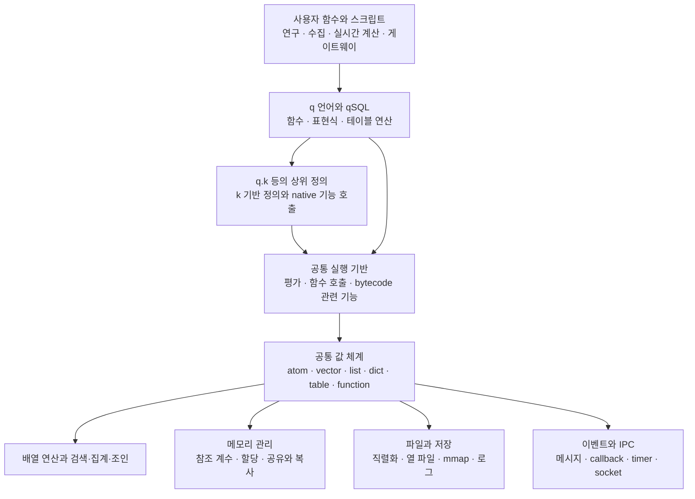
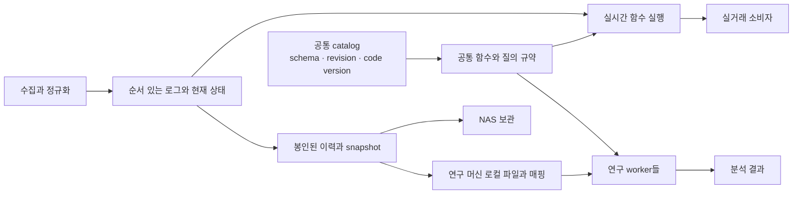

# kdb 코어 공개 자료 조사와 자체 범용 런타임 검토

작성·자료 확인: 2026-09-16. 대상은 주로 **classic kdb+/q**다. 다른 세대의 K, KDB-X, APL 구현은 구분해서 다룬다.

## 1. 먼저 내 판단

**“작고 빠른 공통 런타임을 만들고, 그 위에서 여러 역할의 프로세스를 조립한다”는 해석에 동의한다. 공개 자료에도 직접적인 근거가 있다.** q는 함수·배열·테이블을 다루는 실행 환경이며, 메시지 수신·파일 처리·타이머·질의·상태 변경을 같은 환경에서 프로그래밍한다. 공식 tick 소스는 이 기반으로 수집·배포·실시간 저장·복구 역할을 구성한다. [q 언어](https://code.kx.com/q/learn/startingkdb/language/), [공식 kdb-tick 소스](https://github.com/KxSystems/kdb-tick/tree/85c08ff192b0a103b323246c7300a37919be6159)

이 관점에서 우리가 만들려는 핵심은 다음과 같다.

> **데이터와 함수를 같은 값 체계로 다루고, 메모리·파일·프로세스 사이에서 그 체계를 유지하는 범용 배열 런타임.** 이를 여러 프로세스에 띄워 연구와 실거래 시스템을 구성한다.

이전 문서에서 강조한 저장 엔진 선택·공통 API·등록된 질의 함수만으로는 이 목표가 충분히 표현되지 않았다. 임의의 함수를 정의하고 조합하며, 새 역할을 스크립트로 만들 수 있어야 한다. 시장 데이터에 특화된 기능 목록으로 범용성을 제한하면 사용자가 원하는 방향에서 멀어진다.

다만 **이 구조가 적합하다는 판단과, 우리가 구현하면 곧바로 kdb 수준으로 빠르고 가벼워진다는 주장은 다르다.** 후자는 아직 증거가 없다. 배열 표현, 실행기, 메모리 관리, native 연산, 저장 형식, IPC가 함께 맞아야 한다. RAM이 많다는 사실만으로 언어 실행기의 자체 개발이 최선이라고 증명되지는 않는다.

내 추천은 **q에 가까운 값·함수·테이블 의미론을 가진 독립 런타임**이다. 초기 지원 범위는 줄이되 범용적인 조합 능력을 보존한다. q 전체 호환과 APL 전체 지원을 동시에 시작하지 않는다. 구체적인 범위와 반대 근거는 14~18절에 정리했다.

### 읽는 순서

- **실제 kdb 코어를 알고 싶다면:** 3~10절.
- **사용 경험과 성능의 한계를 보고 싶다면:** 11~12절.
- **공개 소스를 직접 읽고 싶다면:** 13절.
- **우리 런타임·q/APL·하드웨어에 대한 판단:** 14~18절.

## 2. 조사 범위와 증거의 수준

공식 언어·C API·메모리·저장·IPC 문서, release notes, 공식 공개 스크립트와 클라이언트 코드, 작성자가 직접 측정하거나 운영한 기술 문서, 별도 배열 언어의 구현 자료를 조사했다. 단순 제품 순위와 출처 없는 성능 수치는 근거에서 제외했다.

본문의 표현은 다음 수준을 구분한다.

| 구분 | 의미 |
|---|---|
| **공식 동작** | 공식 문서가 설명하는 인터페이스·의미·제약. 전체 내부 소스를 뜻하지 않는다. |
| **공개 코드** | 실제 읽을 수 있는 공식 스크립트·헤더·클라이언트 구현. 해당 저장소와 버전에 한정한다. |
| **사용자 관측** | 작성자의 실험·운영 경험. 환경과 버전이 다르면 결과도 달라질 수 있다. |
| **설계 판단** | 위 근거에서 도출한 우리 시스템에 대한 제안. kdb가 실제로 그렇게 구현됐다는 주장이 아니다. |
| **미확인** | 공개 조사만으로 확정하지 못한 영역. 구현 세부 사항을 추측으로 채우지 않는다. |

“공개 정보 전체를 빠짐없이 확보했다”는 뜻은 아니다. **핵심 계층을 설명할 자료는 상당히 있지만, 전체 q/kdb 엔진 소스와 완전한 VM 명세를 확보한 것은 아니다.** 이번에 배포 바이너리를 설치하거나 벤치마크를 재실행하지 않았다. 사용기 수치는 원저자의 측정이다.

특히 2012~2014년 백서, 3.x/4.0 문서, 4.1t 변경, 최근 KDB-X 설명을 하나의 동시점 구현처럼 섞지 않았다. 날짜가 표시되지 않은 문서는 게시일을 추정하지 않았다.

## 3. 공개 자료로 재구성한 코어의 전체 모습

아래는 이해를 위한 **개념 구조**다. 실제 엔진의 소스 디렉터리나 호출 순서를 복원한 그림은 아니다.

공식 문서는 q의 많은 정의가 k로 작성된 `q.k`에 있고 일부는 C native 기능이라고 설명한다. 따라서 **하위 실행 기반과 그 위에 작성한 기능을 결합하는 구조**는 확인된다. 다만 k4의 모든 문법·동작은 외부용으로 문서화되어 있지 않으며, 버전 사이의 내부 변경도 공개 계약이 아니다. [Parse trees: k4, q and q.k](https://code.kx.com/q/basics/parsetrees/#k4-q-and-qk), [Exposed infrastructure](https://code.kx.com/q/basics/exposed-infrastructure/)

**q.k가 있다고 코어가 따라오는 것은 아니다.** 그 파일을 실행할 평가기, 값 모델, native primitive, 메모리·파일·IPC 기능이 먼저 필요하다. 반대로 모든 기능을 C/Rust로 직접 구현해야 한다는 뜻도 아니다. 빠른 primitive와 언어 자체로 작성한 라이브러리 사이에 경계를 둘 수 있다.

## 4. 값과 메모리 표현: 테이블도 언어의 값이다

### 4.1 공개 C 인터페이스에서 무엇이 보이나

공식 C API의 `K` 객체와 `k.h`에서 **타입 태그, 속성, 참조 계수, 값 또는 배열 길이·데이터**를 담는 구조가 드러난다. 단일 타입 벡터는 같은 타입의 연속 데이터이며, 일반 리스트는 다른 `K` 값들을 참조한다. 이는 행마다 복잡한 객체를 만드는 구조와 다른 출발점이다. 공개 ABI는 내부 구현의 일부를 보여 주지만 모든 최적화용 구조를 설명하지는 않는다. [C API](https://code.kx.com/q/interfaces/c-client-for-q/), [공식 k.h](https://github.com/KxSystems/kdb/blob/master/c/c/k.h)

| 값 | 공개 모델에서 확인되는 특징 | 구현할 때 중요한 점 |
|---|---|---|
| Atom | 정수·실수·시간·symbol 등의 단일 값 | 타입별 폭과 null·무한대 표현 |
| Typed vector | 같은 타입의 연속 배열 | 원소마다 동적 타입 검사 없이 처리할 여지 |
| General list | 서로 다른 타입의 값을 담을 수 있음 | 객체 참조와 간접 접근 비용 |
| Dictionary | key와 value를 연결 | key 타입·검색·순서 의미 |
| Table | 열 이름과 열 데이터의 관계를 갖는 언어 값 | 열 단위 접근·반환 타입·schema |
| Keyed table | key 테이블과 value 테이블의 관계 | 일반 테이블과 연산 결과가 다를 수 있음 |
| Function | 함수 자체가 저장·전달 가능한 값 | 적용·부분 적용·조합·오류 처리 |

이 타입 구분은 공개 타입 번호에도 나타난다. 예를 들어 table은 98, dictionary/keyed table은 99, lambda는 100으로 설명된다. 번호를 그대로 복제하는 것보다 **각 값의 연산 규칙이 일관되는 것**이 더 중요하다. [q 자료형](https://code.kx.com/q/basics/datatypes/)

### 4.2 우리 데이터와 바로 맞지 않는 부분

q의 `long`은 8바이트지만 일부 값을 null·무한대에 사용한다. “모든 Int64 값 + 별도 유효성 비트맵” 모델과 같지 않다. q timestamp는 **2000-01-01 기준 나노초**이며 Unix epoch와 다르다. 가격의 ×10⁸, OI의 ×10⁴ 같은 scale은 정수 타입 자체가 해결하지 않는다. [q 자료형](https://code.kx.com/q/basics/datatypes/), [시간 자료형](https://code.kx.com/q4m3/2_Basic_Data_Types_Atoms/)

따라서 q 호환을 목표로 할 때도 원천 데이터의 정밀도와 결측 의미를 먼저 보존해야 한다. 내부 포맷과 q 의미론이 다르면 변환 규칙을 명시한다. Arrow 버퍼를 연결했다고 epoch·null·enum·scale까지 일치하는 것은 아니다.

### 4.3 함수가 값이라는 것의 실제 의미

q에서는 함수를 변수에 담고 다른 함수에 전달하며 부분 적용과 조합을 수행한다. 리스트·사전·테이블의 적용과 함수 적용도 같은 언어 체계 안에 있다. projection은 생성 시 함수 정의와 채운 인수를 고정하지만 전체 전역 상태를 동결하는 snapshot은 아니다. [함수](https://code.kx.com/q4m3/6_Functions/), [Application](https://code.kx.com/q/basics/application/)

우리 런타임도 새 통계·파일 변환·이벤트 처리기를 **코어 재컴파일 없이 함수로 작성**할 수 있어야 한다. 이것이 다재다능함을 판별하는 첫 기준이다.

## 5. 평가기·bytecode·qSQL: 어디까지 공개되어 있나

### 5.1 bytecode는 실제로 문서화되어 있다

lambda에 `value`를 적용했을 때 bytecode, 인수·지역/전역 정보, 상수, 소스 위치 대응 등이 노출된다고 공식 문서에 나와 있다. 설명하는 구조는 V3.5 기준이고 변경 가능하다고 명시한다. 디버깅 문서도 bytecode compiler 오류를 다룬다. **“q는 매번 AST만 순회하는 순수 tree interpreter”라고 단정하면 틀린다.** [value: Lambda](https://code.kx.com/q/ref/value/#lambda), [Debugging](https://code.kx.com/q/basics/debug/)

여기서 알 수 없는 것도 있다. 완전한 opcode 명세, 실행 루프의 dispatch 방식, stack/register VM 구분, 모든 버전의 JIT 존재와 적용 범위는 이 자료만으로 확정하지 못했다. **bytecode가 있다는 사실을 특정 VM 구현을 안다는 말로 확대하지 않는다.**

### 5.2 질의가 언어와 연결되어 있다

`parse`는 표현식을 함수와 인수의 구조로 드러내며 `eval`은 이를 실행한다. qSQL의 `select/exec/update/delete`는 functional qSQL 형태와 연결된다. 필터 순서, grouping, 선택한 식, 반환되는 vector/dictionary/table/keyed table까지 언어의 의미에 포함된다. [Parse trees](https://code.kx.com/q/basics/parsetrees/), [Functional qSQL](https://code.kx.com/q/basics/funsql/)

따라서 “질의 언어도 만들어야 하는가”에 대한 답은 **기존 q를 실행하지 않고 우리 런타임을 만든다면 평가와 질의 실행 기능을 구현해야 한다**이다. 새 문법을 발명할 필요는 없다. q 문법을 목표로 삼을 수 있지만 그 아래의 실행 의미는 우리가 책임져야 한다.

추천은 q 식, 함수 호출 API, 프로그램이 만든 functional query가 **같은 값·연산 체계로 내려가게 하는 것**이다. HTTP 조회만 별도 SQL로 번역하고 실시간 함수는 다른 규칙을 쓰는 식으로 갈라지면 공통 런타임의 이점이 줄어든다. 이것은 우리 설계 제안이지 kdb의 내부 IR을 복원했다는 주장이 아니다.

### 5.3 질의 최적화도 사용 방식에 영향을 받는다

공식 최적화 백서는 partition 조건·필터 순서·사전 계산·속성·분할 집계를 조정하는 사례를 보여 준다. 잘못 구성한 질의는 불필요하게 전체 데이터를 읽을 수 있다. 이 백서의 실측 버전은 **2.8, 2012-05-29**다. 현재 성능 수치로 재사용할 수는 없지만, 저장 배치와 질의를 함께 설계해야 한다는 실제 사례다. [Columnar database and query optimization](https://code.kx.com/q/wp/columnar-database/)

우리는 임의의 q 식 전체를 자동으로 최적화하는 것부터 시작할 필요가 없다. 우선 평가 순서와 결과를 맞추고, 순수한 배열 연산에서만 임시 배열 제거·연산 결합을 단계적으로 적용하는 편이 낫다. 상태 변경이나 오류 순서를 바꾸는 최적화는 별도 검증이 필요하다.

## 6. 메모리 관리: 참조 계수·공유·allocator가 한 묶음이다

### 6.1 사용 종료, heap 재사용, OS 반환은 다르다

q의 공식 설명에는 thread-local heap, 참조 계수, 크기 등급에 따른 할당, deferred/immediate GC 모드가 나온다. 값이 더 이상 필요하지 않아도 메모리가 프로세스 heap에 남아 재사용될 수 있다. `-g 1`도 모든 작은 객체를 즉시 OS로 돌려주는 설정은 아니다. [GC 모드](https://code.kx.com/q/basics/syscmds/#g-garbage-collection-mode)

`.Q.w`는 used·heap·peak·mmap·symbol 관련 지표를 구분하고, `.Q.gc` 문서는 단편화와 반환 정책을 설명한다. Linux의 RSS 관련 동작과 버전별 옵션도 따로 적혀 있다. **메모리 논리 사용량, 예약·할당량, 실제 상주 페이지를 같은 숫자로 취급하면 안 된다.** [메모리 진단과 GC](https://code.kx.com/q/ref/dotq/)

### 6.2 공유하면 언제 복사가 생기나

Data Intellect의 재현 예제는 참조 계수와 copy-on-write를 설명한다. 기존 열을 함께 참조하는 동안에는 복사를 줄일 수 있지만, 공유된 값을 변경할 때 분리가 필요할 수 있다. allocator가 2의 거듭제곱 크기 블록을 사용하는 사례도 보여 준다. **공유 구조를 사용한다는 사실만으로 update·join·sort·필터 결과까지 복사 없이 처리되지는 않는다.** [Jonny Press의 메모리 분석](https://dataintellect.com/blog/kdb-is-memory-hungry-right/)

우리 설계에서는 다음을 분리해야 한다.

1. 프로세스 내부의 불변 버퍼 공유와 필요 시 복사.
2. 프로세스 사이의 읽기 전용 파일 페이지 공유.
3. 명시적 shared memory의 게시·수명·회수.
4. 계산 중 생성되는 선택 인덱스·정렬 인덱스·hash table·결과 버퍼.

특히 **q 객체 내부 참조 계수를 그대로 여러 프로세스의 공유 포인터 규약으로 사용할 수는 없다.** 프로세스 주소, allocator 소유권, 객체 수명은 별도 문제다. 공용 데이터는 offset/length와 버전이 있는 표현을 갖는 편이 맞다. 이는 자체 구현 제안이다.

### 6.3 symbol과 enum 사전을 구분해야 한다

반복 문자열을 symbol로 다루면 비교·저장이 유리하지만, 고유 문자열을 계속 symbol로 만들면 사전이 커진다. 공식 PyKX 문서도 q의 unique symbol은 생성 후 해제되지 않는다고 설명한다. 주문 ID·요청 ID·임의 경로를 무조건 symbol로 만들지 말아야 할 이유다. [공식 symbol 메모리 설명](https://code.kx.com/pykx/3.1/user-guide/fundamentals/text.html)

**프로세스 안의 interned symbol과 디스크의 enum domain/`sym` 파일은 같은 물건이 아니다.** 디스크 정수 코드의 의미는 해당 사전에 의존한다. 사전을 잘못 교체하면 같은 정수가 다른 문자열을 뜻할 수 있다. 정비에는 값을 다시 해석하고 재열거하는 절차가 필요하다. [Working with sym files](https://code.kx.com/q/wp/symfiles/)

## 7. 저장 코어: 열 파일·partition·속성·mmap

### 7.1 디스크 테이블의 구조

Splayed table은 열마다 별도 파일을 두고 `.d`가 열 목록·순서를 담는다. symbol 열의 enumeration과 일부 중첩 열의 별도 표현도 문서화되어 있다. Partitioned table은 이를 날짜·월·연도·정수 등의 분할 단위로 나눈다. [Splayed tables](https://code.kx.com/q/kb/splayed-tables/), [Partitioned tables](https://code.kx.com/q/kb/partition/)

이 구조가 주는 이점은 필요한 열과 기간만 접근할 수 있다는 것이다. 반면 전체 instrument·전체 기간·다수 열을 요구하면 그만큼 읽어야 한다. **열 저장이 전량 분석의 데이터 크기 자체를 없애지는 않는다.**

### 7.2 속성은 데이터 배치와 검색 방법을 연결한다

| 속성 | 의미와 용도 | 주의점 |
|---|---|---|
| `s` sorted | 정렬되어 있음을 표시해 검색에 활용 | 정렬 기준과 유지 조건 필요 |
| `p` parted | 같은 값들이 연속 구간에 모여 있음 | 전체 값이 크기순으로 정렬됐다는 뜻은 아님 |
| `u` unique | 값의 유일성을 활용 | 유일성 조건과 부가 구조 비용 고려 |
| `g` grouped | 같은 값의 위치를 찾는 구조 활용 | 메모리·갱신 비용과 저장 매체에 따른 효과 고려 |

이들은 단순한 schema 장식이 아니다. 공식 자료는 속성별 검색·메모리 trade-off를 설명한다. as-of join도 검색 열 순서와 symbol별 시간 정렬, 메모리/디스크에서 적절한 속성의 차이를 명시한다. 모든 조인을 같은 hash join 하나로 처리하는 설계와는 다르다. [Data management](https://code.kx.com/q/wp/data-management/), [aj의 조건과 성능](https://code.kx.com/q/ref/aj/)

### 7.3 mmap이 해주는 것과 해주지 않는 것

kdb의 파일 접근에는 memory mapping이 포함된다. 매핑은 파일을 주소 공간으로 연결하는 것이며, 모든 페이지를 즉시 RAM에 올렸다는 뜻은 아니다. 페이지가 없으면 디스크 접근이 필요하다. 이후 연산이 결과를 만들거나 타입을 바꾸면 별도 메모리가 필요할 수 있다. [파일 연산](https://code.kx.com/q/basics/files/), [Q for Mortals: I/O](https://code.kx.com/q4m3/11_IO/)

압축 파일에서는 압축된 블록과 계산에 쓰는 풀린 데이터가 다르다. KX의 압축 백서는 cold read의 I/O 절감과 warm read의 반복 해제 비용을 함께 측정한다. 해당 실험은 **3.1, 2013-09-05, Linux·SAN 환경**이다. 당시 설명을 현재 모든 OS의 캐시 정책으로 일반화하지 않는다. [Compression benchmark](https://code.kx.com/q/wp/compress/)

우리에게 중요한 결론은 **NAS → 로컬 디스크 준비 → 매핑/선별 상주 → 반복 계산**을 분리하는 것이다. NAS 파일을 직접 mmap한다고 최초 네트워크 전송이 사라지지는 않는다. 압축 보관본과 반복 계산용 표현을 달리 두는 선택도 유지해야 한다.

### 7.4 파일 호환과 메모리 호환은 별도다

공개 파일 구조 설명과 IPC 예제가 있다고 모든 kdb 디스크 포맷을 완전하게 구현한 것은 아니다. 중첩 열, enum, 압축, 속성, 버전 변화까지 확인해야 한다. 우리 시스템에 기존 kdb 파일 자산이 없다면 **q 언어 호환과 별개로 자체 versioned column format을 먼저 채택**할 수 있다. 원본 Arrow/Parquet 등의 입력 경로도 따로 유지할 수 있다.

## 8. IPC와 이벤트 루프: 비동기가 언어 사용법에 들어간다

### 8.1 함수 호출과 메시지가 연결된다

q IPC는 문자열뿐 아니라 함수/함수 이름과 인수로 이루어진 값을 보낼 수 있다. sync 요청, async 메시지, 응답을 구분한다. async 송신은 큐에 들어갈 수 있으며, 발신 함수의 반환이 원격 실행 완료를 뜻하지 않는다. 같은 연결의 후속 sync 요청으로 앞선 async 처리의 완료를 확인하는 방식이 문서화되어 있다. [IPC](https://code.kx.com/q/basics/ipc/)

직렬화 예제에는 endian, 메시지 종류, 길이, 타입, 속성, payload가 보인다. 공식 Java 클라이언트에서는 실제 인코딩·디코딩·소켓 처리를 읽을 수 있다. **q의 일반적인 IPC는 프로세스 포인터를 직접 공유하는 방식이 아니다.** [Serialization examples](https://code.kx.com/q/kb/serialization/), [공식 Java IPC 구현](https://github.com/KxSystems/javakdb/blob/master/javakdb/src/main/java/com/kx/c.java)

### 8.2 이벤트를 함수로 바꿔 끼울 수 있다

`.z.pg`는 sync 요청, `.z.ps`는 async 요청을 처리한다. 연결·타이머·HTTP·WebSocket 등에 대한 callback도 문서화되어 있다. 프로세스의 역할을 바꾸는 데 필요한 표면이 함수로 노출되는 셈이다. [환경과 callback](https://code.kx.com/q/ref/dotz/)

이것이 “같은 런타임을 띄워 서로 다른 역할을 한다”는 아이디어의 실제 기반이다. 데이터 수집기, 계산 서버, 질의 gateway, 파일 변환기를 각각 새 언어로 구현할 필요가 줄어든다.

### 8.3 async 호출과 작업 관리 시스템은 구분한다

공식 문서는 비동기 결과 callback을 함수와 메시지로 구성하는 방법을 별도로 제시한다. sync 응답을 나중에 돌려주는 deferred response도 **V3.6, 2018-05-16부터** 지원된다. 따라서 오래된 gateway 백서만 보고 sync client가 항상 gateway를 직렬로 막는다고 단정하면 안 된다. [Async callbacks](https://code.kx.com/q/kb/callbacks/), [Deferred response](https://code.kx.com/q/kb/deferred-response/), [3.6 변경](https://code.kx.com/q/releases/ChangesIn3.6/)

우리는 다음을 명시적으로 설계해야 한다.

- 요청 수락, 큐 적재, 전송, 실행, 결과 게시의 상태.
- request ID, timeout, 취소 가능 지점, 결과 보관, 실패·재시도 규칙.
- 소비자가 느릴 때의 큐 상한과 backpressure.
- 상태 변경 액션의 중복 실행 방지와 완료 확인.
- 연결별 순서와 여러 생산자 사이의 순서 규칙.

이는 기본 메시지 primitive 위에 얹을 공통 라이브러리다. **비동기 API를 만들었다고 긴 계산이 이벤트 루프를 막지 않는 것은 아니다.** 실행 worker를 분리하거나 계산이 제어권을 반환하는 지점을 정해야 한다.

UDP는 이 중 하나의 transport 후보일 뿐이다. q형 모델을 따른다고 UDP가 필수인 것은 아니며, UDP를 쓰면 손실·순서·재전송·재접속 이후 이어받기를 별도로 정해야 한다. 같은 머신의 대량 불변 데이터에는 매핑을, 제어 메시지에는 신뢰할 수 있는 IPC를 사용하는 식의 조합이 가능하다.

## 9. 멀티프로세스와 멀티스레드: 둘 다 있다

q의 상태·이벤트를 다루는 기본 실행 흐름과 병렬 배열 계산은 구분해야 한다. 공식 `peach` 문서는 secondary thread의 전역변수 변경 제한, 소켓 사용 제약, thread별 heap, 프로세스 기반 병렬 실행을 설명한다. **4.1t, 2024-01-04부터** 동적 작업 재분배와 중첩 병렬 실행 관련 변화도 명시한다. [Parallel processing](https://code.kx.com/q/basics/peach/)

4.0에는 primitive 내부의 암묵적 병렬 실행 설명이 있다. 그 문서의 single-level 제한이나 NUMA 비인지 설명은 당시 문맥으로 읽어야 한다. 특히 중첩 제한은 이후 변경과 함께 봐야 한다. “q는 단일 스레드라 한 코어만 쓴다”, “최근 q는 모든 연산이 자동으로 전체 코어에 분산된다”는 설명은 모두 부정확하다. [Multithreaded primitives](https://code.kx.com/q/kb/mt-primitives/)

우리에게 맞는 출발점은 다음과 같다.

| 계층 | 추천 실행 모델 | 이유 |
|---|---|---|
| 실시간 상태 owner | 상태를 소유하는 프로세스와 순서 있는 이벤트 처리 | 업데이트 순서·복구 지점 설명이 쉬움 |
| 긴 연구 계산 | 별도 worker 프로세스 | 실거래 callback과 장애·메모리 예산 분리 |
| 큰 벡터 kernel | 제한된 worker thread 또는 프로세스 | 데이터 크기·메모리 대역폭에 맞춰 병렬화 |
| 공통 이력 | 읽기 전용 파일 매핑과 버전 고정 | 프로세스마다 원본 전체를 다시 보유할 필요 감소 |

이 표는 우리 설계 판단이다. 프로세스 수와 thread 수를 모두 최대치로 키우면 실행 가능한 작업보다 메모리 트래픽과 임시 결과가 먼저 폭증할 수 있다.

## 10. 공개 tick 소스로 보는 아키텍처 조립

공식 `kdb-tick`의 조사 기준 commit은 `85c08ff192b0a103b323246c7300a37919be6159`이다. 짧은 코드가 어떤 기반 기능을 이용하는지 확인하는 데 가치가 크다.

| 파일 | 담당하는 내용 | 런타임에 이미 있어야 하는 기능 |
|---|---|---|
| [tick.q](https://github.com/KxSystems/kdb-tick/blob/85c08ff192b0a103b323246c7300a37919be6159/tick.q) | update 수신, 로그, 배포, timer, 날짜 전환 | 함수·테이블·파일·IPC·callback |
| [tick/u.q](https://github.com/KxSystems/kdb-tick/blob/85c08ff192b0a103b323246c7300a37919be6159/tick/u.q) | 구독 상태, symbol 선택, async 배포, 연결 종료 처리 | dict/list 연산·필터·메시지 송신 |
| [tick/r.q](https://github.com/KxSystems/kdb-tick/blob/85c08ff192b0a103b323246c7300a37919be6159/tick/r.q) | schema 준비, update 삽입, 로그 재생, 이력 전환 | 동적 함수 연결·저장·복구 |

기본적인 흐름은 feed → tickerplant → RDB/실시간 계산이며, 이력을 저장한 HDB와 gateway를 함께 구성한다. RDB 복구는 TP가 알려준 로그 위치·진행 정보를 사용한다. 기본 예제에는 공유 파일 접근 등의 운영 전제가 있다. 스크립트가 짧다고 이 전제까지 사라지는 것은 아니다. [Tickerplant 설명](https://code.kx.com/q/architecture/tickq/), [RDB 설명](https://code.kx.com/q/architecture/rq/)

로그 재생 primitive인 `-11!`는 저장된 메시지를 읽어 `.z.ps`에 넘기며, 유효한 로그 구간과 손상된 끝부분을 다루는 인터페이스도 공개한다. **메시지와 재생의 실행 경로를 연결하는 아이디어**를 직접 확인할 수 있다. 다만 로그를 썼다는 것과 전원 장애 후에도 확실히 남는다는 보장은 별개다. [Internal functions: streaming execute](https://code.kx.com/q/basics/internal/)

최근 공식 [architecture course](https://github.com/KxSystems/kdb-architecture-course/tree/48d6785fcaa2c00322b8d1214dbd0e2ab2b6636d)에도 feed/RDB/HDB/RTE/gateway를 공통 실행기와 역할별 스크립트로 구성하는 예제가 있다. 이쪽은 실제 프로세스 묶음을 이해하는 다음 읽기 자료로 적합하다.

**핵심은 tick.q의 줄 수가 아니다.** 그 정도 코드로 상태·질의·저장·복구·배포를 조합할 수 있게 하는 primitive의 완성도가 핵심이다. 우리도 새로운 역할을 추가할 때마다 코어를 고쳐야 한다면 이 목표를 아직 달성하지 못한 것이다.

## 11. 빠르고 가벼운 이유를 무엇으로 설명할 수 있나

| 근거가 있는 요소 | 실제 효과 | 없어지지 않는 비용 |
|---|---|---|
| 같은 타입의 연속 배열 | 반복적인 타입 검사·간접 접근을 줄일 수 있음 | DRAM 대역폭과 cache miss |
| 큰 배열 단위 primitive | 함수 호출 비용을 여러 원소에 나눔 | 임시 배열·여러 번의 scan |
| 열·기간 단위 접근 | 필요한 데이터만 읽을 수 있음 | 전량 분석의 실제 바이트 수 |
| 정렬·속성·시간 조인 | 검색에 맞는 구조를 활용 | 정렬·속성 생성·유지 비용 |
| 공통 값과 함수 체계 | 언어/DB/서비스 사이 변환 단계를 줄임 | 다른 표현·다른 프로세스 경계의 변환 |
| 참조 공유와 copy-on-write | 불필요한 즉시 복사를 줄임 | 수정 시 분리·단편화·peak memory |
| mmap과 OS 캐시 | 준비된 파일 페이지를 재사용 | cold read·page fault·해제·결과 할당 |
| 작은 프로세스의 조합 | 역할별 상태와 장애를 분리 | IPC 직렬화·큐·프로세스별 작업 메모리 |

이는 앞 절의 공식 자료와 아래 사용 경험을 합친 설명이다. **“몇 줄의 C라서 빠르다”, “q 문법이라 빠르다”, “mmap이라 모든 것이 zero-copy다”만으로는 설명이 되지 않는다.**

또한 배열 전체를 처리하는 vectorization과 CPU SIMD 명령 사용은 같은 말이 아니다. 전자는 언어·알고리즘 수준의 처리 단위이고 후자는 kernel 구현 기법이다. 이번 조사로 모든 kdb primitive의 SIMD 코드 경로나 모든 표현식의 fusion을 확인한 것은 아니다.

## 12. 실제 사용 경험과 공개 실측 6개

아래는 작성자가 코드·환경·직접 관찰을 제시한 자료다. **모든 수치는 이번에 재측정하지 않았다.** KX 백서의 게시 월은 [공식 백서 목록](https://code.kx.com/q/wp/)과 구분해 확인했다.

| 자료·작성자·게시 시점 | 직접 확인한 내용 | 우리에게 주는 판단과 한계 |
|---|---|---|
| [kdb+ is Memory Hungry, Right?](https://dataintellect.com/blog/kdb-is-memory-hungry-right/) — Jonny Press, Data Intellect, 2024-04-11 | 8바이트 값 40,000개의 payload는 약 313KiB지만 예제의 할당 블록은 512KiB. 참조 공유·copy-on-write·작은 블록의 단편화를 설명 | 760GB를 원본 데이터로 모두 채우는 계획은 위험하다. heap·RSS·scratch를 따로 측정해야 한다. 고객 검토 경험과 예제이며 보편적인 GC 지연 수치는 아님 |
| [Code profiler](https://code.kx.com/q/kb/profiler/) — KX, 게시일 미표시 | 1,000만 회 Monte Carlo 예제에서 scalar 계산 약 12초, 배열 단위 계산 약 400ms. `each`로 바꾸는 것만으로는 개선이 작았음 | 함수 호출·할당 단위를 바꾸는 것이 중요하다. kdb 4.0·노트북의 특정 실험이며 모든 계산이 30배 빨라진다는 뜻은 아님. profiler 자체도 초기 범위에 필요 |
| [kdb+tick profiling](https://code.kx.com/q/wp/tick-profiling/) — Ian Kilpatrick, 2014-03 | 10,000행/초에서 메시지당 1→10행 배치 시 TP CPU 31%→6%, RDB 12%→2%. fan-out과 flush 시점이 구독자 지연에도 영향 | 작은 IPC가 병목일 수 있다. 배치가 추가하는 대기와 로그 시점도 함께 봐야 한다. kdb 3.1·2014-02-08 빌드, localhost·CPU affinity 환경 |
| [Who needs an rdb?](https://dataintellect.com/blog/who-needs-an-rdb/) — Matt Doherty, Data Intellect, 2026-04-27 | 약 5,000만 거래·10GB·32GB RAM/NVMe 비교. 측정상 in-memory가 가장 빨랐지만 일부 큰 결과/무속성 질의는 warm HDB와 대략 0~20% 차이. 속성 활용 작은 lookup은 격차가 컸음 | mmap+warm cache를 반드시 비교할 근거다. RDB 폐기 결론이 아니다. 단일 일자·제한된 질의이며 본문에서 사용 바이너리 버전은 확인되지 않음 |
| [Working with sym files](https://code.kx.com/q/wp/symfiles/) — Paula Clarke, 2019-03 | 글로벌 tick 시스템 경험으로 enum 사전 팽창과 재열거·정비 절차를 설명. 병렬 정비는 메모리가 늘고 속성 재적용이 필요할 수 있음 | 문자열 ID와 사전 수명도 운영 설계다. kdb 3.6·2018-05-17 빌드의 검증이며 예제별 domain 등 전제 존재 |
| [Signal processing and q](https://code.kx.com/q/wp/signal-processing/#python-fft-comparison) — Callum Biggs, 2018-08 | 실제 전력 데이터의 FFT·평활화·이상 탐지. 1,048,576점 FFT에서 순수 q 약 1.020초, 순수 Python 8.337초, embedPy를 통한 NumPy FFT 약 0.04644초 | 범용 활용의 실제 사례인 동시에 전문 native kernel을 연결할 이유다. kdb 3.5·2017-10-11, Windows 10·i7-7700·16GB. 알고리즘/라이브러리가 달라 언어 순위로 읽으면 안 됨 |

여기서 내가 얻은 결론은 **작은 런타임을 갖추는 가치와 잘 최적화된 kernel을 재사용하는 가치는 함께 성립한다**는 것이다. 자체 언어를 만든다는 이유로 FFT·압축·모든 선형대수까지 직접 작성할 필요는 없다. 중요한 것은 외부 kernel에 데이터를 넘길 때 정밀도·소유권·복사 비용을 통제할 수 있는가이다.

## 13. 직접 읽을 수 있는 공개 구현 지도

### 13.1 실제 kdb의 일부를 보여 주는 자료

| 읽을 대상 | 얻을 수 있는 정보 | 얻을 수 없는 정보 |
|---|---|---|
| [k.h](https://github.com/KxSystems/kdb/blob/master/c/c/k.h), [C API 문서](https://code.kx.com/q/interfaces/c-client-for-q/) | 공개 값 구조·타입·참조 소유권·확장 함수 경계 | 전체 evaluator·allocator·kernel 소스 |
| [q.k 관계 설명](https://code.kx.com/q/basics/parsetrees/#k4-q-and-qk) | q의 상위 정의와 k/native 기능의 관계 | q.k만으로 동작하는 독립 엔진 |
| [value/lambda](https://code.kx.com/q/ref/value/#lambda) | bytecode와 함수 메타데이터가 노출됨 | 안정된 완전한 VM ISA |
| [Serialization](https://code.kx.com/q/kb/serialization/), [javakdb](https://github.com/KxSystems/javakdb) | wire 표현과 실제 클라이언트 구현 | 모든 디스크 포맷·서버 평가기 |
| [kdb-tick](https://github.com/KxSystems/kdb-tick/tree/85c08ff192b0a103b323246c7300a37919be6159) | 로그·구독·실시간 저장·복구를 조립하는 스크립트 | 각 primitive의 native 내부 |
| [Architecture course](https://github.com/KxSystems/kdb-architecture-course/tree/48d6785fcaa2c00322b8d1214dbd0e2ab2b6636d) | 역할별 프로세스를 묶는 실행 예제 | 우리 인프라에서의 처리량·복구 보장 |
| [Data loaders](https://code.kx.com/q/wp/data-loaders/) | manager/worker, 메모리 기준 작업 배분, 열별 처리 등 실무 조립법 | 범용 자동 최적화 스케줄러 |

이번에 최신 공식 배포본의 `q.k` 파일 전체를 내려받아 분석하지는 않았다. 외부 저장소에 재게시된 파일도 현재 공식 버전이나 완전한 엔진 소스로 취급하지 않았다. 공식 헤더·클라이언트의 기본 브랜치 링크는 변경될 수 있으므로 구현 단계에서는 commit을 고정해야 한다.

### 13.2 실제 kdb 코어와 구별해서 볼 배열 언어 구현

- **[Kona](https://github.com/kevinlawler/kona):** 프로젝트가 명시하는 대상은 K3 재구현이다. 값·평가·배열 처리 구현을 읽을 수 있지만 현재 k4/q의 내부를 증명하지 않는다.
- **[BQN 구현 문서](https://mlochbaum.github.io/BQN/implementation/index.html), [VM 설명](https://mlochbaum.github.io/BQN/implementation/vm.html):** compiler·VM·primitive runtime의 분리와 self-hosting을 연구할 자료다. closure와 참조 수명 등 작은 실행기에도 필요한 문제가 드러난다. q 호환 엔진이 아니다.
- **[GNU APL manual](https://www.gnu.org/software/apl/apl.html):** APL 실행기와 `libapl` 경로를 검토할 수 있다. 평가기를 재사용하는 선택의 참고이지 qSQL·q IPC가 따라오는 것은 아니다.

이 자료들은 “작은 배열 실행기를 실제로 어떻게 구성하는가”를 공부하는 데 유용하다. **비슷한 언어의 소스를 읽고 kdb 내부도 똑같다고 추정하지 않는 것**이 중요하다.

### 13.3 “몇백 줄의 K” 이야기의 원출처도 확인했다

Stephen Taylor의 [Impending kOS](https://vector.org.uk/impending-kos/)(2014-09-01)는 Arthur Whitney의 시연을 직접 본 기록이다. 현재 원문에 나오는 **C 247줄·소스 파일 5개**는 2011년의 *research K interpreter*에 관한 설명이다. 현재 kdb/q 전체 소스 규모가 아니다. 당시 interpreter 크기에 관한 다른 수치도 빌드·플랫폼·측정 범위가 충분히 제시되어 있지 않아 우리 runtime의 목표 크기로 사용하지 않는다.

이 글의 “작은 코어를 만들고 나머지를 그 언어로 구현했다”는 직접 경험은 1980년대 SHARP APL 이식 작업이다. kdb도 같은 방식이라는 문장은 저자의 추정이다. **현재 q/k 관계를 뒷받침하는 근거는 3절의 공식 문서**이고, 이 회고는 설계 사상의 역사적 사례로 읽는다.

oK 구현자 John Earnest의 [ArrayCast 인터뷰](https://www.arraycast.com/2022/11/26/John-Earnest-and-Versions-of-k.html)(2022-11-26)에는 자신의 구현이 약 1,000줄 JavaScript라는 설명과, oK가 느린 편이라는 설명이 함께 나온다. oK/ngn-k는 대체로 K6 계열을 목표로 한다고 말한다. 언어 의미를 처음에 잘못 이해해 구현을 불필요하게 복잡하게 만들었다는 회고도 있다.

두 자료가 뒷받침하는 것은 **작고 이해 가능한 배열 실행기를 만들 수 있다는 가능성**이다. 현재 kdb와 같은 기능·성능·운영 완성도를 같은 규모로 얻는다는 증거는 아니다. 구현자·시연 참석자의 원문을 읽되, 역사적 구현과 현재 제품을 구분해야 한다.

## 14. q 그대로, q 독립 구현, APL의 차이

### 14.1 “q 그대로 사용”을 세 가지로 나눠야 한다

| 선택 | 확보하는 것 | 우리가 맡는 것 |
|---|---|---|
| 실제 q 실행기를 이용 | q의 기존 평가·타입·함수·저장/IPC 기능 | 우리 시스템의 프로세스 구성·운영 계약 |
| q 문법·의미론을 독립 구현 | q 프로그램과 비슷하게 작성하는 자체 런타임 | 평가·배열·함수·table·시간·오류·호환 검증 |
| q에서 아이디어를 가져온 새 언어 | 자유로운 내부 설계 | 언어 설계와 도구·사용법까지 새로 정착 |

사용자가 원하는 자체 런타임은 두 번째에 가장 가깝다. **q C client library나 `k.h`를 연결하는 것만으로 q evaluator가 생기지는 않는다.** 클라이언트 통신과 실제 엔진 실행은 다르다. [C API](https://code.kx.com/q/interfaces/c-client-for-q/)

호환성 목표도 나눈다.

1. **문법:** 기존 q 코드를 파싱하는가.
2. **의미론:** 타입·결과·null·오류·평가 순서가 같은가.
3. **실행 환경:** namespace·함수·callback·상태 변경이 같은가.
4. **Wire:** 실제 q 프로세스와 IPC 값을 주고받는가.
5. **저장:** 기존 kdb 파일과 enum/압축/속성을 읽고 쓰는가.
6. **Native 확장:** 기존 C ABI 확장을 그대로 붙일 수 있는가.

문법 호환만으로 나머지는 성립하지 않는다. “q 호환”이라고 한꺼번에 선언하지 말고 항목별 지원표와 검증 corpus를 가져야 한다. 처음에는 한정된 **q source-compatible subset**을 명시하고 미지원 기능을 분명하게 거부하는 방식이 현실적이다.

### 14.2 APL을 선택하면 무엇이 달라지나

APL은 단순히 q의 표기를 기호로 바꾼 언어가 아니다. Dyalog의 설명에는 rank·shape·depth·중첩 배열이 등장하고, 실행 설정은 인덱싱·비교·수 표현에 영향을 준다. 어떤 APL 방언을 채택할지 먼저 정해야 한다. [Dyalog arrays](https://docs.dyalog.com/20.0/programming-reference-guide/introduction/arrays/arrays/), [System functions and variables](https://docs.dyalog.com/20.0/language-reference-guide/system-functions/system-functions-by-category/)

APL 구현에 파일 매핑이나 병렬 실행 기능이 없다는 뜻은 아니다. Dyalog에는 `⎕MAP`과 isolates/futures 관련 자료가 있다. 다만 그런 기능의 존재와 **q의 table·timestamp·IPC·tick 복구 모델을 그대로 제공한다는 것**은 다르다. [⎕MAP](https://docs.dyalog.com/20.0/language-reference-guide/system-functions/map/), [Parallel Language Features](https://docs.dyalog.com/20.0/files/Parallel_Language_Features.pdf)

특히 **Dyalog 20.0의 `⎕DR` 목록에는 native Int64 정수 배열이 없다.** Int8/16/32와 다른 숫자 표현을 지원한다는 사실, 64비트 실행 파일이라는 사실을 혼동하면 안 된다. 우리 scaled Int64와 나노초 시각을 Float64로 넘기면 2⁵³ 이상의 정수를 모두 정확히 보존할 수 없다. decimal128 또는 별도 정수 표현·연산 경로의 검토가 필요하다. 이는 해당 구현·버전에 대한 제약이며 APL 전체의 공통 제약은 아니다. [Dyalog data representation](https://docs.dyalog.com/20.0/language-reference-guide/system-functions/data-representation-monadic/)

**추천:** kdb와 최대한 비슷한 프로그래밍 경험이 우선이면 q의 값·함수·table 모델을 기준으로 한다. 고차원 배열과 APL 생태계가 주목적이 될 때 APL 실행기 채택을 다시 비교한다. 처음부터 완전한 q와 완전한 APL을 한 실행기에 동시에 넣는 계획은 피한다.

## 15. 우리가 만들 코어와 스크립트의 경계

다음은 **자체 구현을 진행한다면 추천하는 범위**다. 현재 구현됐다는 뜻이 아니다.

| 영역 | 공통 런타임에 있어야 할 것 | 라이브러리·스크립트로 둘 것 |
|---|---|---|
| 값 | 정확한 정수·실수·시간·문자·symbol, vector/list/dict/table/function | 시장 schema·instrument 표기·scale 메타데이터 |
| 실행 | 함수 정의/호출·조합·부분 적용, namespace, 제어 흐름, 오류 | 피처·통계·전략 함수·일반 변환 프로그램 |
| 계산 | 벡터 산술·비교·선택·집계·정렬/검색의 기본 kernel | 파생 지표와 복합 알고리즘 |
| 질의 | table 조작·functional query 실행의 공통 의미 | dataset별 기본 조회·사용자 함수 |
| 메모리 | 소유권·공유 버퍼·해제·할당 진단 | 어떤 데이터를 오래 둘지에 대한 정책 |
| 파일 | versioned value/column 입출력·매핑·로그 primitive | partition·seal·보관·정정·snapshot 게시 정책 |
| 메시지 | 직렬화·연결·event loop·callback·timer | pub/sub·gateway·작업 lifecycle·라우팅 |
| 확장 | native kernel 호출과 버퍼 수명 계약 | FFT·압축·외부 포맷 adapter 등 선택 기능 |
| 관측 | 시간·할당·복사·큐·오류 위치 측정 | 역할별 대시보드·운영 규칙 |

**기능 수를 줄이는 것과 범용성을 제거하는 것은 다르다.** 처음 primitive가 적어도 함수·값·제어 흐름·입출력이 조합되면 일반 프로그램을 만들 수 있다. 반대로 고정된 피처 API만 많이 제공해도 사용자가 새 프로그램을 만들 수 없다면 이 목표와 거리가 있다.

native 코어의 구현 언어는 현재 프로젝트와의 연결을 고려하면 Rust를 우선 검토할 만하다. 이것은 속도 우위를 측정한 결론이 아니다. C ABI와 버퍼 레이아웃을 명확히 해 전문 kernel을 연결할 여지를 남기는 편이 좋다. q/K와 같은 초고밀도 소스 스타일을 복제할 이유는 없다. 실행 footprint와 소스 가독성은 별도로 평가한다.

## 16. 현재 하드웨어와 연구·실거래를 함께 놓고 보면

### 16.1 확인한 사실의 범위

내부 인프라 기록과 기존 공개 벤치마크에는 연구 워크스테이션의 dual Xeon 8173M, 56 physical/112 logical core, 약 760GB대 메모리가 기록되어 있다. 메모리는 기록마다 GB/GiB 표기가 달라 이번 용량 계획에서는 사용자가 제시한 **약 760GB**를 출발점으로만 삼는다. 새 하드웨어 inventory를 실행하지 않았다. [기존 NAS 변환 실측](https://github.com/sicarius01/codex-docs/blob/aadc7bf/quant-research/nas-arrow-conversion-benchmark-2026-09-16.md)

이 공개 실측에서 연구 워크스테이션의 NAS 접속은 1Gbps였고 네트워크 전송이 지배적인 구간이 있었다. 내부 기록에는 다른 머신의 SMB multichannel 실측도 있으므로 **모든 NAS 경로가 항상 1Gbps라고 일반화하지 않는다.** 현재 워크스테이션의 로컬 SSD/NVMe 여유 용량·실측 대역폭은 이번 조사에서 확인하지 않았다.

내부 설정상 이 연구 워크스테이션은 상시 가동 머신이 아니다. 따라서 현 상태에서는 연구 주력 역할에 적합하고, 실거래의 유일한 상태 owner 역할을 맡기려면 별도 운영 조건 변경이 필요하다. 내부 주소·접속 정보는 이 문서에 포함하지 않는다.

### 16.2 RAM이 크다는 장점과 한계

1,500 instruments × 90일 × 1초는 **116억 6,400만 행**이다. 이 밀도의 8바이트 열 하나만 93.312GB이고, 8개면 746.496GB다. 인덱스·결측·작업 결과·OS를 제외한 payload 계산이다. 실제 거래 틱은 균일한 1초 격자가 아니므로 별도 실측이 필요하다.

따라서 “몇 달 모든 데이터를 한 번에 다 올린다”보다 **활성 열/기간을 상주시킬 수 있고, 나머지도 로컬 파일에서 같은 함수로 읽을 수 있다**가 현실적인 목표다. 연구 runtime worker 수에 비례해 원본 전체를 복사하지 않는 것이 특히 중요하다.

dual socket에서는 동일 데이터를 공유하는 이점과 원격 NUMA 메모리 접근 비용이 함께 있다. 무조건 한 벌만 두는 방식, socket별 복제, partition별 owner를 실제로 비교해야 한다. 메모리 용량이 크다고 scan 대역폭이 무제한인 것은 아니다.

### 16.3 하나의 데이터 원천과 여러 실행 프로세스

권장 구성은 다음과 같다. 논리적 데이터 원천은 하나이며 물리적 데이터 사본과 실행 프로세스는 여러 개다.

공통 runtime은 실시간과 연구에서 같은 타입·함수 의미를 제공한다. live/replay 일치는 여기에 **이벤트 순서, 지연 데이터, 정정, 관측 시점, 코드 버전, RNG/시계 등 외부 상태**의 계약까지 더해야 확보된다. 같은 바이너리만으로 자동 보장되지 않는다.

HFT에 적용할 때도 과거의 재구성 호가·틱 피처와 실시간 피처가 동일한 계산 정의를 사용하도록 한다. 긴 기간의 대량 연구가 실거래 owner의 CPU·메모리·큐를 점유하지 않도록 별도 실행 예산을 둔다. 주문 경로 이전은 별도의 지연·정확성 검증 뒤 판단한다.

Shared memory와 mmap은 이 구조의 유력한 **데이터 이동 수단**이다. 값·함수·상태·복구를 묶는 runtime을 대체하지 않는다. 반대로 runtime을 만든다고 shared memory 설계를 피할 수 있는 것도 아니다.

## 17. 내가 진행한다면: 구현 순서와 통과 기준

### 단계 A — 언어 의미와 데이터 계약을 먼저 고정

- 지원할 q 표현·타입·함수·qSQL 범위를 목록으로 작성한다.
- null·overflow·scale·epoch·빈 배열·오류·평가 순서의 예제를 정한다.
- wire/파일/C ABI 호환은 각각 별도 목표로 표시한다.
- 현재/과거/replay에서 함수가 읽는 snapshot과 코드 버전을 지정한다.

**통과 기준:** 대표 프로그램의 결과와 오류를 실행 전 명확히 말할 수 있어야 한다. q 호환을 주장할 부분은 공식 예제와 가능한 기준 실행 결과로 대조할 계획이 있어야 한다.

### 단계 B — 범용 코어를 세 가지 프로그램으로 검증

같은 runtime 구현으로 다음을 모두 스크립트로 작성한다. Windows/Linux는 OS별 빌드이며, 하나의 실행 파일을 두 OS가 공유한다는 뜻은 아니다.

1. 여러 열의 필터·집계·시간 정렬을 하는 연구 프로그램.
2. 메시지를 받아 상태를 바꾸고 질의에 응답하는 프로세스.
3. 거래와 무관한 파일 변환 또는 신호 처리 프로그램.

**통과 기준:** 역할을 추가하면서 코어에 해당 업무의 전용 분기를 넣지 않는다. 함수 조합·오류 위치·메모리 진단이 실제로 유용해야 한다. 이 단계부터 primitive 처리량과 짧은 함수 호출 지연을 따로 측정한다.

### 단계 C — 큰 데이터와 공유를 검증

작은 데이터 → 단일 일자 → 모든 instrument의 수개월 순서로 늘린다. local mapped file, 필요한 열의 preload, 명시적 shared memory, NUMA 배치를 비교한다. NAS 첫 준비 시간과 반복 실행 시간은 분리한다.

**통과 기준:** worker 수 증가가 원본 전체의 동일 배수 메모리 증가로 이어지지 않아야 한다. 결과 materialization·scratch·peak RSS까지 예산 안에 들어야 한다. 매핑 종료·snapshot 교체·consumer 장애에도 살아 있는 buffer를 잘못 회수하면 안 된다.

프로세스별 RSS를 단순히 더하면 공유 매핑을 중복 계산할 수 있다. 공유·전용 상주 메모리와 시스템 전체 물리 메모리 사용량도 함께 측정해 실제 복제와 같은 페이지의 중복 집계를 구분한다.

### 단계 D — 비동기와 복구를 검증

질의 제출·결과 조회·구독·상태 액션을 같은 프로세스 모델로 구성한다. 느린 소비자·연결 단절·중복 메시지·worker 종료·로그 꼬리 손상·재시작을 다룬다.

**통과 기준:** 수락/완료/영속화 상태가 혼동되지 않고, 중복이나 누락이 드러나야 한다. live/replay 결과를 동일 입력과 고정 버전으로 대조한다. 외부 액션은 로그를 재생한다고 무조건 다시 실행하지 않는다.

### 단계 E — 최적화와 확장 범위를 증거로 결정

| 측정 축 | 포함할 지표 |
|---|---|
| 경량성 | 시작 시간, idle RSS, 실행 파일과 필수 의존성, 프로세스당 기본 비용 |
| 배열 실행 | 행/초뿐 아니라 읽고 쓴 bytes, 임시 할당, peak memory |
| 짧은 함수·상태 처리 | 호출 비용, p50/p99/p99.9 지연, 긴 질의 동시 실행 영향 |
| IPC | 메시지 크기·배치·fan-out·큐 길이·flush·원격 완료 지연 |
| 저장·상주 | cold/warm 구분, NAS 준비, local read, page fault, 실제 상주량 |
| 병렬성 | socket/thread/process 수별 처리량·메모리·실거래 간섭 |

비교 대상은 기존 Rust/Julia 경로와 앞서 검토한 실행 엔진들이다. 자체 runtime이 모든 연산에서 이길 필요는 없지만, 느린 부분이 무엇이며 native kernel로 보완 가능한지 설명할 수 있어야 한다. **성능을 확인하기 전에 코드 줄 수나 지원 문법 수로 성공을 선언하지 않는다.**

## 18. 동의하는 점, 반대하는 점, 남아 있는 미확인 사항

### 동의하는 점

**공통 경량 런타임이 아키텍처의 중심이라는 관점은 타당하다.** 공개 q/k 관계, 값과 함수의 통합, callback, tick 스크립트가 이를 뒷받침한다. 사용자가 원하는 것은 하나의 실행 모델로 분석·실시간 계산·서비스를 만드는 경험이며, 이 목표에는 runtime 중심 접근이 잘 맞는다.

### 반대하는 점

- **“하드웨어를 보니 자체 kdb가 이미 최선으로 증명됐다”에는 동의하지 않는다.** 대용량 RAM은 상주와 재사용에 유리한 조건이다. 실행기 자체 개발의 성능·유지보수 이점은 따로 검증해야 한다.
- **“작은 코어니까 구현도 작다”에는 동의하지 않는다.** 짧은 역할 스크립트는 깊게 구현된 primitive에 의존한다. 작은 배포물과 적은 개발 범위는 같은 것이 아니다.
- **“q를 쓰면 모든 계산이 빠르다”에는 동의하지 않는다.** 공개 FFT·profiler 사례처럼 알고리즘·벡터화·specialized kernel 차이가 크다.
- **“완전한 q와 APL을 함께 만들자”는 초기 계획에는 반대한다.** 값·함수 의미가 다른 두 체계를 동시에 맞추면 정작 공통 코어 검증이 늦어진다.

### 공개 조사로 아직 알 수 없는 것

| 미확인 영역 | 현재 말할 수 있는 범위 | 다음에 확인할 방법 |
|---|---|---|
| 전체 compiler/VM 구현 | bytecode·함수 메타데이터 노출은 공식 확인 | 공개 계약 기반 자체 설계, 호환 예제 검증 |
| 모든 native kernel 알고리즘·SIMD 경로 | 동작·일부 속성/병렬 조건은 문서화 | 우리 kernel별 구현·프로파일링 |
| 현재 전체 바이너리 크기·idle footprint | 과거 “작다”는 평판을 현재 수치로 사용할 수 없음 | 선정 빌드/OS에서 분리 측정 |
| 완전한 저장·ABI 호환 | 공식 구조와 주변 코드만으로 전체 범위 확정 불가 | 호환 범위 축소 또는 실제 fixture 검증 |
| 우리 하드웨어의 실효 memory bandwidth·NUMA 영향 | CPU·메모리 기록만 확인 | 승인된 후속 실측 |
| 자체 runtime의 개발량과 성능 도달점 | 현재 보장 가능한 일정·배율 없음 | 단계 B~D 결과로 재산정 |

**최종 제안은 “우리 목적에 맞는 q 지향 범용 런타임을 먼저 검증하고, 그 위에 연구·실거래 아키텍처를 조립하자”이다.** 초기 범위에서 가장 먼저 지켜야 할 것은 화려한 문법이나 kdb 파일의 완전한 복제가 아니라, **값·함수·메모리·메시지가 같은 모델로 이어지는 것**이다.

관련 선행 문서: [연구 I/O 검토](https://github.com/sicarius01/codex-docs/blob/main/data-service/research-io-review-2026-09-16.md), [저장/계산 대안과 통합 플랫폼 검토](https://github.com/sicarius01/codex-docs/blob/main/data-service/research-data-core-review-2026-09-16.md). 이번 문서는 별도 공개 자료 조사와 설계 판단이며 런타임 구현·배포 결과가 아니다.
