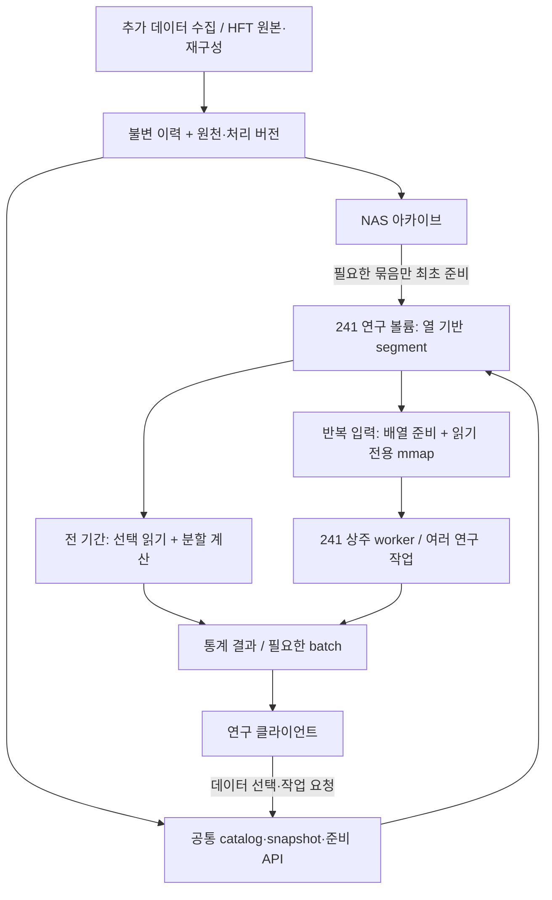

# 추가 데이터와 HFT를 위한 연구 데이터 코어 검토

작성: 2026-09-16 KST. 상태: **조사·설계 제안, 구현 미착수**.

대상은 약 **1,500 instruments × 수개월의 반복 통계**, 추가 데이터의 과거·현재 통합 조회, 기존 호가·틱에서 재구성한 HFT 데이터다. 연구 머신은 사용자가 제시한 **241, RAM 약 760GB**를 기준으로 한다. `loop`의 공유 메모리 구현, 현재 HFT 코드와 기존 실행 보고서, KX·Arrow·분석 엔진의 공식 문서를 검토했다.

이 문서는 [앞선 연구 I/O 검토](https://github.com/sicarius01/codex-docs/blob/main/data-service/research-io-review-2026-09-16.md)를 확장한다. 사용자 최종 지시에 따라 **kdb의 방식과 아이디어, 자체 구현 가능성**을 다룬다. 제품 도입 조건이나 가격은 비교하지 않는다. 241·NAS의 현재 성능을 새로 측정한 보고서는 아니다.

읽는 순서: **1절 결론 → 3절 용량 → 6절 kdb 아이디어 → 7절 자체 코어 → 10~11절 검증·작업 순서**. 현재 HFT의 구체적인 문제는 2절과 9절에 정리했다.

## 1. 추천 결론

**kdb식 구조를 참고한 공통 연구 데이터 코어를 만들 가치가 있다.** 먼저 만들 것은 열·기간·데이터 버전을 지정하는 조회 계약, 불변 데이터 묶음, 필요한 열만 읽는 실행 경로, 반복 계산의 입력 재사용이다. mmap과 shared memory는 이 구조를 빠르게 만드는 수단으로 사용한다.

권장 조합은 다음과 같다.

1. **NAS:** 원본·이력 보관과 백업. 실험마다 전량을 다시 읽는 장소로 사용하지 않는다.
2. **241 연구용 로컬 SSD/NVMe:** 필요한 데이터의 검증된 사본, 압축 열 기반 이력, 계산 중 임시 파일. 용량을 확인한 전용 연구 볼륨이 전제다.
3. **분할 실행:** RAM보다 큰 이력도 열·시간·instrument 묶음으로 읽고 계산할 수 있어야 한다.
4. **반복 입력:** 자주 쓰는 열·기간만 계산 가능한 배열로 준비하고, 읽기 전용 mmap 또는 상주 프로세스의 배열 뷰로 공유한다.
5. **계산 위치:** 241에 작업을 보내고 작은 통계 결과를 받는다. 큰 원자료가 필요하면 제한된 batch로 받는다.
6. **같은 규약:** 최신·과거, 추가 데이터·HFT를 같은 식별·시각·품질·snapshot 규칙으로 요청한다. 내부 저장 형식은 데이터 성격에 맞춰 선택한다.

**760GB는 큰 장점이지만, HFT 전 종목·수개월·전 컬럼을 모두 상주시키는 설계의 근거는 될 수 없다.** 1,500개 × 90일 × 1초 격자에서는 숫자 열 8개만으로 약 746.5GB다. 반면 같은 범위의 1분 데이터는 숫자 열 100개가 약 155.5GB다. 두 데이터를 같은 메모리 정책으로 다루면 안 된다.

우선 구현 후보는 **Rust 공통 코어 + Arrow 계열 배열/파일 + 필요에 따른 Parquet**, 비교 기준은 **DuckDB 또는 Polars의 선택 읽기·분할 집계**다. 자체 엔진이 실제 필요한 연산에서 이 기준보다 나은지 확인하며 범위를 넓힌다. 특정 엔진의 일반 벤치마크 순위를 우리 데이터의 성능으로 대신하지 않는다.

## 2. 현재 코드와 과거 기록에서 확인한 것

### 2.1 HFT에는 서로 다른 두 읽기 경로가 있다

```text
호가·틱 패킷
  ├─ 패킷 아카이브 → SPKR 색인 → 사건 순서 재생/APBT
  └─ record/replay → 1초 raw → 피처 캐시 → 통계·학습·1초 백테스트

추가 데이터 원천
  └─ data-service 수집 → 정규화 revision → 최신/과거 조회
```

1초 피처 통계에는 열 기반 읽기가 잘 맞는다. 패킷 재생에는 정확한 사건 순서와 호가장·주문 상태가 필요하다. **같은 데이터 준비 규약을 사용하되, 패킷 재생까지 1초 테이블로 대체하지 않는다.**

| 확인 항목 | 현재 동작 | 설계에 주는 의미 |
|---|---|---|
| 1초 raw | `ts_ns: i64` + `List<f64>` 46슬롯. 캐시 빌더가 앞 42슬롯을 행 우선 배열로 복사 | raw를 바로 열 단위 통계 배열처럼 쓸 수 없음 |
| 피처 파일 | `feature.arrow`지만 실제 writer는 **Arrow IPC stream**, 시각과 피처별 f64 열 | 확장자로 형식이나 mmap 가능성을 판단하면 안 됨 |
| 공통 피처 reader | 전 RecordBatch를 모은 뒤 전열을 소유 `Vec`로 복사 | 1열 요청에도 전열 읽기·복사가 생김 |
| 여러 날짜 로더 | 날짜별 Frame을 모은 뒤 새 배열에 이어붙임. 정렬도 새 배열 생성 | 파일을 mmap해도 소비자가 소유 배열을 요구하면 복사가 남음 |
| 공통 cross 피처 | 빌드 중 `Arc`로 공유하지만 출력에는 venue별로 반복 포함 | 동일 정의·입력인 열은 저장/계산 공유 후보. 절감률은 별도 측정 |
| DTW 전용 저장소 | 필요한 1열을 심볼별 파일로 추출, 날짜 오프셋으로 선택 읽기 | 프로젝트 안에 이미 읽는 바이트를 줄이는 선례가 있음 |
| DTW의 한계 | f32 저장 후 읽을 때 f64 배열 생성. 날짜 추가 시 전체 파일 재작성 | 정밀도·세대·증분 갱신을 갖춘 범용 저장소는 아님 |
| 다중 실험 | `onesec_bt`는 한 번 로드한 입력에 여러 신호를 실행하는 경로가 있음 | 별도 shared-memory 서버보다 먼저 비교할 간단한 기준 |
| 패킷 재생 | SPKR의 instrument별 chunk·footer index로 선택 읽기. APBT는 bytes를 읽고 사건 참조를 정렬 | 불변 입력·공통 색인은 공유 가능. 전략별 엔진 상태는 개별 소유 |

코드 근거는 13절에 기록했다. 여기서 확인한 복사 경로가 사용자가 겪은 지연의 몇 %였는지는 아직 계측하지 않았다.

### 2.2 실제 규모에 대한 기존 기록

2026-09-06 재생 보고서에는 당시 집계로 **1초 raw 약 506GB, 피처 캐시 약 712GB, 캐시 성공 39일**이 기록되어 있다. 이는 여러 venue와 제한된 심볼 범위의 산출물이며, 현재 저장량이나 1,500 instruments 전체의 실측은 아니다. 그래도 전체 캐시를 RAM에 넣는 것만으로 해결하기 어려운 규모라는 근거다.

2026-09-05 APBT 보고서는 241을 **Xeon 8173M 2개, 56물리/112논리 코어, RAM 767GB**로 기록한다. 당시 약 463GB 패킷을 로컬 디스크에서 읽어 90심볼 × 2변형 × 7일, 총 1,260런을 41분에 실행했다. 보고서는 SMB 병목이 해소됐다고 서술한다. **CPU·실행 조건이 통제된 NAS/SSD 비교가 아니므로, 41분을 SSD만의 개선 효과로 해석하지 않는다.**

같은 재생 작업 기록에는 로컬 디스크가 산출물로 가득 차 작업이 중단된 사건도 있다. 따라서 기존 시스템 드라이브에 수백 GB를 일괄 복사하는 제안은 부적절하다. 연구 볼륨·여유 공간·cache 상한·중단/회수 정책을 먼저 정해야 한다.

### 2.3 `loop`에서 가져올 수 있는 것

`loop`는 같은 backing을 Host와 VM이 공유하고, 확정 이력과 갱신되는 현재값을 구분한다. 검증 기록은 BTC 5분 봉 26,496행, 8MiB backing, 여러 VM의 읽기 전용 공유 수준이다. 수백 GB 통계 성능을 입증한 시스템은 아니다.

특히 현재 통계 소비 경로는 C에서 레코드 128B를 복사하고 Python 정수 목록으로 바꾼 뒤 전체 행 목록을 만든다. 공유 영역을 만들었다고 계산 끝까지 복사가 사라지는 것은 아니다. 차용할 부분은 **데이터 소유권·불변성·게시 순서·읽기 전용 공유**이며, 241의 같은 OS 프로세스에 ARM64 VM/ivshmem 장치를 도입할 필요는 없다.

## 3. 메모리 용량: 추가 데이터와 HFT를 분리해서 계산

가정: 1,500은 거래소·상품 종류를 구별한 **instrument 총수**다. 전 기간에 매 시각 한 행이 있는 조밀한 격자를 가정한다. 각 열은 8바이트 숫자, 단위는 decimal GB/TB다. 타임스탬프를 별도 저장하면 그만큼 열을 추가해야 한다. validity·색인·정정본·계산 결과·임시 배열·객체 overhead는 아래에 포함하지 않았다.

| 주기 / 기간 | 행 수 | 숫자 10열 | 숫자 20열 | 숫자 50열 | 숫자 100열 |
|---|---:|---:|---:|---:|---:|
| 1분 / 90일 | 1.944억 | 15.6GB | 31.1GB | 77.8GB | 155.5GB |
| 1분 / 180일 | 3.888억 | 31.1GB | 62.2GB | 155.5GB | 311.0GB |
| 1초 / 30일 | 38.88억 | 311.0GB | 622.1GB | 1.56TB | 3.11TB |
| 1초 / 90일 | 116.64억 | 933.1GB | 1.87TB | 4.67TB | 9.33TB |
| 1초 / 180일 | 233.28억 | 1.87TB | 3.73TB | 9.33TB | 18.66TB |

계산식은 `instrument 수 × 일수 × 하루 행 수 × 선택 열 수 × 8`이다. 압축률 예측이나 현재 Arrow 파일의 실측 크기가 아니다. 원시 틱은 종목별 사건 빈도가 달라 이 격자 공식으로 계산할 수 없다.

**실용적인 묶음의 예:** 1초 데이터 1,500개 × 7일 × 20열은 값 배열 약 145.2GB다. 하루 × 50열이면 약 51.8GB다. 이 정도 묶음을 읽고, 같은 입력에 여러 통계를 계산한 뒤 다음 묶음으로 넘어갈 수 있다. 여러 달을 분석한다는 요구가 여러 달의 전행을 동시에 RAM에 보유한다는 뜻은 아니다.

초기 RAM 정책 후보는 반복 입력 200~300GB와 제한된 계산 메모리다. 최종 상한은 전체 물리 메모리 사용량과 worker별 임시 배열을 측정해 정한다. OS·다른 서비스·새 segment 작성·압축 해제·정렬/조인에 여유를 남긴다. 동일 mmap 페이지를 프로세스 RSS마다 중복 합산하거나, OS 파일 cache와 공유 매핑을 서로 다른 데이터 사본으로 계산하지 않는다. 반대로 압축 파일 cache와 별도 해제 배열은 함께 존재할 수 있다.

## 4. shared memory·mmap의 정확한 역할

**둘은 양자택일이 아니다.** 로컬 파일을 여러 프로세스가 읽기 전용으로 매핑하는 것도 공유 페이지를 사용하는 방법이다. Windows에서도 일반 파일 또는 paging-file backing을 사용하는 file mapping이 가능하다. 다른 머신에 있는 소비자가 같은 물리 RAM을 공유하는 것은 아니다. [Windows File Mapping](https://learn.microsoft.com/en-us/windows/win32/memory/file-mapping), [Named Shared Memory](https://learn.microsoft.com/en-us/windows/win32/memory/creating-named-shared-memory).

| 방법 | 장점 | 남는 비용 / 제한 | 우리 용도 |
|---|---|---|---|
| 로컬 파일의 읽기 전용 mmap | 같은 파일 페이지 재사용, 필요한 부분 접근, 재시작 후 SSD에서 복구 | 최초 page fault·SSD 읽기, RAM 압박 시 재읽기, 소비자가 복사하면 이점 감소 | **불변 피처·이력의 반복 조회에 우선 후보** |
| paging-file/익명 공유 메모리 | writer가 만든 배열을 여러 프로세스가 공유, 파일 준비 과정 축소 가능 | 수명·게시·복구 관리 필요. 모든 페이지의 영구 RAM 상주 보장 아님 | 최신 제한 버퍼, 매우 자주 바뀌는 계산 결과 등에 후보 |
| 한 프로세스의 배열 + 여러 스레드 | 프로세스 간 전송·공유 객체 관리 없이 입력 재사용 | 프로세스 장애 범위 큼, RAM 상한·가변 상태 분리 필요 | **Rust 반복 실험의 첫 비교군** |

mmap 호출은 파일 내용을 즉시 전부 RAM으로 옮기는 작업이 아니다. 실제 접근 시 페이지가 필요해지고, 반복 접근은 남아 있는 페이지를 재사용한다. warm-up/prefetch로 미리 읽을 수 있으나 Windows의 `PrefetchVirtualMemory`도 메모리 여건에 따른 최적화 요청이다. 전체 데이터의 영구 상주 약속이 아니다. [Microsoft PrefetchVirtualMemory](https://learn.microsoft.com/en-us/windows/win32/api/memoryapi/nf-memoryapi-prefetchvirtualmemory).

Parquet의 압축·인코딩된 bytes를 mmap한다고 바로 숫자 배열이 되지 않는다. 계산할 때 해제·변환이 필요하다. 반복 계산에서 그 비용이 지배적이면 선택한 열만 한 번 계산용 배열로 준비한다. Arrow도 **비압축 buffer와 이를 직접 참조하는 reader**라는 조건이 중요하다. 압축 IPC, 타입 변환, rechunk, 정렬, Python 목록 변환에는 새로운 메모리가 생길 수 있다. [Arrow IPC](https://arrow.apache.org/docs/python/ipc.html), [Arrow buffer·압축 명세](https://arrow.apache.org/docs/format/Columnar.html).

241의 이중 CPU 기록을 고려하면 NUMA도 측정 대상이다. 모든 페이지를 한 CPU 쪽에서 먼저 만들고 다른 CPU가 계속 읽는 배치가 유리하다고 가정하면 안 된다. 입력 파티션과 worker 배치를 맞추고 스레드 수를 단계적으로 늘린다. 공유 메모리는 용량 중복을 줄이지만, 여러 worker가 같은 전체 배열을 읽는 **메모리 대역폭**까지 늘려주지는 않는다.

## 5. 다른 방식들과 비교

| 후보 | 해결하는 문제 | 한계 | 판단 |
|---|---|---|---|
| 로컬 Parquet + DuckDB | 필요한 열/구간을 골라 SQL 집계·조인. RAM보다 큰 일부 연산은 SSD로 임시 데이터를 내리며 실행 | 매 실행 decode 비용, 복잡한 조인/정렬의 임시 공간. 모든 연산이 무제한 out-of-core인 것은 아님 | **전 기간 통계의 기본 비교 기준** |
| 로컬 Parquet + Polars lazy/streaming | 열·필터 선택, batch 실행, DataFrame 중심 연구 | 모든 연산이 streaming인 것은 아니며 일부는 메모리 실행으로 전환 | Python/Rust 연구 파이프라인 대안 |
| 비압축 열 segment + mmap | 반복 실험의 로드·해제·사본 생성 감소 | 디스크 사용량, 세대 관리, 실제 배열 뷰 지원 필요 | **자체 코어의 반복 계산 경로 후보** |
| 상주 Rust worker + 스레드 | 한 번 로드하고 여러 설정/통계 실행, 기존 계산 코드 활용 | 변경 가능한 입력 공유 금지, 작업 취소·메모리 제어 필요 | **가장 먼저 비교할 간단한 재사용 방식** |
| 사전 집계·증분 통계 | 반복해서 같은 원행을 읽는 일을 줄임 | 새 통계 질문에 충분하지 않을 수 있음. 정의·정정·오차 정책 필요 | 저장 형식과 무관하게 우선 적용할 원칙 |
| QuestDB/ClickHouse형 분석 서버 | 데이터가 있는 노드에서 조회·집계하고 결과만 전송, 다중 소비자 서비스 | 이력 이관·스키마·운영·수집 자원 분리 필요. 원행을 전부 반환하면 네트워크 비용 그대로 | 다수 사용자·상시 조회가 중요해지면 비교 |
| Zarr형 다차원 chunk 배열 | time × instrument × feature의 부분 tensor 접근 | chunk 모양에 민감, 작은 파일 증가 가능, 비정형 사건 시각에는 추가 설계 | 학습 tensor/반복 window 추출이 핵심일 때 후보 |
| Ray형 공유 object store·분산 실행 | 작업 스케줄링·노드별 객체 재사용 | 같은 노드의 일부 배열만 직접 공유. 다른 노드에는 전송, 객체화·spill 비용 존재 | 단일 241에서 부족한 것이 확인된 뒤 검토 |
| NAS 근처 계산·네트워크 증설 | 원행 전송량 또는 최초 준비 시간 감소 | NAS CPU/디스크 경합, 계산 위치 관리. 반복 전열 복사 문제는 별도로 남음 | 실제 첫 준비 병목을 측정한 뒤 판단 |

DuckDB는 Parquet에서 열 선택과 필터를 reader에 내려 불필요한 읽기를 줄인다. 다만 모든 종목·기간·열을 요구하면 그만큼 읽어야 한다. 큰 정렬/그룹/조인에 spill을 지원하지만 일부 집계 상태와 복합 연산은 메모리 한계를 만날 수 있다. [Parquet 선택 읽기](https://duckdb.org/docs/stable/data/parquet/overview), [메모리 초과 작업과 제한](https://duckdb.org/docs/current/guides/performance/how_to_tune_workloads).

Polars는 lazy plan과 streaming을 제공하며 일부 연산의 메모리 실행 전환을 공식 문서에 설명한다. 따라서 최종 결과만 작다고 중간 메모리가 작다고 가정하지 않는다. [Polars Streaming](https://docs.pola.rs/user-guide/concepts/streaming/).

QuestDB도 시간 분할 열 저장·mmap·시계열 조인을 사용하는 비교 대상이다. 기존 인프라에 이름이 있다는 이유로 현재 NAS의 QuestDB를 HFT 통계 주 엔진으로 정하는 것은 별개의 결정이다. ClickHouse 같은 서버를 선택해도 연구 데이터와 계산을 빠른 로컬 저장소에 배치하는 원칙은 같다. [QuestDB Architecture](https://questdb.com/docs/architecture/questdb-architecture/), [ClickHouse 자체 운영 설치](https://clickhouse.com/docs/get-started/setup/self-managed/quick-install).

Zarr의 chunk와 shard는 선택 읽기 단위와 파일 수를 조절하는 아이디어로 유용하다. Ray의 배열 공유는 같은 노드 기준이며 원격 객체는 다운로드된다. 둘 다 NAS 전송을 자동으로 없애는 기술은 아니다. [Zarr 성능](https://zarr.readthedocs.io/en/stable/user-guide/performance/), [Ray Objects](https://docs.ray.io/en/latest/ray-core/objects.html).

### 읽기 자체를 줄이는 통계 설계

- 건수·합·최솟값·최댓값·평균은 block별 부분 결과로 합칠 수 있다. 분산/공분산은 수치적으로 안정적인 결합 공식을 사용한다.
- 같은 입력에 대한 임계값 여러 개·여러 horizon·여러 후보를 가능한 범위에서 한 번의 읽기에 묶는다. 연산량은 남지만 파일 재오픈·decode·복사는 줄어든다.
- rolling 계산에는 앞 block의 필요한 이력 또는 상태를 넘긴다. EMA는 단순 고정 warm-up만으로 비트 동일성이 보장되지 않으므로 정의된 시작 상태/checkpoint가 필요하다.
- 정확한 분위수·전역 순위·대규모 조인·경로 의존 시뮬레이션은 작은 요약만으로 대체되지 않을 수 있다. 외부 정렬/선택, 두 번 읽기, spill 또는 문제별 알고리즘이 필요하다.
- 근사 분위수나 표본은 별도 모드로 표시한다. 원래 요구한 정확한 통계를 몰래 근사하지 않는다.

## 6. kdb에서 차용할 핵심

### 6.1 왜 요구와 잘 맞는가

kdb의 참고 가치는 **열 기반 데이터, 시계열 연산, 현재와 이력의 분리, 통합 조회 진입점**을 함께 설계했다는 데 있다. 공식 tick architecture는 수집 로그·배포를 맡는 tickerplant, 현재 데이터를 다루는 RDB, 디스크 이력 HDB, 요청을 연결하는 gateway를 설명한다. 무거운 분석이 수집 경로를 잡지 않게 나누는 구조다. [KX 시스템 아키텍처](https://code.kx.com/q/architecture/).

| kdb 아이디어 | 우리 설계로 옮길 내용 |
|---|---|
| 열을 개별적으로 접근하는 splayed storage | 필요한 피처 buffer만 읽기. 파일 수는 우리 instrument·열 수에 맞게 묶음 단위 결정 |
| 날짜 partition, 여러 저장 장치의 segment | 시간 pruning, 부분 준비/복구, 작업 분배. 하루가 너무 크면 더 작은 불변 묶음 사용 |
| 저장한 열을 메모리에 매핑해 계산 | 파일과 계산 배열 사이의 불필요한 변환을 줄이는 반복 조회 경로 |
| symbol dictionary, 정렬/그룹 정보 | 문자열 반복 감소, instrument 범위 색인, 정렬된 시간 탐색 |
| vector 연산 | 행마다 객체를 만들지 않고 연속된 열을 묶어서 계산 |
| as-of/window join | HFT 사건 시각에 추가 데이터의 그때 사용 가능한 값을 결합 |
| TP/RDB/HDB/gateway 분리 | 내구성 있는 수집·제한된 최신 영역·불변 이력·하나의 조회 계약 |
| 데이터가 있는 프로세스에서 함수 실행 | 원행 전량을 연구 클라이언트로 보내기보다 계산 작업과 결과 전달 |

열 파일·partition·segment의 구조는 KX의 공개 저장 문서에서 확인할 수 있다. 이를 참고하되 **파일 하나당 열 하나를 모든 symbol/date에 그대로 곱하는 배치**를 정답으로 삼지는 않는다. 현재의 소파일 문제를 다시 만들 수 있으므로 manifest와 열 buffer 색인을 가진 묶음도 비교한다. [KX Database](https://code.kx.com/q/database/), [Partitioned tables](https://code.kx.com/q/kb/partition/), [열 기반 조회 최적화](https://code.kx.com/q/wp/columnar-database/).

### 6.2 kdb도 전체 이력을 RAM에 올려야 하는 모델은 아니다

디스크의 열·partition을 필요한 만큼 접근하는 구조 자체가 핵심이다. HFT 수개월 전량이 RAM에 안 들어간다는 이유로 포기할 필요가 없다. 반대로 저장소 이름을 바꿔도 NAS에서 모든 열을 반복 읽으면 그 바이트 비용은 남는다.

우리에게는 **디스크에서 처리 가능한 전체 이력 + RAM에서 재사용하는 선택 영역 + 제한된 최신 영역**의 결합이 맞다. 실시간 영역에서 이력 영역으로 넘어가는 기준은 시각과 게시 sequence로 명시하고, 24시간 시장에서는 UTC 구간을 지속적으로 닫을 수 있어야 한다. 날짜가 바뀔 때 대량 작업으로 수집을 멈추는 구조는 피한다.

### 6.3 시간 조인은 성능과 거래 시점 의미를 함께 설계

KX `aj`는 같은 키에서 기준 시각까지의 최근 행을 결합하며, 중복 시각의 선택 및 반환 시각에도 정의가 있다. DuckDB와 QuestDB에도 ASOF 기능이 있다. **이 연산 전체를 처음부터 구현해야만 시작할 수 있는 것은 아니다.** [KX aj](https://code.kx.com/q/ref/aj/), [DuckDB ASOF](https://duckdb.org/docs/current/guides/sql_features/asof_join), [QuestDB ASOF](https://questdb.com/docs/query/sql/asof-join/).

그러나 `event_time <= 거래 판단 시각`만으로 미래정보 사용을 막을 수는 없다. 예를 들어 12:00~12:01 봉은 12:00에 확정된 값이 아니다. 12:01 이후 실제 관측·조회 가능 시각을 조건으로 삼아야 한다. 정정된 과거값도 그 정정이 알려진 시각 이전에는 사용할 수 없다.

필수 정의는 **instrument 일치, 시간 단위, 사용 가능 시각, 허용 지연(tolerance), 중복 시각의 sequence, 정정 revision, 결측 처리**다. 원천 공개 시각을 알 수 없으면 보유한 관측 시각의 한계를 표시한다. 현재 `data-service`의 `view_seq`는 저장 snapshot이며 완전한 거래 시점 PIT를 제공하지 않는다.

## 7. 필요한 코어를 직접 만들 수 있는가

**가능하다. 우리 작업에 필요한 저장·조회·시계열 연산의 범위를 정하면 현실적인 프로젝트다.** 가장 어려운 부분은 파일에 숫자를 쓰거나 mmap하는 코드보다, 정정·결측·시간 의미·다중 읽기·메모리 한계·장애 후 복구를 일관되게 만드는 일이다.

### 7.1 자체 명세의 최소 범위

아래는 제안 명세다. 아직 API나 디스크 형식으로 확정/구현한 것은 아니다.

| 코어 | v1에서 정의할 동작 | 검증할 핵심 |
|---|---|---|
| 데이터/상품 식별 | dataset, venue, market, instrument의 안정 ID와 표시명. 스키마·단위·scale 별도 관리 | 재상장·이름 변경·다른 venue를 같은 심볼로 혼합하지 않음 |
| 타입 배열 | i64 시각/정확한 scaled 값, 필요한 정수·f64 피처, 명시적 null/품질 | 기존 f64 원본은 그대로 보존. f32 축소나 정확한 가격의 float 변환을 자동 수행하지 않음 |
| 불변 segment | 열 buffer, 행 수, dtype, 정렬 범위, instrument 범위/offset, checksum, 생성 버전 | offset/length 검증, 부분 파일 거부, 64비트 전체 행/바이트 위치 |
| manifest와 snapshot | 어떤 segment·revision·정의 조합인지 고정. 데이터군별 coverage 포함 | 과거/최신 경계의 누락·중복 방지, 실행 중 세대 혼합 방지 |
| 선택 읽기 | instrument·기간·columns를 저장소 단계에 적용, chunked column view 반환 | 사용하지 않는 열을 소유 배열로 읽지 않음. 같은 값/순서 유지 |
| 실행 | 필터, 구간 집계, group, backward as-of, 필요한 rolling/lag | 결측·중복 시각·경계·분할 실행이 전체 실행 정의와 일치 |
| RAM·SSD 예산 | 작업 전 예상 입력/임시/결과 크기, 동시성·prefetch·cache 상한 | 초과 요청을 분할/대기/거부. 디스크 가득 참·취소 후 회수 |
| 최신/이력 연결 | bounded 최신 batch, 내구성 로그 또는 기존 영속 저장 참조, seal 후 이력 게시 | crash 후 재생·중복 제거·게시 watermark 일관성 |
| 소비자 전달 | 같은 논리 요청으로 작은 table, batch iterator, 로컬 읽기 핸들, 계산 job | 큰 요청을 자동 전량 JSON/Python 객체로 만들지 않음 |

instrument 범위 색인과 정렬 정보만으로 필요한 첫 기능을 시작할 수 있다. 범용 B-tree/bitmap/모든 q attribute를 동시에 만들 필요는 없다. 116억 행을 한 배열·한 batch·32비트 row index에 밀어넣지 않고 segment 내부와 전역 offset의 범위를 구분한다.

### 7.2 직접 만들 부분과 기존 구현을 활용할 부분

**직접 소유할 부분:** 시장 데이터 계약, source/replay/feature 버전, snapshot 게시·수명, cache 준비와 회수, 시점 의미, HFT 입력 어댑터, 작업 배치·예산, 실제 병목인 전용 계산 kernel.

**검증된 구현을 활용할 부분:** Arrow/Parquet 직렬화와 압축, 표준 타입·버퍼 관리, 범용 SQL 필터/집계/조인, OS file mapping. 처음에는 DuckDB 또는 Polars를 기준 실행기로 두고 자체 kernel과 동일 결과를 비교할 수 있다. DuckDB 내부 파일을 택할 경우 일반 embedded 방식의 다중 프로세스 쓰기 제약까지 설계해야 하므로, 불변 파일 조회와 작업 소유권을 구분한다. [DuckDB 동시성](https://duckdb.org/docs/current/connect/concurrency).

**별도 제품 규모가 되는 범위:** q 언어·실행기 호환, 모든 qSQL/내장 함수, kdb 바이너리 파일/IPC 호환, 범용 최적화기, 임의 UDF 격리, 분산 복제·고가용성 전체. 사용자가 요구한 방식 차용에는 이 전체 호환성이 필요하지 않다. 공개 구조와 동작을 바탕으로 우리 요구의 독립 명세를 작성한다.

v1을 위 최소 범위로 닫으면 단계별 구현과 검증이 가능하다. 수개월 운영·정정·장애·스키마 진화까지 검증된 코어는 PoC보다 훨씬 큰 작업이다. 현재 자료만으로 완료 날짜나 kdb와 같은 성능을 약속할 수 없다. **첫 실제 HFT 조회와 반복 실험을 통과시키고, 측정으로 필요한 기능만 추가하는 방식**을 권한다.

### 7.3 제안 조회 계약

하나의 SDK에서 다음 의미를 공통으로 다루는 것이 목표다. 아래 이름은 설명용이다.

```text
요청: dataset + instruments + [start, end) + columns
      + snapshot 또는 latest + quality 조건 + temporal mode

prepare → 준비 작업 ID, 입력/예상 바이트, 진행률, 준비된 snapshot
scan    → 제한된 크기의 typed batch 또는 로컬 column view
compute → 집계/조인/연구 작업 ID, 진행률, 결과
latest  → 같은 스키마의 최신값과 신선도/품질
```

`prepare`가 반환한 immutable snapshot을 분석에 고정한다. `latest`는 요청 시점에 어떤 snapshot/watermark로 해석했는지 알려준다. 여러 데이터군의 snapshot은 단일 원천 시각을 가정하지 않고 **각 입력 버전·관측 경계의 조합**으로 표현한다.

원격 PC에는 241의 로컬 포인터를 전달할 수 없다. 로컬 worker는 핸들/manifest로 열고, 원격 소비자는 batch 전송 또는 작업 결과를 받는다. 사용자에게는 같은 데이터 선택 규약을 제공한다. UDP 구독 여부는 live 전달의 별도 결정이며, 역사 데이터 준비·재전송을 UDP 하나로 통일할 이유는 없다.

### 7.4 자체 실행기의 첫 연산은 어떻게 만들 것인가

예를 들어 “전 종목 90일 중 spread 조건에 맞는 행의 수익률 평균”이라면 다음 순서로 실행한다.

```text
snapshot 고정
→ manifest에서 날짜·instrument 묶음 선택
→ 조건 열과 결과 열만 열기
→ 제한된 batch에서 조건 mask/행 위치 계산
→ 종목별 count·평균 상태 갱신
→ 부분 상태 병합
→ 작은 결과 테이블 반환
```

전체 90일을 이어붙인 거대한 Frame이나 필터된 모든 행의 복사본을 먼저 만들 필요가 없다. row 위치를 담는 선택 벡터 또는 bit mask도 크기를 예산에 포함하며 batch 단위로 재사용한다. 결과 행 자체를 요청했다면 필요한 결과 buffer는 별도로 생긴다.

첫 backward as-of kernel은 같은 instrument 안에서 정렬된 두 입력을 앞으로 진행하며 오른쪽의 마지막 유효 행을 유지하는 방식으로 만들 수 있다. 필요한 정렬·revision 해석이 끝난 입력에서는 대략 두 입력의 행 수 합에 비례해 처리할 수 있다. 정렬 비용은 별도이며, 작은 표본 질의는 색인 탐색이 더 나을 수 있다. 구간 시작 전의 마지막 유효 행을 가져오는 경계 처리, tolerance, 중복 시각 선택을 명세·테스트로 고정한다.

실거래 시점 재현은 이 단일 시간 조인만으로 끝나지 않는다. 먼저 해당 판단 시각에 알려진 revision을 해석한 뒤 유효 사건을 선택해야 한다. 늦게 도착한 과거 봉이 “가장 최근 관측된 행”이라는 이유만으로 최신 시장 상태를 대체하지 않게 해야 한다.

초기 실행 계획은 제한된 연산의 조합과 명시적인 메모리 상한으로 충분하다. 자동 비용 최적화기·JIT·범용 분산 실행은 첫 정확한 scan/aggregate/as-of의 선행 조건이 아니다. 이 범위로 시작하면 저장·계산 인터페이스를 검증하면서 기능을 늘릴 수 있다.

## 8. 추천 배치와 데이터 수명



**컴포넌트 배치:** Full Trading 안의 독립 `data-service`에 공통 catalog·snapshot·준비/조회 계약을 두고, 241의 연구 worker를 별도 실행 단위로 둔다. 라이브 수집기와 연구 worker의 CPU·RAM·I/O 예산을 분리한다. 241은 필요할 때 켜는 머신이라는 운영 기록이 있으므로 상시 수집의 유일한 저장처로 의존하지 않는다.

HFT 패킷 복원·호가장·feature 정의는 기존 HFT 컴포넌트가 책임진다. 공통 코어는 그 산출물과 의미/버전을 어댑터로 받아 재사용한다. 이 확장으로 `data-service`가 모든 HFT 전략 코드와 mutable 엔진 상태를 소유하게 만들 필요는 없다.

### 파일 형식과 배치 후보

- **분석 이력:** Parquet의 압축·열 선택 경로를 기본 비교 대상으로 둔다. 쿼리 형태에 따라 native 분석 DB와도 비교한다.
- **반복 계산 영역:** 비압축 Arrow IPC 또는 명세가 있는 고정폭 열 buffer. 직접 배열 뷰를 제공하는 reader인지 실측한다.
- **호환성:** 현재 Rust writer가 IPC stream을 선택한 이유는 당시 Julia reader와의 호환성 문제였다. IPC file을 새 연구 형식으로 쓰려면 Rust·Python·Julia의 실제 사용 버전으로 왕복/직접 읽기를 검증한다. 기존 파일을 이름만 유지한 채 바꾸지 않는다.
- **파티션:** 날짜/시간 묶음 + instrument 묶음 + 열/열군. 시계열 연구는 instrument별 연속 구간, 전 종목 횡단면은 시간별 묶음이 유리하다. 두 접근을 시험하고 자주 쓰는 것만 보조 배치로 만든다.
- **탐색:** manifest의 segment 목록과 통계로 선택한다. 요청마다 NAS 전체 디렉터리와 모든 파일을 `stat`하지 않는다.
- **압축 선택:** 초기 준비·decode·반복 횟수·SSD 공간을 함께 비교한다. 한두 번 읽을 자료까지 전부 비압축 사본으로 만들지 않는다.

### 게시·정정·회수

1. 완성되지 않은 파일은 준비 중 상태로 둔다. 내용·schema·행 수·hash를 확인하고 durable manifest에 게시한다.
2. 독자는 시작 시 snapshot을 고정한다. 읽는 파일의 내용을 덮어쓰거나 길이를 줄이지 않는다.
3. 늦은 데이터·정정은 새 segment/revision으로 게시한다. 정리 작업 뒤에도 고정된 과거 snapshot을 재현할 수 있어야 한다.
4. 독자가 사용 중인 매핑은 lease/refcount 등으로 추적한다. Windows의 열린 매핑 수명도 고려해 이전 파일을 나중에 회수한다.
5. manifest 자체는 원자적 교체와 재시작 복구 규칙을 갖춘다. rename만 성공하면 전원 손실 내구성까지 보장된다고 간주하지 않는다.
6. checksum은 준비·게시·검증 시 사용한다. 실험을 시작할 때마다 수백 GB 전체를 재해시하지 않는다.

## 9. HFT에 적용할 때의 필수 조건

### 피처 통계 경로

현재 `Frame { Vec... }` 소유 모델과 read/concat를 그대로 둔 채 mmap만 추가하지 않는다. 새 연구 경로는 **chunked column view**를 받아 계산하고, join/정렬/수정이 필요한 결과에만 작업 배열을 만든다. mutable 학습 전처리는 읽기 전용 입력과 분리한다.

공통 cross 피처는 정의·입력 버전·lag·시간 격자가 정말 같을 때 한 번만 저장한다. 여러 종목/venue에 복제된 열을 manifest에서 조합할 수 있다. 같은 이름이어도 계산 규칙이 다르면 같은 열로 취급하지 않는다.

기존 DTW f32 저장소는 아이디어의 선례지만 범용 정확값 저장소로 그대로 승격하지 않는다. 새 조회는 원본 f64와 정확한 정수의 dtype를 보존한다. 용량 절감을 위한 f32 변환은 허용 오차가 정해진 별도 파생 dataset으로 다룬다.

### 패킷 재생 경로

SPKR의 instrument별 chunk 선택과 사건 순서를 유지한다. 같은 심볼·날짜의 실험들은 불변 bytes와 검증한 순서 색인을 재사용할 수 있다. 원본 chunk를 mmap하는 것과 호가장·가상 주문·전략 상태를 공유하는 것은 다르다. **전략별 mutable 상태는 독립**이어야 한다.

한 번의 사건 읽기로 여러 전략 상태를 진행시키는 방식도 비교할 만하다. 다만 전략별 연산량·실패 격리·메모리 사용량이 커질 수 있으므로 mmap worker 방식과 실제로 비교한다. 1초 피처에서의 속도 개선을 패킷 재생 속도로 일반화하지 않는다.

### 의미를 바꾸면 성능 개선으로 인정하지 않는다

- 재생본과 라이브본의 원천·수신 시각·호가 복원 버전 차이를 보존한다.
- 결측 날짜, 상장 기간, 늦은 파일, duplicate sequence, warm-up, ffill, cross lag를 명세에 포함한다.
- HFT raw의 일부 flow 값은 이미 trailing/carry 집계다. 다시 단순 합산하면 이중 집계가 된다.
- rolling/forward label의 날짜 경계를 이어야 한다. 미래 결과를 설명변수의 사용 가능 시각으로 착각하지 않는다.
- snapshot, 원본 세대, replay engine 버전, feature 정의 hash, 열·dtype·기간을 cache key에 포함한다.

## 10. 구현 전 비교 실험

현재 수행한 것은 코드/문서 검토와 용량 산술이다. 아래 실험은 **아직 실행하지 않았다**. 241을 켜거나 설정을 바꾸거나 NAS의 대량 데이터를 옮기지 않았다.

### 10.1 데이터와 질의 고정

추가 데이터, HFT 1초 피처, SPKR 패킷을 별도 세트로 둔다. 실제 값 분포·결측·늦은 데이터·정정·여러 instrument를 포함한 작은 표본에서 시작한다. 같은 상수 행을 복제한 압축률을 실제 데이터 크기로 사용하지 않는다.

필수 질의는 다음과 같다.

1. 모든 대상 × 여러 날짜에서 **2~5열만** 읽어 종목별 집계.
2. 20~50열의 조건부 통계·상관·여러 horizon 계산.
3. 추가 데이터와 HFT를 사용 가능 시각으로 backward as-of join.
4. 같은 입력에 대한 여러 파라미터/전략 반복 실행.
5. RAM보다 큰 기간의 정확한 집계와 중간 상태 병합.
6. 동일 SPKR 입력을 여러 전략이 재사용하는 사건 재생.

### 10.2 비교군

| 비교군 | 확인할 것 |
|---|---|
| 현재 reader, NAS 표본 | 현재 대기 시간과 읽는 바이트의 기준 |
| 현재 reader, 같은 표본의 로컬 SSD | 네트워크/소파일 비용과 전열 복사 비용 분리 |
| 한 번 로드 + 같은 프로세스 다중 실험 | shared memory 서비스 없이 얻는 재사용 효과 |
| 로컬 Parquet + DuckDB/Polars | 선택 읽기·분할 계산의 기준 성능 |
| 비압축 열 segment + mmap + 직접 뷰 | decode·복사 제거의 효과와 page fault 비용 |
| 필요할 때만 별도 공유 배열 | 파일 mapping보다 이득이 있는 실제 live/계산 구간 |

기존 운영 위치를 바꾸지 않고 한정된 표본과 별도 연구 영역으로 비교한다. 크기는 작은 정확성 표본 → 약 10~20GB → 약 100GB → 목표 작업 크기로 늘린다. 각 단계는 앞 단계의 정확성·용량 예산이 통과해야 진행한다.

### 10.3 기록할 지표와 통과 기준

- **첫 준비 / 재시작 후 첫 읽기 / RAM에 남은 반복 읽기 / 증분 갱신**을 분리한다. cache 상태와 빌드 모드를 기록한다.
- NAS 전송 bytes, 로컬 디스크 읽기 bytes, 실제 선택 열 bytes, decode 시간, 계산 시간, peak 물리 메모리·private 메모리, page fault, 임시 파일 크기를 측정한다.
- worker 1·4·8개부터 시작해 CPU/NUMA 배치와 병목을 본다. 과거 APBT의 56병렬이 모든 통계에 적합하다고 가정하지 않는다. worker 내부 스레드 수까지 합산한다.
- 같은 snapshot에서 행·키·dtype·정확한 정수는 일치해야 한다. 부동소수 집계는 연산 순서 차이를 고려한 사전 허용 오차와 재현 모드를 정한다.
- 동일 snapshot의 로컬 cache가 유효하면 반복 실행의 **원자료 NAS 재전송은 0**이어야 한다. 모든 페이지가 RAM에 남아야 한다는 조건과는 다르다.
- 열을 줄인 요청에서 실제 읽기량이 줄어야 한다. 전체 Arrow를 읽고 반환만 2열로 줄이는 것은 통과가 아니다.
- 메모리를 넘는 요청은 계획된 분할/spill/거부가 되어야 한다. OOM·무제한 pagefile·무제한 SSD 증가로 끝나면 실패다.
- 정정 게시 중 기존 독자의 결과가 바뀌지 않아야 한다. 중단·재시작·손상 파일·디스크 부족·취소와 매핑 회수를 검증한다.
- 수집/최신 조회의 지연을 함께 측정한다. 연구 성능을 위해 최신 수집을 직렬로 막으면 통과가 아니다.

초 단위 목표는 대표 질의와 연구 볼륨·현재 링크 속도를 확인한 뒤 정한다. 이번 조사만으로 1,500개 수개월 분석 시간을 보장하지 않는다.

## 11. 실제 작업 순서 제안

| 단계 | 결과물 | 다음 단계로 넘어가는 조건 |
|---|---|---|
| **A. 명세·기준 데이터** | 7절의 최소 명세, HFT/추가 데이터 의미 매핑, 대표 질의, 241 볼륨·RAM 예산 | 같은 질문의 정답·데이터 버전·측정 방법이 고정됨 |
| **B. 한정된 비교 구현** | 현재 reader/로컬 재사용/Parquet/mmap을 같은 표본으로 비교 | 어떤 비용을 줄였는지 실제 bytes·시간·메모리로 설명 가능 |
| **C. 공통 읽기 코어** | manifest·snapshot·열/기간 선택·bounded scan·읽기 전용 뷰, 연구 소비자 1개 | 기존 결과 재현, 전열 복사 제거, RAM 초과 처리 |
| **D. 241 반복 실행** | 상주 worker, 묶음 실험, cache 수명·예산·복구, job/result API | 반복 NAS 재전송 제거, 취소·증분 갱신·메모리 한계 검증 |
| **E. 현재/이력 통합** | 최신 영역과 seal된 이력의 조회 경계, 정정·시점 계약 | 경계 중복/누락·시점 혼입 없이 추가 데이터와 HFT 결합 |
| **F. 확장** | 필요한 전용 시간 조인/rolling kernel, 더 큰 규모/다중 사용자 | 기존 실행기로 부족한 지점을 측정한 뒤 범위를 결정 |

기존 `data-service` M1.1의 수집/연구 자원 분리는 유지한다. M1.2는 **추가 데이터만의 SSD 내보내기**에서 **HFT에도 적용 가능한 공통 연구 데이터 경로 검증**으로 확장하는 것이 맞다. HFT의 어댑터와 새 소비자 한 개부터 연결하고, 기존 수집·학습·전략을 일괄 전환하지 않는다.

먼저 A와 B를 끝내면, C를 독자 저장 형식 중심으로 갈지 Arrow 기반으로 충분할지, 어느 연산을 자체 구현할지 근거를 갖고 결정할 수 있다. **명세는 우리가 소유하고, 직접 만드는 범위는 성능 측정으로 정하는 접근**을 추천한다.

## 12. 지금 정할 것과 남겨둘 것

**지금 반영할 방향:**

- kdb의 열·시간 분할·벡터 계산·현재/이력 분리·통합 gateway 아이디어를 차용한다.
- 데이터 준비·계산은 241의 한정된 연구 볼륨과 RAM 예산 안에서 수행한다.
- 전 기간 scan 경로와 반복 입력 공유 경로를 모두 지원한다.
- HFT 피처, HFT 패킷, 추가 데이터는 공통 snapshot 규약 아래 각각 맞는 reader로 연결한다.
- 자체 코어의 첫 성과는 **필요한 입력을 한 번 준비해 여러 분석이 같은 정확한 값을 재사용하는 것**으로 둔다.

**측정 뒤 결정할 것:**

- Parquet/Arrow IPC/고정 열 buffer의 실제 조합, segment 크기와 열군.
- RAM 상주 범위, NUMA/worker 수, 로컬 SSD 공간과 임시 공간 상한.
- DuckDB/Polars 연산을 재사용할 범위와 자체 kernel이 필요한 범위.
- 네트워크 증설, 별도 분석 서버, 여러 계산 노드의 필요성.

## 13. 검토 근거와 한계

아래는 로컬 검토에서 확인한 **레포 상대 경로**다. 공개 저장소에 소스·운영 로그를 함께 게시한 것은 아니다. 실행 시간·용량은 해당 과거 보고서의 기록이며 이번에 재측정하지 않았다.

| 근거 | 위치 |
|---|---|
| HFT raw 스키마·슬롯·복사 | `hft-oms_rust/crates/runner/src/record.rs:45`, `crates/cache-builder/src/rawload.rs:18`, `:73`, `:157` |
| IPC stream 선택 이유·전열 reader | `hft-oms_rust/crates/cache-builder/src/writer.rs:1`, `:49` |
| 다일 concat·정렬 사본 | `hft-oms_rust/crates/fit/src/cacheload.rs:16`, `crates/fit/src/frame.rs:66`, `:81` |
| cross 공유와 출력 | `hft-oms_rust/crates/cache-builder/src/build.rs:123`, `:492` |
| 기존 단일 열 저장소 | `hft-oms_rust/crates/analyzer/src/dtw/colstore.rs:1`, `:57`, `:79` |
| 한 번 로드·여러 신호 | `hft-oms_rust/crates/fit/src/bin/onesec_bt.rs:187`, `:269` |
| 패킷 선택 읽기·APBT 정렬 | `hft-oms_rust/crates/replay/src/lib.rs:397`, `crates/analyzer/src/source/apbt.rs:426` |
| 기존 241 하드웨어·로컬 패킷 실행 | `hft_research/docs/reports/APBT_ALL_SYMBOLS_E0_vs_E1f0_2026-09-05.md:5`, `:207` |
| 재생 데이터 용량·결손·원본 차이·디스크 부족 기록 | `hft_research/docs/reports/REPLAY_V2_REGEN_2026-09-06.md:6`, `:22`, `:33`, `:39` |
| HFT raw flow의 집계 의미 | `hft_research/crates/rlab/src/raw.rs:7` |
| loop의 공유 backing·읽기와 Python 사본 | `loop/examples/binance-ivshmem/native/shared.c:21`, `:64`, `shared.py:47`, `council_tool.py:32` |
| loop의 실제 검증 범위 | `loop/examples/binance-ivshmem/RESULTS.md:6`, `:68`, `loop/docs/PROJECT_GUIDE.md` §7~8 |

외부 기술 설명은 각 절에 연결한 공식 문서를 기준으로 했다. kdb 실행파일의 내부 구현을 검사하거나 성능을 비교 실행하지 않았다. 소스·프로토콜·운영 데이터·기존 실행 프로세스는 변경하지 않았으며, 이 문서와 관련 로컬 안내만 갱신한다. 공개본에는 실제 로컬 절대경로·접속 정보·전략 성과표·원시 데이터를 포함하지 않는다.
