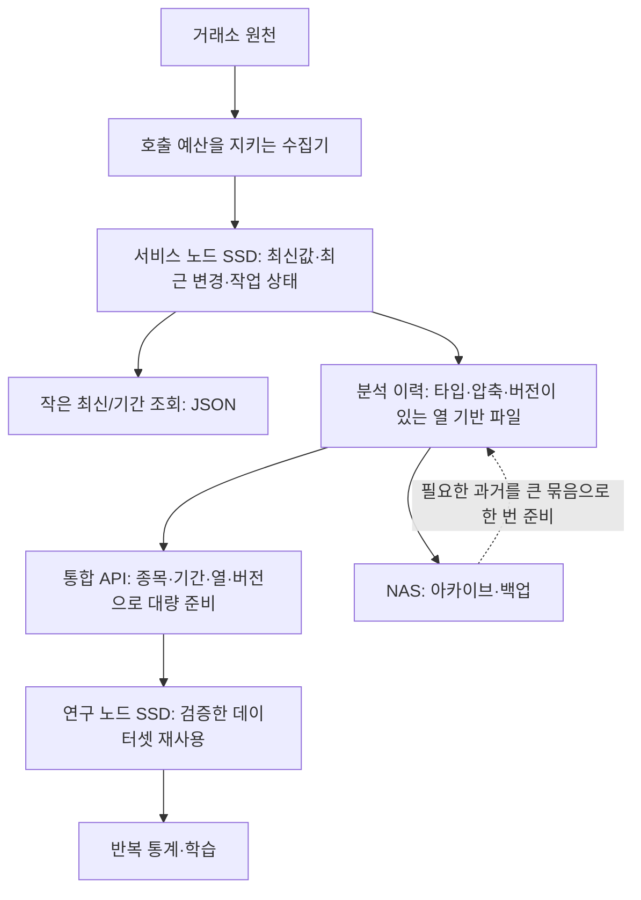

# 전 종목·수개월 연구를 위한 데이터 I/O 검토

공개 열람본 · 관련 문서: [M1 API](api.md) · [데이터 조사](crypto-data-landscape-2026-09-15.md). 이 검토에서 제안한 M1.2는 앞서 게시한 실행 설계 이후의 변경 제안이다.

검토일: 2026-09-16 KST. 대상: `data-service` M1과 후속 설계. 사용자 요구는 **약 1,500 instruments × 수개월 × 반복 통계 분석**이다. 서비스 소스와 운영 데이터를 바꾸지 않고 코드, 로컬 샘플의 크기, 별도 합성 DB를 확인했다. NAS 성능을 직접 측정하거나 과거 연구 작업의 지연 원인을 확정한 보고서는 아니다.

## 1. 결론

**현재 M1을 그대로 전 종목 연구에 확대하면 안 된다. 데이터 종류를 늘리기 전에 대량 조회·분석 배치를 설계하고 검증해야 한다.** 1분 데이터는 같은 행 폭의 1초 데이터보다 행 수가 60분의 1이지만, 전 종목·수개월·여러 계열을 합치면 충분히 큰 규모다.

통합 데이터 API 방향은 유지한다. 내부는 작은 최신 조회와 대량 연구 데이터 준비를 분리하고, 연구는 SSD에 고정한 데이터셋을 반복 사용하게 한다. NAS는 아카이브·백업과 아직 준비되지 않은 과거 자료의 공급 역할을 맡는다. 이력 읽기마다 NAS 소파일을 다시 열거나, 수억 행을 매번 JSON으로 받아오는 경로를 기본으로 두지 않는다.

기존 다음 단계에 **M1.2 대량 연구 경로와 전 종목 수집 예산 검증**을 추가해 펀딩/OI보다 먼저 수행할 것을 제안한다. 실제 전 종목 수집·운영 전환은 아직 하지 않았다.

## 2. 데이터량 계산

가정: 1,500개는 거래소·상품 종류까지 구분한 instrument 총수다. 1,500개 심볼을 거래소마다 수집한다면 해당 조합 수만큼 다시 곱해야 한다. 모든 instrument가 전체 기간에 걸쳐 매분 한 행을 제공한다고 가정한 용량 계획이며, 상장·상폐·원천 지원 범위는 별도다.

| 기간 | 1분 계열 한 종류의 행 수 | 현재 저장 형식 환산 | 현재 JSON 전달 형식 환산 |
|---|---:|---:|---:|
| 30일 | 64,800,000 | 약 66GB | 약 45GB |
| 90일 | 194,400,000 | 약 199GB | 약 136GB |
| 180일 | 388,800,000 | 약 398GB | 약 271GB |

환산 근거: 아래 합성 봉 DB에서 정규화 행+인덱스는 약 1,024B/행, HTTP 응답은 약 698B/행이었다. **원본 응답·추가 revision·WAL·백업·다른 계열은 빠져 있다.** 압축한 분석 파일 크기를 뜻하지 않으며, 실제 여러 종목 값과 페이지 배치에 따라 달라진다. 단위는 1GB=10^9B다.

- 같은 대상의 1초 행은 90일에 약 116.64억 개로, 1분 행의 60배다. 실제 피처 데이터는 열 수도 많으므로 바이트 차이는 별도다.
- 가령 분 단위 계열을 6개 모으면 90일에 약 11.66억 행이다. 모든 후보 데이터가 같은 빈도·폭이라는 예측은 아니다. 펀딩 사건·5분 통계 등은 각각 계산해야 한다.
- 비교를 위한 숫자 배열 가정으로 행당 96B면 90일 한 계열이 약 18.7GB다. 이는 타입이 있는 숫자 12개를 가정한 산술 예시이며, Parquet 실측 크기나 압축률 보장이 아니다.

**대역폭은 API로 없어지지 않는다.** 1Gbps 링크의 이상적인 전송률 125MB/s를 가정하면 136GB를 한 번 옮기는 데도 최소 약 18분이다. 프로토콜·디스크·요청 지연·공유 트래픽·파싱은 추가된다. 실제 NAS 링크 속도는 이번에 측정하지 않았다. 동일 데이터를 실험마다 다시 옮기면 대역폭을 올려도 반복 비용이 남는다.

## 3. 지금 API 뒤에서 하는 일

```text
수집: 거래소 REST → Rust 검증 → 이 PC의 SQLite에 원본 JSON·정규화 revision 저장
조회: HTTP 요청 → 공유 저장소 잠금 → SQLite 조회 → JSON 생성 → 클라이언트 파싱
```

기본 DB는 로컬 `var/data.sqlite3`이며 NAS를 매번 읽는 구조는 아니다. Windows 네트워크 드라이브도 저장 경로에서 거부한다. 그러나 로컬 파일이라는 사실만으로 대량 분석 경로가 준비된 것은 아니다.

| 문제 | 코드 근거 | 영향 |
|---|---|---|
| 조회·적재가 같은 잠금 사용 | `src/collector.rs:25`, `src/api.rs:42`, `src/collector.rs:356` | 과거 읽기나 상태 집계 동안 최신 조회·저장이 기다림 |
| 페이지마다 전 요청 구간 검사 | `src/store.rs:198–215` | limit가 1,000이어도 해당 31일 전체 timestamp를 다시 읽어 coverage 계산 |
| 상태조회가 전체 이력 집계 | `src/store.rs:286`, `src/api.rs:75` | health도 catalog를 실행. 화면은 catalog와 health를 함께 불러 같은 집계를 반복 |
| 작은 페이지·행별 JSON | `src/model.rs:75,117`, `src/store.rs:379` | instrument·record ID·필드명 반복, 파싱·메모리·요청 비용 증가. 열 선택 없음 |
| 모든 원본을 비압축 저장 | `src/store.rs:40,109–131` | 변경 없는 응답도 저장. 전체 상품 응답을 시간마다 보존하는 비용도 누적 |
| 종목별 순차 REST 요청 | `src/collector.rs:273`, `src/source.rs:73–77` | 현재 500ms 간격은 전 종목의 분 단위 수집을 감당하지 못함 |

31일치 봉은 44,640행이고 최대 페이지 크기 1,000에서는 45페이지다. coverage 계산만 44,640 × 45 = **2,008,800 timestamp 읽기**가 필요하다. 예제 클라이언트의 100행 페이지에서는 447페이지로 더 커진다. 1,500종목 × 90일을 31+31+28일로 나누면 최대 페이지 크기에서도 **196,500번의 조회**가 필요하다.

실제 소량 DB의 원본 크기도 확인했다. 상품 목록 응답 5개가 합계 약 5.57MB인 반면, 봉 1,109개의 정규화 payload는 약 0.367MB였다. 이는 작은 초기 샘플이므로 전체 저장 크기 비율로 일반화하지 않는다. 다만 원본 보존 비용을 봉의 숫자 필드 수만으로 계산하면 빠지는 부분이 있다는 증거다.

## 4. 분리된 합성 DB 측정

운영 DB를 변경하지 않고, 동일 schema·인덱스를 가진 임시 DB에 한 종목의 합성 봉을 넣어 기존 실행파일의 HTTP API를 호출했다. 수집기는 껐고 거래소·NAS를 호출하지 않았다. 각 봉은 revision 하나이며 원본은 작은 합성 응답 하나만 연결했다. 실제 정정·원본 적재량이 없는 유리한 조건이다.

**측정 한계:** 개발용 debug 빌드, 로컬 SSD·loopback, OS cache 미초기화. HTTP 시간에는 클라이언트 응답 읽기와 Python JSON 파싱이 포함된다. 운영 release 성능, 차가운 디스크 cache, NAS 대역폭, 1,500종목 동시 성능을 측정한 것은 아니다.

| 항목 | 한 종목 31일 보유 | 한 종목 180일 보유 |
|---|---:|---:|
| 정규화 봉 수 | 44,640 | 259,200 |
| DB 크기 | 45.67MB | 265.60MB |
| 최신 1행 조회, 3회 중앙값 | 15.6ms | 15.4ms |
| catalog, 3회 중앙값 | 93.1ms | 497.1ms |
| health, 3회 중앙값 | 94.9ms | 512.1ms |
| 최근 31일 전량 조회, 45페이지 | 10.82초 | 11.28초 |
| 위 전량 조회의 응답 바이트 | 31.16MB | 31.16MB |

180일 DB에서 health 요청과 최신 1행 조회를 겹쳐 실행하자 최신 조회 12회의 중앙값은 **480ms**, 최대는 **515ms**였다. 별도 네트워크 저장소 없이도 전체 이력 집계와 잠금 경합이 최신 조회에 영향을 줬다. 이 시간을 1,500배 곱해 운영 시간을 예측하지 않는다. 규모와 무관하게 제거해야 할 반복 작업과 자원 경쟁을 확인한 결과다.

측정 JSON과 합성 DB는 로컬 검토 산출물로 보관하며 공개본에는 포함하지 않는다. 위 표는 해당 측정 결과의 요약이다. 벤치마크 서버는 측정 후 종료했다.

## 5. 추천 배치와 조회 구조



서비스 노드와 연구 노드는 같은 PC일 수도 있다. **핵심은 큰 데이터를 반복 계산하는 곳의 SSD에 두는 것**이다. 연구 PC의 용량이 부족하면 데이터를 SSD로 준비한 별도 계산 노드에서 통계를 수행하고 결과만 가져온다. API 서버를 NAS로 옮기는 것만으로 디스크·CPU·대역폭 문제가 해결되지는 않는다.

### 같은 API를 유지하는 방법

- 논리적인 요청은 dataset·instruments·time·columns·품질 조건·조회 버전을 공유한다.
- 작은 조회는 기존 JSON으로 반환한다. 큰 조회는 제한된 대량 준비 작업과 Arrow IPC 스트림 또는 Parquet 파일 묶음으로 전달한다. 라이브러리는 이를 테이블이나 제한된 크기의 batch 반복자로 제공한다.
- 사용자가 NAS 경로·원천 endpoint를 직접 찾지 않도록 서비스가 준비 상태·행 수·예상 크기·결측·재시도/이어받기를 제공한다.
- 동일 연구를 반복할 때는 명시적으로 고정한 데이터 버전의 SSD cache를 사용한다. `latest` 요청에 오래된 cache를 몰래 반환하지 않는다.
- 열 기반 파일은 필요한 열과 기간만 읽는 데 적합하다. 단, 전 종목의 모든 열·전 기간을 요청하면 그 데이터 자체는 읽어야 한다. 파일 형식이 계산량을 없애지는 않는다. [Apache Parquet](https://parquet.apache.org/docs/overview/), [Arrow 형식](https://arrow.apache.org/docs/format/Columnar.html).

### 파일 배치·정정·원본 보존

- Parquet은 분석 이력의 우선 후보, Arrow IPC는 타입을 보존하는 전달 후보다. 실제 압축률과 라이브러리 호환성을 측정한 뒤 고른다.
- 날짜/데이터군/거래소 등의 큰 분할 아래 여러 instrument를 묶고, 정렬·row group으로 선택 읽기를 돕는다. 일×instrument×dataset의 작은 파일 수십만 개를 매번 탐색하는 형태는 피한다. 파일 크기·분할 기준은 단일 종목 조회와 전 종목 통계 양쪽을 측정해 결정한다.
- 파일 목록 문서(manifest)에 schema 버전·상품·기간·열·행 수·hash·coverage·저장 버전 경계를 기록한다. 파일 목록을 얻기 위해 NAS 전체를 걸을 필요가 없어야 한다.
- 확정 봉도 나중에 정정될 수 있다. 파일을 최신값으로 덮어써 과거 `view_seq` 재현을 깨지 않는다. 버전이 고정된 이력 묶음과 이후 정정 기록을 함께 조회하고, 재정리해도 이전 연구 버전을 재현할 수 있어야 한다.
- raw는 압축 묶음과 provenance 참조로 분리할 수 있다. 본문 중복 제거를 하더라도 관측 시각·응답 이력을 보존하고, 응답 안의 시각이 바뀌면 단순 hash 중복 제거가 잘 안 될 수 있음을 고려한다.

SQLite 자체를 당장 전면 폐기할 필요는 없다. 작업 상태·카탈로그·최근 데이터에는 계속 사용할 수 있다. **전 기간 분석 이력을 행별 JSON 테이블 하나와 공유 잠금으로 처리하는 구조는 확대 전에 바꾼다.** 분석 경로를 독립시킨 뒤 필요한 경우 별도 분석 DB를 비교한다.

## 6. 수집도 전 종목 요구에 맞춰 다시 계산

기본 요청 간격 500ms로 종목당 한 번씩 순차 요청하면 1,500개를 한 바퀴 도는 데 최소 약 750초, 즉 12.5분이다. 실제 응답·적재 시간은 추가되고 cycle 종료 후 대기도 있다. 현 구현은 BTC/ETH만 허용하며, 설정의 종목 목록만 늘리면 해결되는 문제가 아니다.

90일 봉을 현재 499행/요청 방식으로 받으면 종목당 최소 260회, 전체 약 39만 회다. 500ms 간격만 합쳐도 약 54시간이며, 31일 단위 분할·원천 한도·네트워크·저장 비용으로 더 늘어날 수 있다. 이는 현재 방식의 산술 하한이며 거래소가 무제한 병렬 수집을 허용한다는 뜻은 아니다.

전 종목 지원은 먼저 거래소·상품·dataset별 무료 지원 범위, bulk/stream 가능 여부, 요청 가중치, 목표 갱신 주기를 계산한다. 현재 수집과 백필의 예산을 나누고, 원천이 제공하는 묶음 조회·봉 스트림·검증된 대량 이력 경로를 필요한 곳에 사용한다. 전 종목이 모든 데이터군을 같은 주기로 제공한다고 약속하지 않는다.

## 7. 다음 작업 순서 수정

| 단계 | 산출물 | 통과 조건 |
|---|---|---|
| **M1.1** | 최신 수집·과거 복구·연구 읽기의 자원 분리 | 과거 누락·대량 읽기가 최신 저장/조회 경로를 직렬로 막지 않음. 재시작·cooldown·결측 의미 유지 |
| **M1.2a** | 전 종목 수집 예산과 데이터 크기 검증 | 약 1,500 instruments의 실제 식별·지원 범위·호출량·저장 증가량을 산출하고 필요한 주기를 유지할 수 있는 경로를 선택 |
| **M1.2b** | 대량 준비 API·열 선택·타입 있는 결과·SSD cache·연구 예제 | 고정 데이터 버전으로 과거/최신 값 일치. 반복 분석에서 동일 원천을 다시 전송하지 않음 |
| **M1.2c** | 대표 규모 성능 실험 | 1,500×90일·180일 시나리오의 첫 준비/반복 계산/증분 갱신을 분리해 바이트·시간·메모리·최신 지연 측정 |
| **M2** | 확정 펀딩 → OI | 앞선 경로에 계열별 정의·단위·시각·지원 범위를 추가 |
| **후속** | PIT 강화·장기 운영·정식 연구 소비자 전환·확장 | 각 단계 계약과 운영 검증을 거쳐 진행. UDP는 별도 필요성 판단 |

M1.1에서는 reader/writer 연결·작업을 분리하고 대량 작업의 동시성·메모리·CPU/I/O를 제한한다. health는 가벼운 상태 확인으로, catalog와 coverage는 증분 요약 또는 같은 고정 조회에서 재사용하는 결과로 바꾼다. 단순 페이지 상한 확대는 반복 스캔·메모리·경합 문제를 해결하지 못한다.

M1.2의 대량 준비는 우선 서비스가 보유한 이력과 확인된 아카이브를 대상으로 한다. 원천에서 새로 받아야 하는 미수집 구간의 자동 백필 준비는 M3에서 확장한다. 이미 보유한 데이터를 연구에 전달하는 시간과 외부 원천 수집 시간을 같은 성능 수치로 섞지 않는다.

SQLite WAL도 긴 읽기 transaction은 checkpoint를 지연시킬 수 있으므로 batch 경계를 설계한다. 연결을 나누기 전 bundled SQLite의 수정 버전도 확인해야 한다. 현재 lockfile의 `libsqlite3-sys 0.35.0`은 이 환경에서 SQLite 3.50.2를 포함한다. 공식 문서의 복수 연결 write/checkpoint 경합 관련 수정(3.51.3 또는 3.50.7 계열 backport)을 반영한 버전으로 검증하는 것이 선행 조건이다. 현재 단일 연결에서 데이터 손상을 확인했다는 뜻은 아니다. [SQLite WAL·동시성·수정 사항](https://sqlite.org/wal.html).

성능 실험은 축소한 대표 데이터로 정확성부터 확인하고 점진적으로 키운다. 실제 전체 원천 적재를 먼저 실행하지 않는다. 숫자 값의 분포·행 폭·정정·결측이 있는 샘플을 포함하며, 같은 값만 복제해 나온 압축률을 운영 예측으로 쓰지 않는다.

최종 통과 판단에는 다음을 분리해 기록한다.

1. **첫 준비:** 이미 가까운 SSD에 있는 이력, NAS에서 옮겨야 하는 이력, 거래소에서 새로 받아야 하는 이력의 시간·바이트를 각각 측정한다.
2. **반복 분석:** 동일 고정 데이터셋은 NAS·원천·서버의 전체 이력을 다시 읽지 않는다. 로컬 SSD cache 적중 여부를 확인한다.
3. **증분 갱신:** 새 날짜·정정된 묶음만 반영하고, 이전 연구 버전은 보존한다.
4. **수집 보호:** 대량 내보내기 중 최신 조회·적재 지연, CPU·메모리·디스크 사용량과 queue 길이를 측정한다.
5. **실제 요구:** 사용할 열·계산 종류·SSD 용량·실측 링크 속도를 기준으로 시간 목표를 확정한다. 아직 확보하지 않은 운영 성능을 초 단위로 약속하지 않는다.

## 8. 이번 검토의 범위

서비스 코드·프로토콜·NAS 자료·운영 DB는 변경하지 않았다. 기존 검토 서버와 별개로 만든 합성 DB에서 측정했고 그 서버는 종료했다. 문서와 로컬 측정 결과만 작성했다. 사용자 요청에 따라 이 리뷰 문서의 공개 열람본을 작성했으며 실행 설정·원본 데이터·측정 로그는 포함하지 않는다.
