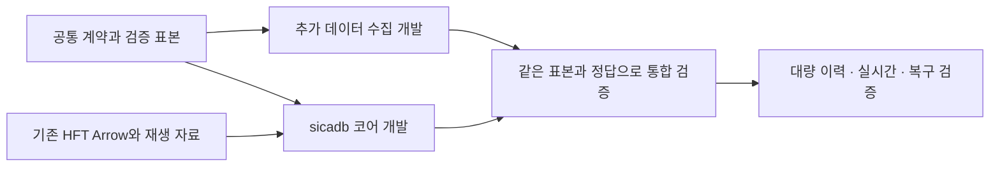

# sicadb 실행 계획 — 공통 런타임과 데이터 수집의 병렬 개발

작성·갱신: 2026-09-17. 상태: **Rust 계산 코어·Arrow/mmap reader와 K2 첫 TCP/worker pool을 구현하고 로컬 검증했다. APL 실험·영속 저장·데이터 전환은 미완료다.** 시작점은 [README](README.md), 현재 증거는 K0/K1 결과 (프로젝트 내부 문서: k0-k1-results-2026-09-16.md)와 K2 결과 (프로젝트 내부 문서: k2-results-2026-09-16.md), 후속 범위는 [다음 작업](next-work.md)이다. 이 문서는 공개 저장소에 게시하는 작업 계획이다.

## 1. 이번에 합의한 방향

프로젝트 이름은 **sicadb**다. 공통 데이터와 함수를 처리하는 빠르고 가벼운 범용 런타임을 만들고, 같은 실행 기반으로 연구·실시간 계산·질의·구독 프로세스를 구성한다.

- **코어 구현 언어는 Rust로 확정한다.** APL은 사용자/LLM이 프로그램을 작성하는 언어의 후보로서 별도로 검증한다.
- **저수준 성능·정확성을 최초 구현의 완료 조건으로 둔다.** [코어 성능·정확성 계약](performance-and-correctness-contract.md)에 따라 kernel마다 SIMD/기본 경로, 메모리·복사·할당 비용, 독립 정답, 경계/동시성 검사, 재현 가능한 성능 증거를 갖춘다. 특정 ISA·NUMA 설정·처리량 수치를 실측 없이 보장하지 않는다.
- **영속 데이터는 Arrow IPC FILE(`.arrow`)과 STREAM(`.arrow.stream`), 확정 파일 접근은 mmap을 기본으로 한다.** 크기·시간 기준으로 장중 파일을 확정한다. 전체 데이터를 RAM에 올리는 것을 전제로 삼지 않는다. RAM보다 큰 데이터가 정상 사용 조건이다.
- **실시간 최신값은 영속화를 기다리지 않고 반드시 제공한다.** live 공개와 durable 확인을 분리하고 기록 지연이 live 경로를 막지 않게 한다.
- **Windows 11이 주 타깃이며 Windows 10도 가능한 범위에서 지원·검증한다.** 별도 컴파일은 허용한다. 현재 PC와 241의 Win11 검증, feeding/일일 배치 PC의 Win10 검증을 구분한다.
- **코어는 SQLite에 의존하지 않는 자체 저장·동시성·복구를 구현한다.** 같은 호스트 live 경로는 shared memory descriptor를 기본으로 하고 TCP 자체 메시지는 원격·선택적 제어·호환 경로로 설계하며 구체 framing과 비용은 별도 검증한다.
- **HFT와 추가 데이터를 처음부터 대상에 포함한다.** 1초 피처, 사건 기반 자료, 분봉·펀딩·OI처럼 밀도와 시각 의미가 다른 자료를 함께 다룬다.
- **APL을 첫 언어 검증 후보로 둔다.** q 호환 자체는 필수 요구가 아니다. 완전한 APL 구현을 이미 결정한 것도 아니다.
- 프로그램의 주 작성자는 LLM이다. 사용 중인 Luna 연결과 CoT off 조건에서 실제 과제를 평가한다. 사람이 쓸 문법의 친숙함보다 결과 정확도와 수정 가능성이 중요하다.
- 분석마다 전용 통계 도구를 추가하는 방식에서 벗어나, 함수·배열·테이블·입출력을 조합해 새 프로그램을 만들 수 있어야 한다.
- 연구와 실거래는 같은 데이터·함수 의미를 사용하되, 긴 연구 작업과 실시간 역할의 실행 자원은 분리한다.

이 합의가 이전 [kdb 조사 문서](../data-service/kdb-style-runtime-and-language-review-2026-09-16.md)의 **q 우선 제안과 RAM 상주 중심 설명보다 우선**한다. 그 문서의 공식 코어 조사 사실은 계속 참고한다.

## 2. 공유 메모리 통합 단계

첫 통합 대상은 Windows 11 x64/MSVC이며 Windows 10 feeding·batch는 별도 실기 gate다. 같은 호스트의 live 시세·feature·1초 테이블·batch 전달을 shared memory로 연결하고 direct read와 push를 같은 API로 제공한다. push는 sequence 범위와 segment offset/generation만 알리고 소비자 executor가 처리한다. TCP는 원격·선택적 제어/호환 경로다.

구현 순서는 (1) OS 지원 interprocess atomic/layout과 bounded page/segment pool, (2) 공통 row sequence columnar batch, publish/pin/reclaim, generation resize, (3) ingest와 live direct/push, (4) recording STREAM·FILE seal·manifest·durable recovery, (5) DLL C ABI와 derived/forwardtestorders 통합이다. column별 독립 회전, 전체 복사 증설, timeout만의 회수, OMS 단일 writer 전환은 계획에 넣지 않는다. OMS는 다중 writer와 lock 상태 갱신을 유지한다. 세부 계약과 gate는 [공유 메모리 런타임 계약](shared-memory-runtime-contract.md)과 [검증 계획](shared-memory-validation-plan.md)을 따른다.

## 3. 프로젝트 위치와 책임

**Full Trading 안의 독립 컴포넌트 `sicadb/`**로 확정했다. 상세 문서를 컴포넌트로 이전하고 독립 Git 저장소로 관리한다. 부모 저장소는 `sicadb/`를 제외하고, 컴포넌트 간 경계 (프로젝트 내부 문서: sicadb.md)만 공용 문서로 둔다. Cargo workspace에는 core·Arrow reader·CLI가 있다. `feeding` 또는 `data-service`의 하위 구현으로 넣지 않는다.

| 컴포넌트 | 앞으로 맡을 책임 | 별도로 키우지 않을 영역 |
|---|---|---|
| `data-service` | 무료 추가 원천 수집, 정규화, 원본 근거, 최신/백필 분리, 결측·quota·재시도, 재전송 가능한 staging | 독립적인 대량 연구 엔진·mmap cache·언어 실행기 |
| `sicadb` | 공통 값·함수 실행, Arrow 저장·snapshot·mmap, RAM 초과 계산, 작업·IPC·구독, 공통 조회 | 거래소별 응답 해석과 재시도 규칙을 코어에 내장 |
| 기존 HFT 수집·재생 | 패킷 수집과 검증된 사건 재구성 | sicadb 도입만을 위한 무조건적인 원본 포맷 교체 |
| HFT 연결 계층 | 기존 Arrow/피처/패킷의 의미를 공통 계약으로 연결 | 별도 세 번째 DB 또는 별도 통계 언어 |

기존 data-service의 SQLite source/outbox와 HTTP 검토 화면은 **다른 세션의 현재 구현**이다. sicadb의 최종 저장 의존성으로 채택하지 않는다. 현재 데이터·재전송 근거를 임의로 지우지 않으며, 자체 저장 경로와 전환 계약을 검증한 뒤 연결·대체한다. source의 최신 구현 범위는 producer 초안 (프로젝트 내부 문서: producer-contract-v0.md)을 확인한다.

sicadb는 거래소명을 몰라도 배열·함수·테이블·메시지를 처리할 수 있어야 한다. 시장 schema와 전략 함수는 상위 라이브러리·스크립트에 둔다.

## 4. 병렬로 진행하되 먼저 맞출 것

**주 개발 흐름은 두 개, 통합 검증 책임은 하나**로 둔다.

계약이 정해진 뒤에는 수집 쪽이 sicadb 완성을 기다리지 않는다. sicadb도 새 펀딩·OI 수집을 기다리지 않고 기존 HFT와 현재 M1 봉 표본으로 개발한다. 통합 담당은 계약·fixture·결과 비교를 소유하며 두 구현 담당의 작업 파일을 겹치지 않게 한다.

### 공통 계약 v0 초안

아래는 **구현 전에 확정할 항목**이다. 기존 `docs/protocols/`나 운영 API를 변경하는 명세가 아니다.

| 항목 | 먼저 고정할 내용 |
|---|---|
| 식별 | dataset, schema version, venue/instrument/product 식별, 원천 레코드 키 |
| 수치 | Int64/Float64 등의 실제 타입, 단위·scale, overflow, null/NaN 구분. 정확값의 임의 float 변환 금지 |
| 시각 | event time, 원천 발표 시각(알 때만), 관측 시각, 실제 조회 가능 시각. 단위·epoch·원천 해상도도 표시 |
| 정정 | 동일 사건의 revision, 중복 수신과 A→B→A 변경의 구별, 이전 snapshot 보존 |
| 순서 | producer/stream 식별과 그 안의 진행 위치. 서로 다른 source의 순서를 하나의 event time으로 추정하지 않음 |
| 전달 | batch ID·schema·row count·무결성 정보, 재전송 키, ack가 의미하는 상태 |
| snapshot | 조회가 고정할 dataset별 revision/진행 경계. 현재 M1 view_seq를 전체 시스템 공통 순서로 오인하지 않음 |
| 품질 | 미수집·원천 결측·무효·미상장·관측 시각 미상의 구별 |
| 형식 | Arrow IPC FILE/STREAM 사용. 최초 producer의 완성 FILE도 직접 수용. batch 크기·partition·IPC 세부 버전은 각 경계 구현 전에 고정 |

과거 HFT에 관측/가용 시각이 없다면 그 값을 추정해서 채우지 않는다. 실제로 확보한 event-time 분석과 엄격한 당시 가용성 분석을 구분한다. 밀리초 시각을 나노초 숫자로 바꿔도 원천의 시간 해상도가 올라가지는 않는다.

Arrow는 값 표현과 직렬화를 제공한다. snapshot 게시, 정정, 복구, 여러 writer의 조정은 sicadb가 정해야 한다. [Arrow columnar specification](https://arrow.apache.org/docs/format/Columnar.html)

### 수집 staging과 sicadb 사이의 완료 계약

1. 수집기는 정규화한 batch와 재전송 근거를 내구 staging에 보존한다.
2. sicadb는 batch ID로 중복을 판별하고 수신 데이터를 검증한다.
3. 단순 수신, 영속화 전 live 공개, 복구 가능한 저장 완료, 확정 snapshot 게시를 구분한다. live는 durable 완료를 기다리지 않는다. 완성 FILE 내보내기만 있는 source adapter를 저지연 live adapter까지 구현된 것으로 표시하지 않는다.
4. 수집기의 재전송 checkpoint는 약속한 durable ack 이후에만 전진한다. ack 유실 후 재전송해도 이중 반영되지 않아야 한다.
5. staging 정리는 복구에 필요한 데이터가 보존된다는 조건을 확인한 뒤 한다. 정리 시점과 보존 기간은 운영 검증에서 결정한다.

staging은 재전송용 저장이다. 사용자 질의가 staging과 sicadb를 임의로 섞어 읽는 구조는 만들지 않는다. 전환 기간의 기존 M1 API와 새 sicadb 조회는 어떤 버전을 읽었는지 표시해 비교한다.

## 5. 단계와 통과 기준

기간을 먼저 약속하지 않고 아래 결과로 다음 단계 진입을 판단한다. 표는 통합 단계의 **목표**다. G1 중 첫 Arrow/mmap·Rust kernel slice의 로컬 결과가 생겼으며 APL과 대용량/통합 검증은 남아 있다. 개별 단계 전체의 완료는 결과 보고서 (프로젝트 내부 문서: k0-k1-results-2026-09-16.md)의 좁은 검증 범위와 구분한다.

| 단계 | 수집 작업 | sicadb 작업 | 사용자에게 보여 줄 결과·통과 기준 |
|---|---|---|---|
| **G0 계약·표본** | 현재 봉·상품 schema, 복구/정정 표본, 원천 의미 정리 | APL 프로필 후보, HFT 읽기 지도, 공통 타입·snapshot, Rust kernel 계약·측정 기반 | 같은 표본·예상 결과를 양쪽에서 해석하고 수치/메모리/검증 규칙을 고정 |
| **G1 두 위험 검증** | M1.1 최신/백필 분리·영속 결측·재전송 준비 | APL 작성성 실험과 Rust Arrow/mmap·최초 kernel 실험을 각각 수행 | LLM 결과 정확도, 독립 정답·지원 SIMD 경로, 복사/할당·chunk 경계·기준선 비교 |
| **G2 첫 통합** | M1 표본을 공통 batch로 내보내기, 펀딩 원천 구현 진행 | Arrow segment 게시·snapshot, 일반 함수 실행, 최소 async job | HFT와 봉을 한 실행 모델에서 읽고 작은 결과를 얻는 데모 |
| **G3 대량·프로세스** | 펀딩·OI를 계열별 검증, 전 instrument 요청 예산·복구 검증 | RAM 초과 집계·외부 정렬/조인, worker 격리·queue·취소 | 1,500 instruments × 수개월에서 정확도·자원·cold/warm 결과 |
| **G4 현재·과거 일치** | 늦은 도착·정정·중단 후 재전송 | 공통 함수의 구독·상태 처리·로그 재생·복구 | 같은 고정 입력/코드 버전의 live/replay 결과 비교 |
| **G5 전체 적용** | 검증된 계열의 수집 범위 확대 | 이력 catalog 등록·필요 부분 변환·연구 소비자 이전 | 범위별 검증·복귀 가능한 전환. 실거래 연결은 별도 지연·복구 확인 후 |

G1의 APL 조사 결과를 기다리는 동안 수집 복구와 Arrow reader 개발을 멈출 필요는 없다. 다만 **검증 전 APL 전체 evaluator를 완성하는 데 먼저 큰 투자를 하지 않는다.**

G는 컴포넌트 통합 단계이고 코어 계약의 K는 코어 검증 단계다. G0/G1은 K0/K1과 대응한다. G2 데모에는 K2의 비동기 실행과 K3의 최소 저장·복구 부분이 필요하다. K2의 read-only 비동기 실행은 검증했지만 영속 저장·복구는 남아 있다. G3~G5는 K3 기능을 확장·검증한다. K0/K1이나 첫 K2 결과를 G2 전체 완료로 표시하지 않는다.

## 6. 수집 작업의 구체 범위

아래 A1/A2는 source 쪽의 책임 범위를 설명한다. 해당 기반 작업과 이후 확장은 별도 세션에서 진행되었으므로 현재 source 할 일 목록으로 재사용하지 않는다. 실제 완료·미완료는 data-service 현재 상태 (프로젝트 내부 문서: README.md)를 따른다.

### A1 — 현재 M1의 수집 지속성

- 최신 수집과 과거 복구의 진행 위치·예산을 분리한다.
- 영구 결측·장기 중단이 최신 수집을 막지 않도록 한다.
- 결측·재시도·원천 cooldown을 재시작 후에도 유지한다.
- 원본 응답, 정확한 수치, revision, source provenance를 보존한다.
- 기존 검토 API는 원천 검증용으로 유지하고 대량 연구 API로 확장하지 않는다.

검증은 정상 원천과 고장 주입 fixture로 먼저 수행하고, 제한된 실제 원천 관찰을 별도로 기록한다. 현재 상세 항목은 [data-service 계획](../data-service/implementation-plan.md)을 따른다.

### A2 — 공통 출력과 다음 원천

공통 batch를 파일로 내보내고 읽는 fixture만 있으면 sicadb 서버를 기다리지 않고 수집 개발을 이어갈 수 있다. source 쪽 시험 consumer와 sicadb 쪽 시험 producer는 같은 fixture를 사용한다.

순서는 **확정 펀딩 → 현재 OI와 원천 기간 통계의 분리**를 기본으로 한다. 실제 endpoint·기간·요청 한도는 구현 직전 공식 자료와 소량 응답으로 재확인한다. 과거에 다시 구할 수 없는 현재 관측 자료는 소량 보존 시작을 앞당길 이유가 있지만, 저장·재시도·원천 한도 검증 없이 전 종목 수집을 시작하지 않는다.

전 종목 확장은 별도 수집 예산 gate를 갖는다. 원천 요청 처리량·IP 공유 quota·최신성·staging 증가·원천 보유 기간을 계산하고, sicadb 유입이 느리거나 중단됐을 때의 저장 한도와 상태를 확인한다.

### 기존 M1.2에서 옮길 책임

| 기존 계획의 일 | 새 소유자 |
|---|---|
| 전 종목 원천 호출 예산·백필·결측 | data-service |
| 정규화 자료의 Arrow 출력·원본 근거 | data-service와 공통 계약 |
| 대량 질의·열 선택·로컬 준비·mmap·재사용 | sicadb |
| snapshot·연구 결과 재현·async 결과 | sicadb |
| 원천 미보유 구간의 수집 요청 실행 | data-service; sicadb는 명시적인 작업으로 연결 |

**sicadb 전체 성능 검증이 끝나야 펀딩·OI 코드를 만들 수 있다는 기존 직렬 선행 조건은 해제한다.** 대신 공통 계약·수집 지속성·원천별 정확성·수집 예산을 선행 조건으로 둔다.

## 7. sicadb의 첫 두 검증

### B1 — APL이 실제 LLM 작성에 적합한가

먼저 기존 참조 실행기에서 작은 입력으로 언어 작성성을 측정한다. 동시에 자체 코어의 배열·Arrow 연결을 좁은 prototype으로 확인한다. **참조 실행기 성능을 자체 sicadb 성능으로 보고하지 않는다.**

APL 프로필은 참조 방언·버전, 인덱스 원점, 비교 허용오차, 배열 rank/shape, 빈 배열, 오류, 함수·평가 순서를 고정한다. Int64·timestamp·Arrow validity 같은 경계는 별도 계약으로 표시한다. 지원하는 기존 연산의 의미를 임의로 바꾸지 않고, 확장은 문서화한다.

**과제 30개 구성안:**

| 묶음 | 개수 | 확인할 내용 |
|---|---:|---|
| 배열·기초 통계 | 8 | 필터·집계·분산·분위수·그룹 결과 |
| 시간 결합 | 8 | HFT+봉/추가 데이터, 경계 시각·정정·미래정보 제외 |
| rolling·누적·상태 | 6 | chunk 사이 상태, warm-up, 순서 |
| 결측·정수·파일 | 4 | Int64 정밀도, null/NaN, 파일 왕복 |
| 함수 조합·일반 프로그램 | 4 | 함수를 정의·조합해 통계 이외 작업도 수행 |

정답과 숨겨진 검증 입력을 모델 실행 전에 확정한다. 작은 fixture의 기대값은 독립 구현 또는 손으로 확인 가능한 계산으로 검증한다. 모델에 준 예제와 채점용 데이터는 분리한다.

실제 모델 ID·버전·추론 설정·출력 예산·제공 문서·오류 피드백 규칙을 기록한다. 사용자의 CoT off 조건은 실제 연결 설정으로 확인해야 하며, 출력에서 추론 텍스트만 숨긴 상태와 혼동하지 않는다. 비밀 값은 기록하지 않는다.

**초기 채택 기준 제안:** 최초 정답 24/30 이상, 같은 형식의 오류 피드백을 최대 두 번 준 뒤 30/30. 사람이 코드를 고치지 않는다. 이 수치는 측정 전 초안이며 G0에서 고정한다. 결과를 본 뒤 쉬운 과제만 남기거나 기준을 낮추지 않는다. 경계 결과는 반복 실험하고, 한 번의 성공을 일반적인 무오류 보장으로 표현하지 않는다.

문법 성공·실행 성공·결과 정답을 각각 기록한다. 미구현 기능, 모델 오답, 데이터 계약 오류도 나눈다. APL 작성성이 불충분하면 Python/SQL 같은 비교 표면으로 같은 과제를 확인하되, 두 번째 전체 언어 구현을 동시에 착수하지 않는다.

### B2 — Arrow/mmap을 계산 끝까지 유지할 수 있는가

기존 48컬럼 IPC FILE을 입력 후보로 삼는다. 기존 원본·파생 cache마다 schema가 다르므로 공통 이름이라는 이유로 같은 reader에 넣지 않는다. Arrow stream도 mmap 입력에서 참조 읽기가 가능한 경우가 있으며, stream이라는 이유만으로 재변환 대상으로 분류하지 않는다. [Arrow IPC와 memory mapping](https://arrow.apache.org/docs/python/ipc.html)

최소 prototype에서 확인할 것은 다음이다.

1. 비압축 primitive 열을 원본 buffer에서 직접 참조하는가.
2. 정확한 정수·시각·validity가 APL/실행기 경계에서도 보존되는가.
3. 전체 입력을 하나의 배열로 합치지 않고 batch를 넘겨 계산하는가.
4. chunk 크기를 바꿔도 필터·집계·rolling·시간 결합 결과가 계약대로 같은가.
5. 함수 호출·선택 인덱스·출력·정렬용 메모리와 입력 복사를 구별해 측정하는가.
6. worker 수를 늘릴 때 private memory가 원본 전체 크기만큼 반복 증가하지 않는가.

APL primitive가 항상 자체 연속 배열을 요구하는 경로라면 borrowed view·chunked array·지원 연산의 실행 방식을 해결해야 한다. 이 문제를 언어 wrapper 하나로 해결됐다고 표시하지 않는다.

작업 예산 시험은 작은 명시적 메모리 예산으로 시작하고 입력이 그보다 큰 조건을 만든다. 이는 실제 물리 RAM/파일 cache를 초과하는 시험과 구분한다. private allocation뿐 아니라 공유/전용 상주량·page fault·시스템 전체 사용량·spill bytes를 기록하고, 별도 실제 RAM 초과 시험과 1,500 instruments × 수개월 범위로 확대한다.

최초 kernel부터 [성능·정확성 계약](performance-and-correctness-contract.md)의 K0/K1을 적용한다. 순수 inner loop의 무할당, 지원 primitive mmap 경로의 입력 무복사, ISA 검출·tail/validity 안전성은 검사 대상이다. 처리량·지연 gate는 명시된 장비에서 기준선과 변동성을 측정한 뒤 고정하며, benchmark가 실행됐다는 이유만으로 합격으로 표시하지 않는다.

## 8. 저장과 실행에서 초기에 고정할 원칙

같은 호스트 live 데이터는 shared memory direct read/push가 기본이고 TCP는 원격·선택 제어 경로다. writer 단일화는 시세·feature·1초 append에만 적용하며 OMS 다중 writer는 유지한다. NAS 자료는 필요 범위를 RAM으로 준비하고 선택 HDD cache를 허용한다.

- **불변 Arrow segment:** `.arrow.stream`과 `.arrow`를 역할에 맞게 사용한다. 쓰는 중인 파일과 확정된 FILE을 구분하고, 크기·시간 기준으로 seal한다. 일 마감은 필수 변환 시점이 아니다. 파일 완성·동기화·무결성 확인과 manifest 게시의 순서를 정하고 중간 장애를 검증한다. footer가 없는 미완성 FILE을 정상 이력으로 노출하지 않는다.
- **진행 중인 데이터:** 최신 상태를 즉시 live 공개하고, 복구 기록·영속화는 별도 경로에서 진행한다. stream 포맷만으로 WAL이 완성되지 않으므로 sequence·commit·tail 복구·checksum·sync를 설계한다. 확정 Arrow와 현재 상태를 합쳐 읽는 경계를 명시해 중복·누락을 막는다. source가 완성 FILE을 제공하는 경로에는 불필요한 stream 재기록을 강제하지 않는다.
- **live와 durable:** disk 지연/실패에서 live 경로의 응답과 기록 지연·gap 표시를 함께 시험한다. 영속화되지 않은 live 값의 과거 복원은 보장하지 않는다. historical snapshot과 live 관측의 입력 경계·내구 상태를 조회 결과에 명시한다.
- **정정과 snapshot:** 읽는 중인 파일을 덮어쓰지 않는다. 새 세대와 manifest로 게시하고 기존 reader가 참조하는 세대는 수명 종료 전 회수하지 않는다.
- **파일 배치:** 거래소/날짜/instrument 묶음·열군·batch 크기는 실제 질의로 결정한다. 수천 개 소파일과 불필요한 넓은 페이지 읽기를 모두 측정한다.
- **RAM 초과 계산:** 집계의 부분 결과 합치기, window 경계 상태, 외부 sort/join을 구분한다. 전역 median처럼 단순 부분 결과 평균으로 해결할 수 없는 연산은 맞는 알고리즘 또는 명시적 제한을 사용한다.
- **범용 실행:** 함수·변수·배열·조건·오류·입출력·메시지를 조합한다. 특정 피처만 실행하는 고정 RPC 목록으로 코어를 제한하지 않는다.
- **실시간 격리:** 긴 연구 작업은 별도 worker에서 실행하고 실시간 이벤트 처리와 queue 예산을 보존한다.
- **TCP·작업:** 같은 호스트 live 데이터는 shared memory direct read/push로 전달하고, TCP는 원격 호스트의 request/job/stream ID·bounded frame·취소·재접속·흐름 제어에 사용한다. 전송 완료를 계산/내구 완료로 취급하지 않는다.
- **느린 추론:** 호출별 독립 window 모델에는 최신 대기 요청 합치기와 마지막 유효 결과 조회를 제공한다. 틱 보존·필요 상태 갱신은 계속한다. 입력 시각·모델 세대·결과 게시 시각과 stale 상태를 보존하며, stateful sequence는 별도 순서 계약을 사용한다. replay는 추론 지연과 실제 사용 가능 시각도 반영한다.
- **동일 의미:** 동일한 함수와 코드 버전을 사용하되, batch/stream 실행 차이와 부동소수점 집계 순서의 영향을 명세·정답에 반영한다.

최초 구현에서는 시세·feature·1초 적재의 main process writer와 명시적 reader snapshot으로 책임을 정한다. OMS의 다중 writer 조정과 lock 상태 갱신은 사용자 확정 설계로 유지한다. 다중 머신 복제·완전한 언어 호환은 초기 성능 검증과 별도의 확장 gate다. 이는 연구·실거래를 여러 프로세스로 구성한다는 목표와 충돌하지 않는다.

## 9. HFT를 어떻게 합류시킬 것인가

HFT 전체를 최종 범위에 포함하되, **논리적인 등록·연결과 물리적인 파일 변환을 구별한다.**

| 자료 | 첫 연결 방법 | 다시 계산해야 하는 경우 |
|---|---|---|
| 48컬럼 무압축 Arrow IPC FILE | schema·원본 근거 확인 후 mmap reader와 catalog 연결 | 값 정의·피처 버전이 달라졌을 때 |
| 기존 벡터형 Arrow stream | 기존 의미를 읽는 adapter; 열 접근 개선이 필요한 구간만 변환 | 원본 재구성 규칙이 바뀌었을 때 |
| 파생 feature cache | 자체 schema/계산 버전으로 등록. 필요한 열을 view로 연결 | 피처 정의·결측·정렬 규칙이 달라졌을 때 |
| 원본 패킷·SPKR | 원본과 검증된 replay를 보존. 필요한 사건/피처를 공통 실행에 연결 | 새로운 상태·피처를 원본 사건에서 재구성해야 할 때 |

포맷 전환만 필요하면 원본 패킷부터 모든 피처를 다시 계산하지 않는다. 반대로 잘못된 재구성 결과는 파일 형식을 바꿔도 고쳐지지 않는다. 1초 피처에서 이미 잃은 사건 정보를 원본 틱처럼 복원했다고 표시하지 않는다.

48컬럼 변환 경로는 [기존 표본 실측](https://github.com/sicarius01/codex-docs/blob/main/quant-research/nas-arrow-conversion-benchmark-2026-09-16.md)이 있지만 전체 이관 완료·현재 catalog coverage는 미확인이다. 대규모 NAS 순회 없이 기존 manifest와 batch 목록을 우선 활용해 실제 범위를 파악한다.

## 10. 첫 번째로 직접 볼 수 있는 결과

첫 통합 데모의 목표는 다음 다섯 가지를 한 번에 보여 주는 것이다.

1. **HFT 피처와 현재 M1 확정 봉이 같은 catalog에 나타난다.** 원본·단위·기간·결측·버전이 보인다.
2. LLM이 고정된 APL 프로필로 작은 분석 함수를 작성한다. 기존 도구에 없는 조합도 함수로 표현한다.
3. sicadb가 고정 snapshot의 필요한 열을 읽고 비동기 작업 ID와 결과를 반환한다.
4. 같은 데이터를 다시 분석할 때 입력 복사·읽기·할당이 어떻게 달라지는지 수치로 표시한다.
5. 프로세스 재시작 후 같은 snapshot·코드·인수로 같은 계약의 결과를 얻는다.

엄격한 PIT를 제공할 수 없는 기존 HFT 표본은 event-time 데모라고 명시하고, 미래정보 배제 검증은 가용 시각이 명확한 별도 fixture로 한다. 이 데모가 실거래 준비 완료를 뜻하지는 않는다.

사용자가 보는 산출물은 실행한 프로그램·작은 결과표·정답 대조·시간/메모리/복사량·snapshot ID다. 먼저 CLI와 재현 가능한 보고서로 확인하고, 검증 화면은 이 정보를 표시하는 얇은 UI로 추가할 수 있다.

## 11. 초기 작업 목록과 남은 범위

| ID | 산출물 | 담당 흐름 | 완료의 증거 |
|---|---|---|---|
| S0-1 | 공통 schema·시간·revision·ack 계약 v0 | 공통 설계 | source와 core가 같은 표본을 해석함 |
| S0-2 | 기존 HFT+M1 소량 fixture와 독립 정답 | 통합 검증 | 행·타입·null·시각·버전 대조 |
| S0-3 | APL dialect/profile 결정과 LLM 30개 과제 | sicadb | 지원표, 사전 고정 정답·채점 규칙 |
| S0-4 | 현재 source의 복구/내보내기 작업 분해 | data-service | M1.1 변경 대상과 source 계약 시험 목록 |
| S0-5 | 첫 prototype의 입력·출력·측정 조건 | sicadb | 참조 interpreter와 자체 runtime의 측정 구분 |
| S0-6 | Rust 코어 성능·정확성 계약 | sicadb | [명세 v0.1](performance-and-correctness-contract.md) 로컬 보완. 실제 kernel·도구·성능 gate 검증은 별도 |

**현재는 실행 계획·운영 조건·S0-6 계약에 더해 첫 Rust 코드와 실물 HFT/펀딩 fixture 검증, 로컬 kernel benchmark가 있다.** 이는 S0-2의 기존 M1 통합 목표나 S0-1~5 전체 완료가 아니다. 첫 결과 (프로젝트 내부 문서: k0-k1-results-2026-09-16.md)에 범위를 남겼고 [next-work](next-work.md)는 공유 메모리 live·기록·복구의 현재 과제를 정의한다. source 진행 상태는 별도 세션의 최신 문서에서 확인하며 이 계획의 과거 M1 상태를 그대로 현재 상태로 가정하지 않는다.

개발 분담이 가능한 경우 source 구현 담당과 sicadb 구현 담당을 분리하고, 공통 계약 변경에는 두 흐름의 fixture 검증을 함께 수행한다. 실제 통계 결과·장애 복구·메모리 주장은 작성자와 다른 검증 담당이 확인한다.

## 12. 무엇을 기준으로 계속 진행할 것인가

APL 프로그램 생성 실패를 source 수집 실패와 섞지 않는다. source 지연 때문에 language prototype 전체가 멈추지 않게 기존 fixture를 사용한다. mmap prototype의 성능이 나쁘면 NAS 전송·파일 배치·Arrow decode·배열 복사·kernel 계산을 분리해 원인을 판단한다.

**계속할 근거:** 범용 함수 조합이 가능하고, 실제 LLM의 결과 정확도가 기준을 충족하며, Arrow 데이터를 RAM 초과 조건에서도 처리하고, 동일 데이터 의미가 현재/과거/재생에 유지되는가.

**재설계할 신호:** 전체 배열 복사가 기본 경로에서 제거되지 않음, 언어가 필요한 정확값을 표현하지 못함, source와 sicadb에 서로 다른 revision/조회 규칙이 생김, 긴 연구 작업이 실시간 상태 처리를 막음.

성공 여부를 코드 줄 수·파서 완성·파일 하나의 mmap 성공으로 판정하지 않는다. **동일한 기반에서 새 프로그램을 만들고, 데이터를 정확하고 효율적으로 다루며, 실패 후에도 설명 가능한 상태로 돌아오는 것**이 sicadb의 첫 목표다.
